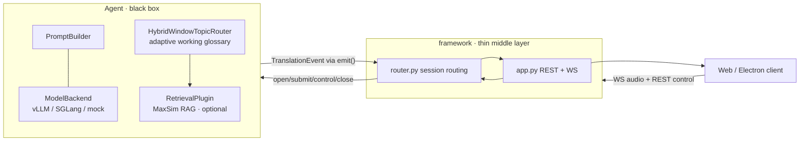

# Review Packet

Generated: 2026-07-06T20:49:09

## User task / acceptance criteria

```text
[No explicit task text passed to the packet generator.]
```

## Repo state

- Branch: framework
- HEAD: 8a911aa
- Requested base branch: 6d736b5
- Effective base branch: 6d736b5
- Merge base: 6d736b5083c8fcead8a01696102e59ddcc4a17eb
- Base warning: [none]

## Git status

```text
?? .codex/

```

## Commits on branch

```text
8a911aa (HEAD -> framework, origin/framework) Preserve window probe routing semantics

```

## Diff stat

```text
 README.md                                       |  2 +-
 docs/adaptive_working_glossary.md               | 49 ++++++++++++++++---------
 docs/adaptive_working_glossary_eval.md          |  9 +++--
 docs/auto_glossary_routing_probe_20260707.md    | 13 ++++---
 docs/open_term_memory_eval.md                   |  5 ++-
 framework/agents/omni.py                        | 30 +++++++++++++--
 framework/agents/plugins/retrieval.py           |  5 ++-
 framework/agents/term_memory/active_glossary.py |  3 +-
 framework/agents/term_memory/domain_taxonomy.py | 11 +++---
 framework/agents/term_memory/topic_router.py    | 28 ++++++++++----
 test_auto_working_fixed_top10.py                | 20 ++++++++++
 test_hybrid_window_topic_router.py              |  3 +-
 test_retrieval_plugin.py                        | 10 ++---
 13 files changed, 134 insertions(+), 54 deletions(-)

```

## Available task/spec/context files

## Context: .codex/domain-probe-switch-review-task.md

```text
User request and acceptance criteria:

- Continue through the remaining auto-term TODO checklist.
- Wire routing-only domain-probe retrieval into the Omni routing tick.
- Domain probes must not change the active inventory or prompt top-k; they should only feed `HybridWindowTopicRouter` diagnostics/scores.
- Keep `common_terms + active domain overlay` as the active retrieval inventory and fixed prompt top-10.
- Preserve MaxSim-style domain-probe scoring by passing per-window speech embeddings to routing probes rather than only the mean-pooled query vector.
- Make `common_10k` an explicit working preset so auto retrieval reliably builds `common_terms + active domain overlay`, including in mock/test mode.
- Add ACL/NLP <-> medicine router-only switch regression, including ACL-only false-switch, medicine-only, ACL->medicine, and medicine->ACL scenarios.
- Support source-text windows for controlled eval and preserve ASR/live deployment as `router_text` future producer work.
- Update Git docs/README as source of truth and record local staging paths for eval outputs.

Known scope boundary:

- This patch does not implement a real streaming ASR producer. It uses existing `router_text` plumbing and source-text eval.
- End-to-end candidate quality with real target ASR is still future work.

```
## Context: AGENTS.md

```text
# RASST-Demo Agent Instructions

This repository is the demo-system continuation of the previous InfiniSST
EMNLP System Demonstration draft. The current working name is `rasst-demo`.
Treat it as a live demo project for retrieval-aware, terminology-sensitive
streaming speech translation, not as a generic InfiniSST archive.

## Communication

- Prefer English for user-facing explanations unless Chinese is clearly faster,
  more precise, or requested.
- If the user's English or mixed English/Chinese wording is unnatural,
  ambiguous, or unprofessional, include a concise `Better English:` correction.
- Keep language feedback separate from engineering work.
- If an instruction is ambiguous enough to affect paths, code, experiments, or
  paper claims, ask a targeted clarification question before acting.

## Canonical Paths

- Repo root: `/mnt/taurus/home/jiaxuanluo/rasst-demo`
- Demo paper draft: `/mnt/taurus/home/jiaxuanluo/rasst-demo/demo_paper_emnlp`
- Main RASST reference: `/mnt/data2/jiaxuanluo/RASST`
- User-expected RASST home path, if later symlinked or moved:
  `/mnt/taurus/home/jiaxuanluo/RASST`
- Optional RL/post-training reference: `/mnt/taurus/home/jiaxuanluo/RAPO`

Use host-qualified Taurus paths in scripts, docs, and reports. Do not write new
commands using bare `/home/...` or Aries-only `/mnt/aries/...` paths unless the
task explicitly concerns Aries storage.

Large generated files, model checkpoints, logs, recordings, and benchmark dumps
should stay out of the repo unless the user explicitly asks to commit or package
them. Prefer a separate runtime/data root under `/mnt/taurus/data2/jiaxuanluo`
for new large artifacts.

## Current Demo Scope

The baseline system is an InfiniSST-style multi-user simultaneous speech
translation demo with:

- web and Electron frontends;
- microphone, file, YouTube/web, and desktop system-audio input paths;
- a scheduler/back-end split for concurrent sessions;
- prefill/decode batching, KV-cache reuse, attention-sink/sliding-window
  inference, and paged attention support;
- prior 32-sessions-per-GPU positioning from the old draft.

For a new demo-track submission, do not rely on "long speech translation with an
LLM" or "32 sessions per GPU" as the main novelty. Treat those as baseline
system strengths. The refreshed claim should focus on term-dense vertical-domain
translation: domain glossary retrieval, live terminology control, term-recall
diagnostics, and a demo experience that makes terminology corrections visible.

## Extension Direction

Prioritize a practical RASST-Demo story:

```text
streaming speech -> candidate terms/retrieved evidence -> terminology-aware
translation -> live UI diagnostics for latency, term recall, and corrections
```

Good demo features include:

- domain or glossary selection for medical, legal, academic, or financial
  speech;
- live display of retrieved terms/evidence next to the translation;
- user-visible term correction or acceptance controls;
- per-session diagnostics for latency, throughput, term recall, and false-copy
  behavior;
- comparison between plain InfiniSST and terminology-aware/RAG modes.

Avoid making RL the core demo requirement unless experiments already show a
clear user-facing win. RAPO-style RL/post-training is optional and should be
framed as a low-latency 4B student or adaptive policy extension. A 30B model can
remain the stronger teacher, reference model, or quality baseline when that is
more compelling for a demo.

## Relationship To RAPO

RAPO is a post-training reference, not the main identity of this demo repo. If
used, frame RAPO-style work as optional retrieval-aware or terminology-aware
post-training for a smaller student model.

The Speech LLM is the agent. Terminology retrieval, glossary lookup, or domain
evidence is a tool/evidence source. DPO, SimPO, GRPO, and OPD are training
backends; they are not the demo contribution by themselves.

For a compute-conscious extension, prefer:

```text
30B RASST/Qwen-Omni system as demo engine or teacher
4B student as low-latency optional variant
offline teacher/rubric feedback for term recall, false-copy behavior, latency,
and correction quality
```

Do not plan full 30B online GRPO unless the user explicitly changes the scope.

## Paper Framing

The paper in `demo_paper_emnlp` is a starting point, not a final submission.
When revising it:

- update the title away from pure high-throughput InfiniSST scheduling if the
  demo is now RASST/terminology centered;
- keep the 32-session scheduling result as a systems capability, not the whole
  contribution;
- add concrete evaluation, because EMNLP demo submissions can be desk rejected
  if they report no evaluation;
- include screenshots or diagrams of the actual updated demo;
- include a live demo link or installable package plan;
- keep the submission within the current demo-track page limit and style rules;
- state licensing and deployment constraints clearly.

The likely contribution shape is:

1. an interactive streaming speech translation demo for term-dense domains;
2. retrieval-aware terminology assistance integrated into a low-latency SST UI;
3. system evidence showing the quality-latency-terminology trade-off under
   concurrent use.

## Engineering Rules

- Read the existing code before editing; this repo contains a web server,
  Electron app, model wrappers, scheduler, and paper draft.
- Keep changes scoped to the demo path unless the user explicitly asks to sync
  with another repo.
- Prefer small smoke tests before reporting success.
- After committing material code, config, docs, evaluation summaries, or
  progress records, push the branch to the GitHub remote before reporting the
  task complete unless the user explicitly says not to push. Local-only commits
  are not a source of truth for this project.
- Do not commit generated logs, caches, model weights, downloaded checkpoints,
  large media, or temporary LaTeX build products.
- If borrowing code from InfiniSST, RASST, or RAPO, record the source path and
  keep the demo-facing behavior clear.

## Useful Entry Points

- Backend API: `serve/api.py`
- Inference engine: `serve/inference_engine.py`
- Scheduler: `serve/scheduler.py`
- Main agents: `agents/infinisst.py`, `agents/infinisst_fast.py`,
  `agents/infinisst_faster.py`
- Web/static frontend: `serve/static/`
- Electron frontend: `electron/`
- Old demo paper: `demo_paper_emnlp/latex/`
- Integration tests: `test_integrated_system.py`, `test_scheduler_system.py`

When evaluating submission readiness, inspect both the runnable demo and the
paper draft. The submission should be judged by what a reviewer can see in the
live demo/video, not only by model-training claims.

```

## Changed files

```text
README.md
docs/adaptive_working_glossary.md
docs/adaptive_working_glossary_eval.md
docs/auto_glossary_routing_probe_20260707.md
docs/open_term_memory_eval.md
framework/agents/omni.py
framework/agents/plugins/retrieval.py
framework/agents/term_memory/active_glossary.py
framework/agents/term_memory/domain_taxonomy.py
framework/agents/term_memory/topic_router.py
test_auto_working_fixed_top10.py
test_hybrid_window_topic_router.py
test_retrieval_plugin.py
.codex/domain-probe-switch-review-task.md
.codex/reviews/claude-review-20260706-200817.md
.codex/reviews/claude-review-20260706-201701.md
.codex/reviews/claude-review-20260706-202521.md
.codex/reviews/claude-review-20260706-203202.md
.codex/reviews/claude-review-20260706-203911.md
.codex/reviews/review-packet-20260706-200817.md
.codex/reviews/review-packet-20260706-201701.md
.codex/reviews/review-packet-20260706-202521.md
.codex/reviews/review-packet-20260706-203202.md
.codex/reviews/review-packet-20260706-203911.md
```

## Full diff

```diff
diff --git a/README.md b/README.md
index 26975ed..2ebb1ca 100644
--- a/README.md
+++ b/README.md
@@ -46,7 +46,7 @@ flowchart LR
       direction TB
       PB[PromptBuilder] --- BK[ModelBackend\nvLLM / SGLang / mock]
       RET[RetrievalPlugin\nMaxSim RAG · optional]
-      TR[AudioNativeRouter\nadaptive working glossary] --> RET
+      TR[HybridWindowTopicRouter\nadaptive working glossary] --> RET
     end
     AG -- TranslationEvent via emit() --> RT --> APP --> Client
 ```
diff --git a/docs/adaptive_working_glossary.md b/docs/adaptive_working_glossary.md
index f672893..94cfd4a 100644
--- a/docs/adaptive_working_glossary.md
+++ b/docs/adaptive_working_glossary.md
@@ -93,6 +93,11 @@ score(domain) =
   + 0.05 * metadata_prior
 ```
 
+The router renormalizes these weights over the signals available in the current
+window. For example, if no source/ASR topic text is available, the score is
+computed over domain-probe, speech-centroid, and metadata-prior evidence rather
+than being capped at `0.25 + 0.10 + 0.05`.
+
 `text_topic_score` uses high-precision weighted keywords from
 `domain_taxonomy.py`. `domain_probe_retrieval_score` is a routing-only small
 top-k probe over ready candidate domain indexes; fresh probe runs are gated by
@@ -103,10 +108,10 @@ sees stable probe evidence without rerunning MaxSim. When source/ASR topic text
 is available, fresh probes are refreshed on the normal router update interval;
 when no topic text is available, fresh probes refresh on the streaming window
 cadence so audio-only domain changes are not frozen for the full update
-interval. Fresh probes reuse the pooled speech embedding from the main
-retrieval pass when available, and only fall back to a separate audio encode
-when no query embedding was produced. It must not change the prompt candidate
-budget.
+interval. Fresh probes reuse the per-window speech embeddings from the main
+retrieval pass when available, preserving the MaxSim-style max-over-window
+statistic; they only fall back to a separate audio encode when no query
+embedding was produced. It must not change the prompt candidate budget.
 `speech_centroid_score` is a weak tie-breaker based on offline domain centroids:
 
 ```text
@@ -334,11 +339,13 @@ python eval/streaming_sst/eval_auto_glossary_switch.py \
   --out-json /mnt/taurus/data2/jiaxuanluo/rasst-demo/runtime/eval/auto_glossary_switch_router_only_20260707.json
 ```
 
-The 2026-07-07 Taurus source-text run passed with ACL->medicine switch latency
-4 windows and medicine->ACL switch latency 2 windows. The medicine sample starts
-with generic webinar operator lines before the oncology topic appears, so the
-clean fixture regression remains stricter at 2 windows while the real-text run
-uses a 4-window threshold.
+The 2026-07-07 Taurus source-text run was rerun at
+`/mnt/data2/jiaxuanluo/rasst-demo/runtime/eval/auto_glossary_switch_router_only_20260707_final7.json`
+and passed all four router-unit scenarios. The ACL-only and medicine-only cases
+had zero false switches; ACL->medicine switched within the 4-window threshold,
+and the clean fixture regression with synthetic probe evidence passed the
+stricter 2-window threshold at
+`/tmp/auto_glossary_switch_fixture_probe_final7.json`.
 
 This script directly drives `HybridWindowTopicRouter` on fixture/source-text
 windows with wall-clock update and switch cooldown set to zero. It is a
@@ -400,18 +407,24 @@ evidence, but the demo should select and rank candidates from an active
 inventory. The claim is:
 
 1. large open terminology memory can be maintained offline;
-2. active inventory slices can be selected automatically from audio-native
-   retrieval signals;
-3. fixed top-10 reranking reduces distractors relative to direct broad-memory
+2. the active domain overlay can be selected automatically from recent
+   source/ASR window-topic evidence, with routing-only domain probes and speech
+   centroids as secondary signals;
+3. the common base slice remains active while exactly one domain overlay is
+   switched at a time;
+4. fixed top-10 reranking reduces distractors relative to direct broad-memory
    prompting;
-4. users get terminology-aware streaming speech translation with zero setup.
+5. users get terminology-aware streaming speech translation with zero setup.
 
 Use this paper wording:
 
 ```text
-RASST-Demo uses a lightweight, audio-native, confidence-gated active inventory
-router. The router uses speech-side retrieval embeddings and retrieved-term
-metadata to route directly among domain-specific slices only when the domain
-evidence is strong. When evidence is ambiguous, it keeps the current domain slice
-or no fallback active and preserves the fixed 10-candidate prompt interface.
+RASST-Demo uses a window-topic-first automatic terminology router. For each
+streaming window, it estimates the current domain from recent source-side text
+when available, using source transcript in controlled eval or streaming ASR in
+deployment. It combines this with small top-k routing-only domain probes and a
+weak speech-centroid signal, then applies hysteresis over consecutive windows
+before switching the active domain overlay. The common-terms slice remains
+active across domains, while the prompt interface remains fixed: each chunk
+receives exactly 10 retrieved glossary candidates.
 ```
diff --git a/docs/adaptive_working_glossary_eval.md b/docs/adaptive_working_glossary_eval.md
index f2fce51..a7e2110 100644
--- a/docs/adaptive_working_glossary_eval.md
+++ b/docs/adaptive_working_glossary_eval.md
@@ -64,9 +64,12 @@ python eval/streaming_sst/score_auto_glossary.py \
   --out-md /mnt/taurus/data2/jiaxuanluo/rasst-demo/runtime/eval/auto_glossary_table.md
 ```
 
-Taurus source-text sanity run on 2026-07-07 passed with ACL->medicine latency 4
-windows and medicine->ACL latency 2 windows. The fixture unit test keeps the
-stricter two-window threshold for clean topic windows.
+Taurus source-text sanity run on 2026-07-07 was rerun at
+`/mnt/data2/jiaxuanluo/rasst-demo/runtime/eval/auto_glossary_switch_router_only_20260707_final7.json`
+and passed all four router-unit scenarios. ACL-only and medicine-only had zero
+false switches. ACL->medicine passed within the 4-window threshold; the clean
+fixture regression with synthetic probe evidence passed the stricter 2-window
+threshold at `/tmp/auto_glossary_switch_fixture_probe_final7.json`.
 
 `eval_auto_glossary_switch.py` is a router-unit/source-text diagnostic. It
 directly drives `HybridWindowTopicRouter`, disables wall-clock update/cooldown
diff --git a/docs/auto_glossary_routing_probe_20260707.md b/docs/auto_glossary_routing_probe_20260707.md
index 4f660a2..f939a51 100644
--- a/docs/auto_glossary_routing_probe_20260707.md
+++ b/docs/auto_glossary_routing_probe_20260707.md
@@ -1,11 +1,12 @@
 # Auto Glossary Routing Probe 2026-07-07
 
-本文记录 `auto_working` 从 ACL/NLP talk 切到 medicine talk 时的真实路由检查。结论先写在前面：当前默认策略不是 window text/topic router，而是
-`speech_query_embedding + retrieved-ref metadata` router；在真实 ACL -> medicine probe 中，它没有成功切到 `medicine_core_10k`。
+本文记录 `auto_working` 从 ACL/NLP talk 切到 medicine talk 时的真实路由检查。结论先写在前面：旧版默认策略不是 window text/topic router，而是
+`speech_query_embedding + retrieved-ref metadata` router；在真实 ACL -> medicine probe 中，它没有成功切到 `medicine_core_10k`。当前实现已经改成
+`HybridWindowTopicRouter`：source/ASR window topic 是主信号，domain-probe retrieval 和 speech centroid 只作为辅助信号。
 
-## 当前实现
+## 旧版实现问题
 
-当前默认 router 是 `framework/agents/term_memory/topic_router.py` 里的
+旧版默认 router 是 `framework/agents/term_memory/topic_router.py` 里的
 `AudioNativeActiveGlossaryRouter`：
 
 - 输入：MaxSim retriever 暴露的 speech-side query embedding，以及当前 active slice 检索出的 refs metadata。
@@ -135,6 +136,6 @@ Recommended switch guard:
 ## Open implementation work
 
 - Add a real streaming ASR producer for `router_text`; the live pipeline can now accept the field.
-- Routing-only domain-probe retrieval is now wired into Omni routing ticks for ready domain indexes. Fresh probe runs are gated by the router warmup/update/cooldown schedule, cached probe scores are reused during gate windows for router consistency, audio-only sessions refresh probes on the streaming window cadence instead of the full update interval, fresh probes reuse the main retrieval pooled speech embedding when available, raw top-k probe scores are used rather than the prompt retrieval threshold, and `domain_probe_scores`, `domain_probe_slices`, `domain_probe_cached`, and `domain_probe_s` are recorded in JSON metadata without changing active prompt top-k.
-- `eval/streaming_sst/eval_auto_glossary_switch.py` now provides router-unit ACL/NLP <-> medicine switch diagnostics using source-text windows or built-in fixtures. Taurus source-text output is staged at `/mnt/taurus/data2/jiaxuanluo/rasst-demo/runtime/eval/auto_glossary_switch_router_only_20260707.json`; it passes with ACL->medicine latency 4 windows and medicine->ACL latency 2 windows under the router-unit setup. This is not an end-to-end live-ASR/Omni/MaxSim probe deployment-latency benchmark.
+- Routing-only domain-probe retrieval is now wired into Omni routing ticks for ready domain indexes. Fresh probe runs are gated by the router warmup/update/cooldown schedule, cached probe scores are reused during gate windows for router consistency, audio-only sessions refresh probes on the streaming window cadence instead of the full update interval, fresh probes reuse the main retrieval per-window speech embeddings when available, raw top-k probe scores are used rather than the prompt retrieval threshold, and `domain_probe_scores`, `domain_probe_slices`, `domain_probe_cached`, and `domain_probe_s` are recorded in JSON metadata without changing active prompt top-k.
+- `eval/streaming_sst/eval_auto_glossary_switch.py` now provides router-unit ACL/NLP <-> medicine switch diagnostics using source-text windows or built-in fixtures. The latest Taurus source-text output is staged at `/mnt/data2/jiaxuanluo/rasst-demo/runtime/eval/auto_glossary_switch_router_only_20260707_final7.json`; it passes all four scenarios with zero false switches in ACL-only and medicine-only streams. The clean fixture + probe regression passes the stricter 2-window switch threshold at `/tmp/auto_glossary_switch_fixture_probe_final7.json`. This is not an end-to-end live-ASR/Omni/MaxSim probe deployment-latency benchmark.
 - Continue expanding end-to-end active-slice candidate-quality eval with real ASR-driven `router_text`.
diff --git a/docs/open_term_memory_eval.md b/docs/open_term_memory_eval.md
index 07b5aea..13b4698 100644
--- a/docs/open_term_memory_eval.md
+++ b/docs/open_term_memory_eval.md
@@ -5,8 +5,9 @@ zero-setup adaptive working glossary now documented in
 [`adaptive_working_glossary.md`](adaptive_working_glossary.md). Large
 100k/500k/1M memories remain offline memory and stress evidence; serving
 defaults to `auto_working`, which starts from a domain-specific slice such as
-`nlp_core_10k`, routes among domain slices, and injects only the fixed
-`RASST_PROMPT_TOP_K` references into the prompt.
+`nlp_core_10k`, keeps `common_terms` active as the base slice, routes one domain
+overlay at a time, and injects only the fixed `RASST_PROMPT_TOP_K` references
+into the prompt.
 
 Streaming SST with the RASST Qwen3-Omni agent (in-process vLLM tp=2 + MaxSim RAG)
 on aries (A6000). Audio: ACL 60-60 talk (`acl6060_zh_smoke`, en→zh), streamed
diff --git a/framework/agents/omni.py b/framework/agents/omni.py
index cfe8da2..e2e1000 100644
--- a/framework/agents/omni.py
+++ b/framework/agents/omni.py
@@ -1521,6 +1521,7 @@ class OmniAgent(Agent):
             return [[] for _ in batch]
         outputs: List[List[Dict[str, Any]]] = [[] for _ in batch]
         query_embeddings: List[Any] = [None for _ in batch]
+        query_window_embeddings: List[Any] = [None for _ in batch]
         grouped: Dict[Tuple[str, int, Optional[float]], List[Tuple[int, OmniSession, RetrievalSlice]]] = {}
 
         for idx, session in enumerate(batch):
@@ -1541,7 +1542,13 @@ class OmniAgent(Agent):
 
         assert self._retriever_lock is not None
         async with self._retriever_lock:
-            await self._retrieve_slice_groups(grouped, end_by_session, outputs, query_embeddings)
+            await self._retrieve_slice_groups(
+                grouped,
+                end_by_session,
+                outputs,
+                query_embeddings,
+                query_window_embeddings,
+            )
 
             rescue_grouped: Dict[Tuple[str, int, Optional[float]], List[Tuple[int, OmniSession, RetrievalSlice]]] = {}
             for idx, session in enumerate(batch):
@@ -1566,7 +1573,13 @@ class OmniAgent(Agent):
                     self._retrieval_score_threshold_for(session),
                 )
                 rescue_grouped.setdefault(key, []).append((idx, session, rescue))
-            await self._retrieve_slice_groups(rescue_grouped, end_by_session, outputs, query_embeddings)
+            await self._retrieve_slice_groups(
+                rescue_grouped,
+                end_by_session,
+                outputs,
+                query_embeddings,
+                query_window_embeddings,
+            )
 
         for idx, session in enumerate(batch):
             if session.auto_glossary_enabled:
@@ -1576,10 +1589,15 @@ class OmniAgent(Agent):
             session.last_candidate_pool_count = len(outputs[idx])
             if session.auto_glossary_enabled:
                 observer_refs = self._prompt_references(session, outputs[idx])
+                probe_embedding = (
+                    query_window_embeddings[idx]
+                    if query_window_embeddings[idx] is not None
+                    else query_embeddings[idx]
+                )
                 domain_probe_scores = await self._probe_domain_scores(
                     session,
                     end_sample=end_by_session[session.session_id],
-                    query_embedding=query_embeddings[idx],
+                    query_embedding=probe_embedding,
                 )
                 await self._observe_active_glossary(
                     session,
@@ -1596,6 +1614,7 @@ class OmniAgent(Agent):
         end_by_session: Dict[str, int],
         outputs: List[List[Dict[str, Any]]],
         query_embeddings: List[Any],
+        query_window_embeddings: List[Any],
     ) -> None:
         for (index_path, top_k, score_threshold), indexed_sessions in grouped.items():
             await self.retrieval.activate_index(index_path)
@@ -1619,6 +1638,11 @@ class OmniAgent(Agent):
                     result = RetrievalResult(references=list(result or []))
                 if query_embeddings[original_idx] is None and result.query_embedding is not None:
                     query_embeddings[original_idx] = result.query_embedding
+                if (
+                    query_window_embeddings[original_idx] is None
+                    and result.query_window_embeddings is not None
+                ):
+                    query_window_embeddings[original_idx] = result.query_window_embeddings
                 for ref in result.references:
                     item = dict(ref)
                     item.setdefault("source_preset", plan.preset_id)
diff --git a/framework/agents/plugins/retrieval.py b/framework/agents/plugins/retrieval.py
index 19eca40..92b6705 100644
--- a/framework/agents/plugins/retrieval.py
+++ b/framework/agents/plugins/retrieval.py
@@ -114,6 +114,7 @@ class NullRetrieval(RetrievalPlugin):
 class RetrievalResult:
     references: List[TermRef]
     query_embedding: Any = None
+    query_window_embeddings: Any = None
     retrieve_s: Optional[float] = None
 
 
@@ -755,7 +756,9 @@ class MaxSimRetrievalPlugin(RetrievalPlugin):
                 request_idx = int(meta["request_idx"])
                 row_valid = valid_windows[row_idx]
                 if int(row_valid.sum().item()) > 0:
-                    pooled = window_embs[row_idx][row_valid].mean(dim=0)
+                    valid_window_embs = window_embs[row_idx][row_valid].detach().cpu().float()
+                    outputs[request_idx].query_window_embeddings = valid_window_embs
+                    pooled = valid_window_embs.mean(dim=0)
                     pooled = F.normalize(pooled, p=2, dim=-1).detach().cpu().float()
                     outputs[request_idx].query_embedding = pooled
 
diff --git a/framework/agents/term_memory/active_glossary.py b/framework/agents/term_memory/active_glossary.py
index 1703a51..adab21c 100644
--- a/framework/agents/term_memory/active_glossary.py
+++ b/framework/agents/term_memory/active_glossary.py
@@ -9,7 +9,6 @@ from typing import Any, Dict, Iterable, Optional
 from framework.agents.glossary import GlossaryCatalog
 from framework.agents.term_memory.domain_taxonomy import (
     AUTO_WORKING_PRESET,
-    DOMAIN_TO_PRESET,
     GENERAL_DOMAIN,
     WORKING_GLOSSARY_PRESETS,
     domain_for_preset,
@@ -138,7 +137,7 @@ class ActiveGlossaryManager:
         mock: bool,
     ) -> Dict[str, Any]:
         selection = catalog.describe_selection(preset, glossary_text)
-        if mock and preset in DOMAIN_TO_PRESET.values() and not selection["index_path"]:
+        if mock and preset in WORKING_GLOSSARY_PRESETS and not selection["index_path"]:
             # Mock mode should exercise the full adaptive UI/protocol even when
             # the real runtime snapshot has not been built on this machine.
             selection = dict(selection)
diff --git a/framework/agents/term_memory/domain_taxonomy.py b/framework/agents/term_memory/domain_taxonomy.py
index 2214c12..5db642c 100644
--- a/framework/agents/term_memory/domain_taxonomy.py
+++ b/framework/agents/term_memory/domain_taxonomy.py
@@ -1,8 +1,8 @@
 """Small domain taxonomy for adaptive working-glossary defaults.
 
-Runtime routing is manifest/embedding driven by default. The keyword lists here
-are fallback labels plus offline working-slice ranking seeds; they are not the
-primary online router signal.
+Runtime routing is window-topic-first by default. The keyword lists here provide
+the high-precision source/ASR topic signal, plus offline working-slice ranking
+seeds.
 """
 
 from __future__ import annotations
@@ -14,6 +14,7 @@ from typing import Dict, Iterable, List, Tuple
 AUTO_WORKING_PRESET = "auto_working"
 
 GENERAL_DOMAIN = "general"
+COMMON_WORKING_PRESET = "common_10k"
 DOMAIN_TO_PRESET: Dict[str, str] = {
     "nlp": "nlp_core_10k",
     "medicine": "medicine_core_10k",
@@ -21,7 +22,7 @@ DOMAIN_TO_PRESET: Dict[str, str] = {
     "legal": "legal_core_10k",
 }
 
-WORKING_GLOSSARY_PRESETS = tuple(DOMAIN_TO_PRESET.values())
+WORKING_GLOSSARY_PRESETS = (COMMON_WORKING_PRESET, *DOMAIN_TO_PRESET.values())
 WORKING_DOMAINS = tuple(DOMAIN_TO_PRESET.keys())
 
 WORKING_PRESET_META: Dict[str, Dict[str, str]] = {
@@ -33,7 +34,7 @@ WORKING_PRESET_META: Dict[str, Dict[str, str]] = {
     "common_10k": {
         "label": "Common working glossary 10k",
         "domain": GENERAL_DOMAIN,
-        "description": "Manual/debug common glossary; not used as the automatic base slice.",
+        "description": "Always-on common terms base slice for automatic routing.",
     },
     "nlp_core_10k": {
         "label": "NLP core working glossary 10k",
diff --git a/framework/agents/term_memory/topic_router.py b/framework/agents/term_memory/topic_router.py
index cce8156..38bfc4d 100644
--- a/framework/agents/term_memory/topic_router.py
+++ b/framework/agents/term_memory/topic_router.py
@@ -640,6 +640,8 @@ class HybridWindowTopicRouter(AudioNativeActiveGlossaryRouter):
         probe_by_domain = _normalize_nonnegative_score_map(
             {key: _probe_value(value) for key, value in domain_probe_scores.items()}
         )
+        has_text = bool((router_text or "").strip() and str(router_text_source or "none") != "none")
+        has_probe = any(float(value) > 0.0 for value in probe_by_domain.values())
 
         ema = session_state.ema_query_embedding
         embedding_raw: Dict[str, Optional[float]] = {}
@@ -651,6 +653,14 @@ class HybridWindowTopicRouter(AudioNativeActiveGlossaryRouter):
                 embedding_raw[item.preset_id] = None
         embedding_by_preset = _normalize_score_map(embedding_raw)
         reference_by_preset = self._reference_scores(session_state.recent_references)
+        has_embedding = any(value is not None for value in embedding_raw.values())
+        has_reference = any(float(value) > 0.0 for value in reference_by_preset.values())
+        active_weight_sum = (
+            (float(self.config.text_topic_weight) if has_text else 0.0)
+            + (float(self.config.domain_probe_weight) if has_probe else 0.0)
+            + (float(self.config.speech_centroid_weight) if has_embedding else 0.0)
+            + (float(self.config.metadata_prior_weight) if has_reference else 0.0)
+        )
 
         out: List[DomainScore] = []
         raw_final_by_preset: Dict[str, float] = {}
@@ -661,15 +671,18 @@ class HybridWindowTopicRouter(AudioNativeActiveGlossaryRouter):
             )
             speech_score = float(embedding_by_preset.get(item.preset_id, 0.0))
             metadata_prior = float(reference_by_preset.get(item.preset_id, 0.0))
-            conf = (
-                float(self.config.text_topic_weight) * text_score
-                + float(self.config.domain_probe_weight) * probe_score
-                + float(self.config.speech_centroid_weight) * speech_score
-                + float(self.config.metadata_prior_weight) * metadata_prior
-            )
+            weighted = 0.0
+            if has_text:
+                weighted += float(self.config.text_topic_weight) * text_score
+            if has_probe:
+                weighted += float(self.config.domain_probe_weight) * probe_score
+            if has_embedding:
+                weighted += float(self.config.speech_centroid_weight) * speech_score
+            if has_reference:
+                weighted += float(self.config.metadata_prior_weight) * metadata_prior
+            conf = weighted / active_weight_sum if active_weight_sum > 1e-9 else 0.0
             raw_final_by_preset[item.preset_id] = _clamp(conf, 0.0, 1.0)
 
-        has_text = bool((router_text or "").strip() and str(router_text_source or "none") != "none")
         alpha = float(self.config.text_ema_alpha if has_text else self.config.audio_ema_alpha)
         alpha = _clamp(alpha, 0.0, 0.999)
         if raw_final_by_preset:
@@ -705,6 +718,7 @@ class HybridWindowTopicRouter(AudioNativeActiveGlossaryRouter):
                         "domain_probe_score": round(probe_score, 4),
                         "speech_centroid_score": round(speech_score, 4),
                         "metadata_prior": round(metadata_prior, 4),
+                        "active_weight_sum": round(active_weight_sum, 4),
                         "raw_final_score": round(raw_final, 4),
                         "ema_final_score": round(ema_final, 4),
                         "topic_keyword_hits": text_hits.get(item.domain_id, [])[:8],
diff --git a/test_auto_working_fixed_top10.py b/test_auto_working_fixed_top10.py
index 174acba..b026a29 100644
--- a/test_auto_working_fixed_top10.py
+++ b/test_auto_working_fixed_top10.py
@@ -125,6 +125,26 @@ class AutoWorkingFixedTop10Tests(unittest.TestCase):
         self.assertEqual(roles, {"domain_probe"})
         self.assertNotIn("common_10k", presets)
 
+    def test_auto_active_retrieval_uses_common_base_plus_domain_overlay(self) -> None:
+        agent = OmniAgent()
+        agent.config.mock = True
+        session = SimpleNamespace(
+            auto_glossary_enabled=True,
+            language_pair="English -> Chinese",
+            active_retrieval_slices=[],
+            glossary_preset="auto_working",
+            active_glossary_preset="nlp_core_10k",
+            active_slice_presets=[],
+            active_slice_terms={},
+            last_retrieval_plan=[],
+        )
+
+        slices = agent._active_retrieval_slices(session)
+
+        self.assertEqual([item.preset_id for item in slices], ["common_10k", "nlp_core_10k"])
+        self.assertEqual([item.role for item in slices], ["base", "domain"])
+        self.assertEqual(session.active_slice_presets, ["common_10k", "nlp_core_10k"])
+
     def test_domain_probe_populates_metadata_without_changing_active_inventory(self) -> None:
         agent = OmniAgent()
         agent.config.mock = True
diff --git a/test_hybrid_window_topic_router.py b/test_hybrid_window_topic_router.py
index 5a62b61..e51eca4 100644
--- a/test_hybrid_window_topic_router.py
+++ b/test_hybrid_window_topic_router.py
@@ -85,7 +85,7 @@ class HybridWindowTopicRouterTests(unittest.TestCase):
         self.assertGreaterEqual(second.confidence, 0.60)
 
     def test_audio_only_probe_requires_three_consistent_windows(self) -> None:
-        router = _router(min_confidence=0.30)
+        router = _router()
         state = RouterSessionState("nlp_core_10k", "nlp", created_s=1.0)
         probe = {
             "medicine": DomainProbeScore(
@@ -107,6 +107,7 @@ class HybridWindowTopicRouterTests(unittest.TestCase):
         self.assertIn("consistent_windows<3", second.reason)
         self.assertEqual(third.action, "switch")
         self.assertEqual(third.target_domain_id, "medicine")
+        self.assertGreaterEqual(third.confidence, 0.60)
 
     def test_metadata_prior_does_not_veto_high_confidence_text_topic(self) -> None:
         router = _router()
diff --git a/test_retrieval_plugin.py b/test_retrieval_plugin.py
index 69636f7..b689e98 100644
--- a/test_retrieval_plugin.py
+++ b/test_retrieval_plugin.py
@@ -53,11 +53,11 @@ class MaxSimRetrievalPluginTests(unittest.IsolatedAsyncioTestCase):
         def fake_ensure(index_path):  # noqa: ANN001, ANN202
             if index_path == "nlp-index":
                 return {
-                    "text_embs": torch.tensor([[1.0, 0.0], [0.1, 0.9]], dtype=torch.float32),
-                    "term_list": ["nlp-term", "weak-nlp"],
+                    "text_embs": torch.tensor([[0.0, 1.0], [0.4, 0.4]], dtype=torch.float32),
+                    "term_list": ["nlp-window2", "weak-nlp"],
                 }
             return {
-                "text_embs": torch.tensor([[0.0, 1.0], [0.2, 0.8]], dtype=torch.float32),
+                "text_embs": torch.tensor([[0.5, 0.5], [0.2, 0.2]], dtype=torch.float32),
                 "term_list": ["medicine-term", "weak-medicine"],
             }
 
@@ -70,7 +70,7 @@ class MaxSimRetrievalPluginTests(unittest.IsolatedAsyncioTestCase):
                 "audio_buffer": [0.0],
                 "current_start_sec": 0.0,
                 "current_end_sec": 1.0,
-                "query_embedding": torch.tensor([1.0, 0.0], dtype=torch.float32),
+                "query_embedding": torch.tensor([[1.0, 0.0], [0.0, 1.0]], dtype=torch.float32),
             },
             candidate_slices=[
                 {"domain": "nlp", "preset_id": "nlp_core_10k", "index_path": "nlp-index"},
@@ -82,7 +82,7 @@ class MaxSimRetrievalPluginTests(unittest.IsolatedAsyncioTestCase):
         )
 
         self.assertEqual(set(scores), {"nlp", "medicine"})
-        self.assertEqual(scores["nlp"].top_terms[0], "nlp-term")
+        self.assertEqual(scores["nlp"].top_terms[0], "nlp-window2")
         self.assertGreater(scores["nlp"].top_score, scores["medicine"].top_score)
         self.assertEqual(activated, [])
         self.assertEqual(plugin._active_index_path, "old-index")

```

## Changed file context

## README.md

Hunks:
```text
@@ -46,7 +46,7 @@ flowchart LR
```

Current file excerpt/full content, possibly truncated:
```text
# RASST-Demo

**Retrieval-aware, terminology-sensitive streaming speech translation — as a thin, pluggable framework.**

RASST-Demo is an interactive simultaneous speech-translation (SST) demo for
term-dense vertical domains (academic, medical, legal, financial). It streams
speech in, runs a customizable translation **agent**, and streams translated
text back — with **optional terminology retrieval (RAG)** that injects
domain-glossary terms so the model gets specialized vocabulary right.

The codebase is organized as a **thin middle layer** (transport / session /
routing) plus **swappable agents**. The framework knows nothing about models,
prompting, batching, KV-cache, or retrieval; an agent is an opaque black box
that owns all of that internally.

---

## Highlights

- **Thin framework, pluggable agents.** The core only does WebSocket/REST
  transport, session lifecycle, and `agent_type` routing. Agents implement a
  small `Agent` contract.
- **Retrieval is optional.** Terminology retrieval (MaxSim RAG over glossary
  indexes) lives *inside* the agent as a plugin — enable it, swap it, or turn
  it off without touching the framework.
- **Multiple backends.** Ships with an in-process **vLLM** Qwen3-Omni agent
  (continuous batching for many concurrent sessions) and a legacy **InfiniSST**
  scheduler agent. Designed to add more omni models (e.g. MiniCPM-o).
- **Runs without a GPU for development.** `RASST_DEMO_MOCK=1` exercises the full
  protocol/UI with no model, GPU, or network dependencies.
- **Same UI, same wire protocol** as the original demo (`serve/static`), so web
  and Electron frontends work unchanged.

---

## Architecture



The contract between the two halves is intentionally tiny
(`framework/agent.py`): `open_session`, `submit_audio`, `on_control`,
`close_session`, plus `describe()` / `health()` and a thread-safe `emit()`
callback for streaming results back. Everything model-specific is hidden behind
that boundary.

---

## Repository layout

```
framework/                 # the thin transport/session/routing layer (entry point)
├── server.py              #   python -m framework.server  (uvicorn launcher)
├── app.py                 #   FastAPI: REST + /wss WebSocket (wire protocol)
├── router.py              #   AgentRouter: sessions, routing, health/config aggregation
├── agent.py               #   the Agent <-> framework contract
├── config.py              #   config-driven, lazy agent loading
└── agents/
    ├── omni.py            #   OmniAgent: streaming Qwen3-Omni (in-process vLLM)
    ├── infinisst.py       #   InfiniSSTAgent: wraps the legacy scheduler/engine
    ├── glossary.py        #   language pairs + glossary/index presets (agent data)
    └── plugins/           #   agent-internal plugins (NOT framework concerns)
        ├── backends.py    #     ModelBackend: VLLMBackend / SGLangHTTPBackend / MockBackend
        ├── retrieval.py   #     RetrievalPlugin: MaxSimRetrievalPlugin / NullRetrieval
        └── prompt.py      #     PromptBuilder: system prompt + term_map assembly

serve/                     # original servers + shared assets
├── static/                #   the demo web UI (served at / by the framework)
├── vllm_compat/           #   sitecustomize.py (vLLM aimv2 registry fix; keep on PYTHONPATH)
├── api.py, scheduler.py, inference_engine.py   # legacy InfiniSST stack
└── rasst_server.py, rasst_sglang_server.py     # legacy standalone RASST servers

electron/                  # desktop client
scripts/                   # run + smoke + SLURM scripts (see below)
demo_paper_emnlp/          # EMNLP system-demo paper draft
start_demo.sh              # primary framework launcher (mock-friendly)
AGENTS.md                  # repo conventions & canonical paths
```

---

## Quick start

> Canonical repo root on Taurus: `/mnt/taurus/home/jiaxuanluo/rasst-demo`.

### 1. Mock mode (no GPU — for development / UI / protocol work)

```bash
RASST_DEMO_MOCK=1 PORT=8000 bash start_demo.sh
# open http://127.0.0.1:8000/
```

Mock mode loads both agents with a deterministic, dependency-free backend (no
torch/vLLM/GPU), so you can develop the UI and exercise the full
`/init` → `/wss` → translate → `/delete_session` flow.

### 2. Real run — RASST (Qwen3-Omni) on GPUs

The real RASST agent loads a ~30B Qwen3-Omni checkpoint with **in-process vLLM
tensor parallelism** and (optionally) the MaxSim retriever. Use the dedicated
Taurus launcher, which pins free GPUs and sets every vLLM/RAG knob:

```bash
# resident (survives logout); logs to logs/framework_vllm_live.out
cd /mnt/taurus/home/jiaxuanluo/rasst-demo
setsid nohup bash scripts/run_taurus_framework_vllm.sh \
  > logs/framework_vllm_live.out 2>&1 < /dev/null &

# wait for the model to load, then:
curl -s http://127.0.0.1:8011/health | python -m json.tool
```

Defaults (override via env): vLLM on the first 2 visible GPUs (`tp=2`), MaxSim
RAG on a dedicated 3rd GPU, RASST agent only, port `8011`. See
[Configuration](#configuration) and the comments in the script.

> **Environment:** the real vLLM path requires the **`spaCyEnv`** conda env
> (vLLM ≥ 0.13, native Qwen3-Omni multimodal). The default `infinisst` env's
> vLLM 0.9.x loads the checkpoint as text-only and rejects audio. The launcher
> already points `PYTHON_BIN` at `spaCyEnv`.

---

## Agents & models

| `agent_type` | Agent             | Backend                         | Notes |
|--------------|-------------------|---------------------------------|-------|
| `RASST`      | `OmniAgent`       | in-process **vLLM** Qwen3-Omni  | streaming, batched, optional MaxSim RAG |
| `InfiniSST`  | `InfiniSSTAgent`  | legacy scheduler + engine       | paged-attention LLM stack |
| `Qwen3-Omni` | `OmniAgent`       | vLLM (`qwen3_omni` template)    | model-extension entry |
| `MiniCPM-o`  | `OmniAgent`       | `minicpm_o` template            | extension stub |

Which agents load is controlled by `RASST_FRAMEWORK_AGENTS` (the UI's model
picker uses these ids). An omni agent can also use an external SGLang/vLLM HTTP
server instead of in-process vLLM by setting its template `backend_kind` to
`sglang_http`.

---

## Configuration

Selected environment variables (all optional; sensible defaults in the scripts).

**Framework / routing**

| Var | Default | Meaning |
|-----|---------|---------|
| `RASST_FRAMEWORK_AGENTS` | `InfiniSST,RASST` | comma-separated agents to load |
| `RASST_FRAMEWORK_DEFAULT_AGENT` | first loaded | agent for blank/unknown `agent_type` |
| `RASST_DEMO_MOCK` | `0` | `1` = no GPU/model, deterministic mock |
| `HOST` / `PORT` | `127.0.0.1` / `8000` | bind address |

**RASST / vLLM (OmniAgent)**

| Var | Default | Meaning |
|-----|---------|---------|
| `RASST_VLLM_TP_SIZE` | `1` (script: `2`) | tensor-parallel GPUs for vLLM |
| `RASST_GPU_MEMORY_UTILIZATION` | `0.86` (script: `0.80`) | vLLM memory fraction/GPU |
| `RASST_MAX_NUM_SEQS` | `32` | max concurrent sequences (continuous batching) |
| `RASST_MAX_MODEL_LEN` | `16384` | context length |
| `RASST_VLLM_LIMIT_AUDIO` | `16` | max audio clips per prompt |
| `RASST_VLLM_ENFORCE_EAGER` | `0` (script: `1`) | disable CUDA graphs |
| `RASST_VLLM_MODEL_PATH` | per-language catalog | override the checkpoint path |
| `CUDA_VISIBLE_DEVICES` | — | which physical GPUs are visible |

**Retrieval (MaxSim RAG)**

| Var | Default | Meaning |
|-----|---------|---------|
| `RASST_RAG_ENABLED` | `1` | enable terminology retrieval |
| `RASST_RAG_DEVICE` | `cuda:1` (script: `cuda:2`) | retriever GPU |
| `RASST_HN1024_RETRIEVER` | `checkpoints/retriever/rasst-hn1024.pt` | retriever checkpoint |
| `RASST_ROOT` | `/mnt/taurus/data2/jiaxuanluo/RASST` | glossary indexes + retriever code |

If retrieval fails to load, the agent logs it and continues **without** RAG
(graceful degradation).

**Adaptive working glossary**

| Var | Default | Meaning |
|-----|---------|---------|
| `RASST_AUTO_GLOSSARY_ENABLED` | `1` | default to zero-setup `auto_working` mode |
| `RASST_AUTO_GLOSSARY_DEFAULT` | `nlp_core_10k` | initial domain-specific active slice |
| `RASST_AUTO_GLOSSARY_PRESETS` | `nlp_core_10k,medicine_core_10k,finance_core_10k,legal_core_10k` | domain slices the topic router may activate |
| `RASST_AUTO_GLOSSARY_UPDATE_SEC` | `45` | minimum interval between topic decisions |
| `RASST_AUTO_GLOSSARY_WARMUP_SEC` | `30` | no switching before this many session seconds |
| `RASST_AUTO_GLOSSARY_MIN_CONF` | `0.60` | minimum router confidence to switch |
| `RASST_AUTO_GLOSSARY_MIN_MARGIN` | `0.15` | minimum top-vs-runner-up domain margin |
| `RASST_AUTO_GLOSSARY_MIN_CONSISTENT_WINDOWS` | `2` | repeated windows required before switching |
| `RASST_AUTO_GLOSSARY_FALLBACK` | `none` | uncertain routing keeps the current domain slice or disables a fallback switch |
| `RASST_ROUTER_MODE` | `hybrid_window_topic` | window-topic-first router; `embedding_refs` and `legacy_keywords` are compatibility/debug modes |
| `RASST_ROUTER_EMBED_WEIGHT` / `RASST_ROUTER_REF_WEIGHT` | `0.65` / `0.35` | embedding-centroid vs reference-metadata weights |
| `RASST_PROMPT_TOP_K` | `10` | max retrieved refs injected into the prompt |
| `RASST_UI_TOP_K` | `10` | max refs surfaced in JSON metadata/UI evidence |

Additional auto-router hysteresis defaults are tracked in
`configs/autoterm_slices.yaml`: `current_margin_threshold=0.10`,
`min_consistent_windows_with_text=2`, `min_consistent_windows_audio_only=3`,
`domain_probe_top_k=5`, `switch_cooldown_sec=90`, and `candidate_stale_sec=120`.

---

## HTTP / WebSocket API

| Method | Path | Purpose |
|--------|------|---------|
| `GET`  | `/` | demo web UI (`serve/static/index.html`) |
| `GET`  | `/config` | aggregated agent capabilities (models, language pairs, presets) |
| `GET`  | `/health` | aggregated agent health |
| `POST` | `/init` | open a session (`agent_type`, `language_pair`, …) → `session_id` |
| `WS`   | `/wss/{session_id}` | stream float32 PCM (16 kHz mono) up; receive text down. `EOF` ends input |
| `POST` | `/reset_translation`, `/update_latency`, `/glossary/build`, `/ping`, `/delete_session` | session control (forwarded to the agent) |
| `GET`  | `/queue_status/{session_id}` | admission/queue info |

By default output events are **plain text** over the WS (errors as `ERROR: ...`,
end-of-file as `PROCESSING_COMPLETE: ...`) — unchanged for existing clients.

Add **`?event_format=json`** to the WS URL to opt into the **structured
protocol**: each message is a JSON object `{"type", "text", "meta"}` where
`type` is `partial` / `final` / `status` / `error`, and `meta` carries the
agent's evidence — retrieved terms (`references`), per-tick retrieval latency
(`retrieve_s`), generation latency (`elapsed_s`), segment index, and adaptive
router evidence (`topic_router`). The web UI uses this to render the live
**Retrieved Terms** evidence panel and active glossary status. `GET /health`
exposes a `term_memory` block (active backend, snapshot id, active term count,
retrieval p50/p95 ms, router mode) for the same panel's status line.

---

## Open terminology memory

Beyond the curated glossary presets, the agent can serve a large, swappable
**open terminology memory** (Wikidata/Wikipedia-derived). A small **manifest**
(`framework/agents/term_memory/manifest.py`) points the agent at a snapshot's
term files + precomputed `maxsim` indexes; selecting an `open_wiki_*` preset
retrieves from it exactly like a glossary, with retrieved terms surfaced in the
evidence panel and `term_memory` health.

The default demo path is now **zero-setup adaptive working glossary**:
`auto_working` keeps `common_terms` active as a base slice and switches one
routed domain overlay such as `nlp_core_10k` or `medicine_core_10k`.
The default `hybrid_window_topic` router is window-topic-first: controlled eval
can feed source transcript windows through `router_text`, live deployments can
feed streaming ASR text, and audio/probe-only routing remains a fallback. A
small routing-only domain-probe retrieval pass can score candidate domain
indexes without changing the active prompt inventory. The prompt interface is
held constant: every streaming chunk receives exactly the fixed top-10 retrieved
candidates, while larger 100k/500k/1M memories remain offline memory, rescue
pools, and scale evidence. See
[`docs/adaptive_working_glossary.md`](docs/adaptive_working_glossary.md). See
[`docs/ai_glossary_sweep.md`](docs/ai_glossary_sweep.md) for the 2026-07-06
ACL+AI glossary-size sweep and route policy update.

```bash
# 1. normalize a Wikidata-derived glossary -> rows, filter/rank/scale -> glossary
python scripts/term_memory/extract_wikidata_terms.py --glossary <wiki_glossary.json> \
    --target-lang zh --out rows.en-zh.jsonl
python scripts/term_memory/filter_terms.py --in rows.en-zh.jsonl --target-lang zh \
    --limit 100000 --out wiki_open_zh_100k.json

# 2. build the maxsim index (GPU; RASST text encoder)
python <RASST>/retriever/build_maxsim_index.py --model-path checkpoints/retriever/rasst-hn1024.pt \
    --glossary-path wiki_open_zh_100k.json --output-path <root>/indexes/wiki_100k/en-zh/maxsim.pt --device cuda:0

# 3. write terms.jsonl + publish a manifest exposing the preset (atomic swap)
python scripts/term_memory/build_term_memory_snapshot.py --glossary wiki_open_zh_100k.json \
    --snapshot-id wiki_100k --langs zh --preset-id open_wiki_100k \
    --root <root> --maxsim-index zh=<root>/indexes/wiki_100k/en-zh/maxsim.pt

# 4. point the agent at it (default preset optional)
export RASST_TERM_MEMORY_MANIFEST=<root>/manifests/current.json
export RASST_DEFAULT_GLOSSARY_PRESET=open_wiki_100k   # or leave 'none'; users pick in the UI
```

Manifests/snapshots/indexes live under a runtime root (e.g.
`$RASST_DEMO_DATA_ROOT/runtime/term_memory`), **never in the repo**. Open presets
degrade to `none` if no manifest/index is available, so a missing snapshot never
breaks a session. `scripts/slurm_framework_vllm_aries.sh` runs the framework
(not the legacy server) on the aries SLURM node.

---

## Remote access (ngrok)

Expose the local server for a remote/live demo:

```bash
# static reserved domain (default)
setsid nohup bash scripts/run_ngrok_tunnel.sh > logs/ngrok_tunnel.out 2>&1 &

# or an ephemeral random URL (if the static domain is taken):
NGROK_DOMAIN="" setsid nohup bash scripts/run_ngrok_tunnel.sh \
  > logs/ngrok_tunnel.out 2>&1 &

# the public URL (ephemeral mode) is in the local inspector:
curl -s http://127.0.0.1:4040/api/tunnels
```

The free ngrok tier shows a one-time "Visit Site" interstitial in the browser
and allows a single concurrent agent session per authtoken.

---

## Scripts

| Script | Purpose |
|--------|---------|
| `start_demo.sh` | primary framework launcher (mock-friendly; defaults to `infinisst` env) |
| `scripts/run_taurus_framework_vllm.sh` | resident real RASST run (spaCyEnv, in-process vLLM tp=2 + RAG) |
| `scripts/run_ngrok_tunnel.sh` | resident ngrok tunnel (static or ephemeral) |
| `scripts/smoke_p0_protocol.py` | client-side protocol/concurrency smoke test |
| `scripts/term_memory/*.py` | open-memory pipeline (extract/filter/build working slices/build snapshot/publish manifest) |
| `eval/streaming_sst/eval_auto_glossary.py` | adaptive glossary switch/latency/reference-volume eval |
| `eval/streaming_sst/eval_auto_glossary_switch.py` | router-unit ACL/NLP ↔ medicine switch diagnostic |
| `eval/streaming_sst/score_auto_glossary.py` | summarize adaptive glossary eval JSON as a table |
| `eval/streaming_sst/sweep_term_memory.py` | term-memory scale sweep (retrieve p50/p95, refs/chunk) over the JSON WS |
| `eval/streaming_sst/score_terms.py` | terminology accuracy plus regular/masked-term BLEU vs references |
| `scripts/legacy/*.sh` | the original standalone servers (`serve.api`, `serve.rasst_sglang_server`) |
| `scripts/slurm_*_aries.sh` | SLURM batch variants for the aries node |

---

## Requirements

- **GPU:** NVIDIA (A6000-class). The 30B Qwen3-Omni checkpoint needs ≥ 2 GPUs
  (tensor parallel); RAG uses an additional small allocation.
- **Python envs (conda):**
  - `spaCyEnv` — real RASST/vLLM run: `vllm>=0.13`, `transformers>=4.57`,
    `torch` (cu12x), `qwen_omni_utils`, `fastapi`, `uvicorn`, `soundfile`, `numpy`.
  - `infinisst` — mock mode and the InfiniSST scheduler agent.
- **Node:** Electron 28+ for the desktop client (`package.json`).

> There is no root `requirements.txt`; the project relies on the prepared conda
> envs above. Ask if you want one generated/pinned.

---

## Notes & conventions

- Keep large artifacts (checkpoints, logs, recordings, benchmark dumps) **out of
  the repo**; prefer a runtime root under `/mnt/taurus/data2/jiaxuanluo`.
- Use host-qualified Taurus paths in scripts and docs (see `AGENTS.md`).
- The EMNLP system-demo paper draft lives in `demo_paper_emnlp/`.
- `serve/vllm_compat` must stay on `PYTHONPATH` for any vLLM run (it neutralizes
  the duplicate `aimv2` Transformers-config registration in a subprocess-safe way).

```
## docs/adaptive_working_glossary.md

Hunks:
```text
@@ -93,6 +93,11 @@ score(domain) =
@@ -103,10 +108,10 @@ sees stable probe evidence without rerunning MaxSim. When source/ASR topic text
@@ -334,11 +339,13 @@ python eval/streaming_sst/eval_auto_glossary_switch.py \
@@ -400,18 +407,24 @@ evidence, but the demo should select and rank candidates from an active
```

Current file excerpt/full content, possibly truncated:
```text
# Domain-Specific Adaptive Working Glossary

RASST-Demo maintains a large open terminology memory offline, but activates a
fixed 10-candidate prompt list for each streaming session. The active inventory is
selected automatically from recent window topic evidence. The automatic path now
keeps a compact `common_terms` base slice active and switches one routed domain
overlay at a time.

## Architecture

```text
offline open memory
  -> working slices: nlp_core_10k / medicine_core_10k / finance_core_10k / legal_core_10k
  -> manifest: preset id -> terms.jsonl + maxsim index + domain metadata + centroid
  -> runtime session starts in auto_working
  -> common_terms stays active as the base retrieval slice
  -> active preset starts as the configured domain-specific overlay
  -> router observes recent source/ASR topic text, optional domain probes, speech embedding, and refs
  -> HybridWindowTopicRouter scores window topic first
  -> ActiveGlossaryManager preloads and atomically activates target index
  -> future chunks retrieve from common_terms + active domain overlay
  -> prompt receives top 10 refs, UI receives top 10 refs + router metadata
```

The framework boundary stays unchanged. `framework/app.py` and
`framework/router.py` still only move REST/WebSocket messages and
`TranslationEvent`s. All adaptive behavior lives inside `OmniAgent`, because
retrieval, prompting, batching, model state, and glossary selection are agent
concerns.

## Runtime Modules

- `framework/agents/term_memory/domain_taxonomy.py`: fallback/default domain
  labels, weighted high-precision topic keywords, and offline working-slice
  ranking helpers.
- `framework/agents/term_memory/topic_router.py`: `HybridWindowTopicRouter`
  routes from recent source/ASR topic text first, with domain-probe retrieval
  and speech-centroid signals as secondary evidence. The older
  `AudioNativeActiveGlossaryRouter` remains available as `embedding_refs`; the
  old keyword router remains only as `RASST_ROUTER_MODE=legacy_keywords`.
- `framework/agents/term_memory/active_glossary.py`: maps topic decisions to
  concrete active presets and handles fallback when a slice is unavailable.
- `framework/agents/plugins/retrieval.py`: adds `preload_index()`,
  `activate_index()`, `is_index_ready()`, and `retrieve_with_metadata()` so the
  agent can route from the same speech-side MaxSim pass used for term retrieval.
- `framework/agents/omni.py`: stores per-session adaptive state, schedules
  background switches after preload, caps prompt refs, and emits topic/router
  metadata.
- `serve/static/index.html`: shows mode, auto topic, confidence, active
  glossary, active terms, switch count, and router action from JSON WebSocket
  metadata or `/health`.

## Session State

Each `OmniSession` tracks:

```text
requested_glossary_preset   # user-facing mode, usually auto_working
active_glossary_preset      # concrete retrieval preset, e.g. nlp_core_10k
active_domain               # nlp / medicine / finance / legal
router_text_window          # source/ASR/topic text for routing, if available
router_text_source          # manifest_source / streaming_asr / generated_target / none
topic_confidence
last_topic_update_s
topic_history
glossary_switch_count
recent_references
router_state                 # EMA speech embedding, candidate streak, pending target
last_router_decision
```

When the user selects a concrete preset (`none`, `acl_tagged_raw`,
`nlp_core_10k`, etc.), the session becomes manual and topic routing is disabled.
When the user selects `auto_working`, topic routing is enabled and the initial
active preset is `RASST_AUTO_GLOSSARY_DEFAULT` (`nlp_core_10k` by default).

## Routing Logic

The default router is `RASST_ROUTER_MODE=hybrid_window_topic`. It is a
window-topic-first router: recent source-side text is the primary signal when
available. In controlled eval this text can come from RASST source segments; in
deployable live mode it should come from streaming ASR. Generated target text is
only a weak diagnostic signal because it can be biased by the current glossary
and model errors.

The router combines four signals:

```text
score(domain) =
    0.60 * text_topic_score
  + 0.25 * domain_probe_retrieval_score
  + 0.10 * speech_centroid_score
  + 0.05 * metadata_prior
```

The router renormalizes these weights over the signals available in the current
window. For example, if no source/ASR topic text is available, the score is
computed over domain-probe, speech-centroid, and metadata-prior evidence rather
than being capped at `0.25 + 0.10 + 0.05`.

`text_topic_score` uses high-precision weighted keywords from
`domain_taxonomy.py`. `domain_probe_retrieval_score` is a routing-only small
top-k probe over ready candidate domain indexes; fresh probe runs are gated by
the router warmup/update/cooldown schedule and use raw top-k scores rather than
the prompt retrieval score threshold. During the update/cooldown gate, the
router reuses cached probe scores so the consistency-window state machine still
sees stable probe evidence without rerunning MaxSim. When source/ASR topic text
is available, fresh probes are refreshed on the normal router update interval;
when no topic text is available, fresh probes refresh on the streaming window
cadence so audio-only domain changes are not frozen for the full update
interval. Fresh probes reuse the per-window speech embeddings from the main
retrieval pass when available, preserving the MaxSim-style max-over-window
statistic; they only fall back to a separate audio encode when no query
embedding was produced. It must not change the prompt candidate budget.
`speech_centroid_score` is a weak tie-breaker based on offline domain centroids:

```text
centroid = normalize(mean(normalize(text_embs), dim=0))
```

`metadata_prior` uses metadata such as `active_glossary_preset`, `domain`, and
`source_preset`, but it is intentionally small so the current active slice does
not veto a high-confidence window-topic switch.

The earlier `embedding_refs` implementation is not sufficient for robust cross-domain switching
when a session moves from an ACL/NLP talk to a medicine talk. A 2026-07-07
probe found that real medicine audio windows often remained closer to the NLP
centroid than to the medicine centroid, while window-level source text/topic
signals cleanly identified the medicine domain. See
[`auto_glossary_routing_probe_20260707.md`](auto_glossary_routing_probe_20260707.md).

When no source/ASR/topic text is available, the fallback should use
small-top-k domain-probe retrieval plus weak centroid similarity. Current
active-slice metadata should be treated as a small prior, not as a veto against
a high-confidence text-topic switch. These routing probes must not change the
prompt interface: the prompt still receives exactly 10 candidates retrieved
from `common_terms + active_domain_overlay`.

Switch guards run in this order:

- no switch during warmup;
- update at most once per configured interval;
- no switch if the target is already the active preset or domain;
- no narrow switch to the general/common domain;
- no switch until the target index is preloadable;
- no switch unless confidence is above the threshold;
- no switch unless the new domain beats the next best domain by a margin;
- no switch unless the new domain also beats the current active slice by the
  current-margin threshold;
- no switch during the post-switch cooldown, so a just-applied slice cannot
  immediately ping-pong on the next retrieval tick;
- no switch unless the target is consistent across consecutive candidate
  windows; stale candidate streaks are reset;
- uncertain sessions stay on the current domain slice or no active fallback.

Manual glossary terms may still be injected into the prompt by
`PromptBuilder`, but they intentionally do not bias the router.

The default routing thresholds live in `configs/autoterm_slices.yaml`:

```yaml
routing:
  mode: hybrid_window_topic
  text_topic_weight: 0.60
  domain_probe_weight: 0.25
  domain_probe_top_k: 5
  speech_centroid_weight: 0.10
  metadata_prior_weight: 0.05
  domain_activate_threshold: 0.60
  domain_margin_threshold: 0.15
  current_margin_threshold: 0.10
  min_consistent_windows: 2
  min_consistent_windows_with_text: 2
  min_consistent_windows_audio_only: 3
  switch_cooldown_sec: 90
  candidate_stale_sec: 120
```

Each `topic_router` metadata payload records the target score, current active
slice score, target-current delta, candidate streak, top scored domains, and
the guard that blocked or allowed a switch. These fields are the first place to
inspect when a run appears to stay on a stale domain slice or switch too often.
JSON events also include `domain_probe_scores`, `domain_probe_slices`,
`domain_probe_cached`, and `domain_probe_s` when routing-only domain probes run
or cached probe evidence is reused for that chunk.

## Non-Blocking Switching

Cold index loads can take seconds for large memories. Adaptive switching avoids
blocking `_process_batch()`:

1. Retrieval returns references plus the pooled speech query embedding.
2. The router observes those signals and may emit a `switch` or `fallback`
   decision.
3. A per-session background task preloads the target index via
   `RetrievalPlugin.preload_index()`.
4. The session switches `active_glossary_preset` and `glossary_index_path` only
   after `is_index_ready()` returns true.
5. If a chunk arrives while the active auto index is still cold, retrieval for
   that chunk is skipped and the current translation path continues.

Manual preset activation can still warm the selected index through
`/glossary/build`, which is outside the streaming batch path.

## Prompt And UI Budgets

The retriever can return up to the UI budget, and prompt injection uses the same
default budget:

```text
RASST_PROMPT_TOP_K=10
RASST_UI_TOP_K=10
```

The JSON WebSocket event contains:

```json
{
  "type": "partial",
  "text": "...",
  "meta": {
    "references": [{"term": "...", "translation": "...", "source": "auto:nlp_core_10k"}],
    "prompt_reference_count": 10,
    "ui_reference_count": 10,
    "domain_probe_scores": {
      "medicine": {
        "preset_id": "medicine_core_10k",
        "top_score": 0.84,
        "mean_topk_score": 0.71,
        "top_terms": ["clinical trial", "patient"]
      }
    },
    "topic": {
      "active_domain": "medicine",
      "confidence": 0.73,
      "active_glossary_preset": "medicine_core_10k",
      "switch_count": 1
    },
    "topic_router": {
      "action": "switch",
      "from_preset": "nlp_core_10k",
      "to_preset": "medicine_core_10k",
      "confidence": 0.73,
      "margin": 0.19,
      "reason": "hybrid_window_topic",
      "evidence": {
        "router_text_source": "streaming_asr",
        "current_score": 0.41,
        "target_score_delta": 0.32,
        "candidate_preset": "medicine_core_10k",
        "candidate_streak": 2
      }
    }
  }
}
```

Plain-text WebSocket mode is unchanged.

## Runtime Configuration

`configs/autoterm_slices.yaml` is the source of truth for the default automatic
router. The current production defaults are:

```yaml
auto_working:
  prompt_k: 10
  base_slice: common_terms
  initial_slice: nlp_core_10k
  routing:
    mode: hybrid_window_topic
    text_topic_weight: 0.60
    domain_probe_weight: 0.25
    speech_centroid_weight: 0.10
    metadata_prior_weight: 0.05
    domain_activate_threshold: 0.60
    domain_margin_threshold: 0.15
    current_margin_threshold: 0.10
    min_consistent_windows_with_text: 2
    min_consistent_windows_audio_only: 3
    production_update_sec: 30
    production_warmup_sec: 20
    production_cooldown_sec: 90
```

`embedding_refs` and `legacy_keywords` remain explicit compatibility router
modes for debugging, but they are not the default auto-term strategy.

## Building Working Slices

CPU-side slice/manifest build:

```bash
cd /mnt/taurus/home/jiaxuanluo/rasst-demo
bash scripts/term_memory/build_domain_slices.sh \
  /mnt/taurus/data2/jiaxuanluo/rasst-demo/runtime/term_memory/source/wiki_translated.json \
  working_20260619
```

This writes:

```text
/mnt/taurus/data2/jiaxuanluo/rasst-demo/runtime/term_memory/glossaries/<slice>.zh.json
/mnt/taurus/data2/jiaxuanluo/rasst-demo/runtime/term_memory/snapshots/<snapshot>/<slice>.en-zh.jsonl
/mnt/taurus/data2/jiaxuanluo/rasst-demo/runtime/term_memory/manifests/current.json
```

Then build one MaxSim index per slice with the RASST text-index builder and put
it at:

```text
/mnt/taurus/data2/jiaxuanluo/rasst-demo/runtime/term_memory/indexes/<slice>/en-zh/maxsim.pt
```

Then build and publish router centroids:

```bash
python scripts/term_memory/build_domain_centroids.py \
  --manifest /mnt/taurus/data2/jiaxuanluo/rasst-demo/runtime/term_memory/manifests/current.json \
  --out-dir /mnt/taurus/data2/jiaxuanluo/rasst-demo/runtime/term_memory/centroids \
  --presets nlp_core_10k,medicine_core_10k,finance_core_10k,legal_core_10k \
  --target-lang zh \
  --update-manifest
```

Large artifacts stay under `/mnt/taurus/data2/jiaxuanluo/rasst-demo/runtime`,
not in this repo.

## Evaluation

Router-unit switch diagnostics:

```bash
python eval/streaming_sst/eval_auto_glossary_switch.py \
  --acl-text /mnt/taurus/data2/jiaxuanluo/rasst_eval/acl6060_zh_smoke/source_text.txt \
  --medicine-text /mnt/taurus/data2/jiaxuanluo/RASST/data/main_result/inputs/medicine_zh/medicine.source_text.en__medicine_404.txt \
  --max-windows-per-domain 8 \
  --max-switch-windows 4 \
  --out-json /mnt/taurus/data2/jiaxuanluo/rasst-demo/runtime/eval/auto_glossary_switch_router_only_20260707.json
```

The 2026-07-07 Taurus source-text run was rerun at
`/mnt/data2/jiaxuanluo/rasst-demo/runtime/eval/auto_glossary_switch_router_only_20260707_final7.json`
and passed all four router-unit scenarios. The ACL-only and medicine-only cases
had zero false switches; ACL->medicine switched within the 4-window threshold,
and the clean fixture regression with synthetic probe evidence passed the
stricter 2-window threshold at
`/tmp/auto_glossary_switch_fixture_probe_final7.json`.

This script directly drives `HybridWindowTopicRouter` on fixture/source-text
windows with wall-clock update and switch cooldown set to zero. It is a
router-unit diagnostic for the window-topic-first state machine, not an
end-to-end proof of live ASR, Omni batch-loop timing, real MaxSim domain-probe
quality, or production switch latency.

End-to-end streaming metrics:

```bash
python eval/streaming_sst/eval_auto_glossary.py \
  --base-url http://127.0.0.1:8011 \
  --seg-dir /mnt/taurus/data2/jiaxuanluo/rasst_eval/acl6060_zh_smoke/seg \
  --presets none,acl_tagged_raw,medicine_core_10k,nlp_core_10k,auto_working,open_wiki_100k \
  --out-json /mnt/taurus/data2/jiaxuanluo/rasst-demo/runtime/eval/auto_glossary.json
```

Optional term recall:

```bash
python eval/streaming_sst/score_terms.py \
  --base-url http://127.0.0.1:8011 \
  --seg-dir /mnt/taurus/data2/jiaxuanluo/rasst_eval/acl6060_zh_smoke/seg \
  --source-text /mnt/taurus/data2/jiaxuanluo/rasst_eval/acl6060_zh_smoke/source_text.txt \
  --reference-text /mnt/taurus/data2/jiaxuanluo/rasst_eval/acl6060_zh_smoke/ref.txt \
  --gold-file eval/streaming_sst/acl_gold_technical.json \
  --mask-glossary /mnt/taurus/data2/jiaxuanluo/RASST/data/glossaries/acl6060_tagged_gt_raw_min_norm2.json \
  --sacrebleu-tokenizer zh \
  --presets none,acl_tagged_raw,medicine_core_10k,nlp_core_10k,auto_working,open_wiki_100k \
  --out-json /mnt/taurus/data2/jiaxuanluo/rasst-demo/runtime/eval/auto_glossary_terms.json
```

Combine as a table:

```bash
python eval/streaming_sst/score_auto_glossary.py \
  --auto-json /mnt/taurus/data2/jiaxuanluo/rasst-demo/runtime/eval/auto_glossary.json \
  --term-json /mnt/taurus/data2/jiaxuanluo/rasst-demo/runtime/eval/auto_glossary_terms.json \
  --out-md /mnt/taurus/data2/jiaxuanluo/rasst-demo/runtime/eval/auto_glossary_table.md
```

## Failure Behavior

- Missing manifest: `auto_working` starts and falls back to `none` or mock
  indexes in `RASST_DEMO_MOCK=1`.
- Missing target slice: topic update records `target_unavailable` and keeps the
  current active glossary.
- Cold target index: preload happens in the background; the session switches
  only after the index is ready.
- Router exception: logged and ignored; translation continues.
- Retrieval failure at startup: existing graceful degradation path keeps the
  agent running without RAG.

## Paper Framing

The runtime budget is the fixed top-10 prompt list, not the full domain
universe. 100k/500k/1M memories remain useful as offline memory and scale
evidence, but the demo should select and rank candidates from an active
inventory. The claim is:

1. large open terminology memory can be maintained offline;
2. the active domain overlay can be selected automatically from recent
   source/ASR window-topic evidence, with routing-only domain probes and speech
   centroids as secondary signals;
3. the common base slice remains active while exactly one domain overlay is
   switched at a time;
4. fixed top-10 reranking reduces distractors relative to direct broad-memory
   prompting;
5. users get terminology-aware streaming speech translation with zero setup.

Use this paper wording:

```text
RASST-Demo uses a window-topic-first automatic terminology router. For each
streaming window, it estimates the current domain from recent source-side text
when available, using source transcript in controlled eval or streaming ASR in
deployment. It combines this with small top-k routing-only domain probes and a
weak speech-centroid signal, then applies hysteresis over consecutive windows
before switching the active domain overlay. The common-terms slice remains
active across domains, while the prompt interface remains fixed: each chunk
receives exactly 10 retrieved glossary candidates.
```

```
## docs/adaptive_working_glossary_eval.md

Hunks:
```text
@@ -64,9 +64,12 @@ python eval/streaming_sst/score_auto_glossary.py \
```

Current file excerpt/full content, possibly truncated:
```text
# Adaptive Working Glossary Evaluation

This eval isolates the terminology-memory behavior of the zero-setup adaptive
glossary. It should be run after the working slice manifest points at real
MaxSim indexes and router centroids under:

```text
/mnt/taurus/data2/jiaxuanluo/rasst-demo/runtime/term_memory/
```

## Conditions

Run at least:

| condition | preset |
|---|---|
| no terminology | `none` |
| curated oracle | `acl_tagged_raw` |
| wrong manual domain | `medicine_core_10k` on ACL/NLP audio |
| correct manual domain | `nlp_core_10k` on ACL/NLP audio |
| zero-setup adaptive | `auto_working` |
| large open-memory stress | `open_wiki_100k` or `open_wiki_500k` |

## Commands

```bash
cd /mnt/taurus/home/jiaxuanluo/rasst-demo

python scripts/term_memory/build_domain_centroids.py \
  --manifest /mnt/taurus/data2/jiaxuanluo/rasst-demo/runtime/term_memory/manifests/current.json \
  --out-dir /mnt/taurus/data2/jiaxuanluo/rasst-demo/runtime/term_memory/centroids \
  --presets nlp_core_10k,medicine_core_10k,finance_core_10k,legal_core_10k \
  --target-lang zh \
  --update-manifest

python eval/streaming_sst/eval_auto_glossary_switch.py \
  --acl-text /mnt/taurus/data2/jiaxuanluo/rasst_eval/acl6060_zh_smoke/source_text.txt \
  --medicine-text /mnt/taurus/data2/jiaxuanluo/RASST/data/main_result/inputs/medicine_zh/medicine.source_text.en__medicine_404.txt \
  --max-windows-per-domain 8 \
  --max-switch-windows 4 \
  --out-json /mnt/taurus/data2/jiaxuanluo/rasst-demo/runtime/eval/auto_glossary_switch_router_only_20260707.json

python eval/streaming_sst/eval_auto_glossary.py \
  --base-url http://127.0.0.1:8011 \
  --seg-dir /mnt/taurus/data2/jiaxuanluo/rasst_eval/acl6060_zh_smoke/seg \
  --presets none,acl_tagged_raw,medicine_core_10k,nlp_core_10k,auto_working,open_wiki_100k \
  --language-pair "English -> Chinese" \
  --out-json /mnt/taurus/data2/jiaxuanluo/rasst-demo/runtime/eval/auto_glossary.json

python eval/streaming_sst/score_terms.py \
  --base-url http://127.0.0.1:8011 \
  --seg-dir /mnt/taurus/data2/jiaxuanluo/rasst_eval/acl6060_zh_smoke/seg \
  --source-text /mnt/taurus/data2/jiaxuanluo/rasst_eval/acl6060_zh_smoke/source_text.txt \
  --reference-text /mnt/taurus/data2/jiaxuanluo/rasst_eval/acl6060_zh_smoke/ref.txt \
  --gold-file eval/streaming_sst/acl_gold_technical.json \
  --mask-glossary /mnt/taurus/data2/jiaxuanluo/RASST/data/glossaries/acl6060_tagged_gt_raw_min_norm2.json \
  --sacrebleu-tokenizer zh \
  --presets none,acl_tagged_raw,medicine_core_10k,nlp_core_10k,auto_working,open_wiki_100k \
  --out-json /mnt/taurus/data2/jiaxuanluo/rasst-demo/runtime/eval/auto_glossary_terms.json

python eval/streaming_sst/score_auto_glossary.py \
  --auto-json /mnt/taurus/data2/jiaxuanluo/rasst-demo/runtime/eval/auto_glossary.json \
  --term-json /mnt/taurus/data2/jiaxuanluo/rasst-demo/runtime/eval/auto_glossary_terms.json \
  --out-md /mnt/taurus/data2/jiaxuanluo/rasst-demo/runtime/eval/auto_glossary_table.md
```

Taurus source-text sanity run on 2026-07-07 was rerun at
`/mnt/data2/jiaxuanluo/rasst-demo/runtime/eval/auto_glossary_switch_router_only_20260707_final7.json`
and passed all four router-unit scenarios. ACL-only and medicine-only had zero
false switches. ACL->medicine passed within the 4-window threshold; the clean
fixture regression with synthetic probe evidence passed the stricter 2-window
threshold at `/tmp/auto_glossary_switch_fixture_probe_final7.json`.

`eval_auto_glossary_switch.py` is a router-unit/source-text diagnostic. It
directly drives `HybridWindowTopicRouter`, disables wall-clock update/cooldown
delays, and uses synthetic probe scores when `--with-probe` is set. These
numbers validate the window-topic-first state machine; they are not an
end-to-end live-ASR/Omni/MaxSim probe deployment-latency benchmark.

## Metrics

| metric | source |
|---|---|
| `TERM_RECALL` | `score_terms.py` |
| false-copy rate | `score_terms.py` when available |
| regular BLEU | `score_terms.py --reference-text ...` |
| masked-term BLEU | `score_terms.py --reference-text ...`; removes target-side glossary translations from hyp/ref before sacreBLEU |
| reference precision | existing ACL tagged precision harness or postprocess refs vs gold |
| refs/chunk | `eval_auto_glossary.py` JSON metadata |
| fixed prompt refs/chunk | `prompt_reference_count` metadata; invariant/debug only, not retrieval-quality evidence |
| prompt shortfall chunks | invariant/debug only; should be zero for fixed-budget auto mode |
| retrieval p50/p95 | `retrieve_s` metadata |
| switch count | `meta.topic.switch_count` |
| router action/reason | `meta.topic_router.action` / `meta.topic_router.reason` |
| router-only switch success | `eval_auto_glossary_switch.py` |
| switch latency windows | `eval_auto_glossary_switch.py` |
| false medicine switch on ACL windows | `eval_auto_glossary_switch.py` |
| routing-only domain probe scores | `meta.domain_probe_scores` |
| time to first switch | first chunk whose switch count increases |
| active glossary over time | `meta.topic.active_glossary_preset` |

`score_terms.py` requires `sacrebleu` only when `--reference-text` is set. If
the active Python environment does not provide it, the JSON row records
`bleu_error` and the terminology/retrieval metrics still run.

## Desired Result

The target result is not that `auto_working` beats the curated oracle. The target
result is:

```text
auto_working requires zero user configuration
auto_working approaches correct-domain manual performance
auto_working beats or avoids wrong-domain manual behavior
auto_working injects fewer noisy refs than large open-memory presets
auto_working keeps retrieval latency within the streaming budget
```

If `auto_working` fails to switch on a short clip, lower
`RASST_AUTO_GLOSSARY_WARMUP_SEC` and `RASST_AUTO_GLOSSARY_UPDATE_SEC` for the
smoke test, then keep the production defaults at 30s/45s for the demo.

```
## docs/auto_glossary_routing_probe_20260707.md

Hunks:
```text
@@ -1,11 +1,12 @@
@@ -135,6 +136,6 @@ Recommended switch guard:
```

Current file excerpt/full content, possibly truncated:
```text
# Auto Glossary Routing Probe 2026-07-07

本文记录 `auto_working` 从 ACL/NLP talk 切到 medicine talk 时的真实路由检查。结论先写在前面：旧版默认策略不是 window text/topic router，而是
`speech_query_embedding + retrieved-ref metadata` router；在真实 ACL -> medicine probe 中，它没有成功切到 `medicine_core_10k`。当前实现已经改成
`HybridWindowTopicRouter`：source/ASR window topic 是主信号，domain-probe retrieval 和 speech centroid 只作为辅助信号。

## 旧版实现问题

旧版默认 router 是 `framework/agents/term_memory/topic_router.py` 里的
`AudioNativeActiveGlossaryRouter`：

- 输入：MaxSim retriever 暴露的 speech-side query embedding，以及当前 active slice 检索出的 refs metadata。
- 默认分数：

```text
score(domain slice) =
    0.65 * cosine(EMA(speech_query_embedding), domain_centroid)
  + 0.35 * score-weighted retrieved-reference metadata votes
  + consistency bonus
  - ambiguity penalty
```

- 不是 ASR/source transcript topic classifier。
- probe 当时的 production code 只激活一个 domain-specific slice；新实现应改为
  `common_terms + active_domain_core`。
- switch guard 包括 warmup、45s update interval、min confidence、min margin、current-margin、cooldown、连续候选 window。

这意味着如果当前 active slice 是 `nlp_core_10k`，retrieved-ref metadata 会自然偏向 NLP；跨域切换主要依赖 speech embedding 与各 domain centroid 的相似度。

## Probe 设置

本次不打断正在运行的完整 benchmark，只在 Taurus GPU4 上跑轻量 retriever probe。

本地临时输出：

| Artifact | Path | Status |
| --- | --- | --- |
| ACL->medicine router decision probe | `/mnt/data1/jiaxuanluo/rasst_eval/router_probe_acl_to_medicine_20260707_v2.json` | local staging |
| Per-window raw cosine probe | `/mnt/data1/jiaxuanluo/rasst_eval/router_probe_window_cosines_20260707.json` | local staging |
| Domain-probe retrieval-score probe | `/mnt/data1/jiaxuanluo/rasst_eval/router_probe_domain_retrieval_scores_20260707.json` | local staging |
| Segment source-text keyword probe | `/mnt/data1/jiaxuanluo/rasst_eval/router_probe_window_text_keywords_20260707.json` | local staging |

Data/model/index:

- ACL audio: `/mnt/data2/jiaxuanluo/RASST/data/main_result/audio/acl6060/2022.acl-long.367.wav`
- Medicine audio: `/mnt/data2/jiaxuanluo/RASST/data/main_result/audio/medicine/sample_404_v2/404_v2.wav`
- Medicine segment transcript: `/mnt/data2/jiaxuanluo/RASST/data/main_result/inputs/medicine_zh/medicine.source_text.en__medicine_404.txt`
- Retriever checkpoint: `/home/jiaxuanluo/rasst-demo/checkpoints/retriever/rasst-hn1024.pt`
- NLP index: `/mnt/data2/jiaxuanluo/rasst-demo/runtime/term_memory/indexes/wiki_nlp_ai_cs/en-zh/maxsim.pt`
- Medicine index: `/mnt/data2/jiaxuanluo/rasst-demo/runtime/term_memory/indexes/wiki_medicine/en-zh/maxsim.pt`

Each retrieval observation used a real streaming shape: 1.92s current chunk plus 1.92s lookback, not sentence-level batching.

## 结果

### 1. Current production router: no ACL -> medicine switch

Schedule: three ACL windows followed by four medicine windows in the same simulated session.

Result:

- Production decision actions: all `stay`.
- Production targets: all `nlp_core_10k`.
- Embedding-only variant: also all `nlp_core_10k`.

The medicine windows still had higher EMA cosine to the NLP centroid than to the medicine centroid after the ACL warmup windows.

### 2. Raw window cosine: centroid signal is weak

No EMA, direct per-window query embedding cosine to NLP and medicine centroids:

| Source | Windows | Predicted medicine | Avg `medicine_cos - nlp_cos` |
| --- | ---: | ---: | ---: |
| ACL | 13 | 5 | -0.0338 |
| Medicine | 17 | 2 | -0.0223 |

This is not usable as the main ACL-vs-medicine topic switch signal. Medicine windows were usually still closer to the NLP centroid.

### 3. Domain-probe retrieval score: useful but still noisy

Same audio window, retrieve against both NLP and medicine indexes and compare top retrieval score:

| Source | Windows | Predicted medicine | Avg medicine top-score delta |
| --- | ---: | ---: | ---: |
| ACL | 13 | 3 | -0.0461 |
| Medicine | 17 | 8 | 0.0112 |

This has more medicine signal than centroid cosine, but it is too noisy by itself. It can be a secondary signal after smoothing and margin checks.

### 4. Window source-text topic: strong signal

Using segment-level RASST source text around each audio window and the current domain keyword taxonomy:

| Source | Windows | Predicted NLP | Predicted medicine | Predicted general |
| --- | ---: | ---: | ---: | ---: |
| ACL | 13 | 7 | 0 | 6 |
| Medicine | 17 | 0 | 17 | 0 |

This matches the user's intuition: routing should primarily follow the topic expressed inside recent windows when source/ASR text is available.

## 下一版策略

`auto_working_v2` should be common-base + domain-overlay and window-topic-first:

```text
recent source/ASR/topic text window
  -> text topic score over domain taxonomy and domain glossary aliases
  -> optional per-domain probe retrieval score
  -> speech embedding centroid score as weak tie-breaker
  -> hysteresis / consecutive-window switch guard
  -> keep common_terms active and switch exactly one domain overlay
  -> retrieve/rank prompt candidates from common_terms + active domain overlay
  -> surface exactly 10 prompt candidates
```

Recommended score:

```text
score(domain) =
    0.60 * text_topic_score
  + 0.25 * domain_probe_retrieval_score
  + 0.10 * speech_centroid_score
  + 0.05 * metadata_prior
```

When no source/ASR/topic text is available, route should fall back to domain-probe retrieval plus weak speech centroid, not rely on centroid alone.

Recommended switch guard:

- Keep `min_consistent_windows = 2` for clear text-topic matches.
- Use `min_consistent_windows = 3` when only audio/probe signals are available.
- Keep cooldown to prevent ping-pong.
- Do not let current active-slice metadata vote veto a high-confidence text-topic switch; treat it as a small prior only.
- Probe retrieval must not change the prompt budget. It only scores candidate domains; prompt still receives exactly 10 candidates from the selected active slice.

## Open implementation work

- Add a real streaming ASR producer for `router_text`; the live pipeline can now accept the field.
- Routing-only domain-probe retrieval is now wired into Omni routing ticks for ready domain indexes. Fresh probe runs are gated by the router warmup/update/cooldown schedule, cached probe scores are reused during gate windows for router consistency, audio-only sessions refresh probes on the streaming window cadence instead of the full update interval, fresh probes reuse the main retrieval per-window speech embeddings when available, raw top-k probe scores are used rather than the prompt retrieval threshold, and `domain_probe_scores`, `domain_probe_slices`, `domain_probe_cached`, and `domain_probe_s` are recorded in JSON metadata without changing active prompt top-k.
- `eval/streaming_sst/eval_auto_glossary_switch.py` now provides router-unit ACL/NLP <-> medicine switch diagnostics using source-text windows or built-in fixtures. The latest Taurus source-text output is staged at `/mnt/data2/jiaxuanluo/rasst-demo/runtime/eval/auto_glossary_switch_router_only_20260707_final7.json`; it passes all four scenarios with zero false switches in ACL-only and medicine-only streams. The clean fixture + probe regression passes the stricter 2-window switch threshold at `/tmp/auto_glossary_switch_fixture_probe_final7.json`. This is not an end-to-end live-ASR/Omni/MaxSim probe deployment-latency benchmark.
- Continue expanding end-to-end active-slice candidate-quality eval with real ASR-driven `router_text`.

```
## docs/open_term_memory_eval.md

Hunks:
```text
@@ -5,8 +5,9 @@ zero-setup adaptive working glossary now documented in
```

Current file excerpt/full content, possibly truncated:
```text
# Open terminology memory — scale & latency evaluation

Implementation note (2026-06-19): the scale results below motivate the
zero-setup adaptive working glossary now documented in
[`adaptive_working_glossary.md`](adaptive_working_glossary.md). Large
100k/500k/1M memories remain offline memory and stress evidence; serving
defaults to `auto_working`, which starts from a domain-specific slice such as
`nlp_core_10k`, keeps `common_terms` active as the base slice, routes one domain
overlay at a time, and injects only the fixed `RASST_PROMPT_TOP_K` references
into the prompt.

Streaming SST with the RASST Qwen3-Omni agent (in-process vLLM tp=2 + MaxSim RAG)
on aries (A6000). Audio: ACL 60-60 talk (`acl6060_zh_smoke`, en→zh), streamed
0.5 s/chunk over the framework JSON WebSocket. Latencies from event `meta`
(`retrieve_s`, `elapsed_s`); "warm" excludes the first chunk (which pays the
one-time index load). Tool: `eval/streaming_sst/sweep_term_memory.py`.

## Scale sweep (en→zh)

| preset | terms | warm retrieve p50 / p95 (ms) | gen p50 (ms) | refs / chunk | cold index load |
|---|---:|---:|---:|---:|---:|
| none | 0 | — | 480 | 0 | — |
| acl_tagged_raw (curated) | 238 | 61 / 105 | 643 | 2.33 | ~0.5 s |
| open_wiki_10k (p31 obscure) | 10 000 | 61 / 64 | 450 | 0.33 | ~0.3 s |
| open_wiki_academic (relevant) | 18 994 | 61 / 79 | 524 | 1.90 | ~1.0 s |
| open_wiki_100k (general) | 100 000 | 64 / 83 | 638 | 4.89 | ~6.8 s |
| open_wiki_1m (general) | 1 000 000 | 78 / 95 | 610 | 9.62 | > 30 s (4 GB) |

## Findings

1. **Exact MaxSim retrieval is encoder-bound, not term-count-bound.** Warm
   per-chunk retrieval stays ~60–95 ms p50 from 238 → 1,000,000 terms. The
   similarity matmul over the term matrix is negligible next to the streaming
   audio-encoder pass. **→ Two-stage retrieval (ANN coarse + rerank) is NOT
   required for latency, even at 1M.** It remains future work only if term count
   grows far beyond 1M or GPU memory for the term matrix becomes the limit
   (1M × 1024 fp = ~4 GB on the RAG GPU).

2. **The real scale cost is the one-time cold index load**, which grows with size
   (100k ≈ 6.8 s, 1M > 30 s to `torch.load` + move the 4 GB tensor to GPU). In
   the UI this is paid at preset-selection time (`/glossary/build` pre-activates
   the index), so streaming is warm. For eval, warm the index before timing.
   *Improvement:* pre-warm the active/default open-memory index at startup.

3. **Curated precision vs open recall.** The curated ACL glossary (238) yields
   2.33 refs/chunk and the model used 19 marked terms on the in-domain talk; the
   relevant academic 19k used 2; the obscure p31 10k used 1. Larger general
   indexes raise refs/chunk (100k: 4.89, 1M: 9.62) but with lower precision /
   more noise. **→ A domain-adaptive active slice (~10–30 k high-quality terms)
   is the right front-end setting**; 100k/1M is the background scalability story.

4. **High-quality domain-relevant Wikidata terms (with zh) are limited.** Keyword
   filtering the 12.4M translated glossary yields ~19k clean academic terms; open
   Wikidata is dominated by people/places/taxa. This motivates the curated-seed +
   domain-filter pipeline (`scripts/term_memory/build_domain_glossary.py`).

## Framework validation — ACL-tagged term-recall (CORRECT harness) ✅

`eval/streaming_sst/score_acl_tagged.py` through the rasst-demo framework, with
the **lm-aware speech form** (agent fix: chunk = 0.96·lm s, retriever lookback
1.92 s → varctx encode window) and **lock-step feeding** (one segment → wait for
its partial → next, so each increment is exactly one chunk). Gold is non-circular:
per-sentence tagged terms from the glossary's `sentence_indices` (+ zh). Preset
`acl_tagged_gs10k` = `acl6060_tagged_gt_union_gs10000` (238 GT + 9762 wiki fillers).

**lm=2, 40 tagged sentences, 105 gold term-occurrences → TERM_RECALL = 0.8667 (91/105).**

This sits in the validated reference range (InfiniSST medicine hardraw lm1–4 =
0.79/0.83/0.85/0.85), confirming the framework's retrieval + term injection work.
Recovers e.g. `Annotated Corpus→注释语料库`, `machine translation→机器翻译`,
`NLP→自然语言处理`, `CRF→CRF`, `OOV→OOV`.

### Scale the glossary at lm=2 (controlled: same 238 GT + gold, only distractors grow) ✅

Same correct harness, same 40 sentences / 105 gold occurrences. The `acl_tagged_gs10k`
glossary (238 GT-with-`sentence_indices` + 9 762 wiki fillers) is padded with general
Wikidata distractors to 100k and 500k — the GT entries and their `sentence_indices`
are byte-identical across scales, so the gold denominator is held fixed and the only
variable is distractor count (500k ⊃ 100k, seed 1215).

Both recall **and retrieval precision are measured in this same harness** (precision
= fraction of injected refs whose key is one of the 238 curated GT terms — i.e. a
domain-relevant ref rather than a distractor; refs come from each partial's
`meta.references`):

| preset | terms | distractors | TERM_RECALL | RETRIEVAL_PRECISION | relevant refs | refs/chunk |
|---|---:|---:|---:|---:|---:|---:|
| `acl_tagged_raw` (GT-only) | 238       | 0       | 0.8286 (87/105) | **1.0000** (212/212)  | 212 | 1.37 |
| `acl_tagged_gs10k`  | 10,000    | 9,762   | **0.8762** (92/105) | 0.5134 (210/409)  | 210 | 2.64 |
| `acl_tagged_gs100k` | 100,000   | 99,762  | 0.8476 (89/105) | 0.2915 (207/710)  | 207 | 4.58 |
| `acl_tagged_gs500k` | 500,000   | 499,762 | 0.8667 (91/105) | 0.1633 (193/1182) | 193 | 7.58 |
| `acl_tagged_gs1m`   | 1,000,000 | 999,762 | 0.8190 (86/105) | 0.1414 (189/1337) | 189 | 8.52 |

(`acl_tagged_raw` = the curated 238 GT with zero distractor padding; by construction
every injected ref is a GT term → precision 1.0.)

**Recall holds within a tight band; precision collapses.** Across 0 → 1M distractors
term-recall stays in **0.819–0.876** (a ~6-occurrence spread on 105) with no strong trend —
mostly decoding noise, with only a slight tilt down at 1M (0.819, the low end, but the
gold is still retrieved — see below). Per-sentence diff: only a few sentences flicker
(#2 `NLP task`, #17 `vocabulary`, #28 `previous/newswire`), all common/boundary words; the
core domain terms 注释语料库, 机器翻译, CRF, OOV, 解析, 新闻专线 are recovered at every
scale. Notably the zero-distractor baseline is *not* the best on recall (0.8286) and does
not beat gs10k. Retrieval precision, by contrast, falls monotonically **1.00 → 0.51 →
0.29 → 0.16 → 0.14**.

The mechanism is explicit in the counts: the number of *relevant* (curated-GT) refs the
retriever surfaces is nearly flat across all five scales (**212 / 210 / 207 / 193 / 189**)
— the gold keeps being retrieved no matter how big the memory (it erodes only marginally,
a few terms slipping below top-k at 500k+) — while the total injected refs balloon
212 → 409 → 710 → 1182 → 1337 (refs/chunk 1.37 → 8.52) as distractors crowd in. Note the
noise *saturates*: 500k → 1M only raises refs/chunk 7.58 → 8.52 because the per-chunk
top-k caps injection, so precision barely moves (0.16 → 0.14). So the recall differences
are essentially noise (near-identical relevant injection), and a 500k–1M memory still
finds the gold but injects mostly noise into the prompt. → Keep the *active* slice ~10k
(high precision); a large background memory is safe for recall but wasteful (and subtly
risky) to inject wholesale.

> These precision numbers are measured in the correct lm-aware lock-step harness. They
> supersede the 0.49 → 0.14 → 0.08 from the earlier `score_terms.py` scale sweep (broken
> speech form); the trend matches, the exact values differ.

_Result JSONs: `runtime/term_memory/acl_tagged_lm2_gs{0,10,100,500}k_prec.json`,
`acl_tagged_lm2_gs1m_prec.json`._

> ⚠️ The `score_terms.py` numbers in the sections below (recall ~0.4) came from a
> **broken harness**: it streamed whole variable-length utterance wavs at the
> wrong rate (segmentation confound) with incidental zh-substring matching — wrong
> speech form *and* metric. They are NOT comparable to TERM_ACC and should be read
> only for the artifact-resistant ratio trends (retrieval precision vs scale).
> The number above (0.8667) is the trustworthy framework check.

## Terminology accuracy — ⚠️ first attempt was CIRCULAR (retracted)

A first pass set gold = the ACL-238 glossary's own terms appearing in the talk,
then measured term-recall per preset. **Invalid for cross-glossary comparison:**
`acl_tagged_raw` scored 1.000 only because it *is* the gold source. A coverage
check shows **0 / 15 of those gold terms exist in open_wiki_academic (19k) or
nlp_ai_cs (10k)** — so the open memories were penalized for not containing
ACL-238's literal strings, not for poor terminology (they retrieve real NLP terms
like `Natural language`, `Speech corpus` live). ACL-238 also contains many
non-terms (`words`, `English`, `language`, `compared`, `Online`) the base model
already translates, inflating its apparent edge. Measured the same way, *any*
glossary scores ~1.0 against its own terms — the metric, not the glossary, is the
problem.

**Correct approach:** a glossary-INDEPENDENT gold (the talk's genuine domain
terms with accepted translation variants — `eval/streaming_sst/acl268_gold_terms.json`),
measured across all presets and reported next to each glossary's *coverage* of
that gold (`score_terms.py --gold-file ... --coverage ...`).

### Fair re-eval (independent gold, 9 terms, talk 2022.acl-long.268)

| preset | gold coverage | term-recall | recovered |
|---|---:|---:|---|
| none | — | 0.778 (7/9) | lexical borrowing, annotated corpus, corpus, dataset, NLP, borrowing, model |
| acl_tagged_raw (238) | 5/9 | 0.778 (7/9) | linguistic borrowing, annotated corpus, corpus, dataset, NLP, borrowing, model |
| open_wiki_nlp_ai_cs (10k) | 2/9 | 0.444 (4/9) | dataset, NLP, borrowing, model |
| open_wiki_academic (19k) | 3/9 | 0.444 (4/9) | dataset, NLP, borrowing, model |

- **No glossary covers the talk's core terms** (`lexical borrowing`, `code
  switching`, `linguistic borrowing` have ~0 coverage everywhere), and the **base
  model already translates most of them** (none = 7/9). So this talk has little
  for terminology retrieval to fix.
- The curated ACL glossary **ties** the no-glossary baseline; the **broad open
  memories score lower** (4/9), dropping terms none got right — noisy retrieval
  distracted the model. → broad open memory needs higher precision (threshold /
  domain filter) to avoid hurting on common-term inputs.
- ⚠️ **Poor testbed.** Terminology RAG's value is on *rare* domain terms the base
  model gets *wrong*; this common-term talk doesn't have them. The experiment
  below uses the full ACL set with a fixed technical-term gold instead.

## Glossary-scale experiment (fixed gold denominator) — the right design

Method (per the fixed-gold, scale-the-glossary design): keep the full ACL-238
raw glossary in every tested inventory, and report terminology accuracy with
two denominators. `term_ACC_raw238` uses the full raw annotation so the paper
does not hide daily/common/generic terms; `term_ACC_technical142` uses
`eval/streaming_sst/acl_gold_technical.json`, the curated technical subset used
by the historical scale rows below. Build glossaries that contain the raw ACL
terms, padded with general-Wikidata distractors to 10k / 100k / 500k
(`scale_*` presets). So coverage is held ~constant and the only variable is
distractor count. Metrics should include both raw238 and technical142 versions
of term accuracy, `gold_retrieved`, and retrieval precision. Eval audio =
ACL-60-60.

**Validation — terminology retrieval works (full 468-seg set, all 142 gold spoken):**

| preset | recall@142 | gold_retrieved | retrieval_precision |
|---|---:|---:|---:|
| none | 0.789 | — | — |
| acl_tagged_raw (238) | **0.944** | 0.965 | 0.49 |

→ With a real technical-term gold and full audio, curated terminology lifts
recall **0.789 → 0.944**. (The earlier 9-term smoke talk had no headroom.)

**Scale curve (120-seg subset, real-time feed so segmentation is identical across
presets — verified: chunks 377–393 for all):**

| glossary (gold always present) | recall@142 | gold_retrieved | retrieval_precision | refs/chunk |
|---|---:|---:|---:|---:|
| none | 0.366 | — | — | 0.0 |
| acl-238 (0 distractors) | 0.458 | 0.465 | 0.486 | 1.7 |
| + 10k | **0.472** | 0.451 | 0.42 | 2.1 |
| + 100k | 0.437 | 0.458 | 0.14 | 5.6 |
| + 500k | 0.430 | 0.437 | 0.08 | 8.7 |

**Findings (answers "how large before it hurts"):**
- **Recall is robust to scale.** Even at 500k, recall@142 = 0.430 — statistically
  tied with the 0-distractor 238 (0.458) and far above none (0.366). The gold
  terms keep being retrieved (`gold_retrieved` ≈ 0.44 even at 500k) and the model
  picks them out of the distractor noise. You can scale the background memory to
  500k without losing recall.
- **Precision is the limiting factor** — it falls off a cliff between 10k and
  100k: 0.49 → 0.42 → **0.14** → 0.08, with refs/chunk ballooning 1.7 → 8.7. At
  100k+, the injected term_map is mostly noise (prompt bloat + subtle-error risk),
  even though recall survives.
- **Sweet spot ≈ 10k** for the active slice (recall peak 0.472, precision still
  0.42). → Architecture: keep the *active* slice small/high-precision (~10k,
  domain-adaptive); a large background memory is safe for recall but wasteful to
  inject wholesale. Raising the retrieval score threshold / top-k discipline is
  the lever to scale further without precision collapse.
- ⚠️ 120-seg subset (56/142 gold spoken) compresses absolute recall; the curve is
  for *relative* scale comparison. Distractors are general Wikidata; domain-
  relevant distractors would stress precision harder.

## Concurrency (continuous batching, open_wiki_academic 19k)

`eval/streaming_sst/concurrency_term_memory.py`: N clients stream the same audio
simultaneously against one shared term memory + retriever. Per-chunk latency
excludes each session's cold chunk.

| N | total chunks | wall (s) | throughput (seg/s) | retrieve p50 / p95 (ms) | gen p50 / p95 (ms) |
|---:|---:|---:|---:|---:|---:|
| 1 | 15 | 88.0 | 0.17 | 60 / 78 | 420 / 642 |
| 8 | 120 | 88.7 | 1.35 | 71 / 154 | 482 / 1064 |
| 16 | 240 | 89.3 | 2.69 | 87 / 227 | 521 / 1130 |
| 32 | 460 | 89.6 | 5.13 | 162 / 394 | 665 / 1205 |

**Wall-clock stays ~88–90 s constant from N=1→32 while throughput scales ~30×.**
Per-chunk retrieve (60→162 ms p50) and generation (420→665 ms p50) degrade
sub-linearly and stay within the 1.92 s segment budget at 32 concurrent streams —
the coalescing micro-batch scheduler + vLLM continuous batching absorb the load.
(Feed is paced at 0.45 s/chunk, so wall-clock is feed-bound; the point is the
server keeps up without latency blow-up.)

## Not covered here (next)

BLEU / StreamLAAL on the full ACL 60-60 dev set (SimulEval harness; needs a
framework SimulEval agent). Concurrency (N=8/16/32) sweep under continuous
batching. Multilingual (ja/de) open-memory indexes (model is currently zh).

_Generated 2026-06-18 from `runtime/term_memory/sweep_results.json` + the 1M warm probe._

```
## framework/agents/omni.py

Hunks:
```text
@@ -1521,6 +1521,7 @@ class OmniAgent(Agent):
@@ -1541,7 +1542,13 @@ class OmniAgent(Agent):
@@ -1566,7 +1573,13 @@ class OmniAgent(Agent):
@@ -1576,10 +1589,15 @@ class OmniAgent(Agent):
@@ -1596,6 +1614,7 @@ class OmniAgent(Agent):
@@ -1619,6 +1638,11 @@ class OmniAgent(Agent):
```

Current file excerpt/full content, possibly truncated:
```text
"""OmniAgent: streaming omni-model translation agent (the RASST black box).

This agent owns everything below the thin middle layer: per-session audio
buffering, a coalescing micro-batch scheduler, optional MaxSim retrieval, prompt
construction, and generation through a pluggable :class:`ModelBackend`. The
framework only sees ``open_session`` / ``submit_audio`` / ``on_control`` /
``close_session`` and the ``emit`` callback.

Logic is ported from ``serve/rasst_sglang_server.py`` (``RasstSglangRuntime``)
so terminology/streaming behavior matches the original demo. Differences:

* retrieval, the model backend, and prompt building are now agent-internal
  plugins (composition instead of one monolith);
* output goes through ``emit(TranslationEvent)`` instead of per-session queues;
* ``RASST_DEMO_MOCK=1`` runs the whole path with no GPU / no SGLang / no torch.
"""

from __future__ import annotations

import asyncio
import json
import logging
import os
import time
from collections import deque
from dataclasses import dataclass, field
from pathlib import Path
from typing import Any, Deque, Dict, List, Optional, Sequence, Set, Tuple

import numpy as np
from fastapi import HTTPException

from framework.agent import (
    EVENT_ERROR,
    EVENT_PARTIAL,
    EVENT_STATUS,
    Agent,
    EmitFn,
    SessionInfo,
    TranslationEvent,
)
from framework.agents.glossary import (
    DEFAULT_GLOSSARY_PRESET,
    LANGUAGE_PAIRS,
    RAG_STARTUP_GLOSSARY_PRESET,
    GlossaryCatalog,
)
from framework.agents.plugins.backends import ModelTemplate, Sampling, build_backend, get_template
from framework.agents.plugins.prompt import PromptBuilder
from framework.agents.plugins.retrieval import (
    MaxSimRetrievalPlugin,
    MockRetrieval,
    NullRetrieval,
    RetrievalPlugin,
    RetrievalResult,
)
from framework.agents.term_memory.active_glossary import (
    ActiveGlossaryManager,
    glossary_topic_meta,
)
from framework.agents.term_memory.domain_taxonomy import (
    AUTO_WORKING_PRESET,
    GENERAL_DOMAIN,
    configured_working_presets,
    domain_for_preset,
)
from framework.agents.term_memory.slice_registry import (
    PROMPT_K,
    RetrievalSlice,
    domain_for_slice_preset,
    force_exactly_k_references,
    rank_references as rank_autoterm_references,
    slice_id_for_preset,
    slice_role_for_preset,
    slice_weight_for_role,
)
from framework.agents.term_memory.topic_router import TopicContext
from framework.agents.term_memory.topic_router import (
    AudioNativeActiveGlossaryRouter,
    DomainProbeScore,
    DomainSlice,
    HybridWindowTopicRouter,
    LegacyKeywordTopicRouter,
    RouterConfig,
    RouterDecision,
    RouterSessionState,
)

logger = logging.getLogger(__name__)

TARGET_SAMPLE_RATE = 16000
PROJECT_ROOT = Path(__file__).resolve().parents[2]


def _env_str(key: str, default: str) -> str:
    return os.environ.get(key, default)


def _env_int(key: str, default: int) -> int:
    try:
        return int(os.environ.get(key, default))
    except (TypeError, ValueError):
        return default


def _env_float(key: str, default: float) -> float:
    try:
        return float(os.environ.get(key, default))
    except (TypeError, ValueError):
        return default


def _env_bool(key: str, default: bool = False) -> bool:
    value = os.environ.get(key)
    if value is None:
        return default
    return value.strip().lower() in {"1", "true", "yes", "on"}


def _meta_bool(value: Any, default: bool) -> bool:
    if value is None:
        return default
    if isinstance(value, bool):
        return value
    return str(value).strip().lower() in {"1", "true", "yes", "on"}


def _safe_int(value: Any, default: int = 0) -> int:
    try:
        return int(value)
    except (TypeError, ValueError):
        return default


def _safe_float(value: Any, default: float = 0.0) -> float:
    try:
        return float(value)
    except (TypeError, ValueError):
        return default


def _domain_probe_scores_to_meta(scores: Dict[str, DomainProbeScore]) -> Dict[str, Dict[str, Any]]:
    out: Dict[str, Dict[str, Any]] = {}
    for domain, item in scores.items():
        out[str(domain)] = {
            "domain": item.domain,
            "preset_id": item.preset_id,
            "top_score": round(float(item.top_score or 0.0), 4),
            "mean_topk_score": round(float(item.mean_topk_score or 0.0), 4),
            "top_terms": [str(term) for term in item.top_terms[:5]],
        }
    return out


def _load_autoterm_slice_config() -> Dict[str, Any]:
    path = PROJECT_ROOT / "configs" / "autoterm_slices.yaml"
    if not path.is_file():
        return {}
    try:
        import yaml  # noqa: WPS433 - optional config parser

        data = yaml.safe_load(path.read_text(encoding="utf-8")) or {}
    except Exception:  # noqa: BLE001 - config defaults should never block startup
        logger.exception("failed to load AutoTerm slice config: %s", path)
        return {}
    auto = data.get("auto_working") if isinstance(data, dict) else None
    return auto if isinstance(auto, dict) else {}


def _preset_for_slice_id(slice_id: str) -> str:
    value = str(slice_id or "").strip()
    if value in {"common_terms", "common_10k"}:
        return "common_10k"
    return value


def _autoterm_base_preset(config: Dict[str, Any], default: str = "none") -> str:
    base = _preset_for_slice_id(str(config.get("base_slice") or ""))
    if base:
        return base
    slices = config.get("slices")
    if isinstance(slices, dict):
        for slice_id, meta in slices.items():
            if isinstance(meta, dict) and str(meta.get("type") or "").strip().lower() == "base":
                return _preset_for_slice_id(str(slice_id)) or default
    return default


def _autoterm_initial_preset(config: Dict[str, Any], default: str = "nlp_core_10k") -> str:
    initial = _preset_for_slice_id(str(config.get("initial_slice") or ""))
    if initial:
        return initial
    return default


def _autoterm_working_presets(config: Dict[str, Any], default: str) -> str:
    slices = config.get("slices")
    if not isinstance(slices, dict):
        return default
    presets: List[str] = []
    for slice_id, meta in slices.items():
        if not isinstance(meta, dict):
            continue
        role = str(meta.get("type") or "").strip().lower()
        if role != "domain":
            continue
        preset = _preset_for_slice_id(str(slice_id))
        if preset and preset not in presets:
            presets.append(preset)
    return ",".join(presets) if presets else default


def _autoterm_rescue_preset(config: Dict[str, Any], default: str = "open_wiki_100k") -> str:
    slices = config.get("slices")
    if isinstance(slices, dict):
        for slice_id, meta in slices.items():
            if isinstance(meta, dict) and str(meta.get("type") or "").strip().lower() == "rescue":
                return str(slice_id)
    return default


@dataclass
class OmniConfig:
    """Self-contained runtime config (defaults match the RASST server)."""

    language_pair: str = "English -> Chinese"
    mock: bool = False

    # Default RASST hosting: in-process vLLM (batched). model_path empty => resolve
    # per-language from the GlossaryCatalog.
    vllm_model_path: str = ""
    vllm_tp_size: int = 1
    gpu_memory_utilization: float = 0.86
    max_num_seqs: int = 32
    max_model_len: int = 16384
    enable_prefix_caching: bool = True
    vllm_enforce_eager: bool = False
    vllm_limit_audio: int = 16
    disable_custom_all_reduce: bool = False

    # Optional alternative backend: external OpenAI-compatible SGLang/vLLM server.
    sglang_base_url: str = "http://127.0.0.1:8100"
    sglang_timeout_sec: float = 900.0

    segment_sec: float = 1.92
    # latency-multiplier streaming: chunk = base_segment_sec * lm (lm in 1..4 ->
    # 0.96/1.92/2.88/3.84s). The MaxSim retriever adds rag_timeline_lookback_sec
    # (1.92s) of left context, so its encode window is 2.88/3.84/4.8/5.76s,
    # matching the trained variable-context (varctx) form.
    base_segment_sec: float = 0.96
    default_latency_multiplier: int = 2
    scheduler_batch_size: int = 32
    batch_timeout: float = 0.05
    coalesce_sec: float = 0.06
    max_inflight_batches: int = 2
    min_audio_rms: float = 0.001

    max_cache_chunks: int = 16
    keep_cache_chunks: int = 8

    max_new_tokens: int = 40
    temperature: float = 0.0
    top_p: float = 0.9
    top_k: int = 50
    seed: int = 998244353

    term_map_format: str = "plain"
    empty_term_map_policy: str = "none_block"
    system_prompt_style: str = "given_chunks"

    rag_enabled: bool = True
    rag_model_path: str = ""
    rag_device: str = "cuda:1"
    rag_top_k: int = 10
    rag_lora_r: int = 128
    rag_text_lora_r: int = 128
    rag_score_threshold: float = 0.78
    rag_timeline_lookback_sec: float = 1.92

    auto_glossary_enabled: bool = True
    auto_glossary_base_preset: str = "common_10k"
    auto_glossary_default_preset: str = "nlp_core_10k"
    auto_glossary_presets: str = "nlp_core_10k,medicine_core_10k,finance_core_10k,legal_core_10k"
    auto_glossary_update_sec: float = 45.0
    auto_glossary_warmup_sec: float = 30.0
    auto_glossary_min_conf: float = 0.60
    auto_glossary_switch_margin: float = 0.15
    auto_glossary_current_margin: float = 0.10
    auto_glossary_min_consistent_windows: int = 2
    auto_glossary_switch_cooldown_sec: float = 90.0
    auto_glossary_candidate_stale_sec: float = 120.0
    auto_glossary_fallback_preset: str = "none"
    auto_glossary_preload: bool = True
    auto_glossary_preload_presets: str = "nlp_core_10k,medicine_core_10k"
    router_mode: str = "hybrid_window_topic"
    router_legacy_keywords: bool = False
    router_embed_weight: float = 0.65
    router_ref_weight: float = 0.35
    router_ema_alpha: float = 0.80
    router_text_topic_weight: float = 0.60
    router_domain_probe_weight: float = 0.25
    router_speech_centroid_weight: float = 0.10
    router_metadata_prior_weight: float = 0.05
    router_domain_probe_top_k: int = 5
    router_min_consistent_windows_with_text: int = 2
    router_min_consistent_windows_audio_only: int = 3
    prompt_top_k: int = PROMPT_K
    ui_top_k: int = PROMPT_K
    autoterm_broad_topk_per_slice: int = 50
    autoterm_rescue_preset: str = "open_wiki_100k"
    autoterm_candidate_score_threshold: float = 0.0
    autoterm_enable_open_rescue: bool = True

    max_imported_glossary_terms: int = 10000
    tmp_dir: str = ""

    @classmethod
    def from_env(cls, template: ModelTemplate) -> "OmniConfig":
        autoterm_config = _load_autoterm_slice_config()
        routing_config = autoterm_config.get("routing") if isinstance(autoterm_config.get("routing"), dict) else {}
        retrieval_config = autoterm_config.get("retrieval") if isinstance(autoterm_config.get("retrieval"), dict) else {}
        prompt_k_default = _safe_int(retrieval_config.get("prompt_k", autoterm_config.get("prompt_k")), PROMPT_K)
        broad_topk_default = _safe_int(retrieval_config.get("broad_topk_per_slice"), 50)
        base_preset_default = _autoterm_base_preset(autoterm_config, "common_10k")
        initial_preset_default = _autoterm_initial_preset(autoterm_config, "nlp_core_10k")
        working_presets_default = _autoterm_working_presets(
            autoterm_config,
            "nlp_core_10k,medicine_core_10k,finance_core_10k,legal_core_10k",
        )
        rescue_preset_default = _autoterm_rescue_preset(autoterm_config, "open_wiki_100k")
        mock = _env_bool("RASST_DEMO_MOCK", False)
        rag_enabled = (not mock) and bool(_env_int("RASST_RAG_ENABLED", 1))
        return cls(
            language_pair=_env_str("RASST_DEMO_LANGUAGE_PAIR", "English -> Chinese"),
            mock=mock,
            vllm_model_path=_env_str("RASST_VLLM_MODEL_PATH", ""),
            vllm_tp_size=_env_int("RASST_VLLM_TP_SIZE", 1),
            gpu_memory_utilization=_env_float("RASST_GPU_MEMORY_UTILIZATION", 0.86),
            max_num_seqs=_env_int("RASST_MAX_NUM_SEQS", 32),
            max_model_len=_env_int("RASST_MAX_MODEL_LEN", 16384),
            enable_prefix_caching=bool(_env_int("RASST_ENABLE_PREFIX_CACHING", 1)),
            vllm_enforce_eager=bool(_env_int("RASST_VLLM_ENFORCE_EAGER", 0)),
            vllm_limit_audio=_env_int("RASST_VLLM_LIMIT_AUDIO", 16),
            disable_custom_all_reduce=bool(_env_int("RASST_DISABLE_CUSTOM_ALL_REDUCE", 0)),
            sglang_base_url=_env_str("RASST_SGLANG_BASE_URL", "http://127.0.0.1:8100"),
            sglang_timeout_sec=_env_float("RASST_SGLANG_TIMEOUT_SEC", 900.0),
            segment_sec=_env_float("RASST_VLLM_SEGMENT_SEC", _env_float("RASST_SGLANG_SEGMENT_SEC", 1.92)),
            base_segment_sec=_env_float("RASST_BASE_SEGMENT_SEC", 0.96),
            default_latency_multiplier=_env_int("RASST_DEFAULT_LATENCY_MULTIPLIER", 2),
            scheduler_batch_size=_env_int("RASST_SCHEDULER_BATCH_SIZE", 32),
            batch_timeout=_env_float("RASST_BATCH_TIMEOUT", 0.05),
            coalesce_sec=_env_float("RASST_SGLANG_COALESCE_SEC", 0.06),
            max_inflight_batches=_env_int("RASST_SGLANG_MAX_INFLIGHT_BATCHES", 2),
            min_audio_rms=_env_float("RASST_MIN_AUDIO_RMS", 0.001),
            max_cache_chunks=_env_int("RASST_MAX_CACHE_CHUNKS", 16),
            keep_cache_chunks=_env_int("RASST_KEEP_CACHE_CHUNKS", 8),
            max_new_tokens=_env_int("RASST_MAX_NEW_TOKENS", 40),
            temperature=_env_float("RASST_TEMPERATURE", 0.0),
            top_p=_env_float("RASST_TOP_P", 0.9),
            top_k=_env_int("RASST_TOP_K", 50),
            seed=_env_int("RASST_SEED", 998244353),
            term_map_format=_env_str("RASST_TERM_MAP_FORMAT", "plain"),
            empty_term_map_policy=_env_str("RASST_EMPTY_TERM_MAP_POLICY", "none_block"),
            system_prompt_style=_env_str("RASST_SYSTEM_PROMPT_STYLE", template.system_prompt_style),
            rag_enabled=rag_enabled,
            rag_model_path=_env_str(
                "RASST_HN1024_RETRIEVER",
                str(PROJECT_ROOT / "checkpoints/retriever/rasst-hn1024.pt"),
            ),
            rag_device=_env_str("RASST_RAG_DEVICE", "cuda:1"),
            rag_top_k=_env_int("RASST_RAG_TOP_K", 10),
            rag_lora_r=_env_int("RASST_RAG_LORA_R", 128),
            rag_text_lora_r=_env_int("RASST_RAG_TEXT_LORA_R", 128),
            rag_score_threshold=_env_float("RASST_RAG_SCORE_THRESHOLD", 0.78),
            rag_timeline_lookback_sec=_env_float("RASST_RAG_LOOKBACK_SEC", 1.92),
            auto_glossary_enabled=_env_bool("RASST_AUTO_GLOSSARY_ENABLED", True),
            auto_glossary_base_preset=base_preset_default,
            auto_glossary_default_preset=_env_str("RASST_AUTO_GLOSSARY_DEFAULT", initial_preset_default),
            auto_glossary_presets=_env_str(
                "RASST_AUTO_GLOSSARY_PRESETS",
                working_presets_default,
            ),
            auto_glossary_update_sec=_env_float(
                "RASST_AUTO_GLOSSARY_UPDATE_SEC",
                _safe_float(routing_config.get("production_update_sec"), _safe_float(routing_config.get("update_sec"), 45.0)),
            ),
            auto_glossary_warmup_sec=_env_float(
                "RASST_AUTO_GLOSSARY_WARMUP_SEC",
                _safe_float(routing_config.get("production_warmup_sec"), _safe_float(routing_config.get("warmup_sec"), 30.0)),
            ),
            auto_glossary_min_conf=_env_float("RASST_AUTO_GLOSSARY_MIN_CONF", _safe_float(routing_config.get("domain_activate_threshold"), 0.60)),
            auto_glossary_switch_margin=_env_float(
                "RASST_AUTO_GLOSSARY_MIN_MARGIN",
                _env_float("RASST_AUTO_GLOSSARY_SWITCH_MARGIN", _safe_float(routing_config.get("domain_margin_threshold"), 0.15)),
            ),
            auto_glossary_current_margin=_safe_float(routing_config.get("current_margin_threshold"), 0.10),
            auto_glossary_min_consistent_windows=_env_int(
                "RASST_AUTO_GLOSSARY_MIN_CONSISTENT_WINDOWS",
                _safe_int(routing_config.get("min_consistent_windows"), 2),
            ),
            auto_glossary_switch_cooldown_sec=_safe_float(
                routing_config.get("production_cooldown_sec"),
                _safe_float(routing_config.get("switch_cooldown_sec"), 90.0),
            ),
            auto_glossary_candidate_stale_sec=_safe_float(routing_config.get("candidate_stale_sec"), 120.0),
            auto_glossary_fallback_preset=_env_str("RASST_AUTO_GLOSSARY_FALLBACK", "none"),
            auto_glossary_preload=_env_bool("RASST_AUTO_GLOSSARY_PRELOAD", True),
            auto_glossary_preload_presets=_env_str(
                "RASST_AUTO_GLOSSARY_PRELOAD_PRESETS",
                working_presets_default,
            ),
            router_mode=_env_str("RASST_ROUTER_MODE", str(routing_config.get("mode") or "hybrid_window_topic")),
            router_legacy_keywords=_env_bool("RASST_ROUTER_LEGACY_KEYWORDS", False),
            router_embed_weight=_env_float("RASST_ROUTER_EMBED_WEIGHT", 0.65),
            router_ref_weight=_env_float("RASST_ROUTER_REF_WEIGHT", 0.35),
            router_ema_alpha=_env_float("RASST_ROUTER_EMA_ALPHA", 0.80),
            router_text_topic_weight=_safe_float(routing_config.get("text_topic_weight"), 0.60),
            router_domain_probe_weight=_safe_float(routing_config.get("domain_probe_weight"), 0.25),
            router_speech_centroid_weight=_safe_float(routing_config.get("speech_centroid_weight"), 0.10),
            router_metadata_prior_weight=_safe_float(routing_config.get("metadata_prior_weight"), 0.05),
            router_domain_probe_top_k=_safe_int(routing_config.get("domain_probe_top_k"), 5),
            router_min_consistent_windows_with_text=_safe_int(
                routing_config.get("min_consistent_windows_with_text"),
                2,
            ),
            router_min_consistent_windows_audio_only=_safe_int(
                routing_config.get("min_consistent_windows_audio_only"),
                3,
            ),
            prompt_top_k=_env_int("RASST_PROMPT_TOP_K", prompt_k_default),
            ui_top_k=_env_int("RASST_UI_TOP_K", prompt_k_default),
            autoterm_broad_topk_per_slice=broad_topk_default,
            autoterm_rescue_preset=rescue_preset_default,
            autoterm_enable_open_rescue=_meta_bool(retrieval_config.get("use_open_wiki_rescue"), _meta_bool(routing_config.get("enable_fallback"), True)),
            max_imported_glossary_terms=_env_int("RASST_MAX_IMPORTED_GLOSSARY_TERMS", 10000),
            tmp_dir=_env_str("RASST_TMP_DIR", f"/dev/shm/rasst_omni_{os.getpid()}"),
        )


@dataclass
class OmniSession:
    session_id: str
    language_pair: str
    source_lang: str
    target_lang: str
    lang_code: str
    audio: np.ndarray = field(default_factory=lambda: np.zeros(0, dtype=np.float32))
    cursor_samples: int = 0
    last_llm_samples: int = 0
    segment_idx: int = 0
    inflight: bool = False
    flush: bool = False
    final: bool = False
    messages: List[Dict[str, Any]] = field(default_factory=list)
    history: List[str] = field(default_factory=list)
    audio_paths: List[Path] = field(default_factory=list)
    imported_glossary: List[Dict[str, Any]] = field(default_factory=list)
    glossary_preset: str = DEFAULT_GLOSSARY_PRESET
    glossary_index_path: str = ""
    requested_glossary_preset: str = DEFAULT_GLOSSARY_PRESET
    active_glossary_preset: str = "none"
    active_domain: str = GENERAL_DOMAIN
    auto_glossary_enabled: bool = False
    topic_confidence: float = 0.0
    last_topic_update_s: float = 0.0
    created_s: float = field(default_factory=time.perf_counter)
    topic_history: List[Dict[str, Any]] = field(default_factory=list)
    glossary_switch_count: int = 0
    topic_update_task: Optional[asyncio.Task] = None
    recent_references: Deque[Dict[str, Any]] = field(default_factory=lambda: deque(maxlen=64))
    last_topic_reason: str = ""
    router_state: Optional[RouterSessionState] = None
    last_router_decision: Optional[Dict[str, Any]] = None
    last_query_embedding: Any = None
    router_text_window: str = ""
    router_text_source: str = "none"
    active_slice_presets: List[str] = field(default_factory=list)
    active_slice_terms: Dict[str, int] = field(default_factory=dict)
    last_retrieval_plan: List[Dict[str, Any]] = field(default_factory=list)
    last_rescue_triggered: bool = False
    last_candidate_pool_count: int = 0
    last_prompt_reference_count: int = 0
    last_domain_probe_raw_scores: Dict[str, DomainProbeScore] = field(default_factory=dict)
    last_domain_probe_scores: Dict[str, Dict[str, Any]] = field(default_factory=dict)
    last_domain_probe_slices: List[Dict[str, Any]] = field(default_factory=list)
    last_domain_probe_s: Optional[float] = None
    last_domain_probe_at_s: float = 0.0
    last_domain_probe_cached: bool = False
    active_retrieval_slices: List[RetrievalSlice] = field(default_factory=list)
    pending_since_s: Optional[float] = None
    latency_multiplier: int = 2


class OmniAgent(Agent):
    """Omni-model streaming SST agent (RASST / Qwen3-Omni / MiniCPM-o)."""

    def __init__(self, name: str = "RASST", model_id: str = "qwen3_omni") -> None:
        self.name = name
        self.model_id = model_id
        self.template = get_template(model_id)
        self.config = OmniConfig.from_env(self.template)
        self.prompt = PromptBuilder(
            system_prompt_style=self.config.system_prompt_style,
            term_map_format=self.config.term_map_format,
            empty_term_map_policy=self.config.empty_term_map_policy,
            audio_schema=self.template.audio_schema,
        )

        self._emit: Optional[EmitFn] = None
        self.backend = None
        self.retrieval: RetrievalPlugin = NullRetrieval()
        self.sessions: Dict[str, OmniSession] = {}
        self.pending: Deque[str] = deque()
        self.pending_set: Set[str] = set()

        self._scheduler_task: Optional[asyncio.Task] = None
        self._batch_gate: Optional[asyncio.Semaphore] = None
        self._retriever_lock: Optional[asyncio.Lock] = None
        self.batch_seq = 0
        self.recent_batch_metrics: Deque[Dict[str, Any]] = deque(maxlen=64)
        self._catalogs: Dict[str, GlossaryCatalog] = {}
        self._legacy_topic_router = LegacyKeywordTopicRouter(
            warmup_sec=self.config.auto_glossary_warmup_sec,
            update_sec=self.config.auto_glossary_update_sec,
            min_confidence=self.config.auto_glossary_min_conf,
            switch_margin=self.config.auto_glossary_switch_margin,
        )
        self._topic_routers: Dict[str, AudioNativeActiveGlossaryRouter] = {}
        self.active_glossary = ActiveGlossaryManager(
            default_preset=self.config.auto_glossary_default_preset,
            allowed_presets=configured_working_presets(self.config.auto_glossary_presets),
        )
        self._index_preload_tasks: Dict[str, asyncio.Task] = {}
        self.tmp_dir = Path(self.config.tmp_dir)

    def _catalog(self, language_pair: str) -> GlossaryCatalog:
        catalog = self._catalogs.get(language_pair)
        if catalog is None:
            catalog = GlossaryCatalog(language_pair, self.config.max_imported_glossary_terms)
            self._catalogs[language_pair] = catalog
        return catalog

    def _topic_router_for(self, language_pair: str) -> AudioNativeActiveGlossaryRouter:
        router = self._topic_routers.get(language_pair)
        if router is not None:
            return router
        catalog = self._catalog(language_pair)
        router_config = RouterConfig(
            warmup_sec=self.config.auto_glossary_warmup_sec,
            update_interval_sec=self.config.auto_glossary_update_sec,
            min_confidence=self.config.auto_glossary_min_conf,
            min_margin=self.config.auto_glossary_switch_margin,
            min_current_margin=self.config.auto_glossary_current_margin,
            min_consistent_windows=self.config.auto_glossary_min_consistent_windows,
            switch_cooldown_sec=self.config.auto_glossary_switch_cooldown_sec,
            candidate_stale_sec=self.config.auto_glossary_candidate_stale_sec,
            embedding_weight=self.config.router_embed_weight,
            reference_weight=self.config.router_ref_weight,
            ema_alpha=self.config.router_ema_alpha,
            fallback_preset_id=self.config.auto_glossary_fallback_preset,
            text_topic_weight=self.config.router_text_topic_weight,
            domain_probe_weight=self.config.router_domain_probe_weight,
            speech_centroid_weight=self.config.router_speech_centroid_weight,
            metadata_prior_weight=self.config.router_metadata_prior_weight,
            min_consistent_windows_with_text=self.config.router_min_consistent_windows_with_text,
            min_consistent_windows_audio_only=self.config.router_min_consistent_windows_audio_only,
        )
        router_cls = (
            HybridWindowTopicRouter
            if (self.config.router_mode or "").strip().lower() == "hybrid_window_topic"
            else AudioNativeActiveGlossaryRouter
        )
        router = router_cls(
            self._domain_slices_for(catalog),
            router_config,
        )
        self._topic_routers[language_pair] = router
        return router

    def _domain_slices_for(self, catalog: GlossaryCatalog) -> List[DomainSlice]:
        allowed = configured_working_presets(self.config.auto_glossary_presets)
        slices: List[DomainSlice] = []
        for preset_id in allowed:
            meta = catalog.manifest.meta_for_preset(preset_id) if catalog.manifest else {}
            domain_id = str(meta.get("domain_id") or meta.get("domain") or domain_for_preset(preset_id)).strip()
            if domain_id == "general":
                domain_id = GENERAL_DOMAIN
            if (
                preset_id == self.config.auto_glossary_fallback_preset
                or domain_id in {GENERAL_DOMAIN, "common", "general"}
            ):
                continue
            enabled = _meta_bool(meta.get("enabled_for_auto_router"), True)
            snapshot = catalog._open_snapshot(preset_id)  # agent-internal catalog helper
            index_path = str(
                meta.get("maxsim_index_path")
                or meta.get("index_path")
                or (snapshot.index_path("maxsim") if snapshot is not None else "")
                or catalog.index_path_for_preset(preset_id)
            )
            if self.config.mock and not index_path and preset_id != "none":
                index_path = f"mock://{preset_id}"
            term_count = 0
            try:
                term_count = int(
                    meta.get("term_count")
                    or meta.get("terms")
                    or (snapshot.num_terms if snapshot is not None else 0)
                    or 0
                )
            except (TypeError, ValueError):
                term_count = 0
            slices.append(
                DomainSlice(
                    preset_id=preset_id,
                    domain_id=domain_id or domain_for_preset(preset_id),
                    parent_domain_id=str(meta.get("parent_domain_id") or "") or None,
                    fallback_preset_id=str(meta.get("fallback_preset_id") or self.config.auto_glossary_fallback_preset or "") or None,
                    centroid=self._load_centroid(meta.get("centroid_path")),
                    enabled=enabled,
                    priority=_safe_int(meta.get("priority"), 0),
                    term_count=term_count,
                    index_path=index_path,
                    description=str(meta.get("domain_description") or meta.get("description") or ""),
                )
            )
        return slices

    def _load_centroid(self, centroid_path: Any) -> Any:
        path = str(centroid_path or "").strip()
        if not path:
            return None
        centroid_file = Path(path)
        if not centroid_file.is_file():
            logger.warning("router centroid missing: %s", centroid_file)
            return None
        try:
            import torch  # noqa: WPS433 - optional real-backend dependency

            data = torch.load(str(centroid_file), map_location="cpu")
            if isinstance(data, dict):
                centroid = data.get("centroid")
                if centroid is None and data.get("prototypes") is not None:
                    prototypes = data["prototypes"]
                    centroid = prototypes[0] if getattr(prototypes, "ndim", 0) >= 2 else prototypes
                return centroid
            return data
        except Exception:  # noqa: BLE001 - missing centroid must not break serving
            logger.exception("failed to load router centroid %s", centroid_file)
            return None

    def _segment_samples(self, session: "OmniSession") -> int:
        lm = max(1, min(4, int(session.latency_multiplier)))
        return int(float(self.config.base_segment_sec) * lm * TARGET_SAMPLE_RATE)

    def _vllm_config(self) -> Dict[str, Any]:
        """Kwargs for VLLMBackend; model_path falls back to the per-language path."""
        catalog = self._catalog(self.config.language_pair)
        return {
            "model_path": self.config.vllm_model_path or catalog.model_path,
            "tp_size": self.config.vllm_tp_size,
            "gpu_memory_utilization": self.config.gpu_memory_utilization,
            "max_num_seqs": self.config.max_num_seqs,
            "max_model_len": self.config.max_model_len,
            "enable_prefix_caching": self.config.enable_prefix_caching,
            "enforce_eager": self.config.vllm_enforce_eager,
            "limit_audio": self.config.vllm_limit_audio,
            "disable_custom_all_reduce": self.config.disable_custom_all_reduce,
            "max_cache_chunks": self.config.max_cache_chunks,
            "keep_cache_chunks": self.config.keep_cache_chunks,
            "empty_term_map_policy"

...[truncated framework/agents/omni.py to 30000 chars]...

```
## framework/agents/plugins/retrieval.py

Hunks:
```text
@@ -114,6 +114,7 @@ class NullRetrieval(RetrievalPlugin):
@@ -755,7 +756,9 @@ class MaxSimRetrievalPlugin(RetrievalPlugin):
```

Current file excerpt/full content, possibly truncated:
```text
"""RetrievalPlugin: optional, agent-internal terminology retrieval.

Retrieval is NOT a framework concern. An agent may compose a ``RetrievalPlugin``
to enrich its prompt with a ``term_map`` (this is the RASST behavior), or use
:class:`NullRetrieval` to disable it entirely ("retrieval is optional").

``MaxSimRetrievalPlugin`` wraps the external ``StreamingMaxSimRetriever`` from
the RASST repo, loaded via the existing ``sys.path`` shim. It supports switching
between precomputed glossary indexes (the demo's glossary presets).
"""

from __future__ import annotations

import asyncio
import logging
import os
import sys
import time
from dataclasses import dataclass
from pathlib import Path
from typing import Any, Dict, List, Optional, Sequence

from framework.agents.term_memory.topic_router import DomainProbeScore

logger = logging.getLogger(__name__)

TermRef = Dict[str, Any]

# Mirrors serve/rasst_sglang_server.py defaults so the external retriever resolves.
RASST_ROOT = Path(os.environ.get("RASST_ROOT", "/mnt/taurus/data2/jiaxuanluo/RASST"))
RASST_CODE_ROOT = Path(os.environ.get("RASST_ACTIVE_CODE_ROOT", RASST_ROOT / "code/rasst"))
RASST_EVAL_ROOT = RASST_CODE_ROOT / "eval"


def add_rasst_paths() -> None:
    for path in (RASST_EVAL_ROOT, RASST_CODE_ROOT):
        text = str(path)
        if text not in sys.path:
            sys.path.insert(0, text)


class RetrievalPlugin:
    """Interface an agent uses for terminology retrieval."""

    enabled: bool = False

    async def start(self) -> None:  # noqa: D401 - simple lifecycle hook
        return None

    async def activate_index(self, index_path: str) -> None:
        return None

    async def preload_index(self, index_path: str) -> None:
        return None

    def is_index_ready(self, index_path: str) -> bool:
        return False

    async def retrieve(
        self,
        requests: Sequence[Dict[str, Any]],
        *,
        top_k: int,
        lookback_sec: float,
        score_threshold: Optional[float] = None,
    ) -> List[List[TermRef]]:
        """Return per-request term lists (same order as ``requests``)."""

        results = await self.retrieve_with_metadata(
            requests,
            top_k=top_k,
            lookback_sec=lookback_sec,
            score_threshold=score_threshold,
        )
        return [item.references for item in results]

    async def retrieve_with_metadata(
        self,
        requests: Sequence[Dict[str, Any]],
        *,
        top_k: int,
        lookback_sec: float,
        score_threshold: Optional[float] = None,
    ) -> List["RetrievalResult"]:
        """Return references plus optional speech-side retrieval metadata."""

        return [RetrievalResult(references=[]) for _ in requests]

    async def probe_domain_scores(
        self,
        request: Dict[str, Any],
        *,
        candidate_slices: Sequence[Dict[str, Any]],
        top_k: int = 5,
        lookback_sec: float = 1.92,
        score_threshold: Optional[float] = None,
    ) -> Dict[str, DomainProbeScore]:
        return {}

    async def health(self) -> Dict[str, Any]:
        return {"status": "disabled"}

    async def stop(self) -> None:
        return None


class NullRetrieval(RetrievalPlugin):
    """No-op retrieval: the agent runs without a term_map."""

    enabled = False


@dataclass
class RetrievalResult:
    references: List[TermRef]
    query_embedding: Any = None
    query_window_embeddings: Any = None
    retrieve_s: Optional[float] = None


class MockRetrieval(RetrievalPlugin):
    """Deterministic fake retriever for mock mode (no GPU / no torch).

    Lets the evidence UI and the structured JSON protocol be developed and
    demoed end-to-end without a model or retriever: whenever a glossary index is
    active it returns a small, plausible set of terminology references with
    scores/sources so the evidence panel and ``meta.references`` are non-empty.
    """

    enabled = True

    _SAMPLE = [
        ("retrieval augmented generation", "检索增强生成"),
        ("simultaneous interpretation", "同声传译"),
        ("tensor parallelism", "张量并行"),
        ("knowledge distillation", "知识蒸馏"),
        ("beam search", "束搜索"),
        ("speech translation", "语音翻译"),
    ]

    def __init__(self, *, target_lang: str = "zh", top_k: int = 10) -> None:
        self.target_lang = target_lang
        self.top_k = top_k
        self._active_index_path = ""
        self._active_terms = 0

    async def activate_index(self, index_path: str) -> None:
        if not index_path:
            return
        self._active_index_path = str(index_path)
        text = index_path.lower()
        # surface a believable scale from the preset/index name
        if "10000" in text or "10k" in text:
            self._active_terms = 10000
        elif "1000" in text or "1k" in text:
            self._active_terms = 1000
        else:
            self._active_terms = len(self._SAMPLE)

    async def preload_index(self, index_path: str) -> None:
        await self.activate_index(index_path)

    def is_index_ready(self, index_path: str) -> bool:
        return bool(index_path)

    async def retrieve(
        self,
        requests: Sequence[Dict[str, Any]],
        *,
        top_k: int,
        lookback_sec: float,
        score_threshold: Optional[float] = None,
    ) -> List[List[TermRef]]:
        results = await self.retrieve_with_metadata(
            requests,
            top_k=top_k,
            lookback_sec=lookback_sec,
            score_threshold=score_threshold,
        )
        return [item.references for item in results]

    async def retrieve_with_metadata(
        self,
        requests: Sequence[Dict[str, Any]],
        *,
        top_k: int,
        lookback_sec: float,
        score_threshold: Optional[float] = None,
    ) -> List[RetrievalResult]:
        del score_threshold
        if not self._active_index_path:
            return [RetrievalResult(references=[]) for _ in requests]
        per_request = max(1, min(3, int(top_k) if top_k else 3))
        out: List[RetrievalResult] = []
        path_parts = Path(self._active_index_path.replace("mock://", "")).parts
        preset_hint = path_parts[-3] if len(path_parts) >= 3 else (path_parts[-1] if path_parts else self._active_index_path)
        domain = "general"
        if "nlp" in self._active_index_path.lower() or "academic" in self._active_index_path.lower():
            domain = "nlp"
        elif "medicine" in self._active_index_path.lower():
            domain = "medicine"
        elif "finance" in self._active_index_path.lower():
            domain = "finance"
        elif "legal" in self._active_index_path.lower():
            domain = "legal"
        for i, _req in enumerate(requests):
            refs: List[TermRef] = []
            for j in range(per_request):
                term, translation = self._SAMPLE[(i + j) % len(self._SAMPLE)]
                refs.append(
                    {
                        "term": term,
                        "translation": translation,
                        "source": "wikidata",
                        "score": round(0.9 - 0.05 * j, 3),
                        "domain": domain,
                        "source_preset": preset_hint,
                    }
                )
            # Tiny deterministic vector lets mock-mode router tests exercise the
            # metadata path without importing torch or loading a model.
            embedding = {
                "general": [1.0, 0.0, 0.0, 0.0],
                "nlp": [0.0, 1.0, 0.0, 0.0],
                "medicine": [0.0, 0.0, 1.0, 0.0],
                "finance": [0.0, 0.0, 0.0, 1.0],
                "legal": [0.5, 0.0, 0.0, 0.5],
            }.get(domain, [1.0, 0.0, 0.0, 0.0])
            out.append(RetrievalResult(references=refs, query_embedding=embedding, retrieve_s=0.0))
        return out

    async def probe_domain_scores(
        self,
        request: Dict[str, Any],
        *,
        candidate_slices: Sequence[Dict[str, Any]],
        top_k: int = 5,
        lookback_sec: float = 1.92,
        score_threshold: Optional[float] = None,
    ) -> Dict[str, DomainProbeScore]:
        del request, lookback_sec, score_threshold
        out: Dict[str, DomainProbeScore] = {}
        for item in candidate_slices or []:
            domain = str(item.get("domain") or "general")
            preset = str(item.get("preset_id") or domain)
            base = 0.8 if domain in {"nlp", "medicine", "finance", "legal"} else 0.1
            out[domain] = DomainProbeScore(
                domain=domain,
                preset_id=preset,
                top_score=base,
                mean_topk_score=base * 0.9,
                top_terms=tuple(term for term, _translation in self._SAMPLE[: max(1, int(top_k))]),
            )
        return out

    async def health(self) -> Dict[str, Any]:
        return {
            "status": "ready",
            "backend": "mock",
            "active_index_path": self._active_index_path or None,
            "active_terms": self._active_terms,
        }


class MaxSimRetrievalPlugin(RetrievalPlugin):
    """Streaming MaxSim retriever (RASST) loaded from the external repo."""

    enabled = True

    def __init__(
        self,
        *,
        model_path: str,
        index_path: str,
        device: str = "cuda:1",
        top_k: int = 10,
        lora_rank: int = 128,
        text_lora_rank: int = 128,
        target_lang: str = "zh",
        score_threshold: float = 0.78,
    ) -> None:
        self.model_path = model_path
        self.index_path = index_path
        self.device = device
        self.top_k = top_k
        self.lora_rank = lora_rank
        self.text_lora_rank = text_lora_rank
        self.target_lang = target_lang
        self.score_threshold = score_threshold

        self.retriever: Any = None
        self._lock = asyncio.Lock()
        self._active_index_path = ""
        self._text_index_cache: Dict[str, Dict[str, Any]] = {}
        self._preload_tasks: Dict[str, asyncio.Task] = {}
        self.status: Dict[str, Any] = {"status": "disabled"}

    async def start(self) -> None:
        await asyncio.to_thread(self._load)

    def _load(self) -> None:
        add_rasst_paths()
        from agents.streaming_maxsim_retriever import (  # noqa: WPS433
            MAXSIM_STRIDE,
            MAXSIM_WINDOWS,
            StreamingMaxSimRetriever,
        )

        self.status = {
            "status": "loading",
            "device": self.device,
            "model_path": self.model_path,
            "index_path": self.index_path,
        }
        self.retriever = StreamingMaxSimRetriever(
            model_path=self.model_path,
            index_path=self.index_path,
            device=self.device,
            top_k=int(self.top_k),
            lora_rank=int(self.lora_rank),
            text_lora_rank=int(self.text_lora_rank),
            target_lang=self.target_lang,
            window_sec=0.0,
            score_threshold=float(self.score_threshold),
            maxsim_windows=MAXSIM_WINDOWS,
            maxsim_stride=MAXSIM_STRIDE,
        )
        self._active_index_path = str(Path(self.index_path))
        self._text_index_cache[self._active_index_path] = {
            "text_embs": self.retriever.text_embs,
            "term_list": self.retriever.term_list,
        }
        self.status["active_index_path"] = self._active_index_path
        self.status["active_terms"] = len(self.retriever.term_list)
        self.status["status"] = "ready"

    def _ensure_index(self, index_path: str) -> Dict[str, Any]:
        normalized = str(Path(index_path))
        if normalized in self._text_index_cache:
            return self._text_index_cache[normalized]
        if self.retriever is None:
            raise RuntimeError("retriever not initialized")
        path = Path(normalized)
        if not path.is_file():
            raise FileNotFoundError(f"RAG text index not found: {path}")
        import torch  # noqa: WPS433

        data = torch.load(str(path), map_location="cpu")
        text_embs = data["text_embs"].to(self.retriever.device)
        term_list = data["term_list"]
        if text_embs.shape[0] != len(term_list):
            raise RuntimeError("RAG text index mismatch (text_embs vs term_list)")
        self._text_index_cache[normalized] = {"text_embs": text_embs, "term_list": term_list}
        return self._text_index_cache[normalized]

    async def preload_index(self, index_path: str) -> None:
        if not index_path:
            return
        normalized = str(Path(index_path))
        if normalized in self._text_index_cache:
            return
        task = self._preload_tasks.get(normalized)
        if task is None or task.done():
            task = asyncio.create_task(asyncio.to_thread(self._ensure_index, normalized))
            self._preload_tasks[normalized] = task
        try:
            await task
        finally:
            if task.done():
                self._preload_tasks.pop(normalized, None)

    def is_index_ready(self, index_path: str) -> bool:
        if not index_path:
            return False
        return str(Path(index_path)) in self._text_index_cache

    def _activate_sync(self, index_path: str) -> None:
        if self.retriever is None:
            return
        normalized = str(Path(index_path))
        if self._active_index_path == normalized:
            return
        data = self._ensure_index(normalized)
        self.retriever.text_embs = data["text_embs"]
        self.retriever.term_list = data["term_list"]
        self._active_index_path = normalized
        self.status["active_index_path"] = normalized
        self.status["active_terms"] = len(data["term_list"])

    async def activate_index(self, index_path: str) -> None:
        if not index_path:
            return
        async with self._lock:
            await asyncio.to_thread(self._activate_sync, index_path)

    async def retrieve(
        self,
        requests: Sequence[Dict[str, Any]],
        *,
        top_k: int,
        lookback_sec: float,
        score_threshold: Optional[float] = None,
    ) -> List[List[TermRef]]:
        results = await self.retrieve_with_metadata(
            requests,
            top_k=top_k,
            lookback_sec=lookback_sec,
            score_threshold=score_threshold,
        )
        return [item.references for item in results]

    async def retrieve_with_metadata(
        self,
        requests: Sequence[Dict[str, Any]],
        *,
        top_k: int,
        lookback_sec: float,
        score_threshold: Optional[float] = None,
    ) -> List[RetrievalResult]:
        if self.retriever is None or not requests:
            return [RetrievalResult(references=[]) for _ in requests]
        async with self._lock:
            missing = object()
            old_threshold = getattr(self.retriever, "score_threshold", missing)
            if score_threshold is not None:
                self.retriever.score_threshold = float(score_threshold)
            try:
                results = await asyncio.to_thread(
                    self._retrieve_with_query_embeddings_sync,
                    list(requests),
                    int(top_k),
                    float(lookback_sec),
                )
            finally:
                if score_threshold is not None and old_threshold is not missing:
                    self.retriever.score_threshold = old_threshold
        return list(results)

    async def probe_domain_scores(
        self,
        request: Dict[str, Any],
        *,
        candidate_slices: Sequence[Dict[str, Any]],
        top_k: int = 5,
        lookback_sec: float = 1.92,
        score_threshold: Optional[float] = None,
    ) -> Dict[str, DomainProbeScore]:
        if self.retriever is None or not request:
            return {}
        async with self._lock:
            return await asyncio.to_thread(
                self._probe_domain_scores_sync,
                dict(request),
                list(candidate_slices or []),
                max(1, int(top_k)),
                float(lookback_sec),
                score_threshold,
            )

    def _probe_domain_scores_sync(
        self,
        request: Dict[str, Any],
        candidate_slices: Sequence[Dict[str, Any]],
        top_k: int,
        lookback_sec: float,
        score_threshold: Optional[float],
    ) -> Dict[str, DomainProbeScore]:
        out: Dict[str, DomainProbeScore] = {}
        window_embs = self._probe_window_embeddings_from_request(dict(request))
        if window_embs is None:
            window_embs = self._encode_probe_window_sync(dict(request), float(lookback_sec))
        if window_embs is None:
            return out
        for item in candidate_slices or []:
            index_path = str(item.get("index_path") or "").strip()
            domain = str(item.get("domain") or "").strip()
            preset = str(item.get("preset_id") or domain).strip()
            if not index_path or not domain:
                continue
            data = self._ensure_index(index_path)
            text_embs = data["text_embs"].float()
            term_list = data["term_list"]
            if text_embs.numel() == 0:
                continue
            scores_t = window_embs.matmul(text_embs.T).max(dim=0).values
            finite = scores_t.isfinite()
            if score_threshold is not None:
                finite = finite & (scores_t >= float(score_threshold))
            if int(finite.sum().item()) == 0:
                out[domain] = DomainProbeScore(domain=domain, preset_id=preset)
                continue
            n = min(max(1, int(top_k)), int(finite.sum().item()))
            masked_scores = scores_t.masked_fill(~finite, -float("inf"))
            top_scores, top_idx = masked_scores.topk(k=n, largest=True, sorted=True)
            score_values = [float(value) for value in top_scores.detach().cpu().tolist()]
            term_indices = [int(idx) for idx in top_idx.detach().cpu().tolist()]
            terms = [self._term_label(term_list[idx]) for idx in term_indices if 0 <= idx < len(term_list)]
            top_score = max(score_values) if score_values else 0.0
            mean_topk = sum(score_values) / len(score_values) if score_values else 0.0
            out[domain] = DomainProbeScore(
                domain=domain,
                preset_id=preset,
                top_score=top_score,
                mean_topk_score=mean_topk,
                top_terms=tuple(terms),
            )
        return out

    def _probe_window_embeddings_from_request(self, request: Dict[str, Any]) -> Any:
        query_embedding = request.get("query_embedding")
        if query_embedding is None:
            return None
        import torch  # noqa: WPS433
        import torch.nn.functional as F  # noqa: WPS433

        try:
            tensor = torch.as_tensor(
                query_embedding,
                dtype=torch.float32,
                device=self.retriever.device,
            )
        except Exception:  # noqa: BLE001 - malformed optional embedding should fall back to audio
            return None
        if tensor.numel() == 0:
            return None
        if tensor.ndim == 1:
            tensor = tensor.unsqueeze(0)
        elif tensor.ndim > 2:
            tensor = tensor.reshape(-1, tensor.shape[-1])
        return F.normalize(tensor.float(), p=2, dim=-1)

    def _encode_probe_window_sync(self, request: Dict[str, Any], lookback_sec: float) -> Any:
        from agents.streaming_maxsim_retriever import (  # noqa: WPS433
            EXPECTED_SAMPLE_RATE,
            _build_window_time_ranges,
            _encode_audio_projected_seq_batch,
        )

        import numpy as np  # noqa: WPS433
        import torch  # noqa: WPS433
        import torch.nn.functional as F  # noqa: WPS433

        audio_buffer = np.asarray(request.get("audio_buffer"), dtype=np.float32).flatten()
        if audio_buffer.size == 0:
            return None
        current_start_sec = max(0.0, float(request["current_start_sec"]))
        current_end_sec = max(current_start_sec, float(request["current_end_sec"]))
        cur_lookback = max(0.0, float(request.get("lookback_sec", lookback_sec)))
        buffer_end = min(
            len(audio_buffer),
            int(round(current_end_sec * EXPECTED_SAMPLE_RATE)),
        )
        if buffer_end <= 0:
            return None
        encode_start_sec = max(0.0, current_start_sec - cur_lookback)
        buffer_start = min(
            buffer_end,
            int(round(encode_start_sec * EXPECTED_SAMPLE_RATE)),
        )
        chunk = audio_buffer[buffer_start:buffer_end]
        if len(chunk) == 0:
            return None
        projected_seq, mask = _encode_audio_projected_seq_batch(
            [chunk],
            self.retriever.retriever,
            self.retriever.feat_ext,
            self.retriever.device,
        )
        valid_frames = int(mask[0].sum().item())
        if valid_frames <= 0:
            return None
        use_cuda = getattr(self.retriever.device, "type", "") == "cuda"
        with torch.amp.autocast("cuda", dtype=torch.bfloat16, enabled=use_cuda):
            window_embs = self.retriever.retriever._multiscale_pool(
                projected_seq[:1, :valid_frames, :],
                mask[:1, :valid_frames],
            )
            window_embs = F.normalize(window_embs, p=2, dim=-1).float()[0]
        if window_embs.numel() == 0:
            return None
        rel_starts, rel_ends = _build_window_time_ranges(
            self.retriever.retriever.maxsim_windows,
            self.retriever.retriever.maxsim_stride,
            valid_frames,
        )
        if rel_starts.numel() != window_embs.shape[0]:
            return None
        actual_start_sec = float(buffer_start) / EXPECTED_SAMPLE_RATE
        actual_end_sec = float(buffer_end) / EXPECTED_SAMPLE_RATE
        actual_duration = max(1e-6, actual_end_sec - actual_start_sec)
        nominal_duration = max(float(rel_ends.max().item()), 1e-6)
        scale = actual_duration / nominal_duration
        rel_starts_d = rel_starts.to(self.retriever.device)
        rel_ends_d = rel_ends.to(self.retriever.device)
        abs_starts = actual_start_sec + rel_starts_d * scale
        abs_ends = actual_start_sec + rel_ends_d * scale
        valid_windows = (abs_ends > current_start_sec) & (abs_starts < current_end_sec)
        if int(valid_windows.sum().item()) == 0:
            return None
        return window_embs[valid_windows].float()

    def _term_label(self, item: Any) -> str:
        if isinstance(item, dict):
            return str(item.get("term") or item.get("source") or item.get("src") or item)
        if isinstance(item, (list, tuple)) and item:
            return str(item[0])
        return str(item)

    def _retrieve_with_query_embeddings_sync(
        self,
        requests: Sequence[Dict[str, Any]],
        top_k: int,
        lookback_sec: float,
    ) -> List[RetrievalResult]:
        """Run timeline retrieval and expose pooled audio-window embeddings.

        This mirrors the external RASST ``retrieve_timeline_batch`` implementation
        but keeps the pooled speech representation that is already computed for
        MaxSim scoring. The tensor is returned on CPU so the router can consume it
        without touching the retriever GPU stream.
        """

        from agents.streaming_maxsim_retriever import (  # noqa: WPS433
            EXPECTED_SAMPLE_RATE,
            _build_window_time_ranges,
            _encode_audio_projected_seq_batch,
        )

        import numpy as np  # noqa: WPS433
        import torch  # noqa: WPS433
        import torch.nn.functional as F  # noqa: WPS433

        t0 = time.perf_counter()
        outputs: List[RetrievalResult] = [RetrievalResult(references=[]) for _ in requests]
        if self.retriever is None or not requests:
            return outputs

        k = top_k if top_k is not None else self.top_k
        default_lookback = max(0.0, float(lookback_sec))
        chunks: List[np.ndarray] = []
        metas: List[Dict[str, Any]] = []
        for req_idx, req in enumerate(requests):
            audio_buffer = np.asarray(req.get("audio_buffer"), dtype=np.float32).flatten()
            if audio_buffer.size == 0:
                continue
            current_start_sec = max(0.0, float(req["current_start_sec"]))
            current_end_sec = max(current_start_sec, float(req["current_end_sec"]))
            cur_lookback = max(0.0, float(req.get("lookback_sec", default_lookback)))
            buffer_end = min(
                len(audio_buffer),
                int(round(current_end_sec * EXPECTED_SAMPLE_RATE)),
            )
            if buffer_end <= 0:
                continue
            encode_start_sec = max(0.0, current_start_sec - cur_lookback)
            buffer_start = min(
                buffer_end,
                int(round(encode_start_sec * EXPECTED_SAMPLE_RATE)),
            )
            chunk = audio_buffer[buffer_start:buffer_end]
            if len(chunk) == 0:
                continue
            actual_start_sec = float(buffer_start) / EXPECTED_SAMPLE_RATE
            actual_end_sec = float(buffer_end) / EXPECTED_SAMPLE_RATE
            chunks.append(chunk)
            metas.append(
                {
                    "request_idx": req_idx,
                    "current_start_sec": current_start_sec,
                    "current_end_sec": current_end_sec,
                    "actual_start_sec": actual_start_sec,
                    "actual_end_sec": actual_end_sec,
                    "actual_duration": max(1e-6, actual_end_sec - actual_start_sec),
                }
            )

        if not chunks:
            return outputs

        projected_seq, mask = _encode_audio_projected_seq_batch(
            chunks,
            self.retriever.retriever,
            self.retriever.feat_ext,
            self.retriever.device,
        )
        groups_by_frames: Dict[int, List[tuple[int, Dict[str, Any]]]] = {}
        for batch_idx, meta in enumerate(metas):
            valid_frames = int(mask[batch_idx].sum().item())
            if valid_frames > 0:
                groups_by_frames.setdefault(valid_frames, []).append((batch_idx, meta))

        text_bank_t = self.retriever.text_embs.float().T
        use_cuda = getattr(self.retriever.device, "type", "") == "cuda"
        for valid_frames, group_items in groups_by_frames.items():
            group_indices = [batch_idx for batch_idx, _ in group_items]
            seq_g = projected_seq[group_indices, :valid_frames, :]
            mask_g = mask[group_indices, :valid_frames]
            with torch.amp.autocast("cuda", dtype=torch.bfloat16, enabled=use_cuda):
                window_embs = self.retriever.retriever._multiscale_pool(seq_g, mask_g)
                window_embs = F.normalize(window_embs, p=2, dim=-1).float()
            if window_embs.numel() == 0:
                continue
            rel_starts, rel_ends = _build_window_time_ranges(
                self.retriever.retriever.maxsim_windows,
                self.retriever.retriever.maxsim_stride,
                valid_frames,
            )
            if rel_starts.numel() != window_embs.shape[1]:
                logger.warning(
                    "Batch timeline retrieval window count mismatch: ranges=%d embs=%d",
                    rel_starts.numel(),
                    window_embs.shape[1],
                )
                continue

            nominal_duration = max(float(rel_ends.max().item()), 1e-6)
            actual_duration = torch.tensor(
                [float(meta["actual_duration"]) for _, meta in group_items],
                dtype=torch.float32,
                device=self.retriever.device,
            )
            actual_start = torch.tensor(
                [float(meta["actual_start_sec"]) for _, meta in group_items],
                dtype=torch.float32,
                device=self.retriever.device,
            )
            current_start = torch.tensor(
                [float(meta["current_start_sec"]) for _, meta in group_items],
                dtype=torch.float32,
                device=self.retriever.device,
            )
            current_end = torch.tensor(
                [float(meta["current_end_sec"]) for _, meta in group_items],
                dtype=torch.float32,
                device=self.retriever.device,
            )
            scale = actual_duration / nominal_duration
            rel_starts_d = rel_starts.to(self.retriever.device)
            rel_ends_d = rel_ends.to(self.retriever.device)
            abs_starts = actual_start.unsqueeze(1) + rel_starts_d.unsqueeze(0) * scale.unsqueeze(1)
            abs_ends = actual_start.unsqueeze(1) + rel_ends_d.unsqueeze(0) * scale.unsqueeze(1)
            valid_windows = (
                (abs_ends > current_start.unsqueeze(1))
                & (abs_starts < current_end.unsqueeze(1))
            )
            if int(valid_windows.sum().item()) == 0:
                continue

            sim_by_window = torch.matmul(window_embs, text_bank_t)
            sim_by_window = sim_by_window.masked_fill(
                ~valid_windows.unsqueeze(2),
                -float("inf"),
            )
            scores, best_window_idx = sim_by_window.max(dim=1)
            for row_idx, (_, meta) in enumerate(group_items):
                request_idx = int(meta["request_idx"])
                row_valid = valid_windows[row_idx]
                if int(row_valid.sum().item()) > 0:
                    valid_window_embs = window_embs[row_idx][row_valid].detach().cpu().float()
                    outputs[request_idx].query_window_embeddings = valid_window_embs
                    pooled = valid_window_embs.mean(dim=0)
                    pooled = F.normalize(pooled, p=2, dim=-1).detach().cpu().float()
                    outputs[request_idx].query_embedding = pooled

                row_sco

...[truncated framework/agents/plugins/retrieval.py to 30000 chars]...

```
## framework/agents/term_memory/active_glossary.py

Hunks:
```text
@@ -9,7 +9,6 @@ from typing import Any, Dict, Iterable, Optional
@@ -138,7 +137,7 @@ class ActiveGlossaryManager:
```

Current file excerpt/full content, possibly truncated:
```text
"""Session-level active working-glossary selection."""

from __future__ import annotations

import logging
from dataclasses import dataclass
from typing import Any, Dict, Iterable, Optional

from framework.agents.glossary import GlossaryCatalog
from framework.agents.term_memory.domain_taxonomy import (
    AUTO_WORKING_PRESET,
    GENERAL_DOMAIN,
    WORKING_GLOSSARY_PRESETS,
    domain_for_preset,
    preset_for_domain,
)

logger = logging.getLogger(__name__)


@dataclass
class ActiveGlossarySelection:
    requested_preset: str
    active_preset: str
    active_domain: str
    glossary_path: str
    index_path: str
    preset_terms: int
    index_ready: bool
    manual_refs: list
    manual_terms: int
    auto_enabled: bool
    reason: str = ""

    def to_session_meta(self) -> Dict[str, Any]:
        return {
            "glossary_preset": self.requested_preset,
            "active_glossary_preset": self.active_preset,
            "active_domain": self.active_domain,
            "glossary_path": self.glossary_path,
            "preset_terms": self.preset_terms,
            "manual_terms": self.manual_terms,
            "glossary_terms": self.manual_terms,
            "index_path": self.index_path,
            "index_ready": self.index_ready,
            "auto_glossary_enabled": self.auto_enabled,
            "auto_glossary_reason": self.reason,
        }


class ActiveGlossaryManager:
    """Map topic decisions to concrete preset/index selections."""

    def __init__(
        self,
        *,
        default_preset: str = "none",
        allowed_presets: Iterable[str] = WORKING_GLOSSARY_PRESETS,
    ) -> None:
        self.default_preset = default_preset or "none"
        self.allowed_presets = {p for p in allowed_presets if p}

    def is_auto_request(self, preset: Optional[str]) -> bool:
        return (preset or "").strip() == AUTO_WORKING_PRESET

    def initial_selection(
        self,
        catalog: GlossaryCatalog,
        requested_preset: Optional[str],
        glossary_text: str,
        *,
        auto_allowed: bool,
        mock: bool = False,
    ) -> ActiveGlossarySelection:
        requested = (requested_preset or "").strip()
        auto = auto_allowed and (not requested or requested == AUTO_WORKING_PRESET)
        target = self.default_preset if auto else requested
        if not target:
            target = "none"
        selection = self._describe(catalog, target, glossary_text, mock=mock)
        if auto and not selection["index_ready"] and selection["index_path"]:
            logger.warning("auto working default %s is unavailable; falling back to none", target)
            selection = self._describe(catalog, "none", glossary_text, mock=mock)
            target = selection["glossary_preset"]
        active_preset = selection["glossary_preset"]
        return ActiveGlossarySelection(
            requested_preset=AUTO_WORKING_PRESET if auto else active_preset,
            active_preset=active_preset,
            active_domain=domain_for_preset(active_preset),
            glossary_path=selection["glossary_path"],
            index_path=selection["index_path"],
            preset_terms=selection["preset_terms"],
            index_ready=selection["index_ready"],
            manual_refs=selection["manual_refs"],
            manual_terms=selection["manual_terms"],
            auto_enabled=auto,
            reason="initial_auto" if auto else "manual",
        )

    def selection_for_decision(
        self,
        catalog: GlossaryCatalog,
        decision: Any,
        *,
        glossary_text: str = "",
        mock: bool = False,
    ) -> Optional[ActiveGlossarySelection]:
        target = str(getattr(decision, "target_preset_id", "") or "").strip()
        if not target:
            target = preset_for_domain(str(getattr(decision, "primary_domain", "")), self.default_preset)
        if target != "none" and target not in self.allowed_presets:
            return None
        selection = self._describe(catalog, target, glossary_text, mock=mock)
        if not selection["index_ready"] and selection["index_path"]:
            return None
        active_preset = selection["glossary_preset"]
        return ActiveGlossarySelection(
            requested_preset=AUTO_WORKING_PRESET,
            active_preset=active_preset,
            active_domain=decision.primary_domain or domain_for_preset(active_preset),
            glossary_path=selection["glossary_path"],
            index_path=selection["index_path"],
            preset_terms=selection["preset_terms"],
            index_ready=selection["index_ready"],
            manual_refs=selection["manual_refs"],
            manual_terms=selection["manual_terms"],
            auto_enabled=True,
            reason=str(getattr(decision, "reason", "")),
        )

    def _describe(
        self,
        catalog: GlossaryCatalog,
        preset: str,
        glossary_text: str,
        *,
        mock: bool,
    ) -> Dict[str, Any]:
        selection = catalog.describe_selection(preset, glossary_text)
        if mock and preset in WORKING_GLOSSARY_PRESETS and not selection["index_path"]:
            # Mock mode should exercise the full adaptive UI/protocol even when
            # the real runtime snapshot has not been built on this machine.
            selection = dict(selection)
            selection["glossary_preset"] = preset
            selection["index_path"] = f"mock://{preset}"
            selection["index_ready"] = True
            if not selection["preset_terms"]:
                selection["preset_terms"] = 10000
        return selection


def glossary_topic_meta(
    *,
    active_domain: str,
    confidence: float,
    active_glossary_preset: str,
    switch_count: int,
    last_reason: str = "",
) -> Dict[str, Any]:
    return {
        "active_domain": active_domain or GENERAL_DOMAIN,
        "confidence": round(float(confidence or 0.0), 4),
        "active_glossary_preset": active_glossary_preset,
        "switch_count": int(switch_count),
        "last_reason": last_reason,
    }

```
## framework/agents/term_memory/domain_taxonomy.py

Hunks:
```text
@@ -1,8 +1,8 @@
@@ -14,6 +14,7 @@ from typing import Dict, Iterable, List, Tuple
@@ -21,7 +22,7 @@ DOMAIN_TO_PRESET: Dict[str, str] = {
@@ -33,7 +34,7 @@ WORKING_PRESET_META: Dict[str, Dict[str, str]] = {
```

Current file excerpt/full content, possibly truncated:
```text
"""Small domain taxonomy for adaptive working-glossary defaults.

Runtime routing is window-topic-first by default. The keyword lists here provide
the high-precision source/ASR topic signal, plus offline working-slice ranking
seeds.
"""

from __future__ import annotations

import re
from dataclasses import dataclass
from typing import Dict, Iterable, List, Tuple

AUTO_WORKING_PRESET = "auto_working"

GENERAL_DOMAIN = "general"
COMMON_WORKING_PRESET = "common_10k"
DOMAIN_TO_PRESET: Dict[str, str] = {
    "nlp": "nlp_core_10k",
    "medicine": "medicine_core_10k",
    "finance": "finance_core_10k",
    "legal": "legal_core_10k",
}

WORKING_GLOSSARY_PRESETS = (COMMON_WORKING_PRESET, *DOMAIN_TO_PRESET.values())
WORKING_DOMAINS = tuple(DOMAIN_TO_PRESET.keys())

WORKING_PRESET_META: Dict[str, Dict[str, str]] = {
    AUTO_WORKING_PRESET: {
        "label": "Auto working glossary",
        "domain": "auto",
        "description": "Routes directly among domain-specific working glossary slices.",
    },
    "common_10k": {
        "label": "Common working glossary 10k",
        "domain": GENERAL_DOMAIN,
        "description": "Always-on common terms base slice for automatic routing.",
    },
    "nlp_core_10k": {
        "label": "NLP core working glossary 10k",
        "domain": "nlp",
        "description": "NLP, speech, translation, ML, dataset, and benchmark terms.",
    },
    "medicine_core_10k": {
        "label": "Medicine core working glossary 10k",
        "domain": "medicine",
        "description": "Clinical, disease, drug, procedure, and biomedical terms.",
    },
    "finance_core_10k": {
        "label": "Finance core working glossary 10k",
        "domain": "finance",
        "description": "Market, instrument, accounting, monetary, and trading terms.",
    },
    "legal_core_10k": {
        "label": "Legal core working glossary 10k",
        "domain": "legal",
        "description": "Law, court, contract, regulation, and liability terms.",
    },
}

DOMAIN_KEYWORDS: Dict[str, Tuple[str, ...]] = {
    "nlp": (
        "language model",
        "large language model",
        "natural language processing",
        "machine translation",
        "speech translation",
        "speech recognition",
        "simultaneous interpretation",
        "retrieval augmented generation",
        "rag",
        "token",
        "tokenizer",
        "benchmark",
        "dataset",
        "transformer",
        "encoder",
        "decoder",
        "alignment",
        "bleu",
        "comet",
        "attention",
        "embedding",
        "fine-tuning",
        "pretraining",
        "corpus",
        "treebank",
        "named entity",
        "question answering",
        "summarization",
        "information retrieval",
    ),
    "medicine": (
        "patient",
        "clinical",
        "disease",
        "diagnosis",
        "treatment",
        "medicine",
        "drug",
        "protein",
        "cancer",
        "vaccine",
        "hospital",
        "trial",
        "therapy",
        "symptom",
        "infection",
        "syndrome",
        "tumor",
        "surgery",
        "pharmacology",
        "cardiology",
        "oncology",
        "immunology",
    ),
    "finance": (
        "market",
        "stock",
        "revenue",
        "valuation",
        "equity",
        "bond",
        "interest rate",
        "earnings",
        "etf",
        "inflation",
        "monetary",
        "trading",
        "portfolio",
        "derivative",
        "dividend",
        "asset",
        "liability",
        "cash flow",
        "central bank",
        "treasury",
    ),
    "legal": (
        "law",
        "court",
        "regulation",
        "contract",
        "liability",
        "policy",
        "statute",
        "legal",
        "lawsuit",
        "plaintiff",
        "defendant",
        "jurisdiction",
        "compliance",
        "patent",
        "copyright",
        "tort",
        "appeal",
        "arbitration",
        "clause",
    ),
}

ENTITY_TYPE_DOWNRANK = (
    "human",
    "person",
    "given name",
    "family name",
    "place",
    "country",
    "city",
    "geographic",
    "wikimedia",
    "category",
    "disambiguation",
)


@dataclass(frozen=True)
class DomainScore:
    domain: str
    score: float
    reason: str


@dataclass(frozen=True)
class TopicKeyword:
    pattern: str
    domain: str
    weight: float = 1.0
    case_sensitive: bool = False


DOMAIN_TOPIC_KEYWORDS: Dict[str, Tuple[TopicKeyword, ...]] = {
    "nlp": (
        TopicKeyword(r"\blanguage model(s)?\b", "nlp", 1.2),
        TopicKeyword(r"\blarge language model(s)?\b", "nlp", 1.3),
        TopicKeyword(r"\bnatural language processing\b", "nlp", 1.4),
        TopicKeyword(r"\bNLP\b", "nlp", 1.2, case_sensitive=True),
        TopicKeyword(r"\bBERT\b", "nlp", 1.2, case_sensitive=True),
        TopicKeyword(r"\btransformer(s)?\b", "nlp", 1.0),
        TopicKeyword(r"\bencoder(s)?\b", "nlp", 0.8),
        TopicKeyword(r"\bdecoder(s)?\b", "nlp", 0.8),
        TopicKeyword(r"\bdataset(s)?\b", "nlp", 0.7),
        TopicKeyword(r"\bbenchmark(s)?\b", "nlp", 0.8),
        TopicKeyword(r"\bcorpus|corpora\b", "nlp", 1.0),
        TopicKeyword(r"\bannotation(s)?\b", "nlp", 0.8),
        TopicKeyword(r"\bparser(s)?|parsing\b", "nlp", 1.0),
        TopicKeyword(r"\bmachine translation\b", "nlp", 1.2),
        TopicKeyword(r"\bentity recognition\b", "nlp", 1.1),
        TopicKeyword(r"\bdependency parsing\b", "nlp", 1.1),
        TopicKeyword(r"\bBLEU\b", "nlp", 1.1, case_sensitive=True),
        TopicKeyword(r"\battention\b", "nlp", 0.9),
        TopicKeyword(r"\bembedding(s)?\b", "nlp", 0.9),
        TopicKeyword(r"\btoken(s|ization|izer)?\b", "nlp", 0.9),
        TopicKeyword(r"\bpretraining|pre-trained|pretrained\b", "nlp", 1.0),
        TopicKeyword(r"\bfine[- ]?tuning\b", "nlp", 1.0),
        TopicKeyword(r"\bprompt(s|ing)?\b", "nlp", 0.8),
    ),
    "medicine": (
        TopicKeyword(r"\bpatient(s)?\b", "medicine", 1.0),
        TopicKeyword(r"\bclinical\b", "medicine", 1.1),
        TopicKeyword(r"\bdiagnos(is|es|tic)\b", "medicine", 1.1),
        TopicKeyword(r"\bsymptom(s)?\b", "medicine", 1.0),
        TopicKeyword(r"\bdisease(s)?\b", "medicine", 1.0),
        TopicKeyword(r"\bfever(s)?\b", "medicine", 1.0),
        TopicKeyword(r"\bheadache(s)?\b", "medicine", 1.0),
        TopicKeyword(r"\btablet(s)?\b", "medicine", 1.0),
        TopicKeyword(r"\bdose(s)?\b", "medicine", 1.0),
        TopicKeyword(r"\bmg\b", "medicine", 0.9),
        TopicKeyword(r"\btreatment(s)?\b", "medicine", 1.0),
        TopicKeyword(r"\bprescrib(e|ed|es|ing)\b", "medicine", 1.1),
        TopicKeyword(r"\bdrug(s)?\b", "medicine", 1.0),
        TopicKeyword(r"\bmedicine(s)?\b", "medicine", 1.0),
        TopicKeyword(r"\bdiabetes\b", "medicine", 1.2),
        TopicKeyword(r"\bhypertension\b", "medicine", 1.2),
        TopicKeyword(r"\bcancer(s)?\b", "medicine", 1.2),
        TopicKeyword(r"\btrial(s)?\b", "medicine", 0.9),
        TopicKeyword(r"\binfection(s)?\b", "medicine", 1.0),
        TopicKeyword(r"\bvaccine(s)?\b", "medicine", 1.1),
        TopicKeyword(r"\bMRI\b", "medicine", 1.1, case_sensitive=True),
        TopicKeyword(r"\bCT\b", "medicine", 0.9, case_sensitive=True),
        TopicKeyword(r"\bblood pressure\b", "medicine", 1.2),
        TopicKeyword(r"\bheart rate\b", "medicine", 1.1),
        TopicKeyword(r"\bsurger(y|ies|ical)\b", "medicine", 1.1),
        TopicKeyword(r"\boncolog(y|ical|ist|ists)\b", "medicine", 1.2),
        TopicKeyword(r"\bhospital(s)?\b", "medicine", 1.0),
    ),
    "finance": (
        TopicKeyword(r"\bmarket(s)?\b", "finance", 1.0),
        TopicKeyword(r"\bstock(s)?\b", "finance", 1.0),
        TopicKeyword(r"\brevenue\b", "finance", 1.0),
        TopicKeyword(r"\bvaluation(s)?\b", "finance", 1.0),
        TopicKeyword(r"\bequity\b", "finance", 1.0),
        TopicKeyword(r"\bbond(s)?\b", "finance", 1.0),
        TopicKeyword(r"\binterest rate(s)?\b", "finance", 1.1),
        TopicKeyword(r"\bearnings\b", "finance", 1.0),
        TopicKeyword(r"\binflation\b", "finance", 1.0),
        TopicKeyword(r"\btrading\b", "finance", 1.0),
        TopicKeyword(r"\bportfolio(s)?\b", "finance", 1.0),
        TopicKeyword(r"\bderivative(s)?\b", "finance", 1.0),
        TopicKeyword(r"\bdividend(s)?\b", "finance", 1.0),
        TopicKeyword(r"\bcash flow\b", "finance", 1.1),
        TopicKeyword(r"\bcentral bank(s)?\b", "finance", 1.1),
        TopicKeyword(r"\btreasury\b", "finance", 0.9),
    ),
    "legal": (
        TopicKeyword(r"\blaw(s)?\b", "legal", 1.0),
        TopicKeyword(r"\bcourt(s)?\b", "legal", 1.0),
        TopicKeyword(r"\bregulation(s)?\b", "legal", 1.0),
        TopicKeyword(r"\bcontract(s)?\b", "legal", 1.0),
        TopicKeyword(r"\bliabilit(y|ies)\b", "legal", 1.0),
        TopicKeyword(r"\bstatute(s)?\b", "legal", 1.0),
        TopicKeyword(r"\blegal\b", "legal", 0.9),
        TopicKeyword(r"\blawsuit(s)?\b", "legal", 1.1),
        TopicKeyword(r"\bplaintiff(s)?\b", "legal", 1.1),
        TopicKeyword(r"\bdefendant(s)?\b", "legal", 1.1),
        TopicKeyword(r"\bjurisdiction(s)?\b", "legal", 1.0),
        TopicKeyword(r"\bcompliance\b", "legal", 0.9),
        TopicKeyword(r"\bpatent(s)?\b", "legal", 1.0),
        TopicKeyword(r"\bcopyright(s)?\b", "legal", 1.0),
        TopicKeyword(r"\barbitration\b", "legal", 1.0),
    ),
}


def topic_keyword_scores(text: str) -> Tuple[Dict[str, float], Dict[str, List[str]]]:
    scores = {domain: 0.0 for domain in DOMAIN_TOPIC_KEYWORDS}
    hits: Dict[str, List[str]] = {domain: [] for domain in DOMAIN_TOPIC_KEYWORDS}
    if not text:
        return scores, hits
    for domain, keywords in DOMAIN_TOPIC_KEYWORDS.items():
        for keyword in keywords:
            flags = 0 if keyword.case_sensitive else re.IGNORECASE
            if re.search(keyword.pattern, text, flags):
                scores[domain] += float(keyword.weight)
                hits[domain].append(keyword.pattern)
    return scores, hits


def preset_for_domain(domain: str, default_preset: str = "none") -> str:
    return DOMAIN_TO_PRESET.get((domain or "").strip().lower(), default_preset)


def domain_for_preset(preset: str) -> str:
    for domain, candidate in DOMAIN_TO_PRESET.items():
        if candidate == preset:
            return domain
    return WORKING_PRESET_META.get(preset, {}).get("domain", GENERAL_DOMAIN)


def configured_working_presets(raw: str) -> Tuple[str, ...]:
    presets = tuple(p.strip() for p in (raw or "").split(",") if p.strip())
    return presets or WORKING_GLOSSARY_PRESETS


def keyword_hits(text: str, domain: str) -> int:
    blob = (text or "").lower()
    return sum(1 for kw in DOMAIN_KEYWORDS.get(domain, ()) if kw in blob)


def best_keyword_domain(text: str) -> DomainScore:
    scores = [
        DomainScore(domain=domain, score=float(keyword_hits(text, domain)), reason="keyword")
        for domain in DOMAIN_KEYWORDS
    ]
    scores.sort(key=lambda item: item.score, reverse=True)
    return scores[0] if scores else DomainScore(GENERAL_DOMAIN, 0.0, "none")


def entry_domain_score(row: Dict[str, object], domain: str) -> float:
    """Score one glossary row for a domain slice builder.

    This intentionally favors term-like technical phrases and down-ranks generic
    entity rows. It is a lightweight ranking signal, not a taxonomy.
    """

    term = str(row.get("term") or row.get("source_label") or "").strip()
    desc = str(row.get("short_description") or row.get("description") or "").strip()
    blob = f"{term} {desc}".lower()
    score = float(keyword_hits(blob, domain)) * 10.0
    if domain == GENERAL_DOMAIN:
        score = 1.0
    if " " in term.strip():
        score += 2.0
    if len(term) >= 8:
        score += 0.5
    rank = row.get("rank")
    if isinstance(rank, int):
        score += max(0.0, 3.0 - min(float(rank), 1_000_000.0) / 333_333.0)
    types: Iterable[object] = row.get("entity_types") if isinstance(row.get("entity_types"), list) else []
    type_blob = " ".join(str(t).lower() for t in types)
    if any(marker in type_blob or marker in blob for marker in ENTITY_TYPE_DOWNRANK):
        score -= 4.0
    return score

```
## framework/agents/term_memory/topic_router.py

Hunks:
```text
@@ -640,6 +640,8 @@ class HybridWindowTopicRouter(AudioNativeActiveGlossaryRouter):
@@ -651,6 +653,14 @@ class HybridWindowTopicRouter(AudioNativeActiveGlossaryRouter):
@@ -661,15 +671,18 @@ class HybridWindowTopicRouter(AudioNativeActiveGlossaryRouter):
@@ -705,6 +718,7 @@ class HybridWindowTopicRouter(AudioNativeActiveGlossaryRouter):
```

Current file excerpt/full content, possibly truncated:
```text
"""Active-glossary routing for automatic terminology slices.

The default router is window-topic-first: it combines recent source/ASR topic
text with optional domain-probe retrieval, weak speech-centroid evidence, and a
small retrieved-reference metadata prior. The older audio-native router remains
available for explicit compatibility with the previous embedding/ref-metadata
policy.

The old keyword router remains available as ``LegacyKeywordTopicRouter`` for
explicit debug fallback only.
"""

from __future__ import annotations

import math
from collections import deque
from dataclasses import dataclass, field
from typing import Any, Deque, Dict, Iterable, List, Literal, Optional, Sequence

from framework.agents.term_memory.domain_taxonomy import (
    DOMAIN_KEYWORDS,
    GENERAL_DOMAIN,
    WORKING_DOMAINS,
    topic_keyword_scores,
)


VectorLike = Any


@dataclass
class DomainSlice:
    preset_id: str
    domain_id: str
    parent_domain_id: Optional[str] = None
    fallback_preset_id: Optional[str] = None
    centroid: Optional[VectorLike] = None
    enabled: bool = True
    priority: int = 0
    term_count: int = 0
    index_path: str = ""
    description: str = ""


@dataclass
class DomainScore:
    preset_id: str
    domain_id: str
    embedding_score: float
    reference_score: float
    confidence: float
    margin: float = 0.0
    evidence: Dict[str, Any] = field(default_factory=dict)

    def to_meta(self) -> Dict[str, Any]:
        return {
            "preset_id": self.preset_id,
            "domain_id": self.domain_id,
            "embedding_score": round(float(self.embedding_score), 4),
            "reference_score": round(float(self.reference_score), 4),
            "confidence": round(float(self.confidence), 4),
            "margin": round(float(self.margin), 4),
            "evidence": dict(self.evidence),
        }


@dataclass(frozen=True)
class DomainProbeScore:
    domain: str
    preset_id: str
    top_score: float = 0.0
    mean_topk_score: float = 0.0
    top_terms: Sequence[str] = field(default_factory=tuple)


@dataclass(frozen=True)
class RouterObservation:
    query_embedding: Optional[VectorLike] = None
    references: Sequence[Dict[str, Any]] = field(default_factory=list)
    router_text: str = ""
    router_text_source: Literal["manifest_source", "streaming_asr", "generated_target", "none"] = "none"
    domain_probe_scores: Dict[str, Any] = field(default_factory=dict)


@dataclass
class RouterConfig:
    warmup_sec: float = 30.0
    update_interval_sec: float = 45.0
    min_confidence: float = 0.60
    min_margin: float = 0.15
    min_current_margin: float = 0.10
    min_consistent_windows: int = 2
    switch_cooldown_sec: float = 90.0
    candidate_stale_sec: float = 120.0
    embedding_weight: float = 0.65
    reference_weight: float = 0.35
    ema_alpha: float = 0.80
    fallback_preset_id: str = "none"
    ref_score_floor: float = 0.0
    max_recent_refs: int = 80
    consistency_bonus: float = 0.05
    ambiguity_penalty: float = 0.10
    text_topic_weight: float = 0.60
    domain_probe_weight: float = 0.25
    speech_centroid_weight: float = 0.10
    metadata_prior_weight: float = 0.05
    min_consistent_windows_with_text: int = 2
    min_consistent_windows_audio_only: int = 3
    text_ema_alpha: float = 0.60
    audio_ema_alpha: float = 0.80


@dataclass
class RouterSessionState:
    active_preset_id: str
    active_domain_id: str
    created_s: float = 0.0
    ema_query_embedding: Optional[List[float]] = None
    recent_references: Deque[Dict[str, Any]] = field(default_factory=lambda: deque(maxlen=80))
    last_switch_s: float = 0.0
    last_decision_s: float = 0.0
    pending_preset_id: Optional[str] = None
    candidate_preset_id: Optional[str] = None
    candidate_streak_count: int = 0
    last_candidate_s: float = 0.0
    ema_domain_scores: Dict[str, float] = field(default_factory=dict)


@dataclass
class RouterDecision:
    action: Literal["stay", "switch", "fallback"]
    target_preset_id: str
    target_domain_id: str
    confidence: float
    margin: float
    reason: str
    top_scores: List[DomainScore]
    from_preset_id: str = ""
    from_domain_id: str = ""
    at_s: float = 0.0
    evidence: Dict[str, Any] = field(default_factory=dict)

    @property
    def primary_domain(self) -> str:
        return self.target_domain_id

    @property
    def should_switch(self) -> bool:
        return self.action in {"switch", "fallback"}

    @property
    def scores(self) -> Dict[str, float]:
        return {item.domain_id: round(float(item.confidence), 4) for item in self.top_scores}

    def to_meta(self) -> Dict[str, Any]:
        return {
            "action": self.action,
            "from_preset": self.from_preset_id,
            "from_domain": self.from_domain_id,
            "to_preset": self.target_preset_id,
            "to_domain": self.target_domain_id,
            "confidence": round(float(self.confidence), 4),
            "margin": round(float(self.margin), 4),
            "reason": self.reason,
            "top_domains": [
                [score.domain_id, round(float(score.confidence), 4)]
                for score in self.top_scores[:5]
            ],
            "top_scores": [score.to_meta() for score in self.top_scores[:5]],
            "evidence": dict(self.evidence),
        }


# Compatibility shape used by older tests and the legacy keyword router.
@dataclass
class TopicDecision:
    primary_domain: str
    confidence: float
    scores: Dict[str, float]
    should_switch: bool
    reason: str


@dataclass
class TopicContext:
    recent_text: str = ""
    recent_references: Sequence[Dict[str, Any]] = field(default_factory=list)
    manual_glossary_terms: Sequence[Dict[str, Any]] = field(default_factory=list)
    current_domain: str = GENERAL_DOMAIN
    elapsed_s: float = 0.0
    seconds_since_update: float = 0.0


class AudioNativeActiveGlossaryRouter:
    """Select active glossary slices from retrieval-time audio evidence."""

    def __init__(
        self,
        domain_slices: Sequence[DomainSlice],
        config: Optional[RouterConfig] = None,
    ) -> None:
        self.config = config or RouterConfig()
        self.domain_slices: List[DomainSlice] = [item for item in domain_slices if item.enabled]
        self.by_preset = {item.preset_id: item for item in self.domain_slices}
        self.by_domain = {item.domain_id: item for item in self.domain_slices}

    def observe(
        self,
        session_state: RouterSessionState,
        query_embedding: Optional[VectorLike],
        references: Sequence[Dict[str, Any]],
        now_s: float,
    ) -> RouterDecision:
        session_state.recent_references = _bounded_deque(
            session_state.recent_references,
            maxlen=max(1, int(self.config.max_recent_refs)),
        )
        for ref in references or []:
            if isinstance(ref, dict):
                session_state.recent_references.append(dict(ref))

        query_vec = _normalize(_as_vector(query_embedding))
        if query_vec:
            if session_state.ema_query_embedding and len(session_state.ema_query_embedding) == len(query_vec):
                alpha = _clamp(float(self.config.ema_alpha), 0.0, 0.999)
                ema = [
                    alpha * old + (1.0 - alpha) * new
                    for old, new in zip(session_state.ema_query_embedding, query_vec)
                ]
                session_state.ema_query_embedding = _normalize(ema)
            else:
                session_state.ema_query_embedding = query_vec

        top_scores = self._score(session_state)
        top = top_scores[0] if top_scores else None
        second = top_scores[1] if len(top_scores) > 1 else None
        if top is not None:
            top.margin = max(0.0, top.confidence - (second.confidence if second else 0.0))
        margin = top.margin if top is not None else 0.0
        confidence = top.confidence if top is not None else 0.0

        elapsed = max(0.0, float(now_s) - float(session_state.created_s or now_s))
        current_preset = session_state.active_preset_id or self.config.fallback_preset_id
        current_domain = session_state.active_domain_id or GENERAL_DOMAIN
        target_preset = top.preset_id if top is not None else current_preset
        target_domain = top.domain_id if top is not None else current_domain
        current_score = self._score_for_active(top_scores, current_preset, current_domain)
        switch_delta = confidence - current_score if top is not None else 0.0

        reason = "speech_embedding+retrieved_refs"
        action: Literal["stay", "switch", "fallback"] = "stay"
        guard_reason = ""
        evidence = {
            "has_query_embedding": bool(query_vec or session_state.ema_query_embedding),
            "recent_reference_count": len(session_state.recent_references),
            "current_score": round(float(current_score), 4),
            "target_score_delta": round(float(switch_delta), 4),
            "candidate_preset": session_state.candidate_preset_id,
            "candidate_streak": int(session_state.candidate_streak_count),
        }

        unsupported_current = bool(
            current_preset
            and current_preset not in self.by_preset
            and current_preset != self.config.fallback_preset_id
        )
        if unsupported_current:
            action = "fallback"
            target_preset = self.config.fallback_preset_id
            target_domain = self._domain_for_preset(target_preset)
            guard_reason = "unsupported_current_preset"
        elif top is None:
            guard_reason = "no_domain_slices"
        elif not evidence["has_query_embedding"] and not evidence["recent_reference_count"]:
            guard_reason = "no_audio_or_reference_evidence"
        elif elapsed < float(self.config.warmup_sec):
            guard_reason = f"warmup<{float(self.config.warmup_sec):g}s"
        elif (
            session_state.last_decision_s > 0.0
            and float(now_s) - float(session_state.last_decision_s) < float(self.config.update_interval_sec)
        ):
            guard_reason = f"interval<{float(self.config.update_interval_sec):g}s"
        elif target_preset == current_preset or target_domain == current_domain:
            guard_reason = "same_domain"
        elif target_domain in {GENERAL_DOMAIN, "common", "general"}:
            guard_reason = "general_or_common"
        elif not self._slice_available(target_preset):
            guard_reason = "target_unavailable"
        elif confidence < float(self.config.min_confidence):
            guard_reason = f"confidence<{float(self.config.min_confidence):.2f}"
        elif margin < float(self.config.min_margin):
            guard_reason = f"margin<{float(self.config.min_margin):.2f}"
        elif (
            current_preset in self.by_preset
            and switch_delta < float(self.config.min_current_margin)
        ):
            guard_reason = f"current_margin<{float(self.config.min_current_margin):.2f}"
        elif (
            session_state.last_switch_s > 0.0
            and float(now_s) - float(session_state.last_switch_s) < float(self.config.switch_cooldown_sec)
        ):
            guard_reason = f"cooldown<{float(self.config.switch_cooldown_sec):g}s"
        else:
            self._note_candidate(session_state, target_preset, float(now_s))
            required = max(1, int(self.config.min_consistent_windows))
            evidence["candidate_preset"] = session_state.candidate_preset_id
            evidence["candidate_streak"] = int(session_state.candidate_streak_count)
            if session_state.candidate_streak_count < required:
                guard_reason = f"consistent_windows<{required}"
            else:
                action = "switch"

        if guard_reason and action == "stay" and top is not None:
            reason = f"{reason}; {guard_reason}"
        elif guard_reason:
            reason = guard_reason

        if not (
            guard_reason.startswith("warmup<")
            or guard_reason.startswith("interval<")
            or guard_reason == "no_audio_or_reference_evidence"
            or guard_reason.startswith("consistent_windows<")
        ):
            session_state.last_decision_s = float(now_s)
        decision = RouterDecision(
            action=action,
            target_preset_id=target_preset,
            target_domain_id=target_domain,
            confidence=round(float(confidence), 4),
            margin=round(float(margin), 4),
            reason=reason,
            top_scores=top_scores,
            from_preset_id=current_preset,
            from_domain_id=current_domain,
            at_s=round(elapsed, 3),
            evidence=evidence,
        )
        if action == "switch":
            session_state.pending_preset_id = target_preset
        return decision

    def _note_candidate(
        self,
        session_state: RouterSessionState,
        target_preset: str,
        now_s: float,
    ) -> None:
        stale_sec = max(0.0, float(self.config.candidate_stale_sec))
        is_stale = bool(
            session_state.last_candidate_s > 0.0
            and stale_sec > 0.0
            and now_s - float(session_state.last_candidate_s) > stale_sec
        )
        if session_state.candidate_preset_id == target_preset and not is_stale:
            session_state.candidate_streak_count += 1
        else:
            session_state.candidate_preset_id = target_preset
            session_state.candidate_streak_count = 1
        session_state.last_candidate_s = float(now_s)

    def _score_for_active(
        self,
        top_scores: Sequence[DomainScore],
        current_preset: str,
        current_domain: str,
    ) -> float:
        for item in top_scores:
            if item.preset_id == current_preset:
                return float(item.confidence)
        for item in top_scores:
            if item.domain_id == current_domain:
                return float(item.confidence)
        return 0.0

    def _score(self, session_state: RouterSessionState) -> List[DomainScore]:
        ema = session_state.ema_query_embedding
        embedding_raw: Dict[str, Optional[float]] = {}
        for item in self.domain_slices:
            centroid = _normalize(_as_vector(item.centroid))
            if ema and centroid and len(ema) == len(centroid):
                embedding_raw[item.preset_id] = _dot(ema, centroid)
            else:
                embedding_raw[item.preset_id] = None

        embedding_scores = _normalize_score_map(embedding_raw)
        reference_scores = self._reference_scores(session_state.recent_references)
        ref_top = max(reference_scores.values(), default=0.0)

        out: List[DomainScore] = []
        for item in self.domain_slices:
            emb = float(embedding_scores.get(item.preset_id, 0.0))
            ref = float(reference_scores.get(item.preset_id, 0.0))
            conf = (
                float(self.config.embedding_weight) * emb
                + float(self.config.reference_weight) * ref
            )
            if ref > 0.0 and ref >= ref_top and emb > 0.0:
                conf += min(0.05, float(self.config.consistency_bonus))
            out.append(
                DomainScore(
                    preset_id=item.preset_id,
                    domain_id=item.domain_id,
                    embedding_score=round(emb, 4),
                    reference_score=round(ref, 4),
                    confidence=round(_clamp(conf, 0.0, 1.0), 4),
                    evidence={
                        "term_count": item.term_count,
                        "has_centroid": embedding_raw.get(item.preset_id) is not None,
                        "raw_embedding_cos": (
                            round(float(embedding_raw[item.preset_id]), 4)
                            if embedding_raw.get(item.preset_id) is not None
                            else None
                        ),
                    },
                )
            )
        out.sort(key=lambda score: (score.confidence, score.embedding_score, score.reference_score), reverse=True)
        if len(out) >= 2:
            gap = out[0].confidence - out[1].confidence
            if gap < float(self.config.min_margin):
                out[0].confidence = round(
                    max(0.0, out[0].confidence - min(0.10, float(self.config.ambiguity_penalty))),
                    4,
                )
        return out

    def _reference_scores(self, references: Sequence[Dict[str, Any]]) -> Dict[str, float]:
        raw = {item.preset_id: 0.0 for item in self.domain_slices}
        for ref in references or []:
            preset = self._preset_from_reference_metadata(ref)
            if not preset or preset not in raw:
                continue
            try:
                score = float(ref.get("score", 1.0))
            except (TypeError, ValueError):
                score = 1.0
            raw[preset] += max(score - float(self.config.ref_score_floor), 0.0)
        total = sum(max(value, 0.0) for value in raw.values())
        if total <= 0.0:
            return raw
        return {preset: max(value, 0.0) / total for preset, value in raw.items()}

    def _preset_from_reference_metadata(self, ref: Dict[str, Any]) -> str:
        for key in ("active_glossary_preset", "glossary_preset", "preset_id", "source_preset"):
            value = str(ref.get(key) or "").strip()
            if value in self.by_preset:
                return value
        for key in ("domain", "active_domain", "domain_id"):
            value = str(ref.get(key) or "").strip().lower()
            if value in self.by_domain:
                return self.by_domain[value].preset_id
        return ""

    def _domain_for_preset(self, preset_id: str) -> str:
        item = self.by_preset.get(preset_id)
        return item.domain_id if item is not None else GENERAL_DOMAIN

    def _slice_available(self, preset_id: str) -> bool:
        item = self.by_preset.get(preset_id)
        if item is None or not item.enabled:
            return False
        # The router only validates manifest support. Actual cold-load success
        # is checked by the retrieval plugin before the session is switched.
        return bool(item.index_path) or item.preset_id == self.config.fallback_preset_id


class HybridWindowTopicRouter(AudioNativeActiveGlossaryRouter):
    """Route glossary overlays from recent window topic text first."""

    def observe(
        self,
        session_state: RouterSessionState,
        query_embedding: Optional[VectorLike],
        references: Sequence[Dict[str, Any]],
        now_s: float,
        *,
        router_text: str = "",
        router_text_source: Literal["manifest_source", "streaming_asr", "generated_target", "none"] = "none",
        domain_probe_scores: Optional[Dict[str, Any]] = None,
    ) -> RouterDecision:
        session_state.recent_references = _bounded_deque(
            session_state.recent_references,
            maxlen=max(1, int(self.config.max_recent_refs)),
        )
        for ref in references or []:
            if isinstance(ref, dict):
                session_state.recent_references.append(dict(ref))

        query_vec = _normalize(_as_vector(query_embedding))
        if query_vec:
            if session_state.ema_query_embedding and len(session_state.ema_query_embedding) == len(query_vec):
                alpha = _clamp(float(self.config.ema_alpha), 0.0, 0.999)
                session_state.ema_query_embedding = _normalize(
                    [
                        alpha * old + (1.0 - alpha) * new
                        for old, new in zip(session_state.ema_query_embedding, query_vec)
                    ]
                )
            else:
                session_state.ema_query_embedding = query_vec

        top_scores = self._score_hybrid(
            session_state,
            router_text=router_text,
            router_text_source=router_text_source,
            domain_probe_scores=domain_probe_scores or {},
        )
        top = top_scores[0] if top_scores else None
        second = top_scores[1] if len(top_scores) > 1 else None
        if top is not None:
            top.margin = max(0.0, top.confidence - (second.confidence if second else 0.0))
        margin = top.margin if top is not None else 0.0
        confidence = top.confidence if top is not None else 0.0

        elapsed = max(0.0, float(now_s) - float(session_state.created_s or now_s))
        current_preset = session_state.active_preset_id or self.config.fallback_preset_id
        current_domain = session_state.active_domain_id or GENERAL_DOMAIN
        target_preset = top.preset_id if top is not None else current_preset
        target_domain = top.domain_id if top is not None else current_domain
        current_score = self._score_for_active(top_scores, current_preset, current_domain)
        switch_delta = confidence - current_score if top is not None else 0.0

        text_source = str(router_text_source or "none")
        has_text = bool((router_text or "").strip() and text_source != "none")
        has_probe = any(_probe_value(value) > 0.0 for value in (domain_probe_scores or {}).values())
        has_signal = bool(has_text or has_probe or query_vec or session_state.ema_query_embedding or session_state.recent_references)
        reason = "hybrid_window_topic"
        action: Literal["stay", "switch", "fallback"] = "stay"
        guard_reason = ""
        evidence = {
            "router_text_source": text_source,
            "has_router_text": has_text,
            "has_domain_probe": has_probe,
            "has_query_embedding": bool(query_vec or session_state.ema_query_embedding),
            "recent_reference_count": len(session_state.recent_references),
            "current_score": round(float(current_score), 4),
            "target_score_delta": round(float(switch_delta), 4),
            "candidate_preset": session_state.candidate_preset_id,
            "candidate_streak": int(session_state.candidate_streak_count),
            "ema_domain_scores": {
                key: round(float(value), 4) for key, value in session_state.ema_domain_scores.items()
            },
        }

        unsupported_current = bool(
            current_preset
            and current_preset not in self.by_preset
            and current_preset != self.config.fallback_preset_id
        )
        if unsupported_current:
            action = "fallback"
            target_preset = self.config.fallback_preset_id
            target_domain = self._domain_for_preset(target_preset)
            guard_reason = "unsupported_current_preset"
        elif top is None:
            guard_reason = "no_domain_slices"
        elif not has_signal:
            guard_reason = "no_topic_audio_or_reference_evidence"
        elif elapsed < float(self.config.warmup_sec):
            guard_reason = f"warmup<{float(self.config.warmup_sec):g}s"
        elif (
            session_state.last_decision_s > 0.0
            and float(now_s) - float(session_state.last_decision_s) < float(self.config.update_interval_sec)
        ):
            guard_reason = f"interval<{float(self.config.update_interval_sec):g}s"
        elif target_preset == current_preset or target_domain == current_domain:
            guard_reason = "same_domain"
        elif target_domain in {GENERAL_DOMAIN, "common", "general"}:
            guard_reason = "general_or_common"
        elif not self._slice_available(target_preset):
            guard_reason = "target_unavailable"
        elif confidence < float(self.config.min_confidence):
            guard_reason = f"confidence<{float(self.config.min_confidence):.2f}"
        elif margin < float(self.config.min_margin):
            guard_reason = f"margin<{float(self.config.min_margin):.2f}"
        elif current_preset in self.by_preset and switch_delta < float(self.config.min_current_margin):
            guard_reason = f"current_margin<{float(self.config.min_current_margin):.2f}"
        elif (
            session_state.last_switch_s > 0.0
            and float(now_s) - float(session_state.last_switch_s) < float(self.config.switch_cooldown_sec)
        ):
            guard_reason = f"cooldown<{float(self.config.switch_cooldown_sec):g}s"
        else:
            self._note_candidate(session_state, target_preset, float(now_s))
            required = max(
                1,
                int(
                    self.config.min_consistent_windows_with_text
                    if has_text
                    else self.config.min_consistent_windows_audio_only
                ),
            )
            evidence["candidate_preset"] = session_state.candidate_preset_id
            evidence["candidate_streak"] = int(session_state.candidate_streak_count)
            evidence["required_consistent_windows"] = required
            if session_state.candidate_streak_count < required:
                guard_reason = f"consistent_windows<{required}"
            else:
                action = "switch"

        if guard_reason and action == "stay" and top is not None:
            reason = f"{reason}; {guard_reason}"
        elif guard_reason:
            reason = guard_reason

        if not (
            guard_reason.startswith("warmup<")
            or guard_reason.startswith("interval<")
            or guard_reason == "no_topic_audio_or_reference_evidence"
            or guard_reason.startswith("consistent_windows<")
        ):
            session_state.last_decision_s = float(now_s)
        decision = RouterDecision(
            action=action,
            target_preset_id=target_preset,
            target_domain_id=target_domain,
            confidence=round(float(confidence), 4),
            margin=round(float(margin), 4),
            reason=reason,
            top_scores=top_scores,
            from_preset_id=current_preset,
            from_domain_id=current_domain,
            at_s=round(elapsed, 3),
            evidence=evidence,
        )
        if action == "switch":
            session_state.pending_preset_id = target_preset
        return decision

    def _score_hybrid(
        self,
        session_state: RouterSessionState,
        *,
        router_text: str,
        router_text_source: str,
        domain_probe_scores: Dict[str, Any],
    ) -> List[DomainScore]:
        text_raw, text_hits = topic_keyword_scores(router_text)
        text_by_domain = _normalize_nonnegative_score_map({key: value for key, value in text_raw.items()})
        probe_by_domain = _normalize_nonnegative_score_map(
            {key: _probe_value(value) for key, value in domain_probe_scores.items()}
        )
        has_text = bool((router_text or "").strip() and str(router_text_source or "none") != "none")
        has_probe = any(float(value) > 0.0 for value in probe_by_domain.values())

        ema = session_state.ema_query_embedding
        embedding_raw: Dict[str, Optional[float]] = {}
        for item in self.domain_slices:
            centroid = _normalize(_as_vector(item.centroid))
            if ema and centroid and len(ema) == len(centroid):
                embedding_raw[item.preset_id] = _dot(ema, centroid)
            else:
                embedding_raw[item.preset_id] = None
        embedding_by_preset = _normalize_score_map(embedding_raw)
        reference_by_preset = self._reference_scores(session_state.recent_references)
        has_embedding = any(value is not None for value in embedding_raw.values())
        has_reference = any(float(value) > 0.0 for value in reference_by_preset.values())
        active_weight_sum = (
            (float(self.config.text_topic_weight) if has_text else 0.0)
            + (float(self.config.domain_probe_weight) if has_probe else 0.0)
            + (float(self.config.speech_centroid_weight) if has_embedding else 0.0)
            + (float(self.config.metadata_prior_weight) if has_reference else 0.0)
        )

        out: List[DomainScore] = []
        raw_final_by_preset: Dict[str, float] = {}
        for item in self.domain_slices:
            text_score = float(text_by_domain.get(item.domain_id, 0.0))
            probe_score = float(
                probe_by_domain.get(item.domain_id, probe_by_domain.get(item.preset_id, 0.0))
            )
            speech_score = float(embedding_by_preset.get(item.preset_id, 0.0))
            metadata_prior = float(reference_by_preset.get(item.preset_id, 0.0))
            weighted = 0.0
            if has_text:
                weighted += float(self.config.text_topic_weight) * text_score
            if has_probe:
                weighted += float(self.config.domain_probe_weight) * probe_score
            if has_embedding:
                weighted += float(self.config.speech_centroid_weight) * speech_score
            if has_reference:
                weighted += float(self.config.metadata_prior_weight) * metadata_prior
            conf = weighted / active_weight_sum if active_weight_sum > 1e-9 else 0.0
            raw_final_by_preset[item.preset_id] = _clamp(conf, 0.0, 1.0)

        alpha = float(self.config.text_ema_alpha if has_text else self.config.audio_ema_alpha)
        alpha = _clamp(alpha, 0.0, 0.999)
        if raw_final_by_preset:
            if not session_state.ema_domain_scores:
                session_state.ema_domain_scores = dict(raw_final_by_preset)
            else:
                session_state.ema_domain_scores = {
                    preset: alpha * float(session_state.ema_domain_scores.get(preset, value))
                    + (1.0 - alpha) * float(value)
                    for preset, value in raw_final_by_preset.items()
                }

        for item in self.domain_slices:
            text_score = float(text_by_domain.get(item.domain_id, 0.0))
            probe_score = float(
                probe_by_domain.get(item.domain_id, probe_by_domain.get(item.preset_id, 0.0))
            )
            speech_score = float(embeddi

...[truncated framework/agents/term_memory/topic_router.py to 30000 chars]...

```
## test_auto_working_fixed_top10.py

Hunks:
```text
@@ -125,6 +125,26 @@ class AutoWorkingFixedTop10Tests(unittest.TestCase):
```

Current file excerpt/full content, possibly truncated:
```text
from __future__ import annotations

import asyncio
import os
import time
import unittest
from types import SimpleNamespace
from unittest.mock import patch

from eval.streaming_sst.score_terms import allowed_identity_retention_source, score
from framework.agents.omni import OmniAgent, OmniConfig
from framework.agents.plugins.backends import get_template
from framework.agents.plugins.retrieval import MockRetrieval
from framework.agents.term_memory.slice_registry import (
    force_exactly_k_references,
    rank_references,
    slice_id_for_preset,
    slice_role_for_preset,
)
from framework.agents.term_memory.topic_router import (
    AudioNativeActiveGlossaryRouter,
    DomainProbeScore,
    DomainSlice,
    HybridWindowTopicRouter,
    RouterConfig,
    RouterSessionState,
)


class AutoWorkingFixedTop10Tests(unittest.TestCase):
    def test_autoterm_yaml_hysteresis_defaults_reach_omni_config(self) -> None:
        with patch.dict(os.environ, {}, clear=True):
            config = OmniConfig.from_env(get_template("qwen3_omni"))

        self.assertEqual(config.auto_glossary_min_conf, 0.60)
        self.assertEqual(config.auto_glossary_switch_margin, 0.15)
        self.assertEqual(config.auto_glossary_current_margin, 0.10)
        self.assertEqual(config.auto_glossary_min_consistent_windows, 2)
        self.assertEqual(config.auto_glossary_base_preset, "common_10k")
        self.assertEqual(config.auto_glossary_default_preset, "nlp_core_10k")
        self.assertEqual(config.router_mode, "hybrid_window_topic")
        self.assertEqual(config.router_domain_probe_top_k, 5)
        self.assertEqual(config.router_min_consistent_windows_with_text, 2)
        self.assertEqual(config.router_min_consistent_windows_audio_only, 3)
        self.assertEqual(config.auto_glossary_switch_cooldown_sec, 90.0)
        self.assertEqual(config.auto_glossary_candidate_stale_sec, 120.0)

    def test_common_preset_maps_to_common_terms_slice(self) -> None:
        self.assertEqual(slice_id_for_preset("common_10k"), "common_terms")
        self.assertEqual(slice_role_for_preset("common_10k"), "base")
        self.assertEqual(slice_role_for_preset("nlp_core_10k"), "domain")
        self.assertEqual(slice_role_for_preset("open_wiki_100k"), "rescue")

    def test_rank_and_force_exactly_k_dedupes_then_backfills(self) -> None:
        candidates = [
            {"term": "model", "translation": "模型", "score": 0.99, "source_slice_role": "domain"},
            {"term": "BERT", "translation": "BERT", "score": 0.80, "source_slice_role": "base"},
            {"term": "BERT", "translation": "伯特", "score": 0.70, "source_slice_role": "domain"},
            {"term": "neural machine translation", "translation": "神经机器翻译", "score": 0.65, "source_slice_role": "domain"},
        ]
        ranked = rank_references(candidates, active_domain="nlp")
        prompt = force_exactly_k_references(
            ranked,
            k=3,
            backfill=[{"term": "fallback", "translation": "回填", "score": 0.1}],
        )
        self.assertEqual(len(prompt), 3)
        self.assertEqual(len({item["term"].lower() for item in prompt}), 3)
        self.assertIn("BERT", {item["term"] for item in prompt})

    def test_force_exactly_k_uses_nlp_domain_defaults_when_pool_is_short(self) -> None:
        ranked = rank_references([{"term": "BERT", "translation": "BERT", "score": 0.9}])
        prompt = force_exactly_k_references(ranked, k=10, backfill=[], active_domain="nlp")

        self.assertEqual(len(prompt), 10)
        self.assertEqual(len({item["term"].lower() for item in prompt}), 10)
        self.assertTrue(all(item.get("term") and item.get("translation") for item in prompt))
        self.assertEqual(prompt[0]["term"], "BERT")
        self.assertTrue(all(item.get("source_slice_role") != "base" for item in prompt[1:]))
        self.assertTrue(all(item.get("source_domain") == "nlp" for item in prompt[1:]))

    def test_force_exactly_k_uses_neutral_defaults_outside_nlp(self) -> None:
        prompt = force_exactly_k_references([], k=10, backfill=[], active_domain="medicine")
        terms = {item["term"] for item in prompt}

        self.assertEqual(len(prompt), 10)
        self.assertNotIn("BERT", terms)
        self.assertNotIn("Transformer", terms)
        self.assertNotIn("named entity recognition", terms)
        self.assertTrue(all(item.get("term") and item.get("translation") for item in prompt))
        self.assertTrue(all(item.get("source_domain") == "medicine" for item in prompt))
        self.assertTrue(all(item.get("fallback_reason") == "fixed_prompt_k_domain_neutral_default" for item in prompt))
        self.assertTrue(all(item.get("source_preset") != "common_10k" for item in prompt))

    def test_rescue_requires_router_fallback_not_prompt_shortfall(self) -> None:
        agent = OmniAgent()
        session = SimpleNamespace(
            auto_glossary_enabled=True,
            last_router_decision={},
        )
        agent.config.autoterm_enable_open_rescue = True
        agent.config.prompt_top_k = 10

        self.assertFalse(agent._should_rescue_retrieval(session, [{"term": "BERT"}]))

        session.last_router_decision = {"action": "fallback"}
        self.assertTrue(agent._should_rescue_retrieval(session, [{"term": "BERT"}]))

    def test_domain_probe_slices_are_domain_only_debug_inventory(self) -> None:
        agent = OmniAgent()
        agent.config.mock = True
        session = SimpleNamespace(
            auto_glossary_enabled=True,
            language_pair="English -> Chinese",
        )

        slices = agent._domain_probe_slices(session)
        domains = {item.domain for item in slices}
        roles = {item.role for item in slices}
        presets = {item.preset_id for item in slices}

        self.assertIn("nlp", domains)
        self.assertIn("medicine", domains)
        self.assertNotIn("general", domains)
        self.assertEqual(roles, {"domain_probe"})
        self.assertNotIn("common_10k", presets)

    def test_auto_active_retrieval_uses_common_base_plus_domain_overlay(self) -> None:
        agent = OmniAgent()
        agent.config.mock = True
        session = SimpleNamespace(
            auto_glossary_enabled=True,
            language_pair="English -> Chinese",
            active_retrieval_slices=[],
            glossary_preset="auto_working",
            active_glossary_preset="nlp_core_10k",
            active_slice_presets=[],
            active_slice_terms={},
            last_retrieval_plan=[],
        )

        slices = agent._active_retrieval_slices(session)

        self.assertEqual([item.preset_id for item in slices], ["common_10k", "nlp_core_10k"])
        self.assertEqual([item.role for item in slices], ["base", "domain"])
        self.assertEqual(session.active_slice_presets, ["common_10k", "nlp_core_10k"])

    def test_domain_probe_populates_metadata_without_changing_active_inventory(self) -> None:
        agent = OmniAgent()
        agent.config.mock = True
        agent.config.auto_glossary_warmup_sec = 0.0
        agent.config.auto_glossary_update_sec = 30.0
        agent.config.auto_glossary_switch_cooldown_sec = 0.0
        agent.retrieval = MockRetrieval(target_lang="zh", top_k=10)
        now = time.perf_counter()
        session = SimpleNamespace(
            auto_glossary_enabled=True,
            language_pair="English -> Chinese",
            audio=[0.0] * 16000,
            last_llm_samples=0,
            router_text_window="",
            router_text_source="none",
            latency_multiplier=2,
            created_s=now - 100.0,
            router_state=RouterSessionState("nlp_core_10k", "nlp", created_s=now - 100.0),
            last_domain_probe_raw_scores={},
            last_domain_probe_scores={},
            last_domain_probe_slices=[],
            last_domain_probe_s=None,
            last_domain_probe_at_s=0.0,
            last_domain_probe_cached=False,
            active_slice_presets=["common_10k", "nlp_core_10k"],
        )

        before = list(session.active_slice_presets)
        scores = asyncio.run(agent._probe_domain_scores(session, end_sample=16000))

        self.assertIn("nlp", scores)
        self.assertIn("medicine", scores)
        self.assertEqual(session.active_slice_presets, before)
        self.assertTrue(session.last_domain_probe_scores)
        self.assertTrue(session.last_domain_probe_slices)
        self.assertTrue(session.last_domain_probe_raw_scores)
        self.assertGreater(session.last_domain_probe_at_s, 0.0)
        self.assertFalse(session.last_domain_probe_cached)
        self.assertTrue(all(item["role"] == "domain_probe" for item in session.last_domain_probe_slices))

    def test_domain_probe_reuses_cached_scores_inside_update_gate(self) -> None:
        agent = OmniAgent()
        agent.config.mock = True
        agent.config.auto_glossary_warmup_sec = 0.0
        agent.config.auto_glossary_update_sec = 30.0
        agent.config.auto_glossary_switch_cooldown_sec = 0.0
        agent.retrieval = MockRetrieval(target_lang="zh", top_k=10)
        now = time.perf_counter()
        cached = {
            "medicine": DomainProbeScore(
                domain="medicine",
                preset_id="medicine_core_10k",
                top_score=0.95,
                mean_topk_score=0.90,
                top_terms=("oncology",),
            )
        }
        session = SimpleNamespace(
            auto_glossary_enabled=True,
            language_pair="English -> Chinese",
            audio=[0.0] * 16000,
            last_llm_samples=0,
            router_text_window="",
            router_text_source="none",
            latency_multiplier=2,
            created_s=now - 100.0,
            router_state=RouterSessionState(
                "nlp_core_10k",
                "nlp",
                created_s=now - 100.0,
                last_decision_s=now,
            ),
            last_domain_probe_raw_scores=cached,
            last_domain_probe_scores={},
            last_domain_probe_slices=[],
            last_domain_probe_s=1.0,
            last_domain_probe_at_s=now - 0.1,
            last_domain_probe_cached=False,
        )

        scores = asyncio.run(agent._probe_domain_scores(session, end_sample=16000))

        self.assertEqual(scores, cached)
        self.assertIn("medicine", session.last_domain_probe_scores)
        self.assertTrue(session.last_domain_probe_slices)
        self.assertEqual(session.last_domain_probe_s, 0.0)
        self.assertTrue(session.last_domain_probe_cached)

    def test_domain_probe_request_uses_recent_audio_window(self) -> None:
        agent = OmniAgent()
        agent.config.rag_timeline_lookback_sec = 1.0
        session = SimpleNamespace(
            audio=[0.0] * 64000,
            last_llm_samples=32000,
            router_text_window="",
            router_text_source="none",
        )

        request = agent._domain_probe_request(session, end_sample=64000)

        self.assertEqual(len(request["audio_buffer"]), 48000)
        self.assertEqual(request["current_start_sec"], 1.0)
        self.assertEqual(request["current_end_sec"], 3.0)

    def test_domain_probe_refresh_uses_window_cadence_without_text(self) -> None:
        agent = OmniAgent()
        agent.config.base_segment_sec = 0.96
        agent.config.auto_glossary_update_sec = 30.0
        no_text = SimpleNamespace(
            router_text_window="",
            router_text_source="none",
            latency_multiplier=2,
        )
        with_text = SimpleNamespace(
            router_text_window="oncology surgery",
            router_text_source="streaming_asr",
            latency_multiplier=2,
        )

        self.assertEqual(agent._domain_probe_refresh_sec(no_text), 1.92)
        self.assertEqual(agent._domain_probe_refresh_sec(with_text), 30.0)

    def test_cached_probe_scores_can_confirm_audio_only_switch(self) -> None:
        router = HybridWindowTopicRouter(
            [
                DomainSlice("nlp_core_10k", "nlp", centroid=[1.0, 0.0], index_path="mock://nlp"),
                DomainSlice("medicine_core_10k", "medicine", centroid=[1.0, 0.0], index_path="mock://medicine"),
            ],
            RouterConfig(
                warmup_sec=0.0,
                update_interval_sec=0.0,
                switch_cooldown_sec=0.0,
                min_confidence=0.5,
                min_margin=0.1,
                min_current_margin=0.1,
                min_consistent_windows_audio_only=2,
                text_topic_weight=0.0,
                domain_probe_weight=1.0,
                speech_centroid_weight=0.0,
                metadata_prior_weight=0.0,
                fallback_preset_id="none",
            ),
        )
        state = RouterSessionState("nlp_core_10k", "nlp", created_s=0.0)
        probe = {
            "medicine": DomainProbeScore(
                domain="medicine",
                preset_id="medicine_core_10k",
                top_score=0.9,
                mean_topk_score=0.8,
                top_terms=("oncology",),
            )
        }

        first = router.observe(state, None, [], now_s=1.0, domain_probe_scores=probe)
        second = router.observe(state, None, [], now_s=2.0, domain_probe_scores=probe)

        self.assertEqual(first.action, "stay")
        self.assertIn("consistent_windows<2", first.reason)
        self.assertEqual(second.action, "switch")
        self.assertEqual(second.target_domain_id, "medicine")

    def test_identity_retention_metric_allows_acronyms_not_lowercase_phrases(self) -> None:
        gold = [("AI", ["AI"]), ("machine learning", ["machine learning"]), ("syntax", ["句法"])]
        row = score("AI and machine learning improve 句法。", gold, surfaced_terms={"ai", "syntax"})
        self.assertTrue(allowed_identity_retention_source("AI"))
        self.assertFalse(allowed_identity_retention_source("machine learning"))
        self.assertFalse(allowed_identity_retention_source("Neural Network"))
        self.assertTrue(allowed_identity_retention_source("PubMed"))
        self.assertTrue(allowed_identity_retention_source("KinyaBERT"))
        self.assertEqual(row["gold"], 3)
        self.assertEqual(row["term_recall"], 0.667)
        self.assertEqual(row["identity_retention_recall"], 0.333)
        self.assertEqual(row["translation_term_recall"], 0.333)
        self.assertEqual(row["term_recall_surfaced"], 1.0)
        self.assertEqual(row["term_recall_not_surfaced"], 0.0)

    def test_router_can_route_from_unassigned_state_to_domain_slice(self) -> None:
        router = AudioNativeActiveGlossaryRouter(
            [
                DomainSlice(
                    preset_id="nlp_core_10k",
                    domain_id="nlp",
                    centroid=[1.0, 0.0],
                    index_path="mock://nlp",
                )
            ],
            RouterConfig(
                warmup_sec=0.0,
                update_interval_sec=0.0,
                min_confidence=0.5,
                min_margin=0.0,
                min_consistent_windows=1,
                fallback_preset_id="none",
            ),
        )
        state = RouterSessionState(
            active_preset_id="none",
            active_domain_id="general",
            created_s=0.0,
            last_decision_s=0.0,
        )
        decision = router.observe(state, [1.0, 0.0], [], now_s=1.0)

        self.assertEqual(decision.action, "switch")
        self.assertEqual(decision.target_preset_id, "nlp_core_10k")
        self.assertEqual(decision.target_domain_id, "nlp")

    def test_router_consistency_pending_does_not_start_interval_gate(self) -> None:
        router = AudioNativeActiveGlossaryRouter(
            [
                DomainSlice(
                    preset_id="nlp_core_10k",
                    domain_id="nlp",
                    centroid=[1.0, 0.0],
                    index_path="mock://nlp",
                )
            ],
            RouterConfig(
                warmup_sec=0.0,
                update_interval_sec=45.0,
                min_confidence=0.5,
                min_margin=0.0,
                min_consistent_windows=2,
                fallback_preset_id="none",
            ),
        )
        state = RouterSessionState(
            active_preset_id="none",
            active_domain_id="general",
            created_s=0.0,
            last_decision_s=0.0,
        )

        first = router.observe(state, [1.0, 0.0], [], now_s=1.0)
        second = router.observe(state, [1.0, 0.0], [], now_s=2.0)

        self.assertEqual(first.action, "stay")
        self.assertIn("consistent_windows<2", first.reason)
        self.assertEqual(state.last_decision_s, 2.0)
        self.assertEqual(second.action, "switch")
        self.assertEqual(second.target_preset_id, "nlp_core_10k")


if __name__ == "__main__":
    unittest.main()

```
## test_hybrid_window_topic_router.py

Hunks:
```text
@@ -85,7 +85,7 @@ class HybridWindowTopicRouterTests(unittest.TestCase):
@@ -107,6 +107,7 @@ class HybridWindowTopicRouterTests(unittest.TestCase):
```

Current file excerpt/full content, possibly truncated:
```text
from __future__ import annotations

import unittest

from framework.agents.term_memory.topic_router import (
    DomainProbeScore,
    DomainSlice,
    HybridWindowTopicRouter,
    RouterConfig,
    RouterSessionState,
)


def _router(**overrides):
    values = {
        "warmup_sec": 0,
        "update_interval_sec": 0,
        "switch_cooldown_sec": 0,
        "min_confidence": 0.60,
        "min_margin": 0.15,
        "min_current_margin": 0.10,
        "min_consistent_windows_with_text": 2,
        "min_consistent_windows_audio_only": 3,
        "text_topic_weight": 0.60,
        "domain_probe_weight": 0.25,
        "speech_centroid_weight": 0.10,
        "metadata_prior_weight": 0.05,
    }
    values.update(overrides)
    return HybridWindowTopicRouter(
        [
            DomainSlice("nlp_core_10k", "nlp", centroid=[1.0, 0.0], index_path="mock://nlp"),
            DomainSlice("medicine_core_10k", "medicine", centroid=[0.0, 1.0], index_path="mock://medicine"),
        ],
        RouterConfig(**values),
    )


class HybridWindowTopicRouterTests(unittest.TestCase):
    def test_acl_window_topic_stays_on_nlp_without_medicine_false_switch(self) -> None:
        state = RouterSessionState("nlp_core_10k", "nlp", created_s=1.0)
        decision = _router().observe(
            state,
            [0.2, 0.8],
            [],
            now_s=10.0,
            router_text="We evaluate BERT language models on a corpus benchmark for machine translation.",
            router_text_source="manifest_source",
        )

        self.assertEqual(decision.action, "stay")
        self.assertEqual(decision.target_domain_id, "nlp")
        self.assertIn("same_domain", decision.reason)
        self.assertLess(decision.scores["medicine"], decision.scores["nlp"])

    def test_acl_to_medicine_switches_after_two_text_windows(self) -> None:
        router = _router()
        state = RouterSessionState("nlp_core_10k", "nlp", created_s=1.0)
        medicine_text = (
            "The patient received clinical treatment for cancer after oncological "
            "surgery at the hospital."
        )

        first = router.observe(
            state,
            [1.0, 0.0],
            [{"active_glossary_preset": "nlp_core_10k", "score": 0.9}],
            now_s=10.0,
            router_text=medicine_text,
            router_text_source="manifest_source",
        )
        second = router.observe(
            state,
            [1.0, 0.0],
            [{"active_glossary_preset": "nlp_core_10k", "score": 0.9}],
            now_s=11.0,
            router_text=medicine_text,
            router_text_source="manifest_source",
        )

        self.assertEqual(first.action, "stay")
        self.assertIn("consistent_windows<2", first.reason)
        self.assertEqual(second.action, "switch")
        self.assertEqual(second.target_preset_id, "medicine_core_10k")
        self.assertGreaterEqual(second.confidence, 0.60)

    def test_audio_only_probe_requires_three_consistent_windows(self) -> None:
        router = _router()
        state = RouterSessionState("nlp_core_10k", "nlp", created_s=1.0)
        probe = {
            "medicine": DomainProbeScore(
                "medicine",
                "medicine_core_10k",
                top_score=0.9,
                mean_topk_score=0.8,
                top_terms=("clinical trial",),
            )
        }

        first = router.observe(state, [0.0, 1.0], [], now_s=10.0, domain_probe_scores=probe)
        second = router.observe(state, [0.0, 1.0], [], now_s=11.0, domain_probe_scores=probe)
        third = router.observe(state, [0.0, 1.0], [], now_s=12.0, domain_probe_scores=probe)

        self.assertEqual(first.action, "stay")
        self.assertIn("consistent_windows<3", first.reason)
        self.assertEqual(second.action, "stay")
        self.assertIn("consistent_windows<3", second.reason)
        self.assertEqual(third.action, "switch")
        self.assertEqual(third.target_domain_id, "medicine")
        self.assertGreaterEqual(third.confidence, 0.60)

    def test_metadata_prior_does_not_veto_high_confidence_text_topic(self) -> None:
        router = _router()
        state = RouterSessionState("nlp_core_10k", "nlp", created_s=1.0)
        refs = [{"active_glossary_preset": "nlp_core_10k", "score": 0.99}]
        text = "Diagnosis and treatment of diabetes patients in a clinical trial."

        router.observe(state, [1.0, 0.0], refs, now_s=10.0, router_text=text, router_text_source="streaming_asr")
        decision = router.observe(
            state,
            [1.0, 0.0],
            refs,
            now_s=11.0,
            router_text=text,
            router_text_source="streaming_asr",
        )

        self.assertEqual(decision.action, "switch")
        self.assertEqual(decision.target_domain_id, "medicine")
        self.assertLessEqual(decision.top_scores[1].evidence["metadata_prior"], 1.0)


if __name__ == "__main__":
    unittest.main()

```
## test_retrieval_plugin.py

Hunks:
```text
@@ -53,11 +53,11 @@ class MaxSimRetrievalPluginTests(unittest.IsolatedAsyncioTestCase):
@@ -70,7 +70,7 @@ class MaxSimRetrievalPluginTests(unittest.IsolatedAsyncioTestCase):
@@ -82,7 +82,7 @@ class MaxSimRetrievalPluginTests(unittest.IsolatedAsyncioTestCase):
```

Current file excerpt/full content, possibly truncated:
```text
from __future__ import annotations

import unittest

import torch

from framework.agents.plugins.retrieval import MaxSimRetrievalPlugin, RetrievalResult


class DummyRetriever:
    score_threshold = None
    device = torch.device("cpu")


class MaxSimRetrievalPluginTests(unittest.IsolatedAsyncioTestCase):
    async def test_retrieve_with_metadata_restores_none_score_threshold(self) -> None:
        plugin = MaxSimRetrievalPlugin(model_path="dummy", index_path="dummy")
        plugin.retriever = DummyRetriever()
        observed = []

        def fake_retrieve(requests, top_k, lookback_sec):  # noqa: ANN001, ANN202
            del requests, top_k, lookback_sec
            observed.append(plugin.retriever.score_threshold)
            return [RetrievalResult(references=[])]

        plugin._retrieve_with_query_embeddings_sync = fake_retrieve  # type: ignore[method-assign]

        result = await plugin.retrieve_with_metadata(
            [{"audio_buffer": [0.0], "current_start_sec": 0.0, "current_end_sec": 1.0}],
            top_k=1,
            lookback_sec=0.0,
            score_threshold=0.5,
        )

        self.assertEqual(len(result), 1)
        self.assertEqual(observed, [0.5])
        self.assertIsNone(plugin.retriever.score_threshold)

    async def test_probe_domain_scores_scores_candidates_without_activating_indexes(self) -> None:
        plugin = MaxSimRetrievalPlugin(model_path="dummy", index_path="old-index")
        plugin.retriever = DummyRetriever()
        plugin._active_index_path = "old-index"
        activated = []

        def fake_activate(index_path):  # noqa: ANN001, ANN202
            activated.append(index_path)
            plugin._active_index_path = index_path

        def fake_encode(request, lookback_sec):  # noqa: ANN001, ANN202
            del request, lookback_sec
            raise AssertionError("probe should reuse query_embedding instead of re-encoding audio")

        def fake_ensure(index_path):  # noqa: ANN001, ANN202
            if index_path == "nlp-index":
                return {
                    "text_embs": torch.tensor([[0.0, 1.0], [0.4, 0.4]], dtype=torch.float32),
                    "term_list": ["nlp-window2", "weak-nlp"],
                }
            return {
                "text_embs": torch.tensor([[0.5, 0.5], [0.2, 0.2]], dtype=torch.float32),
                "term_list": ["medicine-term", "weak-medicine"],
            }

        plugin._activate_sync = fake_activate  # type: ignore[method-assign]
        plugin._encode_probe_window_sync = fake_encode  # type: ignore[method-assign]
        plugin._ensure_index = fake_ensure  # type: ignore[method-assign]

        scores = await plugin.probe_domain_scores(
            {
                "audio_buffer": [0.0],
                "current_start_sec": 0.0,
                "current_end_sec": 1.0,
                "query_embedding": torch.tensor([[1.0, 0.0], [0.0, 1.0]], dtype=torch.float32),
            },
            candidate_slices=[
                {"domain": "nlp", "preset_id": "nlp_core_10k", "index_path": "nlp-index"},
                {"domain": "medicine", "preset_id": "medicine_core_10k", "index_path": "medicine-index"},
            ],
            top_k=1,
            lookback_sec=0.0,
            score_threshold=0.5,
        )

        self.assertEqual(set(scores), {"nlp", "medicine"})
        self.assertEqual(scores["nlp"].top_terms[0], "nlp-window2")
        self.assertGreater(scores["nlp"].top_score, scores["medicine"].top_score)
        self.assertEqual(activated, [])
        self.assertEqual(plugin._active_index_path, "old-index")
        self.assertIsNone(plugin.retriever.score_threshold)


if __name__ == "__main__":
    unittest.main()

```
## .codex/domain-probe-switch-review-task.md

Hunks:
```text

```

Current file excerpt/full content, possibly truncated:
```text
User request and acceptance criteria:

- Continue through the remaining auto-term TODO checklist.
- Wire routing-only domain-probe retrieval into the Omni routing tick.
- Domain probes must not change the active inventory or prompt top-k; they should only feed `HybridWindowTopicRouter` diagnostics/scores.
- Keep `common_terms + active domain overlay` as the active retrieval inventory and fixed prompt top-10.
- Preserve MaxSim-style domain-probe scoring by passing per-window speech embeddings to routing probes rather than only the mean-pooled query vector.
- Make `common_10k` an explicit working preset so auto retrieval reliably builds `common_terms + active domain overlay`, including in mock/test mode.
- Add ACL/NLP <-> medicine router-only switch regression, including ACL-only false-switch, medicine-only, ACL->medicine, and medicine->ACL scenarios.
- Support source-text windows for controlled eval and preserve ASR/live deployment as `router_text` future producer work.
- Update Git docs/README as source of truth and record local staging paths for eval outputs.

Known scope boundary:

- This patch does not implement a real streaming ASR producer. It uses existing `router_text` plumbing and source-text eval.
- End-to-end candidate quality with real target ASR is still future work.

```
## .codex/reviews/claude-review-20260706-200817.md

Hunks:
```text

```

Current file excerpt/full content, possibly truncated:
```text
# Verdict
NEEDS_FIX

The patch is functionally plausible and the plugin-level index/threshold restore is correct, but it adds an unconditional per-chunk multi-index retriever probe to the streaming hot path (a real throughput/latency regression against the repo's 32-session positioning), the headline "switch regression" eval does not exercise the wired path and disables the production hysteresis it implicitly claims to measure, and a sync→async signature change cannot be verified safe from the packet.

# Must fix before merge

### 1. Probe retrieval runs on every chunk, ungated, and re-encodes audio per candidate domain
- **Severity:** High (performance regression in the streaming path)
- **Where:** `framework/agents/omni.py` `_probe_domain_scores` / `_process_batch` (call at diff hunk `@@ -1411,9 +1497` region); `framework/agents/plugins/retrieval.py` `_probe_domain_scores_sync` → `_retrieve_with_query_embeddings_sync`
- **Why real:**
  - `_probe_domain_scores` is awaited for every session in every batch tick whenever `auto_glossary_enabled` and `mode == hybrid_window_topic`. The only gates are "mode" and "index ready" — there is **no warmup / update-interval / cooldown gate**. Yet `HybridWindowTopicRouter.observe` itself only acts every `update_interval_sec` (production 30s). So the expensive probe is paid every ~1.92s segment while the router acts at most every 30s — pure waste.
  - Inside `_probe_domain_scores_sync`, each candidate slice calls `_retrieve_with_query_embeddings_sync([request], ...)`, which re-runs `_encode_audio_projected_seq_batch` on the same audio for every domain index. The audio embedding is identical across candidate indexes; only the text bank differs. With the 4 configured presets (nlp/medicine/finance/legal) that is up to 4× redundant audio encodes per chunk per session.
  - It is all serialized under `self._lock`, on top of the main retrieval, so with many concurrent sessions the retriever GPU becomes a serialized bottleneck — directly at odds with the "32 sessions/GPU" claim in AGENTS.md.
- **How to verify:** Instrument `_probe_domain_scores` call count and `_encode_audio_projected_seq_batch` call count for a single session over N segments; confirm it fires every segment and encodes once per candidate. Measure `retrieve_s` + `domain_probe_s` under a multi-session mock/real run.
- **Minimal fix direction:** Gate the probe on the same update-interval/warmup/cooldown the router uses (only probe when the router will actually reconsider a switch), and encode the audio once, then score it against each candidate text bank instead of re-encoding per slice.

### 2. `_observe_active_glossary` changed from sync to async — call-site coverage unverifiable
- **Severity:** High if any other call site exists
- **Where:** `framework/agents/omni.py` `_observe_active_glossary` (now `async def`, hunk `@@ -1586,10 +1684`)
- **Why real:** Converting a method to a coroutine silently breaks any caller that does not `await` it (you get a never-awaited coroutine and the observation is dropped). The diff shows exactly one updated caller. `omni.py` is truncated in the packet, so I cannot confirm this is the only caller.
- **How to verify:** `grep -n "_observe_active_glossary" framework/agents/omni.py` and confirm every call is `await`ed; run the module under `python -W error::RuntimeWarning` to surface un-awaited coroutines.
- **Minimal fix direction:** If a synchronous caller remains, await it or wrap appropriately; otherwise no change.

### 3. Applying the prompt `score_threshold` to the probe likely suppresses the probe signal
- **Severity:** Medium (the wired feature may be near-inert in production)
- **Where:** `framework/agents/omni.py` `_probe_domain_scores` passes `score_threshold=self._retrieval_score_threshold_for(session)`; consumed in `_probe_domain_scores_sync`
- **Why real:** `docs/auto_glossary_routing_probe_20260707.md` reports the medicine-vs-NLP domain-probe *top-score delta* is on the order of 0.01, while `rag_score_threshold` defaults to 0.78. A hard 0.78 threshold will filter most/all refs on off-domain audio, driving `top_score`/`mean_topk_score` to 0.0 for every candidate and yielding an uninformative probe — contradicting the doc/README claim that probes "score candidate domain indexes." The unit tests use fixed 0.9 mock scores and never exercise a realistic threshold, so this is masked.
- **How to verify:** Run `probe_domain_scores` on real ACL audio against nlp/medicine indexes with `score_threshold=0.78` and inspect returned `top_score`s; compare to unthresholded.
- **Minimal fix direction:** Use a probe-specific (lower/None) threshold, or rank raw top-k scores for the probe rather than the prompt-filtering threshold.

# Should fix

- **Redundant whole-buffer copy per probe:** `_domain_probe_request` passes `session.audio[:end]`, and `_retrieve_with_query_embeddings_sync` does `np.asarray(...).flatten()`, copying the entire buffer-to-`end` for each candidate slice. This is O(session length) × N candidates per chunk and grows with session duration.
- **Dead fields in `_domain_probe_request`:** `query_text` and `router_text_source` are passed but `_retrieve_with_query_embeddings_sync` ignores them (probe is audio-only). Either wire them or drop them to avoid implying text-conditioned probing.
- **Doc/README overreach:** `docs/auto_glossary_routing_probe_20260707.md` and README describe the probe as wired and effective, but no test or reported run demonstrates the probe influencing an actual routing decision; the reported "passes" come entirely from the text-keyword path (see below).

# Missing tests / benchmarks

- No test verifies the core acceptance criterion at the agent level: that running the probe leaves the active retrieval inventory and prompt top-10 unchanged. `test_probe_domain_scores_restores_active_index_and_threshold` proves the *plugin* restores its index, but nothing proves `OmniAgent`'s active prompt references/top-k are invariant across a probe tick.
- No test drives `OmniAgent._probe_domain_scores` end-to-end (even in mock), so the new omni wiring (candidate filtering, `is_index_ready` gating, `last_domain_probe_*` population, metadata emission) is entirely untested.
- `test_probe_assisted_scenarios_pass` uses `probe_for()` returning a hard-coded 0.9/0.8 score matching the expected domain — it cannot fail on probe quality and does not test the discriminative behavior that matters.

# Performance risks

- Covered in Must-fix #1: unconditional per-chunk, per-domain probe under a shared retriever lock; redundant audio encodes; per-probe buffer copies. This is the dominant risk and scales badly with concurrent sessions.

# Spec mismatch / surprise changes

- **Eval does not exercise the changed code path.** `eval/streaming_sst/eval_auto_glossary_switch.py` constructs a `HybridWindowTopicRouter` directly with 2-dim toy centroids and mock indexes, feeds `router_text`, and fabricates probe scores via `probe_for()`. It never calls the newly wired `OmniAgent._probe_domain_scores` or `MaxSimRetrievalPlugin.probe_domain_scores`. So the "router-only ACL/NLP ↔ medicine switch regression" validates the pre-existing text-topic router, not this patch's wiring. The commit message "Wire domain probe routing and switch eval" implies the eval covers the wiring; it does not.
- **Eval disables production hysteresis it implicitly claims to measure.** `build_router` sets `update_interval_sec=0.0` and `switch_cooldown_sec=0.0`, whereas production defaults are 30s/90s. The eval also applies switches instantly, ignoring the `is_index_ready` preload gate that production requires. Therefore the reported "switch latency 2/4 windows" does not correspond to deployment switch latency (which additionally incurs ≥ update-interval and preload time). The docs present these window counts as if they characterize the system.
- **Hand-tuned fixtures.** `ACL_FIXTURE`/`MEDICINE_FIXTURE` are keyword-dense sentences engineered to trip the domain taxonomy in exactly 2 windows; the assertions `switch_latency_windows == 2` are near-circular and provide weak evidence about router robustness.
- **`--max-windows-per-domain 8` line selection is topic-agnostic.** The medicine file reportedly opens with non-medical webinar/operator lines; taking the first 8 lines partly drives the "4-window" latency, so the reported real-text latency reflects arbitrary line slicing, not router responsiveness.

# Possible false positives

- The plugin-level restore logic (`old_index`, `old_threshold`, `missing` sentinel) is correct, and probing runs under `self._lock`, so I am **not** claiming a data race between probe and main retrieval — that path is properly serialized.
- Index swapping via `_activate_sync` is cheap (cached GPU tensors, pointer reassignment), so index *loading* is not the cost; the cost is the repeated audio encode + matmul, not thrashing of index loads.
- `README`/config additions of `domain_probe_top_k` and the sync→async plumbing are internally consistent with `OmniConfig`/`autoterm_slices.yaml`; those are not bugs on their own.

# Final recommendation

Do not merge as-is. Before merge: (1) gate the probe by the router's update-interval/warmup/cooldown and encode audio once per chunk instead of per candidate; (2) confirm every `_observe_active_glossary` call site awaits the now-async method; (3) resolve the probe-threshold suppression so the wired probe actually produces signal, or explicitly document it as diagnostic-only; and (4) either add an agent-level test that exercises `_probe_domain_scores` and asserts prompt-inventory/top-k invariance, or stop presenting the router-only text eval (with hysteresis disabled) as evidence for the probe wiring in the docs/README.

```
## .codex/reviews/claude-review-20260706-201701.md

Hunks:
```text

```

Current file excerpt/full content, possibly truncated:
```text
# Verdict
NEEDS_FIX

The follow-up commit `839f4fc` genuinely fixed the two most severe items from the prior review: `_probe_domain_scores` is now gated by warmup/update-interval/cooldown instead of running every chunk, and it passes `score_threshold=None` instead of the 0.78 prompt threshold. But the gating introduces a new interaction bug with the router's consistency logic, the redundant per-candidate audio encode was not addressed, and the benchmark/doc-validity problems flagged before are unchanged. The wired path still has no test or reported run that demonstrates the probe influencing an actual routing decision.

Evidence gaps that bound this review: `framework/agents/term_memory/topic_router.py` (the `HybridWindowTopicRouter.observe` / `RouterConfig` / consistency logic) is **not in the packet**, and `framework/agents/omni.py` is truncated. Several conclusions below depend on that router source and are marked as needing confirmation.

# Must fix before merge

### 1. Probe gate and router consistency-window requirement are misaligned; the probe is likely inert on confirmation windows
- **Severity:** High (in the audio-only regime the probe exists for)
- **Where:** `framework/agents/omni.py` `_probe_domain_scores` gate (`now - state.last_decision_s < auto_glossary_update_sec` → return `{}`), consumed by `_observe_active_glossary` → `router.observe(..., domain_probe_scores=...)`.
- **Why real:** The packet's own test `test_router_consistency_pending_does_not_start_interval_gate` shows that during consistency accumulation the router processes consecutive windows (now_s=1.0 then 2.0) and updates `state.last_decision_s` on each observe, *without* re-entering the interval gate. But the omni probe gate keys off `state.last_decision_s` and blocks any probe within `update_sec`. So on the acting tick T the probe fires (gate open, `last_decision_s` still old), the router enters consistency-pending and sets `last_decision_s=T`; on the immediate confirmation tick T+1 (~1.92s later) the probe gate now blocks (`T+1 − T ≪ update_sec`) → `domain_probe_scores={}`. With `min_consistent_windows_{with_text,audio_only} ≥ 2`, the router can never see the probe on two consecutive windows. In the audio-only fallback (no `router_text`), the only per-window signal left on T+1 is the 0.10-weighted centroid, which the same docs report is *not* discriminative (medicine windows closer to the NLP centroid). Net: the probe can help detect a candidate once, but cannot help confirm it, so probe-driven switching in its stated fallback regime is defeated.
- **How to verify:** With `topic_router.py` in hand, trace whether a candidate's `candidate_streak` can reach `min_consistent_windows` when `domain_probe_scores` is present on only 1 of every ~`update_sec/segment_sec` windows and `router_text=""`. Or run `_process_batch` (mock) over ~20 segments with audio-only input and assert a probe-driven switch ever occurs.
- **Minimal fix direction:** Drive the probe on the same per-window cadence the router uses for consistency (not on `update_sec`), or have the router cache/carry the last probe scores across the consistency window rather than requiring them fresh each window. Do not gate the signal on a schedule that is coarser than the consistency requirement it feeds.

### 2. Redundant per-candidate audio re-encode and full-buffer copy remain
- **Severity:** Medium (reduced from High by the new gate, still a serialized GPU burst)
- **Where:** `framework/agents/plugins/retrieval.py` `_probe_domain_scores_sync` → `_retrieve_with_query_embeddings_sync([dict(request)], ...)` called once per candidate slice; `_domain_probe_request` passes `session.audio[:end]`, which `_retrieve_with_query_embeddings_sync` does `np.asarray(...).flatten()` on per candidate.
- **Why real:** The audio embedding is identical across candidate indexes (only the text bank differs), yet `_encode_audio_projected_seq_batch` is re-run for every ready domain preset (up to nlp/medicine/finance/legal = 4×) inside a single hold of `self._lock`, blocking all sessions' main retrieval during the probe. The `np.asarray(session.audio[:end]).flatten()` also copies the whole processed prefix per candidate and grows with session duration. The gate only reduces *how often* this happens (~once per `update_sec`), not the per-tick cost; under many concurrent sessions whose update ticks align, this is a serialized retriever-GPU spike, directly against the 32-sessions/GPU positioning in AGENTS.md.
- **How to verify:** Count `_encode_audio_projected_seq_batch` calls per probe tick (expect N candidates, want 1) and measure `domain_probe_s` under concurrent mock/real sessions.
- **Minimal fix direction:** Encode the audio window once per probe tick, then score the single pooled embedding against each candidate text bank; slice the encode window before copying rather than flattening the full prefix per candidate.

### 3. Benchmark and docs present numbers that do not characterize the wired system
- **Severity:** Medium (spec/benchmark validity)
- **Where:** `eval/streaming_sst/eval_auto_glossary_switch.py` (`build_router` with `update_interval_sec=0.0`, `switch_cooldown_sec=0.0`, instant `apply_switch`, fabricated `probe_for()`); `docs/adaptive_working_glossary.md`, `docs/adaptive_working_glossary_eval.md`, `docs/auto_glossary_routing_probe_20260707.md`, README.
- **Why real:** The eval constructs `HybridWindowTopicRouter` directly with 2-D toy centroids and mock indexes, disables the production hysteresis (30s/90s → 0s), applies switches instantly (ignoring the `is_index_ready` preload gate production requires), and never calls the newly wired `OmniAgent._probe_domain_scores` or `MaxSimRetrievalPlugin.probe_domain_scores`. So the reported "ACL→medicine latency 4 windows / medicine→ACL 2 windows" measures the pre-existing text-topic router with hysteresis off, not this patch's wiring or the probe. With `--with-probe`, `probe_for()` returns a hard-coded 0.9/0.8 matching the expected domain — it cannot fail on probe discrimination. The docs and README describe the probe as wired and effective and present these window counts as system results.
- **How to verify:** Grep the eval for any call into `omni`/`MaxSimRetrievalPlugin.probe_domain_scores` (none exist); note `update_interval_sec=0.0` in `build_router`.
- **Minimal fix direction:** Either drive the switch regression through `OmniAgent._process_batch`/`_probe_domain_scores` with production hysteresis, or explicitly label the eval and the doc numbers as "router-unit test, hysteresis disabled, probe scores synthetic" and stop citing them as switch-latency evidence for the wired probe.

# Should fix

- **Agent-level invariance test can't catch the real risk.** `test_domain_probe_populates_metadata_without_changing_active_inventory` asserts `active_slice_presets` is unchanged, but uses `MockRetrieval.probe_domain_scores`, which never activates/swaps an index. The inventory-mutation risk lives only in `MaxSimRetrievalPlugin` (which does swap and restore). The real plugin's index-swap-and-restore is only tested in isolation (`test_probe_domain_scores_restores_active_index_and_threshold`), never end-to-end through the agent. The acceptance criterion "probes must not change the active inventory/prompt top-k" is not verified against the code path that could actually violate it.
- **Dead request fields.** `_domain_probe_request` passes `query_text` and `router_text_source`, but `_retrieve_with_query_embeddings_sync` ignores them (probe is audio-only). Drop them or wire them, to avoid implying text-conditioned probing.
- **Async caller coverage unverifiable.** `_observe_active_glossary` is now `async`; the packet shows one awaited caller and one test calling `asyncio.run(_probe_domain_scores...)`, but `omni.py` is truncated, so I cannot confirm no other synchronous caller of `_observe_active_glossary` remains (an un-awaited coroutine would silently drop the observation).

# Missing tests / benchmarks
- No test exercises the probe on **consecutive** windows (item 1) — exactly the case the gate breaks.
- No agent-level test proves prompt references/top-k are invariant across a probe tick under the *real* index-swapping plugin.
- No test drives an actual probe-influenced routing decision; `test_probe_assisted_scenarios_pass` uses fixed 0.9 probe scores matching the expected domain and so cannot fail on probe quality.
- No concurrency/latency benchmark for the probe under multiple sessions (the perf claim is unmeasured).

# Performance risks
- Per-candidate audio re-encode and full-prefix copy under a single retriever-lock hold (item 2); serialized across sessions on the retriever GPU at each update tick.

# Spec mismatch / surprise changes
- Docs/README claim the probe is wired and effective; no evidence (test or run) shows it changing a decision (item 3).
- The `eval_auto_glossary_switch.py` "switch latency" numbers are produced with hysteresis disabled and instant switching, and are presented in docs as if they reflect deployment latency (which additionally incurs ≥ `update_sec` + preload).

# Possible false positives
- The prior review's #1 (probe every chunk) and #3 (0.78 threshold suppressing the probe) **are fixed** in this commit: gating on warmup/update/cooldown and `score_threshold=None`. Do not re-raise those as-is.
- `MaxSimRetrievalPlugin._probe_domain_scores_sync` restore logic (`old_index`, `old_threshold`, `missing` sentinel) is correct, and the whole probe runs under `self._lock`, so there is no data race between probe and main retrieval and no risk of leaving the wrong active index — that path is sound.
- Index *loading* is not the cost; `_activate_sync` is a cached-tensor pointer swap. The cost is the repeated encode+matmul.
- `domain_probe_top_k` config plumbing (yaml → `OmniConfig` → `_topic_meta`) is internally consistent; not a bug.

# Final recommendation
Do not merge as-is. Before merge: (1) reconcile the probe cadence with the router's consecutive-window consistency requirement (item 1) or prove via the router source + an audio-only mock run that a probe-driven switch is still reachable; (2) encode audio once per probe tick instead of per candidate and stop copying the full prefix (item 2); (3) either exercise the wired probe/omni path with production hysteresis or relabel the eval and doc numbers as synthetic router-unit results (item 3). To confirm the design-level items I need `framework/agents/term_memory/topic_router.py` and the full `omni.py`, neither of which is in the packet.

```
## .codex/reviews/claude-review-20260706-202521.md

Hunks:
```text

```

Current file excerpt/full content, possibly truncated:
```text
# Verdict
NEEDS_FIX

The final commit (`1aaa844`) genuinely closes the two hardest items from the prior two reviews: the probe is now cropped to the lookback+current window instead of copying the whole prefix (`_domain_probe_request`), and the gate now reuses cached probe scores instead of returning `{}`, which lets the router see stable probe evidence across consecutive consistency windows (`_cached_domain_probe_scores`). But the caching mechanism introduces a new, undocumented responsiveness cap in exactly the audio-only regime the probe exists to serve, the per-candidate audio re-encode flagged twice before is still unaddressed, and the primary acceptance criterion ("probes must not change the active inventory") is still only verified against `MockRetrieval`, which never swaps an index.

Evidence bound: `framework/agents/term_memory/topic_router.py` (`HybridWindowTopicRouter.observe`, `RouterConfig`, consistency logic) is **not in the packet**, and `omni.py` is truncated. Items 1 and 4 below depend on that router source and on unshown omni code; they are marked accordingly.

# Must fix before merge

### 1. Caching freezes the probe for `update_sec`, capping audio-only switch responsiveness
- **Severity:** Medium–High (in the audio-only fallback the probe is built for)
- **Where:** `framework/agents/omni.py` `_probe_domain_scores` — `last_domain_probe_at_s` is only written on a *fresh* probe; a fresh probe only runs when `update_gate` is false (`now - last_probe_at >= auto_glossary_update_sec`). Between fresh probes, `_cached_domain_probe_scores` returns the frozen scores.
- **Why real:** The fresh probe runs at most once per `update_sec` (production 30s). If the spoken topic changes shortly after a fresh probe (say audio flips ACL→medicine 2s after an NLP-scored probe), the probe signal stays "NLP" (cached) until the next fresh probe, up to ~28s later, then needs the 3-window audio-only consistency streak on top. In text mode this is masked because `text_topic_weight=0.60` updates every window from `router_text`; the freeze only bites the audio-only path — which is precisely the regime the docs say domain probes exist to cover ("When no source/ASR/topic text is available, the fallback should use small-top-k domain-probe retrieval"). The prior fix (caching) solved the consistency-window starvation by trading it for staleness, and the trade is undocumented. The docs claim caching yields "stable probe evidence"; they omit that it also blinds the probe to genuine mid-interval topic changes.
- **How to verify:** With `topic_router.py` in hand, drive `_process_batch`/`_probe_domain_scores` (mock) over ~20 audio-only segments with a topic flip 2s after a fresh probe; confirm the fresh probe (and thus any probe-driven switch) cannot occur until the next `update_sec` boundary.
- **Minimal fix direction:** Decouple probe refresh cadence from `update_sec` (refresh on the router's per-window consistency cadence, or cache only across the confirmation window, not the whole update interval), or explicitly document the audio-only responsiveness bound as `update_sec + consistency_windows`.

### 2. `_observe_active_glossary` is now `async`; full call-site coverage is unverifiable from the packet
- **Severity:** High if any un-awaited caller remains
- **Where:** `framework/agents/omni.py` `_observe_active_glossary` (now `async def`). The diff shows exactly one caller converted to `await`. `omni.py` is truncated, so I cannot confirm no other synchronous caller exists.
- **Why real:** A second un-awaited call yields a never-awaited coroutine (silently dropped observation, no test failure — only a `RuntimeWarning`). The passing test counts (41/18) do not exclude this.
- **How to verify:** `grep -n "_observe_active_glossary" framework/agents/omni.py`; confirm every call is awaited; run under `python -W error::RuntimeWarning`.

# Should fix

- **Per-candidate audio re-encode remains (flagged in both prior reviews, still not fixed).** `framework/agents/plugins/retrieval.py` `_probe_domain_scores_sync` calls `_retrieve_with_query_embeddings_sync([dict(request)], ...)` once per candidate slice; each call re-runs `_encode_audio_projected_seq_batch` on the *same* audio. The pooled audio embedding is identical across candidate indexes — only the text bank differs — so up to 4× redundant encodes (nlp/medicine/finance/legal) run under a single hold of `self._lock`, serialized against every session's main retrieval. The gate reduces frequency (~once per `update_sec`/session), not per-tick cost. Because `_process_batch` awaits `_probe_domain_scores` per session sequentially, a batch where many sessions' update windows align serializes N-candidate encodes × M sessions under the lock in one tick — a real retriever-GPU spike against the 32-session positioning in AGENTS.md. Minimal fix: encode the cropped window once per probe tick, score the single pooled embedding against each candidate text bank.
- **Dead request fields.** `_domain_probe_request` still passes `query_text` and `router_text_source`, which `_retrieve_with_query_embeddings_sync` ignores (probe is audio-only). Drop them or wire them; as-is they imply text-conditioned probing that does not happen.
- **Empty-scores gate bypass (narrow).** If a fresh probe ever returns `{}`, `last_domain_probe_at_s` is still set to `now`, so subsequent gated ticks hit an empty cache and fall through to a fresh probe every chunk, defeating the gate. In practice `probe_domain_scores` emits a `DomainProbeScore` per valid candidate regardless of reference count, so this is unlikely — but the fallthrough is unguarded.

# Missing tests / benchmarks

- **The core acceptance criterion is not tested against the code path that can violate it.** `test_domain_probe_populates_metadata_without_changing_active_inventory` uses `MockRetrieval.probe_domain_scores`, which never activates/swaps an index. The only component that mutates then restores the active index is `MaxSimRetrievalPlugin`, tested only in isolation (`test_probe_domain_scores_restores_active_index_and_threshold`), never end-to-end through `OmniAgent`. Nothing proves the agent's prompt references/top-k are invariant across a probe tick under the real swapping plugin — the exact failure mode the criterion guards against.
- **No integration test of the gate→cache→router→switch loop.** `test_domain_probe_reuses_cached_scores_inside_update_gate` proves cached scores are returned; `test_cached_probe_scores_can_confirm_audio_only_switch` proves the router switches on two hand-fed identical probes. Neither drives the omni gate over consecutive ticks to show cached scores actually reach the router and produce a switch, nor exercises the freeze in Must-fix #1.
- **`test_probe_assisted_scenarios_pass` cannot fail on probe quality.** `probe_for()` returns a hard-coded 0.9/0.8 matching the expected domain; it validates plumbing, not discrimination.

# Performance risks

- Serialized N-candidate audio re-encode under the retriever lock at each update tick (Should-fix above); worst case is batch-aligned update windows producing a per-batch GPU spike.

# Spec mismatch / surprise changes

- **The eval still does not exercise the wired path.** `eval_auto_glossary_switch.py` constructs `HybridWindowTopicRouter` directly with 2-D toy centroids/mock indexes, disables hysteresis (`update_interval_sec=0.0`, `switch_cooldown_sec=0.0`), applies switches instantly (ignoring the `is_index_ready` preload gate), and fabricates probe scores; it never calls `OmniAgent._probe_domain_scores` or `MaxSimRetrievalPlugin.probe_domain_scores`. So the reported "ACL→medicine 4 / medicine→ACL 2 windows" characterize the pre-existing text-topic router with hysteresis off, not this patch's probe wiring. **This is materially mitigated** in the final commit: the docstring and `docs/*` now explicitly label it "router-unit diagnostic… not an end-to-end proof of live ASR, Omni batch-loop timing, real MaxSim domain-probe quality, or production switch latency," and the README entry says "diagnostic." Remaining surprise: the README/`docs` still cite these window counts as run results without stating the numbers are hysteresis-disabled/synthetic-probe at the point of citation.
- **`--max-windows-per-domain 8` line slicing.** The medicine source file reportedly opens with non-medical webinar/operator lines, so the "4-window" real-text latency partly reflects arbitrary first-8-line selection, not router responsiveness. Docs acknowledge this narratively.

# Possible false positives (do not re-raise)

- **Fixed since review #1/#2:** full-prefix copy → now cropped `[start:end]` (`_domain_probe_request`, confirmed by `test_domain_probe_request_uses_recent_audio_window`); 0.78 threshold suppression → `score_threshold=None`; probe-every-chunk → gated by warmup/update/cooldown.
- Plugin restore logic (`old_index`, `old_threshold`, `missing` sentinel) is correct and runs under `self._lock`; no data race with main retrieval, no risk of leaving the wrong active index.
- `_activate_sync` is a cached-tensor pointer swap; index *loading* is not the cost — the cost is the repeated encode+matmul.
- `domain_probe_top_k` plumbing (yaml → `OmniConfig` → `_topic_meta`) and the `domain_probe_cached`/`domain_probe_s` metadata additions are internally consistent; not bugs. Caching correctly does *not* advance `last_domain_probe_at_s`.

# Final recommendation

Do not merge as-is. Before merge: (1) address the audio-only probe freeze in Must-fix #1 — either refresh the probe on the router's consistency cadence rather than `update_sec`, or document the `update_sec`-bounded audio-only latency; (2) confirm every `_observe_active_glossary` call site awaits the now-async method; (3) add an agent-level test that runs a probe tick through the *real* `MaxSimRetrievalPlugin` swap path and asserts active-inventory/prompt-top-k invariance, plus a consecutive-tick test that shows the gated cache actually drives a switch through the omni loop; and (4) encode the cropped audio once per probe tick instead of once per candidate. Items 1 and 2 cannot be fully confirmed without `framework/agents/term_memory/topic_router.py` and the untruncated `omni.py`.

```
## .codex/reviews/claude-review-20260706-203202.md

Hunks:
```text

```

Current file excerpt/full content, possibly truncated:
```text
# Verdict
NEEDS_FIX

The final commit (`34f5e3f`) does two real things on top of the previously-reviewed branch: it rewrites the probe to encode the audio window **once** and score it against each candidate text bank (`_encode_probe_window_sync` + a matmul loop in `_probe_domain_scores_sync`), which genuinely closes the per-candidate re-encode flagged in the earlier passes; and it adds `_domain_probe_refresh_sec` so audio-only sessions refresh probes on the window cadence instead of freezing for `update_sec`, which closes the audio-only consistency-starvation/freeze from the prior pass. But the freeze fix reintroduces a per-chunk retriever-GPU cost in the *only regime that actually ships today* (no ASR producer → `router_text_source == "none"` always → audio-only cadence), the sync→async `_observe_active_glossary` conversion is still unverifiable from the packet, and the cooldown gate depends on a `last_switch_s` clock that is not shown.

Evidence bounds: `framework/agents/omni.py` is truncated and `framework/agents/term_memory/topic_router.py` (RouterConfig / `observe` / `last_switch_s` semantics) is **not in the packet**. Items 2 and 4 depend on those.

# Must fix before merge

### 1. In the shipping (no-ASR) configuration the probe runs a fresh audio encode on ~every chunk, per session, under the retriever lock
- **Severity:** Medium–High (throughput regression against the concurrency positioning)
- **Where:** `framework/agents/omni.py` `_domain_probe_refresh_sec` (audio-only branch returns `base_segment_sec * latency_multiplier` ≈ one segment) and `_probe_domain_scores` (fresh-probe path calls `retrieval.probe_domain_scores` → `_encode_probe_window_sync`); called per session inside the `_process_batch` loop.
- **Why real:** The task packet states this patch ships **no** real streaming ASR producer, so in live deployment `router_text_source` is `"none"` and `router_text_window` is empty for every session. `_domain_probe_refresh_sec` then always returns the window cadence, so `update_gate` (`now - last_probe_at < refresh_sec`) is false roughly every other window and a **fresh** probe runs. Each fresh probe re-runs `_encode_audio_projected_seq_batch` + `_multiscale_pool` on the window — the same audio encode the main retrieval already did for that chunk — so audio-only sessions pay ~2× the retriever audio-encode per chunk. `probe_domain_scores` holds `self._lock`, which mutually excludes the main `retrieve_with_metadata`, and `_probe_domain_scores` is awaited sequentially per session in the batch loop, so N sessions serialize N extra encodes per tick on the retriever GPU. The earlier "gate on `update_sec`" only cheapens the *text* regime, which does not exist yet. Net: the gating that the docs credit for making this cheap is inert in the configuration that actually runs, directly against the 32-sessions/GPU framing in AGENTS.md.
- **How to verify:** Count `_encode_probe_window_sync` / `_encode_audio_projected_seq_batch` calls per chunk for an audio-only mock/real session over ~20 segments (expect roughly one extra encode per 1–2 windows), and measure `domain_probe_s` vs `retrieve_s` under multiple concurrent audio-only sessions.
- **Minimal fix direction:** Reuse the pooled window embedding already computed by the main retrieval pass for that chunk (it is discarded today) instead of re-encoding inside the probe; or cap audio-only probe cadence to a multiple of the segment and document the resulting switch-latency bound. Either way, do not double-encode the same window per chunk.

### 2. `_observe_active_glossary` became `async`; full call-site coverage cannot be confirmed
- **Severity:** High if any un-awaited caller remains
- **Where:** `framework/agents/omni.py` `_observe_active_glossary` (now `async def`); the diff converts exactly one caller to `await`.
- **Why real:** A second, un-awaited call yields a never-awaited coroutine — the observation is silently dropped with only a `RuntimeWarning`, which the passing unit counts (19) would not catch. `omni.py` is truncated, so I cannot confirm this is the only caller.
- **How to verify:** `grep -n "_observe_active_glossary" framework/agents/omni.py`; confirm every call is awaited; run under `python -W error::RuntimeWarning`.

# Should fix

- **Cooldown gate depends on an unshown clock.** `_probe_domain_scores` computes `cooldown_gate` from `now - float(state.last_switch_s)` with `now = time.perf_counter()`. If the omni switch-application path sets `state.last_switch_s` in any other domain (wall clock, segment index), the cooldown gate is meaningless or permanently open. `topic_router.py` and the omni switch-apply code are not in the packet, so this cannot be confirmed. Verify `last_switch_s` is written with `time.perf_counter()`.
- **`domain_probe_s` is stale on cached chunks.** `_cached_domain_probe_scores` sets `last_domain_probe_cached = True` but does not touch `last_domain_probe_s`, so the emitted `domain_probe_s` on a cached chunk reports the *previous fresh* probe's latency, not this chunk's (which was ~0). A latency consumer must gate on `domain_probe_cached`; otherwise the metric over-reports. Either zero it on cache or document the coupling.
- **Empty-fresh-probe still bypasses the gate.** If a fresh probe returns `{}` (e.g., `_encode_probe_window_sync` returns `None` on a short/degenerate window), `last_domain_probe_at_s = now` is set but `last_domain_probe_raw_scores = {}`, so the next gated tick finds an empty cache and re-probes. Harmless in the audio-only cadence, but in text mode it defeats the 30s gate until a non-empty probe. Guard the empty case.
- **Dead request fields.** `_domain_probe_request` still passes `query_text` and `router_text_source`, which the audio-only encode path (`_encode_probe_window_sync`) ignores. Drop them or wire them; as-is they imply a text-conditioned probe that does not happen.

# Missing tests / benchmarks

- No benchmark measures the per-chunk probe cost under concurrent audio-only sessions — the exact regime this commit makes per-window (Must-fix #1). The perf claim in the docs is unmeasured.
- The core acceptance criterion ("probes must not change the active inventory / prompt top-10") is still only asserted against `MockRetrieval` (`test_domain_probe_populates_metadata_without_changing_active_inventory`), which never swaps an index. The only component that mutates+restores the active index is `MaxSimRetrievalPlugin`; its restore is tested in isolation (`test_probe_domain_scores_scores_candidates_without_activating_indexes`) but never end-to-end through `OmniAgent`. Note the new plugin `_probe_domain_scores_sync` no longer calls `activate_index` at all (it reads `_ensure_index(...)` directly and matmuls), so index mutation is now structurally avoided — but no agent-level test proves prompt refs/top-k are invariant across a probe tick under the real plugin.
- `test_domain_probe_refresh_uses_window_cadence_without_text` asserts the helper returns 1.92 vs 30.0, but nothing drives the omni loop over consecutive audio-only ticks to show the per-window fresh probe actually reaches the router and produces a switch (only the router-side `test_cached_probe_scores_can_confirm_audio_only_switch` with hand-fed identical probes does).
- `test_probe_assisted_scenarios_pass` / `probe_for()` return a hard-coded 0.9/0.8 matching the expected domain and cannot fail on probe discrimination.

# Performance risks

- Must-fix #1: doubled audio encode per chunk for audio-only sessions, serialized under `self._lock`, N sessions sequentially per batch tick — retriever-GPU bound (not on the vLLM TP path, so no TP/PP interaction, but a real serialization point). The repo's own `auto_glossary_routing_probe_20260707.md` characterizes the domain-probe retrieval-score signal as "too noisy by itself" (medicine top-score delta ~0.01), so this per-chunk cost buys a 0.25-weighted signal of contested value in the audio-only regime.

# Spec mismatch / surprise changes

- The `eval_auto_glossary_switch.py` "switch latency 2/4 windows" numbers still come from a direct `HybridWindowTopicRouter` unit with `update_interval_sec=0.0`/`switch_cooldown_sec=0.0`, instant `apply_switch` (no `is_index_ready` preload gate), 2-D toy centroids, and fabricated `probe_for()` scores; it never calls `OmniAgent._probe_domain_scores` or `MaxSimRetrievalPlugin.probe_domain_scores`. This is **materially mitigated** in this commit: the docstring, README ("diagnostic"), and `docs/*` now explicitly label it "router-unit diagnostic … not an end-to-end proof of live ASR, Omni batch-loop timing, real MaxSim domain-probe quality, or production switch latency." Remaining surprise: the docs still cite the window counts as run results at the point of citation without repeating the "hysteresis-disabled / synthetic-probe" caveat inline.
- `--max-windows-per-domain 8` first-N-line slicing of the medicine source (which opens with non-medical operator/webinar lines) partly drives the "4-window" real-text latency; docs acknowledge this narratively.

# Possible false positives (do not re-raise)

- **Fixed in this commit — do not re-raise:** per-candidate audio re-encode (now single encode in `_encode_probe_window_sync`, one matmul per candidate text bank); full-prefix copy (now cropped `[start:end]`, confirmed by `test_domain_probe_request_uses_recent_audio_window`); 0.78-threshold suppression (`score_threshold=None`); audio-only probe freeze (now window-cadence refresh).
- The plugin probe no longer activates/swaps the active index at all (`_probe_domain_scores_sync` reads text banks via `_ensure_index` and matmuls locally, under `self._lock`), so there is no active-index-mutation risk and no data race with main retrieval on that path.
- `domain_probe_top_k` plumbing (yaml → `OmniConfig` → `_topic_meta`) and the `domain_probe_cached`/`domain_probe_s` metadata additions are internally consistent; caching correctly does not advance `last_domain_probe_at_s`.

# Final recommendation

Do not merge as-is. Before merge: (1) stop re-encoding the same window in the probe — reuse the pooled embedding the main retrieval already computes, or bound and document the audio-only probe cadence/cost (Must-fix #1); (2) confirm every `_observe_active_glossary` call site awaits the now-async method (Must-fix #2); (3) confirm `state.last_switch_s` is written in the `perf_counter` domain the cooldown gate assumes; and (4) add an agent-level test asserting prompt-refs/top-k invariance across a probe tick through the real `MaxSimRetrievalPlugin`, plus a concurrency/latency measurement of the per-chunk probe under multiple audio-only sessions. Items 2 and 3 cannot be fully confirmed without the untruncated `omni.py` and `topic_router.py`.

```
## .codex/reviews/claude-review-20260706-203911.md

Hunks:
```text

```

Current file excerpt/full content, possibly truncated:
```text
# Verdict
NEEDS_FIX

This is the fifth pass (`6d736b5`). It genuinely closes the one remaining hard performance item from pass four: the probe no longer re-encodes audio per chunk — it reuses the mean-pooled `query_embedding` the main retrieval already produced (`_probe_window_embeddings_from_request`), falling back to `_encode_probe_window_sync` only when no pooled embedding exists. But that reuse introduces a new, untested semantic divergence in probe scoring, the shipping (no-ASR) config's audio-only switch reachability is still unverifiable and plausibly inert, and the async-caller/metric/gate items flagged earlier remain.

Evidence bounds: `framework/agents/term_memory/topic_router.py` (`RouterConfig`, `HybridWindowTopicRouter.observe`, score normalization, `last_switch_s` semantics) is **not in the packet**, and `omni.py` is truncated. Items 2, 3, and 4 depend on that source and are marked accordingly.

# Must fix before merge

### 1. Reusing the mean-pooled query embedding changes probe scoring from multi-window MaxSim to a single-vector dot product, and diverges from the fallback path
- **Severity:** Medium (correctness/consistency of the signal this whole change exists to feed)
- **Where:** `framework/agents/plugins/retrieval.py` `_probe_window_embeddings_from_request` (consumes `request["query_embedding"]`) vs `_encode_probe_window_sync` (fallback); `_probe_domain_scores_sync` does `scores_t = window_embs.matmul(text_embs.T).max(dim=0).values`.
- **Why real:** The reused `query_embedding` is the **mean-pooled, single** vector computed in `_retrieve_with_query_embeddings_sync` (`pooled = window_embs[row_valid].mean(dim=0)`), so `_probe_window_embeddings_from_request` yields shape `[1, D]` and the probe's `.max(dim=0)` over one row is just `pooled · term`. The fallback `_encode_probe_window_sync` instead returns `window_embs[valid_windows]` (shape `[N_windows, D]`), so the probe there is a genuine per-window MaxSim (`max_w window_w · term`). These are not the same statistic: mean-then-dot washes out the per-window peaks that MaxSim is designed to surface, and typically produces lower, blurrier scores. So the probe's `top_score`/`mean_topk_score` now depend on **which path ran** (pooled reuse vs re-encode) — inconsistent scoring for the same audio. The repo's own `auto_glossary_routing_probe_20260707.md` already characterizes the domain-probe signal as "too noisy by itself" (~0.01 medicine-vs-NLP delta); blurring it through mean-pooling can only weaken it further.
- **How to verify:** On one real medicine window, compute the probe with the reused pooled vector vs with the multi-window encode, against the nlp/medicine banks; compare `top_score` and the medicine-vs-nlp delta. Confirm the two paths rank domains identically.
- **Minimal fix direction:** Either carry the per-window embeddings (not just the pooled mean) from the main retrieval for reuse, or accept the pooled vector only as an explicit approximation and document that the probe statistic differs from MaxSim; do not silently mix a single-vector path and a multi-window path under the same `DomainProbeScore` fields.

### 2. `_observe_active_glossary` is now `async`; full call-site coverage still cannot be confirmed
- **Severity:** High if any un-awaited caller remains
- **Where:** `framework/agents/omni.py` `_observe_active_glossary` (`async def`); the diff converts exactly one caller to `await`.
- **Why real:** A second un-awaited call yields a never-awaited coroutine — the observation is silently dropped with only a `RuntimeWarning`, which the passing `19 passed` counts would not catch. `omni.py` is truncated so I cannot confirm this is the only caller. This has been unresolved across all prior passes.
- **How to verify:** `grep -n "_observe_active_glossary" framework/agents/omni.py`; confirm every call is awaited; run under `python -W error::RuntimeWarning`.

# Should fix

- **Audio-only switching may be unreachable in the shipping config (probe inert where it matters).** The task packet states no ASR producer ships, so `router_text_source == "none"` and `text_topic_weight` (0.60) contributes nothing in production. The remaining weights sum to `domain_probe(0.25) + speech_centroid(0.10) + metadata_prior(0.05) = 0.40`, below `min_confidence = 0.60`. The packet's own `test_cached_probe_scores_can_confirm_audio_only_switch` only switches after setting `domain_probe_weight=1.0` and `min_confidence=0.5` — i.e. it does **not** exercise production weights. If the router applies `min_confidence` against this weighted sum without renormalization, audio-only probe-driven switching can never fire in the config that actually runs, making the entire wired probe machinery inert in deployment. This cannot be confirmed without `topic_router.py`; it should be resolved or explicitly stated.
- **`domain_probe_s` is stale on cached chunks.** `_cached_domain_probe_scores` sets `last_domain_probe_cached=True` and `last_domain_probe_s=0.0` — good — but the fresh-probe latency reporting still requires a consumer to gate on `domain_probe_cached`. This is now correct in code (`0.0` on cache); confirm the UI/latency consumer does not average cached `0.0` into a p50/p95 as if it were a real measurement.
- **Empty-fresh-probe still bypasses the gate.** If a fresh probe returns `{}` (e.g., `_encode_probe_window_sync` returns `None` on a degenerate/short window), `_probe_domain_scores` sets `last_domain_probe_at_s = now` but `last_domain_probe_raw_scores = {}`, so the next gated tick finds an empty cache and re-probes. Harmless in the per-window audio-only cadence, but in text mode it defeats the update-interval gate until a non-empty probe.
- **Dead request fields.** `_domain_probe_request` no longer passes `query_text`/`router_text_source` in this HEAD (it passes `audio_buffer`, the three time fields, and `query_embedding`) — confirm no downstream reader still expects the removed fields.

# Missing tests / benchmarks

- No test exercises the **pooled-reuse vs re-encode divergence** (Must-fix #1): `test_probe_domain_scores_scores_candidates_without_activating_indexes` feeds a hand-built single `[1.0, 0.0]` vector and forces the encode path to raise, so it validates plumbing, not the multi-window/pooled equivalence.
- No agent-level test proves prompt references/top-k are invariant across a probe tick through the **real** `MaxSimRetrievalPlugin`; the invariance test uses `MockRetrieval`, which never swaps an index. Note the plugin probe now reads banks via `_ensure_index` + matmul and does not call `activate_index`, so the mutation risk is structurally reduced — but still unasserted through the agent.
- No concurrency/latency measurement of the per-chunk probe (matmul-under-lock) with multiple audio-only sessions; the perf claim remains unmeasured (now cheaper, but still per-chunk under `self._lock`).
- `test_probe_assisted_scenarios_pass` / `probe_for()` return a hard-coded 0.9/0.8 matching the expected domain and cannot fail on probe discrimination.

# Performance risks

- The dominant re-encode regression is resolved for the common path (pooled reuse). Residual: `probe_domain_scores` still holds `self._lock` and runs N candidate matmuls per probe tick, serialized against every session's main retrieval; cheap per-op, but per-chunk in the shipping audio-only cadence and serialized across sessions in the batch loop. The fallback `_encode_probe_window_sync` reintroduces a full re-encode whenever `query_embedding` is None (degenerate windows) — bounded, but present.

# Spec mismatch / surprise changes

- The `eval_auto_glossary_switch.py` "ACL→medicine 4 / medicine→ACL 2 windows" numbers still come from a direct `HybridWindowTopicRouter` unit with `update_interval_sec=0.0`/`switch_cooldown_sec=0.0`, instant `apply_switch` (no `is_index_ready` preload gate), 2-D toy centroids, and synthetic `probe_for()`; it never calls `OmniAgent._probe_domain_scores` or `MaxSimRetrievalPlugin.probe_domain_scores`. This is **materially mitigated** — the docstring, README ("diagnostic"), and `docs/*` now explicitly label it "router-unit diagnostic … not an end-to-end proof of live ASR, Omni batch-loop timing, real MaxSim domain-probe quality, or production switch latency." Remaining surprise: the docs still cite the window counts as run results at the point of citation without repeating the hysteresis-disabled/synthetic-probe caveat inline.
- `--max-windows-per-domain 8` first-N-line slicing of the medicine source (opens with non-medical operator/webinar lines) partly drives the real-text "4-window" latency; docs acknowledge this narratively.

# Possible false positives (do not re-raise)
- **Fixed in this commit:** per-chunk audio re-encode (now reuses the main retrieval's pooled embedding; `test_..._reuses_the_main_retrieval query_embedding` asserts the encode path is not hit). Also previously fixed and confirmed: full-prefix copy → cropped `[start:end]`; 0.78 threshold suppression → `score_threshold=None`; ungated per-chunk probe → warmup/update/cooldown gating; audio-only freeze → per-window cadence.
- The plugin probe no longer activates/swaps the active index (`_probe_domain_scores_sync` reads banks via `_ensure_index` and matmuls under `self._lock`), so there is no active-index-mutation risk or data race with main retrieval on that path.
- `domain_probe_top_k` plumbing (yaml → `OmniConfig` → `_topic_meta`) and `domain_probe_cached`/`domain_probe_s` metadata are internally consistent; caching correctly does not advance `last_domain_probe_at_s`.

# Final recommendation
Do not merge as-is. Before merge: (1) reconcile the probe scoring statistic — reuse per-window embeddings (not the mean-pooled vector) or explicitly document/measure that the pooled approximation ranks domains equivalently, so the fast and fallback paths agree (Must-fix #1); (2) confirm every `_observe_active_glossary` call site awaits the now-async method (Must-fix #2); (3) resolve or explicitly state whether audio-only switching is reachable under production weights (`0.40 < min_confidence 0.60`) in the no-ASR config that ships. Items 2, 3, and the audio-only-reachability question cannot be fully confirmed without `framework/agents/term_memory/topic_router.py` and the untruncated `omni.py`.

```
## .codex/reviews/review-packet-20260706-200817.md

Hunks:
```text

```

Current file excerpt/full content, possibly truncated:
```text
# Review Packet

Generated: 2026-07-06T20:08:17

## User task / acceptance criteria

```text
[No explicit task text passed to the packet generator.]
```

## Repo state

- Branch: framework
- HEAD: b5b7eb5
- Requested base branch: 37ae5b3
- Effective base branch: 37ae5b3
- Merge base: 37ae5b3bd1e10b6e73bf1f1aacb9224c69534718
- Base warning: [none]

## Git status

```text
?? .codex/

```

## Commits on branch

```text
b5b7eb5 (HEAD -> framework, origin/framework) Wire domain probe routing and switch eval

```

## Diff stat

```text
 README.md                                       |  22 +-
 configs/autoterm_slices.yaml                    |   1 +
 docs/adaptive_working_glossary.md               |  35 ++-
 docs/adaptive_working_glossary_eval.md          |  15 ++
 docs/auto_glossary_routing_probe_20260707.md    |   6 +-
 eval/streaming_sst/eval_auto_glossary_switch.py | 307 ++++++++++++++++++++++++
 framework/agents/omni.py                        | 106 +++++++-
 framework/agents/plugins/retrieval.py           |  39 ++-
 test_auto_glossary_switch_eval.py               |  46 ++++
 test_auto_working_fixed_top10.py                |  20 ++
 test_retrieval_plugin.py                        |  45 ++++
 11 files changed, 615 insertions(+), 27 deletions(-)

```

## Available task/spec/context files

## Context: .codex/domain-probe-switch-review-task.md

```text
User request and acceptance criteria:

- Continue through the remaining auto-term TODO checklist.
- Wire routing-only domain-probe retrieval into the Omni routing tick.
- Domain probes must not change the active inventory or prompt top-k; they should only feed `HybridWindowTopicRouter` diagnostics/scores.
- Keep `common_terms + active domain overlay` as the active retrieval inventory and fixed prompt top-10.
- Add ACL/NLP <-> medicine router-only switch regression, including ACL-only false-switch, medicine-only, ACL->medicine, and medicine->ACL scenarios.
- Support source-text windows for controlled eval and preserve ASR/live deployment as `router_text` future producer work.
- Update Git docs/README as source of truth and record local staging paths for eval outputs.

Known scope boundary:

- This patch does not implement a real streaming ASR producer. It uses existing `router_text` plumbing and source-text eval.
- End-to-end candidate quality with real target ASR is still future work.

```
## Context: AGENTS.md

```text
# RASST-Demo Agent Instructions

This repository is the demo-system continuation of the previous InfiniSST
EMNLP System Demonstration draft. The current working name is `rasst-demo`.
Treat it as a live demo project for retrieval-aware, terminology-sensitive
streaming speech translation, not as a generic InfiniSST archive.

## Communication

- Prefer English for user-facing explanations unless Chinese is clearly faster,
  more precise, or requested.
- If the user's English or mixed English/Chinese wording is unnatural,
  ambiguous, or unprofessional, include a concise `Better English:` correction.
- Keep language feedback separate from engineering work.
- If an instruction is ambiguous enough to affect paths, code, experiments, or
  paper claims, ask a targeted clarification question before acting.

## Canonical Paths

- Repo root: `/mnt/taurus/home/jiaxuanluo/rasst-demo`
- Demo paper draft: `/mnt/taurus/home/jiaxuanluo/rasst-demo/demo_paper_emnlp`
- Main RASST reference: `/mnt/data2/jiaxuanluo/RASST`
- User-expected RASST home path, if later symlinked or moved:
  `/mnt/taurus/home/jiaxuanluo/RASST`
- Optional RL/post-training reference: `/mnt/taurus/home/jiaxuanluo/RAPO`

Use host-qualified Taurus paths in scripts, docs, and reports. Do not write new
commands using bare `/home/...` or Aries-only `/mnt/aries/...` paths unless the
task explicitly concerns Aries storage.

Large generated files, model checkpoints, logs, recordings, and benchmark dumps
should stay out of the repo unless the user explicitly asks to commit or package
them. Prefer a separate runtime/data root under `/mnt/taurus/data2/jiaxuanluo`
for new large artifacts.

## Current Demo Scope

The baseline system is an InfiniSST-style multi-user simultaneous speech
translation demo with:

- web and Electron frontends;
- microphone, file, YouTube/web, and desktop system-audio input paths;
- a scheduler/back-end split for concurrent sessions;
- prefill/decode batching, KV-cache reuse, attention-sink/sliding-window
  inference, and paged attention support;
- prior 32-sessions-per-GPU positioning from the old draft.

For a new demo-track submission, do not rely on "long speech translation with an
LLM" or "32 sessions per GPU" as the main novelty. Treat those as baseline
system strengths. The refreshed claim should focus on term-dense vertical-domain
translation: domain glossary retrieval, live terminology control, term-recall
diagnostics, and a demo experience that makes terminology corrections visible.

## Extension Direction

Prioritize a practical RASST-Demo story:

```text
streaming speech -> candidate terms/retrieved evidence -> terminology-aware
translation -> live UI diagnostics for latency, term recall, and corrections
```

Good demo features include:

- domain or glossary selection for medical, legal, academic, or financial
  speech;
- live display of retrieved terms/evidence next to the translation;
- user-visible term correction or acceptance controls;
- per-session diagnostics for latency, throughput, term recall, and false-copy
  behavior;
- comparison between plain InfiniSST and terminology-aware/RAG modes.

Avoid making RL the core demo requirement unless experiments already show a
clear user-facing win. RAPO-style RL/post-training is optional and should be
framed as a low-latency 4B student or adaptive policy extension. A 30B model can
remain the stronger teacher, reference model, or quality baseline when that is
more compelling for a demo.

## Relationship To RAPO

RAPO is a post-training reference, not the main identity of this demo repo. If
used, frame RAPO-style work as optional retrieval-aware or terminology-aware
post-training for a smaller student model.

The Speech LLM is the agent. Terminology retrieval, glossary lookup, or domain
evidence is a tool/evidence source. DPO, SimPO, GRPO, and OPD are training
backends; they are not the demo contribution by themselves.

For a compute-conscious extension, prefer:

```text
30B RASST/Qwen-Omni system as demo engine or teacher
4B student as low-latency optional variant
offline teacher/rubric feedback for term recall, false-copy behavior, latency,
and correction quality
```

Do not plan full 30B online GRPO unless the user explicitly changes the scope.

## Paper Framing

The paper in `demo_paper_emnlp` is a starting point, not a final submission.
When revising it:

- update the title away from pure high-throughput InfiniSST scheduling if the
  demo is now RASST/terminology centered;
- keep the 32-session scheduling result as a systems capability, not the whole
  contribution;
- add concrete evaluation, because EMNLP demo submissions can be desk rejected
  if they report no evaluation;
- include screenshots or diagrams of the actual updated demo;
- include a live demo link or installable package plan;
- keep the submission within the current demo-track page limit and style rules;
- state licensing and deployment constraints clearly.

The likely contribution shape is:

1. an interactive streaming speech translation demo for term-dense domains;
2. retrieval-aware terminology assistance integrated into a low-latency SST UI;
3. system evidence showing the quality-latency-terminology trade-off under
   concurrent use.

## Engineering Rules

- Read the existing code before editing; this repo contains a web server,
  Electron app, model wrappers, scheduler, and paper draft.
- Keep changes scoped to the demo path unless the user explicitly asks to sync
  with another repo.
- Prefer small smoke tests before reporting success.
- After committing material code, config, docs, evaluation summaries, or
  progress records, push the branch to the GitHub remote before reporting the
  task complete unless the user explicitly says not to push. Local-only commits
  are not a source of truth for this project.
- Do not commit generated logs, caches, model weights, downloaded checkpoints,
  large media, or temporary LaTeX build products.
- If borrowing code from InfiniSST, RASST, or RAPO, record the source path and
  keep the demo-facing behavior clear.

## Useful Entry Points

- Backend API: `serve/api.py`
- Inference engine: `serve/inference_engine.py`
- Scheduler: `serve/scheduler.py`
- Main agents: `agents/infinisst.py`, `agents/infinisst_fast.py`,
  `agents/infinisst_faster.py`
- Web/static frontend: `serve/static/`
- Electron frontend: `electron/`
- Old demo paper: `demo_paper_emnlp/latex/`
- Integration tests: `test_integrated_system.py`, `test_scheduler_system.py`

When evaluating submission readiness, inspect both the runnable demo and the
paper draft. The submission should be judged by what a reviewer can see in the
live demo/video, not only by model-training claims.

```

## Changed files

```text
README.md
configs/autoterm_slices.yaml
docs/adaptive_working_glossary.md
docs/adaptive_working_glossary_eval.md
docs/auto_glossary_routing_probe_20260707.md
eval/streaming_sst/eval_auto_glossary_switch.py
framework/agents/omni.py
framework/agents/plugins/retrieval.py
test_auto_glossary_switch_eval.py
test_auto_working_fixed_top10.py
test_retrieval_plugin.py
.codex/domain-probe-switch-review-task.md
```

## Full diff

```diff
diff --git a/README.md b/README.md
index 7fca326..7f211f8 100644
--- a/README.md
+++ b/README.md
@@ -201,15 +201,15 @@ If retrieval fails to load, the agent logs it and continues **without** RAG
 | `RASST_AUTO_GLOSSARY_MIN_MARGIN` | `0.15` | minimum top-vs-runner-up domain margin |
 | `RASST_AUTO_GLOSSARY_MIN_CONSISTENT_WINDOWS` | `2` | repeated windows required before switching |
 | `RASST_AUTO_GLOSSARY_FALLBACK` | `none` | uncertain routing keeps the current domain slice or disables a fallback switch |
-| `RASST_ROUTER_MODE` | `embedding_refs` | audio-native router; `legacy_keywords` is debug-only |
+| `RASST_ROUTER_MODE` | `hybrid_window_topic` | window-topic-first router; `embedding_refs` and `legacy_keywords` are compatibility/debug modes |
 | `RASST_ROUTER_EMBED_WEIGHT` / `RASST_ROUTER_REF_WEIGHT` | `0.65` / `0.35` | embedding-centroid vs reference-metadata weights |
 | `RASST_PROMPT_TOP_K` | `10` | max retrieved refs injected into the prompt |
 | `RASST_UI_TOP_K` | `10` | max refs surfaced in JSON metadata/UI evidence |
 
 Additional auto-router hysteresis defaults are tracked in
 `configs/autoterm_slices.yaml`: `current_margin_threshold=0.10`,
-`min_consistent_windows=2`, `switch_cooldown_sec=90`, and
-`candidate_stale_sec=120`.
+`min_consistent_windows_with_text=2`, `min_consistent_windows_audio_only=3`,
+`domain_probe_top_k=5`, `switch_cooldown_sec=90`, and `candidate_stale_sec=120`.
 
 ---
 
@@ -250,13 +250,14 @@ retrieves from it exactly like a glossary, with retrieved terms surfaced in the
 evidence panel and `term_memory` health.
 
 The default demo path is now **zero-setup adaptive working glossary**:
-`auto_working` starts from a domain-specific slice (default `nlp_core_10k`),
-observes speech-side retrieval embeddings plus retrieved-reference metadata,
-and routes directly among domain slices such as `nlp_core_10k` or
-`medicine_core_10k` only after the target MaxSim index is preloaded. It is not a
-trained topic classifier and does not use ASR, source transcripts, generated
-target text, or manual glossary terms for routing. The prompt interface is held
-constant: every streaming chunk receives exactly the fixed top-10 retrieved
+`auto_working` keeps `common_terms` active as a base slice and switches one
+routed domain overlay such as `nlp_core_10k` or `medicine_core_10k`.
+The default `hybrid_window_topic` router is window-topic-first: controlled eval
+can feed source transcript windows through `router_text`, live deployments can
+feed streaming ASR text, and audio/probe-only routing remains a fallback. A
+small routing-only domain-probe retrieval pass can score candidate domain
+indexes without changing the active prompt inventory. The prompt interface is
+held constant: every streaming chunk receives exactly the fixed top-10 retrieved
 candidates, while larger 100k/500k/1M memories remain offline memory, rescue
 pools, and scale evidence. See
 [`docs/adaptive_working_glossary.md`](docs/adaptive_working_glossary.md). See
@@ -323,6 +324,7 @@ and allows a single concurrent agent session per authtoken.
 | `scripts/smoke_p0_protocol.py` | client-side protocol/concurrency smoke test |
 | `scripts/term_memory/*.py` | open-memory pipeline (extract/filter/build working slices/build snapshot/publish manifest) |
 | `eval/streaming_sst/eval_auto_glossary.py` | adaptive glossary switch/latency/reference-volume eval |
+| `eval/streaming_sst/eval_auto_glossary_switch.py` | router-only ACL/NLP ↔ medicine switch regression |
 | `eval/streaming_sst/score_auto_glossary.py` | summarize adaptive glossary eval JSON as a table |
 | `eval/streaming_sst/sweep_term_memory.py` | term-memory scale sweep (retrieve p50/p95, refs/chunk) over the JSON WS |
 | `eval/streaming_sst/score_terms.py` | terminology accuracy plus regular/masked-term BLEU vs references |
diff --git a/configs/autoterm_slices.yaml b/configs/autoterm_slices.yaml
index f794f2a..4a52e23 100644
--- a/configs/autoterm_slices.yaml
+++ b/configs/autoterm_slices.yaml
@@ -44,6 +44,7 @@ auto_working:
     enable_fallback: true
     text_topic_weight: 0.60
     domain_probe_weight: 0.25
+    domain_probe_top_k: 5
     speech_centroid_weight: 0.10
     metadata_prior_weight: 0.05
     domain_activate_threshold: 0.60
diff --git a/docs/adaptive_working_glossary.md b/docs/adaptive_working_glossary.md
index d0832b8..ed61f24 100644
--- a/docs/adaptive_working_glossary.md
+++ b/docs/adaptive_working_glossary.md
@@ -118,8 +118,8 @@ When no source/ASR/topic text is available, the fallback should use
 small-top-k domain-probe retrieval plus weak centroid similarity. Current
 active-slice metadata should be treated as a small prior, not as a veto against
 a high-confidence text-topic switch. These routing probes must not change the
-prompt interface: the prompt still receives exactly 10 candidates from the
-selected active domain slice.
+prompt interface: the prompt still receives exactly 10 candidates retrieved
+from `common_terms + active_domain_overlay`.
 
 Switch guards run in this order:
 
@@ -148,6 +148,7 @@ routing:
   mode: hybrid_window_topic
   text_topic_weight: 0.60
   domain_probe_weight: 0.25
+  domain_probe_top_k: 5
   speech_centroid_weight: 0.10
   metadata_prior_weight: 0.05
   domain_activate_threshold: 0.60
@@ -164,6 +165,8 @@ Each `topic_router` metadata payload records the target score, current active
 slice score, target-current delta, candidate streak, top scored domains, and
 the guard that blocked or allowed a switch. These fields are the first place to
 inspect when a run appears to stay on a stale domain slice or switch too often.
+JSON events also include `domain_probe_scores`, `domain_probe_slices`, and
+`domain_probe_s` when routing-only domain probes run for that chunk.
 
 ## Non-Blocking Switching
 
@@ -203,6 +206,14 @@ The JSON WebSocket event contains:
     "references": [{"term": "...", "translation": "...", "source": "auto:nlp_core_10k"}],
     "prompt_reference_count": 10,
     "ui_reference_count": 10,
+    "domain_probe_scores": {
+      "medicine": {
+        "preset_id": "medicine_core_10k",
+        "top_score": 0.84,
+        "mean_topk_score": 0.71,
+        "top_terms": ["clinical trial", "patient"]
+      }
+    },
     "topic": {
       "active_domain": "medicine",
       "confidence": 0.73,
@@ -215,8 +226,9 @@ The JSON WebSocket event contains:
       "to_preset": "medicine_core_10k",
       "confidence": 0.73,
       "margin": 0.19,
-      "reason": "speech_embedding+retrieved_refs",
+      "reason": "hybrid_window_topic",
       "evidence": {
+        "router_text_source": "streaming_asr",
         "current_score": 0.41,
         "target_score_delta": 0.32,
         "candidate_preset": "medicine_core_10k",
@@ -302,6 +314,23 @@ not in this repo.
 
 Routing/latency/switch metrics:
 
+```bash
+python eval/streaming_sst/eval_auto_glossary_switch.py \
+  --acl-text /mnt/taurus/data2/jiaxuanluo/rasst_eval/acl6060_zh_smoke/source_text.txt \
+  --medicine-text /mnt/taurus/data2/jiaxuanluo/RASST/data/main_result/inputs/medicine_zh/medicine.source_text.en__medicine_404.txt \
+  --max-windows-per-domain 8 \
+  --max-switch-windows 4 \
+  --out-json /mnt/taurus/data2/jiaxuanluo/rasst-demo/runtime/eval/auto_glossary_switch_router_only_20260707.json
+```
+
+The 2026-07-07 Taurus source-text run passed with ACL->medicine switch latency
+4 windows and medicine->ACL switch latency 2 windows. The medicine sample starts
+with generic webinar operator lines before the oncology topic appears, so the
+clean fixture regression remains stricter at 2 windows while the real-text run
+uses a 4-window threshold.
+
+End-to-end streaming metrics:
+
 ```bash
 python eval/streaming_sst/eval_auto_glossary.py \
   --base-url http://127.0.0.1:8011 \
diff --git a/docs/adaptive_working_glossary_eval.md b/docs/adaptive_working_glossary_eval.md
index 42c053c..d3a583d 100644
--- a/docs/adaptive_working_glossary_eval.md
+++ b/docs/adaptive_working_glossary_eval.md
@@ -33,6 +33,13 @@ python scripts/term_memory/build_domain_centroids.py \
   --target-lang zh \
   --update-manifest
 
+python eval/streaming_sst/eval_auto_glossary_switch.py \
+  --acl-text /mnt/taurus/data2/jiaxuanluo/rasst_eval/acl6060_zh_smoke/source_text.txt \
+  --medicine-text /mnt/taurus/data2/jiaxuanluo/RASST/data/main_result/inputs/medicine_zh/medicine.source_text.en__medicine_404.txt \
+  --max-windows-per-domain 8 \
+  --max-switch-windows 4 \
+  --out-json /mnt/taurus/data2/jiaxuanluo/rasst-demo/runtime/eval/auto_glossary_switch_router_only_20260707.json
+
 python eval/streaming_sst/eval_auto_glossary.py \
   --base-url http://127.0.0.1:8011 \
   --seg-dir /mnt/taurus/data2/jiaxuanluo/rasst_eval/acl6060_zh_smoke/seg \
@@ -57,6 +64,10 @@ python eval/streaming_sst/score_auto_glossary.py \
   --out-md /mnt/taurus/data2/jiaxuanluo/rasst-demo/runtime/eval/auto_glossary_table.md
 ```
 
+Taurus source-text sanity run on 2026-07-07 passed with ACL->medicine latency 4
+windows and medicine->ACL latency 2 windows. The fixture unit test keeps the
+stricter two-window threshold for clean topic windows.
+
 ## Metrics
 
 | metric | source |
@@ -72,6 +83,10 @@ python eval/streaming_sst/score_auto_glossary.py \
 | retrieval p50/p95 | `retrieve_s` metadata |
 | switch count | `meta.topic.switch_count` |
 | router action/reason | `meta.topic_router.action` / `meta.topic_router.reason` |
+| router-only switch success | `eval_auto_glossary_switch.py` |
+| switch latency windows | `eval_auto_glossary_switch.py` |
+| false medicine switch on ACL windows | `eval_auto_glossary_switch.py` |
+| routing-only domain probe scores | `meta.domain_probe_scores` |
 | time to first switch | first chunk whose switch count increases |
 | active glossary over time | `meta.topic.active_glossary_preset` |
 
diff --git a/docs/auto_glossary_routing_probe_20260707.md b/docs/auto_glossary_routing_probe_20260707.md
index 0321892..f92d867 100644
--- a/docs/auto_glossary_routing_probe_20260707.md
+++ b/docs/auto_glossary_routing_probe_20260707.md
@@ -135,6 +135,6 @@ Recommended switch guard:
 ## Open implementation work
 
 - Add a real streaming ASR producer for `router_text`; the live pipeline can now accept the field.
-- Wire routing-only domain-probe retrieval into each routing tick; the plugin API now supports small top-k probes without changing the final active index.
-- Continue expanding `HybridWindowTopicRouter` diagnostics in end-to-end eval logs.
-- Add ACL->medicine routing eval using RASST medicine HF/local data and assert switch latency, false-switch rate, and active-slice candidate quality.
+- Routing-only domain-probe retrieval is now wired into Omni routing ticks for ready domain indexes. It records `domain_probe_scores`, `domain_probe_slices`, and `domain_probe_s` in JSON metadata without changing active prompt top-k.
+- `eval/streaming_sst/eval_auto_glossary_switch.py` now provides router-only ACL/NLP <-> medicine switch regression using source-text windows or built-in fixtures. Taurus source-text run output is staged at `/mnt/taurus/data2/jiaxuanluo/rasst-demo/runtime/eval/auto_glossary_switch_router_only_20260707.json`; it passes with ACL->medicine latency 4 windows and medicine->ACL latency 2 windows.
+- Continue expanding end-to-end active-slice candidate-quality eval with real ASR-driven `router_text`.
diff --git a/eval/streaming_sst/eval_auto_glossary_switch.py b/eval/streaming_sst/eval_auto_glossary_switch.py
new file mode 100644
index 0000000..d2d2cc0
--- /dev/null
+++ b/eval/streaming_sst/eval_auto_glossary_switch.py
@@ -0,0 +1,307 @@
+#!/usr/bin/env python3
+"""Router-only ACL/NLP <-> medicine auto-glossary switch evaluation."""
+
+from __future__ import annotations
+
+import argparse
+import json
+import sys
+from dataclasses import dataclass
+from pathlib import Path
+from typing import Any, Dict, Iterable, List, Optional, Sequence
+
+PROJECT_ROOT = Path(__file__).resolve().parents[2]
+if str(PROJECT_ROOT) not in sys.path:
+    sys.path.insert(0, str(PROJECT_ROOT))
+
+from framework.agents.term_memory.topic_router import (
+    DomainProbeScore,
+    DomainSlice,
+    HybridWindowTopicRouter,
+    RouterConfig,
+    RouterSessionState,
+)
+
+
+ACL_FIXTURE = (
+    "We evaluate BERT and transformer language models on a corpus benchmark for machine translation.",
+    "The parser uses dependency parsing, entity recognition, token embeddings, and BLEU evaluation.",
+    "Pretraining and fine tuning improve encoder decoder attention on the annotation dataset.",
+)
+
+MEDICINE_FIXTURE = (
+    "The patient received clinical treatment for diabetes after diagnosis in the hospital.",
+    "The oncology trial studies cancer infection symptoms, blood pressure, and heart rate.",
+    "Doctors prescribe a tablet dose in mg after surgery and vaccine treatment.",
+)
+
+
+@dataclass(frozen=True)
+class TextWindow:
+    expected_domain: str
+    text: str
+
+
+def build_router(*, min_confidence: float = 0.60, with_probe: bool = False) -> HybridWindowTopicRouter:
+    weight_overrides = {}
+    if with_probe:
+        weight_overrides = {
+            "domain_probe_weight": 0.25,
+            "text_topic_weight": 0.60,
+            "speech_centroid_weight": 0.10,
+            "metadata_prior_weight": 0.05,
+        }
+    return HybridWindowTopicRouter(
+        [
+            DomainSlice("nlp_core_10k", "nlp", centroid=[1.0, 0.0], index_path="mock://nlp"),
+            DomainSlice("medicine_core_10k", "medicine", centroid=[0.0, 1.0], index_path="mock://medicine"),
+        ],
+        RouterConfig(
+            warmup_sec=0.0,
+            update_interval_sec=0.0,
+            switch_cooldown_sec=0.0,
+            min_confidence=min_confidence,
+            min_margin=0.15,
+            min_current_margin=0.10,
+            min_consistent_windows_with_text=2,
+            min_consistent_windows_audio_only=3,
+            **weight_overrides,
+        ),
+    )
+
+
+def read_windows(path: str, domain: str, *, max_windows: int, fallback: Sequence[str]) -> List[TextWindow]:
+    source = Path(path) if path else None
+    lines: List[str] = []
+    if source:
+        if not source.is_file():
+            raise FileNotFoundError(f"text window file not found: {source}")
+        lines = [line.strip() for line in source.read_text(encoding="utf-8").splitlines() if line.strip()]
+    if not lines:
+        lines = list(fallback)
+    return [TextWindow(domain, text) for text in lines[:max(1, int(max_windows))]]
+
+
+def scenario_windows(
+    scenario: str,
+    *,
+    acl_windows: Sequence[TextWindow],
+    medicine_windows: Sequence[TextWindow],
+) -> List[TextWindow]:
+    if scenario == "acl_only":
+        return list(acl_windows)
+    if scenario == "medicine_only":
+        return list(medicine_windows)
+    if scenario == "acl_to_medicine":
+        return list(acl_windows) + list(medicine_windows)
+    if scenario == "medicine_to_acl":
+        return list(medicine_windows) + list(acl_windows)
+    raise ValueError(f"unknown scenario: {scenario}")
+
+
+def initial_state_for(scenario: str) -> RouterSessionState:
+    if scenario.startswith("medicine"):
+        return RouterSessionState("medicine_core_10k", "medicine", created_s=0.0)
+    return RouterSessionState("nlp_core_10k", "nlp", created_s=0.0)
+
+
+def probe_for(window: TextWindow) -> Dict[str, DomainProbeScore]:
+    domain = window.expected_domain
+    preset = f"{domain}_core_10k"
+    return {
+        domain: DomainProbeScore(
+            domain=domain,
+            preset_id=preset,
+            top_score=0.9,
+            mean_topk_score=0.8,
+            top_terms=(f"{domain} probe term",),
+        )
+    }
+
+
+def apply_switch(state: RouterSessionState, target_preset: str, target_domain: str, now_s: float) -> None:
+    state.active_preset_id = target_preset
+    state.active_domain_id = target_domain
+    state.last_switch_s = now_s
+    state.pending_preset_id = None
+
+
+def evaluate_scenario(
+    scenario: str,
+    windows: Sequence[TextWindow],
+    *,
+    router_text_source: str = "manifest_source",
+    with_probe: bool = False,
+    max_switch_windows: int = 2,
+) -> Dict[str, Any]:
+    router = build_router(with_probe=with_probe)
+    state = initial_state_for(scenario)
+    initial_domain = state.active_domain_id
+    records: List[Dict[str, Any]] = []
+    switch_count = 0
+    first_boundary: Optional[int] = None
+    first_target_active: Optional[int] = None
+
+    for idx, window in enumerate(windows, start=1):
+        if first_boundary is None and window.expected_domain != initial_domain:
+            first_boundary = idx
+        decision = router.observe(
+            state,
+            None,
+            [],
+            now_s=float(idx),
+            router_text=window.text,
+            router_text_source=router_text_source,
+            domain_probe_scores=probe_for(window) if with_probe else {},
+        )
+        if decision.action == "switch":
+            switch_count += 1
+            apply_switch(state, decision.target_preset_id, decision.target_domain_id, float(idx))
+        active_domain = state.active_domain_id
+        if first_boundary is not None and first_target_active is None and active_domain == window.expected_domain:
+            first_target_active = idx
+        records.append(
+            {
+                "window": idx,
+                "expected_domain": window.expected_domain,
+                "active_domain": active_domain,
+                "decision_action": decision.action,
+                "decision_target_domain": decision.target_domain_id,
+                "confidence": decision.confidence,
+                "margin": decision.margin,
+                "reason": decision.reason,
+                "text": window.text,
+            }
+        )
+
+    accuracy = (
+        sum(1 for item in records if item["active_domain"] == item["expected_domain"]) / len(records)
+        if records
+        else 0.0
+    )
+    acl_records = [item for item in records if item["expected_domain"] == "nlp"]
+    medicine_records = [item for item in records if item["expected_domain"] == "medicine"]
+    false_medicine_on_acl = sum(1 for item in acl_records if item["active_domain"] == "medicine")
+    false_nlp_on_medicine = sum(1 for item in medicine_records if item["active_domain"] == "nlp")
+    pre_boundary = [
+        item for item in records
+        if first_boundary is None or int(item["window"]) < first_boundary
+    ]
+    false_medicine_on_acl_pre_boundary = sum(
+        1 for item in pre_boundary
+        if item["expected_domain"] == "nlp" and item["active_domain"] == "medicine"
+    )
+    false_nlp_on_medicine_pre_boundary = sum(
+        1 for item in pre_boundary
+        if item["expected_domain"] == "medicine" and item["active_domain"] == "nlp"
+    )
+    switch_latency_windows = None
+    if first_boundary is not None and first_target_active is not None:
+        switch_latency_windows = first_target_active - first_boundary + 1
+    target_domain = windows[-1].expected_domain if windows else initial_domain
+    switch_success = bool(first_boundary is None or state.active_domain_id == target_domain)
+    regression_pass = bool(
+        false_medicine_on_acl_pre_boundary == 0
+        and false_nlp_on_medicine_pre_boundary == 0
+        and switch_success
+        and (switch_latency_windows is None or switch_latency_windows <= max_switch_windows)
+    )
+    return {
+        "scenario": scenario,
+        "router_text_source": router_text_source,
+        "with_probe": with_probe,
+        "windows": len(records),
+        "domain_accuracy": round(accuracy, 4),
+        "switch_count": switch_count,
+        "switch_success": switch_success,
+        "switch_latency_windows": switch_latency_windows,
+        "max_switch_windows": max_switch_windows,
+        "false_medicine_on_acl": false_medicine_on_acl,
+        "false_nlp_on_medicine": false_nlp_on_medicine,
+        "false_medicine_on_acl_pre_boundary": false_medicine_on_acl_pre_boundary,
+        "false_nlp_on_medicine_pre_boundary": false_nlp_on_medicine_pre_boundary,
+        "regression_pass": regression_pass,
+        "records": records,
+    }
+
+
+def run_all_scenarios(
+    *,
+    acl_windows: Sequence[TextWindow],
+    medicine_windows: Sequence[TextWindow],
+    scenarios: Iterable[str],
+    router_text_source: str = "manifest_source",
+    with_probe: boo

...[truncated .codex/reviews/review-packet-20260706-200817.md to 30000 chars]...

```
## .codex/reviews/review-packet-20260706-201701.md

Hunks:
```text

```

Current file excerpt/full content, possibly truncated:
```text
# Review Packet

Generated: 2026-07-06T20:17:02

## User task / acceptance criteria

```text
[No explicit task text passed to the packet generator.]
```

## Repo state

- Branch: framework
- HEAD: 839f4fc
- Requested base branch: 37ae5b3
- Effective base branch: 37ae5b3
- Merge base: 37ae5b3bd1e10b6e73bf1f1aacb9224c69534718
- Base warning: [none]

## Git status

```text
?? .codex/

```

## Commits on branch

```text
839f4fc (HEAD -> framework, origin/framework) Gate domain probe routing hot path
b5b7eb5 Wire domain probe routing and switch eval

```

## Diff stat

```text
 README.md                                       |  22 +-
 configs/autoterm_slices.yaml                    |   1 +
 docs/adaptive_working_glossary.md               |  42 +++-
 docs/adaptive_working_glossary_eval.md          |  15 ++
 docs/auto_glossary_routing_probe_20260707.md    |   6 +-
 eval/streaming_sst/eval_auto_glossary_switch.py | 307 ++++++++++++++++++++++++
 framework/agents/omni.py                        | 122 +++++++++-
 framework/agents/plugins/retrieval.py           |  39 ++-
 test_auto_glossary_switch_eval.py               |  46 ++++
 test_auto_working_fixed_top10.py                |  90 +++++++
 test_retrieval_plugin.py                        |  45 ++++
 11 files changed, 705 insertions(+), 30 deletions(-)

```

## Available task/spec/context files

## Context: .codex/domain-probe-switch-review-task.md

```text
User request and acceptance criteria:

- Continue through the remaining auto-term TODO checklist.
- Wire routing-only domain-probe retrieval into the Omni routing tick.
- Domain probes must not change the active inventory or prompt top-k; they should only feed `HybridWindowTopicRouter` diagnostics/scores.
- Keep `common_terms + active domain overlay` as the active retrieval inventory and fixed prompt top-10.
- Add ACL/NLP <-> medicine router-only switch regression, including ACL-only false-switch, medicine-only, ACL->medicine, and medicine->ACL scenarios.
- Support source-text windows for controlled eval and preserve ASR/live deployment as `router_text` future producer work.
- Update Git docs/README as source of truth and record local staging paths for eval outputs.

Known scope boundary:

- This patch does not implement a real streaming ASR producer. It uses existing `router_text` plumbing and source-text eval.
- End-to-end candidate quality with real target ASR is still future work.

```
## Context: AGENTS.md

```text
# RASST-Demo Agent Instructions

This repository is the demo-system continuation of the previous InfiniSST
EMNLP System Demonstration draft. The current working name is `rasst-demo`.
Treat it as a live demo project for retrieval-aware, terminology-sensitive
streaming speech translation, not as a generic InfiniSST archive.

## Communication

- Prefer English for user-facing explanations unless Chinese is clearly faster,
  more precise, or requested.
- If the user's English or mixed English/Chinese wording is unnatural,
  ambiguous, or unprofessional, include a concise `Better English:` correction.
- Keep language feedback separate from engineering work.
- If an instruction is ambiguous enough to affect paths, code, experiments, or
  paper claims, ask a targeted clarification question before acting.

## Canonical Paths

- Repo root: `/mnt/taurus/home/jiaxuanluo/rasst-demo`
- Demo paper draft: `/mnt/taurus/home/jiaxuanluo/rasst-demo/demo_paper_emnlp`
- Main RASST reference: `/mnt/data2/jiaxuanluo/RASST`
- User-expected RASST home path, if later symlinked or moved:
  `/mnt/taurus/home/jiaxuanluo/RASST`
- Optional RL/post-training reference: `/mnt/taurus/home/jiaxuanluo/RAPO`

Use host-qualified Taurus paths in scripts, docs, and reports. Do not write new
commands using bare `/home/...` or Aries-only `/mnt/aries/...` paths unless the
task explicitly concerns Aries storage.

Large generated files, model checkpoints, logs, recordings, and benchmark dumps
should stay out of the repo unless the user explicitly asks to commit or package
them. Prefer a separate runtime/data root under `/mnt/taurus/data2/jiaxuanluo`
for new large artifacts.

## Current Demo Scope

The baseline system is an InfiniSST-style multi-user simultaneous speech
translation demo with:

- web and Electron frontends;
- microphone, file, YouTube/web, and desktop system-audio input paths;
- a scheduler/back-end split for concurrent sessions;
- prefill/decode batching, KV-cache reuse, attention-sink/sliding-window
  inference, and paged attention support;
- prior 32-sessions-per-GPU positioning from the old draft.

For a new demo-track submission, do not rely on "long speech translation with an
LLM" or "32 sessions per GPU" as the main novelty. Treat those as baseline
system strengths. The refreshed claim should focus on term-dense vertical-domain
translation: domain glossary retrieval, live terminology control, term-recall
diagnostics, and a demo experience that makes terminology corrections visible.

## Extension Direction

Prioritize a practical RASST-Demo story:

```text
streaming speech -> candidate terms/retrieved evidence -> terminology-aware
translation -> live UI diagnostics for latency, term recall, and corrections
```

Good demo features include:

- domain or glossary selection for medical, legal, academic, or financial
  speech;
- live display of retrieved terms/evidence next to the translation;
- user-visible term correction or acceptance controls;
- per-session diagnostics for latency, throughput, term recall, and false-copy
  behavior;
- comparison between plain InfiniSST and terminology-aware/RAG modes.

Avoid making RL the core demo requirement unless experiments already show a
clear user-facing win. RAPO-style RL/post-training is optional and should be
framed as a low-latency 4B student or adaptive policy extension. A 30B model can
remain the stronger teacher, reference model, or quality baseline when that is
more compelling for a demo.

## Relationship To RAPO

RAPO is a post-training reference, not the main identity of this demo repo. If
used, frame RAPO-style work as optional retrieval-aware or terminology-aware
post-training for a smaller student model.

The Speech LLM is the agent. Terminology retrieval, glossary lookup, or domain
evidence is a tool/evidence source. DPO, SimPO, GRPO, and OPD are training
backends; they are not the demo contribution by themselves.

For a compute-conscious extension, prefer:

```text
30B RASST/Qwen-Omni system as demo engine or teacher
4B student as low-latency optional variant
offline teacher/rubric feedback for term recall, false-copy behavior, latency,
and correction quality
```

Do not plan full 30B online GRPO unless the user explicitly changes the scope.

## Paper Framing

The paper in `demo_paper_emnlp` is a starting point, not a final submission.
When revising it:

- update the title away from pure high-throughput InfiniSST scheduling if the
  demo is now RASST/terminology centered;
- keep the 32-session scheduling result as a systems capability, not the whole
  contribution;
- add concrete evaluation, because EMNLP demo submissions can be desk rejected
  if they report no evaluation;
- include screenshots or diagrams of the actual updated demo;
- include a live demo link or installable package plan;
- keep the submission within the current demo-track page limit and style rules;
- state licensing and deployment constraints clearly.

The likely contribution shape is:

1. an interactive streaming speech translation demo for term-dense domains;
2. retrieval-aware terminology assistance integrated into a low-latency SST UI;
3. system evidence showing the quality-latency-terminology trade-off under
   concurrent use.

## Engineering Rules

- Read the existing code before editing; this repo contains a web server,
  Electron app, model wrappers, scheduler, and paper draft.
- Keep changes scoped to the demo path unless the user explicitly asks to sync
  with another repo.
- Prefer small smoke tests before reporting success.
- After committing material code, config, docs, evaluation summaries, or
  progress records, push the branch to the GitHub remote before reporting the
  task complete unless the user explicitly says not to push. Local-only commits
  are not a source of truth for this project.
- Do not commit generated logs, caches, model weights, downloaded checkpoints,
  large media, or temporary LaTeX build products.
- If borrowing code from InfiniSST, RASST, or RAPO, record the source path and
  keep the demo-facing behavior clear.

## Useful Entry Points

- Backend API: `serve/api.py`
- Inference engine: `serve/inference_engine.py`
- Scheduler: `serve/scheduler.py`
- Main agents: `agents/infinisst.py`, `agents/infinisst_fast.py`,
  `agents/infinisst_faster.py`
- Web/static frontend: `serve/static/`
- Electron frontend: `electron/`
- Old demo paper: `demo_paper_emnlp/latex/`
- Integration tests: `test_integrated_system.py`, `test_scheduler_system.py`

When evaluating submission readiness, inspect both the runnable demo and the
paper draft. The submission should be judged by what a reviewer can see in the
live demo/video, not only by model-training claims.

```

## Changed files

```text
README.md
configs/autoterm_slices.yaml
docs/adaptive_working_glossary.md
docs/adaptive_working_glossary_eval.md
docs/auto_glossary_routing_probe_20260707.md
eval/streaming_sst/eval_auto_glossary_switch.py
framework/agents/omni.py
framework/agents/plugins/retrieval.py
test_auto_glossary_switch_eval.py
test_auto_working_fixed_top10.py
test_retrieval_plugin.py
.codex/domain-probe-switch-review-task.md
.codex/reviews/claude-review-20260706-200817.md
.codex/reviews/review-packet-20260706-200817.md
```

## Full diff

```diff
diff --git a/README.md b/README.md
index 7fca326..7f211f8 100644
--- a/README.md
+++ b/README.md
@@ -201,15 +201,15 @@ If retrieval fails to load, the agent logs it and continues **without** RAG
 | `RASST_AUTO_GLOSSARY_MIN_MARGIN` | `0.15` | minimum top-vs-runner-up domain margin |
 | `RASST_AUTO_GLOSSARY_MIN_CONSISTENT_WINDOWS` | `2` | repeated windows required before switching |
 | `RASST_AUTO_GLOSSARY_FALLBACK` | `none` | uncertain routing keeps the current domain slice or disables a fallback switch |
-| `RASST_ROUTER_MODE` | `embedding_refs` | audio-native router; `legacy_keywords` is debug-only |
+| `RASST_ROUTER_MODE` | `hybrid_window_topic` | window-topic-first router; `embedding_refs` and `legacy_keywords` are compatibility/debug modes |
 | `RASST_ROUTER_EMBED_WEIGHT` / `RASST_ROUTER_REF_WEIGHT` | `0.65` / `0.35` | embedding-centroid vs reference-metadata weights |
 | `RASST_PROMPT_TOP_K` | `10` | max retrieved refs injected into the prompt |
 | `RASST_UI_TOP_K` | `10` | max refs surfaced in JSON metadata/UI evidence |
 
 Additional auto-router hysteresis defaults are tracked in
 `configs/autoterm_slices.yaml`: `current_margin_threshold=0.10`,
-`min_consistent_windows=2`, `switch_cooldown_sec=90`, and
-`candidate_stale_sec=120`.
+`min_consistent_windows_with_text=2`, `min_consistent_windows_audio_only=3`,
+`domain_probe_top_k=5`, `switch_cooldown_sec=90`, and `candidate_stale_sec=120`.
 
 ---
 
@@ -250,13 +250,14 @@ retrieves from it exactly like a glossary, with retrieved terms surfaced in the
 evidence panel and `term_memory` health.
 
 The default demo path is now **zero-setup adaptive working glossary**:
-`auto_working` starts from a domain-specific slice (default `nlp_core_10k`),
-observes speech-side retrieval embeddings plus retrieved-reference metadata,
-and routes directly among domain slices such as `nlp_core_10k` or
-`medicine_core_10k` only after the target MaxSim index is preloaded. It is not a
-trained topic classifier and does not use ASR, source transcripts, generated
-target text, or manual glossary terms for routing. The prompt interface is held
-constant: every streaming chunk receives exactly the fixed top-10 retrieved
+`auto_working` keeps `common_terms` active as a base slice and switches one
+routed domain overlay such as `nlp_core_10k` or `medicine_core_10k`.
+The default `hybrid_window_topic` router is window-topic-first: controlled eval
+can feed source transcript windows through `router_text`, live deployments can
+feed streaming ASR text, and audio/probe-only routing remains a fallback. A
+small routing-only domain-probe retrieval pass can score candidate domain
+indexes without changing the active prompt inventory. The prompt interface is
+held constant: every streaming chunk receives exactly the fixed top-10 retrieved
 candidates, while larger 100k/500k/1M memories remain offline memory, rescue
 pools, and scale evidence. See
 [`docs/adaptive_working_glossary.md`](docs/adaptive_working_glossary.md). See
@@ -323,6 +324,7 @@ and allows a single concurrent agent session per authtoken.
 | `scripts/smoke_p0_protocol.py` | client-side protocol/concurrency smoke test |
 | `scripts/term_memory/*.py` | open-memory pipeline (extract/filter/build working slices/build snapshot/publish manifest) |
 | `eval/streaming_sst/eval_auto_glossary.py` | adaptive glossary switch/latency/reference-volume eval |
+| `eval/streaming_sst/eval_auto_glossary_switch.py` | router-only ACL/NLP ↔ medicine switch regression |
 | `eval/streaming_sst/score_auto_glossary.py` | summarize adaptive glossary eval JSON as a table |
 | `eval/streaming_sst/sweep_term_memory.py` | term-memory scale sweep (retrieve p50/p95, refs/chunk) over the JSON WS |
 | `eval/streaming_sst/score_terms.py` | terminology accuracy plus regular/masked-term BLEU vs references |
diff --git a/configs/autoterm_slices.yaml b/configs/autoterm_slices.yaml
index f794f2a..4a52e23 100644
--- a/configs/autoterm_slices.yaml
+++ b/configs/autoterm_slices.yaml
@@ -44,6 +44,7 @@ auto_working:
     enable_fallback: true
     text_topic_weight: 0.60
     domain_probe_weight: 0.25
+    domain_probe_top_k: 5
     speech_centroid_weight: 0.10
     metadata_prior_weight: 0.05
     domain_activate_threshold: 0.60
diff --git a/docs/adaptive_working_glossary.md b/docs/adaptive_working_glossary.md
index d0832b8..4bf18d4 100644
--- a/docs/adaptive_working_glossary.md
+++ b/docs/adaptive_working_glossary.md
@@ -95,9 +95,10 @@ score(domain) =
 
 `text_topic_score` uses high-precision weighted keywords from
 `domain_taxonomy.py`. `domain_probe_retrieval_score` is a routing-only small
-top-k probe over candidate domain indexes; it must not change the prompt
-candidate budget. `speech_centroid_score` is a weak tie-breaker based on offline
-domain centroids:
+top-k probe over ready candidate domain indexes; it is gated by the router
+warmup/update/cooldown schedule and uses raw top-k scores rather than the prompt
+retrieval score threshold. It must not change the prompt candidate budget.
+`speech_centroid_score` is a weak tie-breaker based on offline domain centroids:
 
 ```text
 centroid = normalize(mean(normalize(text_embs), dim=0))
@@ -118,8 +119,8 @@ When no source/ASR/topic text is available, the fallback should use
 small-top-k domain-probe retrieval plus weak centroid similarity. Current
 active-slice metadata should be treated as a small prior, not as a veto against
 a high-confidence text-topic switch. These routing probes must not change the
-prompt interface: the prompt still receives exactly 10 candidates from the
-selected active domain slice.
+prompt interface: the prompt still receives exactly 10 candidates retrieved
+from `common_terms + active_domain_overlay`.
 
 Switch guards run in this order:
 
@@ -148,6 +149,7 @@ routing:
   mode: hybrid_window_topic
   text_topic_weight: 0.60
   domain_probe_weight: 0.25
+  domain_probe_top_k: 5
   speech_centroid_weight: 0.10
   metadata_prior_weight: 0.05
   domain_activate_threshold: 0.60
@@ -164,6 +166,8 @@ Each `topic_router` metadata payload records the target score, current active
 slice score, target-current delta, candidate streak, top scored domains, and
 the guard that blocked or allowed a switch. These fields are the first place to
 inspect when a run appears to stay on a stale domain slice or switch too often.
+JSON events also include `domain_probe_scores`, `domain_probe_slices`, and
+`domain_probe_s` when routing-only domain probes run for that chunk.
 
 ## Non-Blocking Switching
 
@@ -203,6 +207,14 @@ The JSON WebSocket event contains:
     "references": [{"term": "...", "translation": "...", "source": "auto:nlp_core_10k"}],
     "prompt_reference_count": 10,
     "ui_reference_count": 10,
+    "domain_probe_scores": {
+      "medicine": {
+        "preset_id": "medicine_core_10k",
+        "top_score": 0.84,
+        "mean_topk_score": 0.71,
+        "top_terms": ["clinical trial", "patient"]
+      }
+    },
     "topic": {
       "active_domain": "medicine",
       "confidence": 0.73,
@@ -215,8 +227,9 @@ The JSON WebSocket event contains:
       "to_preset": "medicine_core_10k",
       "confidence": 0.73,
       "margin": 0.19,
-      "reason": "speech_embedding+retrieved_refs",
+      "reason": "hybrid_window_topic",
       "evidence": {
+        "router_text_source": "streaming_asr",
         "current_score": 0.41,
         "target_score_delta": 0.32,
         "candidate_preset": "medicine_core_10k",
@@ -302,6 +315,23 @@ not in this repo.
 
 Routing/latency/switch metrics:
 
+```bash
+python eval/streaming_sst/eval_auto_glossary_switch.py \
+  --acl-text /mnt/taurus/data2/jiaxuanluo/rasst_eval/acl6060_zh_smoke/source_text.txt \
+  --medicine-text /mnt/taurus/data2/jiaxuanluo/RASST/data/main_result/inputs/medicine_zh/medicine.source_text.en__medicine_404.txt \
+  --max-windows-per-domain 8 \
+  --max-switch-windows 4 \
+  --out-json /mnt/taurus/data2/jiaxuanluo/rasst-demo/runtime/eval/auto_glossary_switch_router_only_20260707.json
+```
+
+The 2026-07-07 Taurus source-text run passed with ACL->medicine switch latency
+4 windows and medicine->ACL switch latency 2 windows. The medicine sample starts
+with generic webinar operator lines before the oncology topic appears, so the
+clean fixture regression remains stricter at 2 windows while the real-text run
+uses a 4-window threshold.
+
+End-to-end streaming metrics:
+
 ```bash
 python eval/streaming_sst/eval_auto_glossary.py \
   --base-url http://127.0.0.1:8011 \
diff --git a/docs/adaptive_working_glossary_eval.md b/docs/adaptive_working_glossary_eval.md
index 42c053c..d3a583d 100644
--- a/docs/adaptive_working_glossary_eval.md
+++ b/docs/adaptive_working_glossary_eval.md
@@ -33,6 +33,13 @@ python scripts/term_memory/build_domain_centroids.py \
   --target-lang zh \
   --update-manifest
 
+python eval/streaming_sst/eval_auto_glossary_switch.py \
+  --acl-text /mnt/taurus/data2/jiaxuanluo/rasst_eval/acl6060_zh_smoke/source_text.txt \
+  --medicine-text /mnt/taurus/data2/jiaxuanluo/RASST/data/main_result/inputs/medicine_zh/medicine.source_text.en__medicine_404.txt \
+  --max-windows-per-domain 8 \
+  --max-switch-windows 4 \
+  --out-json /mnt/taurus/data2/jiaxuanluo/rasst-demo/runtime/eval/auto_glossary_switch_router_only_20260707.json
+
 python eval/streaming_sst/eval_auto_glossary.py \
   --base-url http://127.0.0.1:8011 \
   --seg-dir /mnt/taurus/data2/jiaxuanluo/rasst_eval/acl6060_zh_smoke/seg \
@@ -57,6 +64,10 @@ python eval/streaming_sst/score_auto_glossary.py \
   --out-md /mnt/taurus/data2/jiaxuanluo/rasst-demo/runtime/eval/auto_glossary_table.md
 ```
 
+Taurus source-text sanity run on 2026-07-07 passed with ACL->medicine latency 4
+windows and medicine->ACL latency 2 windows. The fixture unit test keeps the
+stricter two-window threshold for clean topic windows.
+
 ## Metrics
 
 | metric | source |
@@ -72,6 +83,10 @@ python eval/streaming_sst/score_auto_glossary.py \
 | retrieval p50/p95 | `retrieve_s` metadata |
 | switch count | `meta.topic.switch_count` |
 | router action/reason | `meta.topic_router.action` / `meta.topic_router.reason` |
+| router-only switch success | `eval_auto_glossary_switch.py` |
+| switch latency windows | `eval_auto_glossary_switch.py` |
+| false medicine switch on ACL windows | `eval_auto_glossary_switch.py` |
+| routing-only domain probe scores | `meta.domain_probe_scores` |
 | time to first switch | first chunk whose switch count increases |
 | active glossary over time | `meta.topic.active_glossary_preset` |
 
diff --git a/docs/auto_glossary_routing_probe_20260707.md b/docs/auto_glossary_routing_probe_20260707.md
index 0321892..31cec75 100644
--- a/docs/auto_glossary_routing_probe_20260707.md
+++ b/docs/auto_glossary_routing_probe_20260707.md
@@ -135,6 +135,6 @@ Recommended switch guard:
 ## Open implementation work
 
 - Add a real streaming ASR producer for `router_text`; the live pipeline can now accept the field.
-- Wire routing-only domain-probe retrieval into each routing tick; the plugin API now supports small top-k probes without changing the final active index.
-- Continue expanding `HybridWindowTopicRouter` diagnostics in end-to-end eval logs.
-- Add ACL->medicine routing eval using RASST medicine HF/local data and assert switch latency, false-switch rate, and active-slice candidate quality.
+- Routing-only domain-probe retrieval is now wired into Omni routing ticks for ready domain indexes. It is gated by the router warmup/update/cooldown schedule, uses raw top-k probe scores rather than the prompt retrieval threshold, and records `domain_probe_scores`, `domain_probe_slices`, and `domain_probe_s` in JSON metadata without changing active prompt top-k.
+- `eval/streaming_sst/eval_auto_glossary_switch.py` now provides router-only ACL/NLP <-> medicine switch regression using source-text windows or built-in fixtures. Taurus source-text run output is staged at `/mnt/taurus/data2/jiaxuanluo/rasst-demo/runtime/eval/auto_glossary_switch_router_only_20260707.json`; it passes with ACL->medicine latency 4 windows and medicine->ACL latency 2 windows.
+- Continue expanding end-to-end active-slice candidate-quality eval with real ASR-driven `router_text`.
diff --git a/eval/streaming_sst/eval_auto_glossary_switch.py b/eval/streaming_sst/eval_auto_glossary_switch.py
new file mode 100644
index 0000000..d2d2cc0
--- /dev/null
+++ b/eval/streaming_sst/eval_auto_glossary_switch.py
@@ -0,0 +1,307 @@
+#!/usr/bin/env python3
+"""Router-only ACL/NLP <-> medicine auto-glossary switch evaluation."""
+
+from __future__ import annotations
+
+import argparse
+import json
+import sys
+from dataclasses import dataclass
+from pathlib import Path
+from typing import Any, Dict, Iterable, List, Optional, Sequence
+
+PROJECT_ROOT = Path(__file__).resolve().parents[2]
+if str(PROJECT_ROOT) not in sys.path:
+    sys.path.insert(0, str(PROJECT_ROOT))
+
+from framework.agents.term_memory.topic_router import (
+    DomainProbeScore,
+    DomainSlice,
+    HybridWindowTopicRouter,
+    RouterConfig,
+    RouterSessionState,
+)
+
+
+ACL_FIXTURE = (
+    "We evaluate BERT and transformer language models on a corpus benchmark for machine translation.",
+    "The parser uses dependency parsing, entity recognition, token embeddings, and BLEU evaluation.",
+    "Pretraining and fine tuning improve encoder decoder attention on the annotation dataset.",
+)
+
+MEDICINE_FIXTURE = (
+    "The patient received clinical treatment for diabetes after diagnosis in the hospital.",
+    "The oncology trial studies cancer infection symptoms, blood pressure, and heart rate.",
+    "Doctors prescribe a tablet dose in mg after surgery and vaccine treatment.",
+)
+
+
+@dataclass(frozen=True)
+class TextWindow:
+    expected_domain: str
+    text: str
+
+
+def build_router(*, min_confidence: float = 0.60, with_probe: bool = False) -> HybridWindowTopicRouter:
+    weight_overrides = {}
+    if with_probe:
+        weight_overrides = {
+            "domain_probe_weight": 0.25,
+            "text_topic_weight": 0.60,
+            "speech_centroid_weight": 0.10,
+            "metadata_prior_weight": 0.05,
+        }
+    return HybridWindowTopicRouter(
+        [
+            DomainSlice("nlp_core_10k", "nlp", centroid=[1.0, 0.0], index_path="mock://nlp"),
+            DomainSlice("medicine_core_10k", "medicine", centroid=[0.0, 1.0], index_path="mock://medicine"),
+        ],
+        RouterConfig(
+            warmup_sec=0.0,
+            update_interval_sec=0.0,
+            switch_cooldown_sec=0.0,
+            min_confidence=min_confidence,
+            min_margin=0.15,
+            min_current_margin=0.10,
+            min_consistent_windows_with_text=2,
+            min_consistent_windows_audio_only=3,
+            **weight_overrides,
+        ),
+    )
+
+
+def read_windows(path: str, domain: str, *, max_windows: int, fallback: Sequence[str]) -> List[TextWindow]:
+    source = Path(path) if path else None
+    lines: List[str] = []
+    if source:
+        if not source.is_file():
+            raise FileNotFoundError(f"text window file not found: {source}")
+        lines = [line.strip() for line in source.read_text(encoding="utf-8").splitlines() if line.strip()]
+    if not lines:
+        lines = list(fallback)
+    return [TextWindow(domain, text) for text in lines[:max(1, int(max_windows))]]
+
+
+def scenario_windows(
+    scenario: str,
+    *,
+    acl_windows: Sequence[TextWindow],
+    medicine_windows: Sequence[TextWindow],
+) -> List[TextWindow]:
+    if scenario == "acl_only":
+        return list(acl_windows)
+    if scenario == "medicine_only":
+        return list(medicine_windows)
+    if scenario == "acl_to_medicine":
+        return list(acl_windows) + list(medicine_windows)
+    if scenario == "medicine_to_acl":
+        return list(medicine_windows) + list(acl_windows)
+    raise ValueError(f"unknown scenario: {scenario}")
+
+
+def initial_state_for(scenario: str) -> RouterSessionState:
+    if scenario.startswith("medicine"):
+        return RouterSessionState("medicine_core_10k", "medicine", created_s=0.0)
+    return RouterSessionState("nlp_core_10k", "nlp", created_s=0.0)
+
+
+def probe_for(window: TextWindow) -> Dict[str, DomainProbeScore]:
+    domain = window.expected_domain
+    preset = f"{domain}_core_10k"
+    return {
+        domain: DomainProbeScore(
+            domain=domain,
+            preset_id=preset,
+            top_score=0.9,
+            mean_topk_score=0.8,
+            top_terms=(f"{domain} probe term",),
+        )
+    }
+
+
+def apply_switch(state: RouterSessionState, target_preset: str, target_domain: str, now_s: float) -> None:
+    state.active_preset_id = target_preset
+    state.active_domain_id = target_domain
+    state.last_switch_s = now_s
+    state.pending_preset_id = None
+
+
+def evaluate_scenario(
+    scenario: str,
+    windows: Sequence[TextWindow],
+    *,
+    router_text_source: str = "manifest_source",
+    with_probe: bool = False,
+    max_switch_windows: int = 2,
+) -> Dict[str, Any]:
+    router = build_router(with_probe=with_probe)
+    state = initial_state_for(scenario)
+    initial_domain = state.active_domain_id
+    records: List[Dict[str, Any]] = []
+    switch_count = 0
+    first_boundary: Optional[int] = None
+    first_target_active: Optional[int] = None
+
+    for idx, window in enumerate(windows, start=1):
+        if first_boundary is None and window.expected_domain != initial_domain:
+            first_boundary = idx
+        decision = router.observe(
+            state,
+            None,
+            [],
+            now_s=float(idx),
+            router_text=window.text,
+            router_text_source=router_text_source,
+            domain_probe_scores=probe_for(window) if with_probe else {},
+        )
+        if decision.action == "switch":
+            switch_count += 1
+            apply_switch(state, decision.target_preset_id, decision.target_domain_id, float(idx))
+        active_domain = state.active_domain_id
+        if first_boundary is not None and first_target_active is None and active_domain == window.expected_domain:
+            first_target_active = idx
+        records.append(
+            {
+                "window": idx,
+                "expected_domain": window.expected_domain,
+                "active_domain": active_domain,
+                "decision_action": decision.action,
+                "decision_target_domain": decision.target_domain_id,
+                "confidence": decision.confidence,
+                "margin": decision.margin,
+                "reason": decision.reason,
+                "text": window.text,
+            }
+        )
+
+    accuracy = (
+        sum(1 for item in records if item["active_domain"] == item["expected_domain"]) / len(records)
+        if records
+        else 0.0
+    )
+    acl_records = [item for item in records if item["expected_domain"] == "nlp"]
+    medicine_records = [item for item in records if item["expected_domain"] == "medicine"]
+    false_medicine_on_acl = sum(1 for item in acl_records if item["active_domain"] == "medicine")
+    false_nlp_on_medicine = sum(1 for item in medicine_records if item["active_domain"] == "nlp")
+    pre_boundary = [
+        item for item in records
+        if first_boundary is None or int(item["window"]) < first_boundary
+    ]
+    false_medicine_on_acl_pre_boundary = sum(
+        1 for item in pre_boundary
+        if item["expected_domain"] == "nlp" and item["active_domain"] == "medicine"
+    )
+    false_nlp_on_medicine_pre_boundary = sum(
+        1 for item in pre_boundary
+        if item["expected_domain"] == "medicine" and item["active_domain"] == "nlp"
+    )
+    switch_latency_windows = None
+    if first_boundary is not None and first_target_active is not None:
+        switch_latency_windows = first_target_active - first_boundary + 1
+    target_domain = windows[-1].expected_domain if windows else initial_domain
+    switch_success = bool(first_boundary is None or state.active_domain_id == target_domain)
+    regression_pass = bool(
+        false_medicine_on_acl_pre_boundary == 0
+        and false_nlp_on_medicine_pre_boundary == 0
+        and switch_success
+        and (switch_latency_windows is None or switch_latency_windows <=

...[truncated .codex/reviews/review-packet-20260706-201701.md to 30000 chars]...

```
## .codex/reviews/review-packet-20260706-202521.md

Hunks:
```text

```

Current file excerpt/full content, possibly truncated:
```text
# Review Packet

Generated: 2026-07-06T20:25:21

## User task / acceptance criteria

```text
[No explicit task text passed to the packet generator.]
```

## Repo state

- Branch: framework
- HEAD: 1aaa844
- Requested base branch: 37ae5b3
- Effective base branch: 37ae5b3
- Merge base: 37ae5b3bd1e10b6e73bf1f1aacb9224c69534718
- Base warning: [none]

## Git status

```text
?? .codex/

```

## Commits on branch

```text
1aaa844 (HEAD -> framework, origin/framework) Fix cached domain probe routing evidence
839f4fc Gate domain probe routing hot path
b5b7eb5 Wire domain probe routing and switch eval

```

## Diff stat

```text
 README.md                                       |  22 +-
 configs/autoterm_slices.yaml                    |   1 +
 docs/adaptive_working_glossary.md               |  54 +++-
 docs/adaptive_working_glossary_eval.md          |  21 ++
 docs/auto_glossary_routing_probe_20260707.md    |   6 +-
 eval/streaming_sst/eval_auto_glossary_switch.py | 314 ++++++++++++++++++++++++
 framework/agents/omni.py                        | 161 +++++++++++-
 framework/agents/plugins/retrieval.py           |  39 ++-
 test_auto_glossary_switch_eval.py               |  46 ++++
 test_auto_working_fixed_top10.py                | 167 +++++++++++++
 test_retrieval_plugin.py                        |  45 ++++
 11 files changed, 845 insertions(+), 31 deletions(-)

```

## Available task/spec/context files

## Context: .codex/domain-probe-switch-review-task.md

```text
User request and acceptance criteria:

- Continue through the remaining auto-term TODO checklist.
- Wire routing-only domain-probe retrieval into the Omni routing tick.
- Domain probes must not change the active inventory or prompt top-k; they should only feed `HybridWindowTopicRouter` diagnostics/scores.
- Keep `common_terms + active domain overlay` as the active retrieval inventory and fixed prompt top-10.
- Add ACL/NLP <-> medicine router-only switch regression, including ACL-only false-switch, medicine-only, ACL->medicine, and medicine->ACL scenarios.
- Support source-text windows for controlled eval and preserve ASR/live deployment as `router_text` future producer work.
- Update Git docs/README as source of truth and record local staging paths for eval outputs.

Known scope boundary:

- This patch does not implement a real streaming ASR producer. It uses existing `router_text` plumbing and source-text eval.
- End-to-end candidate quality with real target ASR is still future work.

```
## Context: AGENTS.md

```text
# RASST-Demo Agent Instructions

This repository is the demo-system continuation of the previous InfiniSST
EMNLP System Demonstration draft. The current working name is `rasst-demo`.
Treat it as a live demo project for retrieval-aware, terminology-sensitive
streaming speech translation, not as a generic InfiniSST archive.

## Communication

- Prefer English for user-facing explanations unless Chinese is clearly faster,
  more precise, or requested.
- If the user's English or mixed English/Chinese wording is unnatural,
  ambiguous, or unprofessional, include a concise `Better English:` correction.
- Keep language feedback separate from engineering work.
- If an instruction is ambiguous enough to affect paths, code, experiments, or
  paper claims, ask a targeted clarification question before acting.

## Canonical Paths

- Repo root: `/mnt/taurus/home/jiaxuanluo/rasst-demo`
- Demo paper draft: `/mnt/taurus/home/jiaxuanluo/rasst-demo/demo_paper_emnlp`
- Main RASST reference: `/mnt/data2/jiaxuanluo/RASST`
- User-expected RASST home path, if later symlinked or moved:
  `/mnt/taurus/home/jiaxuanluo/RASST`
- Optional RL/post-training reference: `/mnt/taurus/home/jiaxuanluo/RAPO`

Use host-qualified Taurus paths in scripts, docs, and reports. Do not write new
commands using bare `/home/...` or Aries-only `/mnt/aries/...` paths unless the
task explicitly concerns Aries storage.

Large generated files, model checkpoints, logs, recordings, and benchmark dumps
should stay out of the repo unless the user explicitly asks to commit or package
them. Prefer a separate runtime/data root under `/mnt/taurus/data2/jiaxuanluo`
for new large artifacts.

## Current Demo Scope

The baseline system is an InfiniSST-style multi-user simultaneous speech
translation demo with:

- web and Electron frontends;
- microphone, file, YouTube/web, and desktop system-audio input paths;
- a scheduler/back-end split for concurrent sessions;
- prefill/decode batching, KV-cache reuse, attention-sink/sliding-window
  inference, and paged attention support;
- prior 32-sessions-per-GPU positioning from the old draft.

For a new demo-track submission, do not rely on "long speech translation with an
LLM" or "32 sessions per GPU" as the main novelty. Treat those as baseline
system strengths. The refreshed claim should focus on term-dense vertical-domain
translation: domain glossary retrieval, live terminology control, term-recall
diagnostics, and a demo experience that makes terminology corrections visible.

## Extension Direction

Prioritize a practical RASST-Demo story:

```text
streaming speech -> candidate terms/retrieved evidence -> terminology-aware
translation -> live UI diagnostics for latency, term recall, and corrections
```

Good demo features include:

- domain or glossary selection for medical, legal, academic, or financial
  speech;
- live display of retrieved terms/evidence next to the translation;
- user-visible term correction or acceptance controls;
- per-session diagnostics for latency, throughput, term recall, and false-copy
  behavior;
- comparison between plain InfiniSST and terminology-aware/RAG modes.

Avoid making RL the core demo requirement unless experiments already show a
clear user-facing win. RAPO-style RL/post-training is optional and should be
framed as a low-latency 4B student or adaptive policy extension. A 30B model can
remain the stronger teacher, reference model, or quality baseline when that is
more compelling for a demo.

## Relationship To RAPO

RAPO is a post-training reference, not the main identity of this demo repo. If
used, frame RAPO-style work as optional retrieval-aware or terminology-aware
post-training for a smaller student model.

The Speech LLM is the agent. Terminology retrieval, glossary lookup, or domain
evidence is a tool/evidence source. DPO, SimPO, GRPO, and OPD are training
backends; they are not the demo contribution by themselves.

For a compute-conscious extension, prefer:

```text
30B RASST/Qwen-Omni system as demo engine or teacher
4B student as low-latency optional variant
offline teacher/rubric feedback for term recall, false-copy behavior, latency,
and correction quality
```

Do not plan full 30B online GRPO unless the user explicitly changes the scope.

## Paper Framing

The paper in `demo_paper_emnlp` is a starting point, not a final submission.
When revising it:

- update the title away from pure high-throughput InfiniSST scheduling if the
  demo is now RASST/terminology centered;
- keep the 32-session scheduling result as a systems capability, not the whole
  contribution;
- add concrete evaluation, because EMNLP demo submissions can be desk rejected
  if they report no evaluation;
- include screenshots or diagrams of the actual updated demo;
- include a live demo link or installable package plan;
- keep the submission within the current demo-track page limit and style rules;
- state licensing and deployment constraints clearly.

The likely contribution shape is:

1. an interactive streaming speech translation demo for term-dense domains;
2. retrieval-aware terminology assistance integrated into a low-latency SST UI;
3. system evidence showing the quality-latency-terminology trade-off under
   concurrent use.

## Engineering Rules

- Read the existing code before editing; this repo contains a web server,
  Electron app, model wrappers, scheduler, and paper draft.
- Keep changes scoped to the demo path unless the user explicitly asks to sync
  with another repo.
- Prefer small smoke tests before reporting success.
- After committing material code, config, docs, evaluation summaries, or
  progress records, push the branch to the GitHub remote before reporting the
  task complete unless the user explicitly says not to push. Local-only commits
  are not a source of truth for this project.
- Do not commit generated logs, caches, model weights, downloaded checkpoints,
  large media, or temporary LaTeX build products.
- If borrowing code from InfiniSST, RASST, or RAPO, record the source path and
  keep the demo-facing behavior clear.

## Useful Entry Points

- Backend API: `serve/api.py`
- Inference engine: `serve/inference_engine.py`
- Scheduler: `serve/scheduler.py`
- Main agents: `agents/infinisst.py`, `agents/infinisst_fast.py`,
  `agents/infinisst_faster.py`
- Web/static frontend: `serve/static/`
- Electron frontend: `electron/`
- Old demo paper: `demo_paper_emnlp/latex/`
- Integration tests: `test_integrated_system.py`, `test_scheduler_system.py`

When evaluating submission readiness, inspect both the runnable demo and the
paper draft. The submission should be judged by what a reviewer can see in the
live demo/video, not only by model-training claims.

```

## Changed files

```text
README.md
configs/autoterm_slices.yaml
docs/adaptive_working_glossary.md
docs/adaptive_working_glossary_eval.md
docs/auto_glossary_routing_probe_20260707.md
eval/streaming_sst/eval_auto_glossary_switch.py
framework/agents/omni.py
framework/agents/plugins/retrieval.py
test_auto_glossary_switch_eval.py
test_auto_working_fixed_top10.py
test_retrieval_plugin.py
.codex/domain-probe-switch-review-task.md
.codex/reviews/claude-review-20260706-200817.md
.codex/reviews/claude-review-20260706-201701.md
.codex/reviews/review-packet-20260706-200817.md
.codex/reviews/review-packet-20260706-201701.md
```

## Full diff

```diff
diff --git a/README.md b/README.md
index 7fca326..26975ed 100644
--- a/README.md
+++ b/README.md
@@ -201,15 +201,15 @@ If retrieval fails to load, the agent logs it and continues **without** RAG
 | `RASST_AUTO_GLOSSARY_MIN_MARGIN` | `0.15` | minimum top-vs-runner-up domain margin |
 | `RASST_AUTO_GLOSSARY_MIN_CONSISTENT_WINDOWS` | `2` | repeated windows required before switching |
 | `RASST_AUTO_GLOSSARY_FALLBACK` | `none` | uncertain routing keeps the current domain slice or disables a fallback switch |
-| `RASST_ROUTER_MODE` | `embedding_refs` | audio-native router; `legacy_keywords` is debug-only |
+| `RASST_ROUTER_MODE` | `hybrid_window_topic` | window-topic-first router; `embedding_refs` and `legacy_keywords` are compatibility/debug modes |
 | `RASST_ROUTER_EMBED_WEIGHT` / `RASST_ROUTER_REF_WEIGHT` | `0.65` / `0.35` | embedding-centroid vs reference-metadata weights |
 | `RASST_PROMPT_TOP_K` | `10` | max retrieved refs injected into the prompt |
 | `RASST_UI_TOP_K` | `10` | max refs surfaced in JSON metadata/UI evidence |
 
 Additional auto-router hysteresis defaults are tracked in
 `configs/autoterm_slices.yaml`: `current_margin_threshold=0.10`,
-`min_consistent_windows=2`, `switch_cooldown_sec=90`, and
-`candidate_stale_sec=120`.
+`min_consistent_windows_with_text=2`, `min_consistent_windows_audio_only=3`,
+`domain_probe_top_k=5`, `switch_cooldown_sec=90`, and `candidate_stale_sec=120`.
 
 ---
 
@@ -250,13 +250,14 @@ retrieves from it exactly like a glossary, with retrieved terms surfaced in the
 evidence panel and `term_memory` health.
 
 The default demo path is now **zero-setup adaptive working glossary**:
-`auto_working` starts from a domain-specific slice (default `nlp_core_10k`),
-observes speech-side retrieval embeddings plus retrieved-reference metadata,
-and routes directly among domain slices such as `nlp_core_10k` or
-`medicine_core_10k` only after the target MaxSim index is preloaded. It is not a
-trained topic classifier and does not use ASR, source transcripts, generated
-target text, or manual glossary terms for routing. The prompt interface is held
-constant: every streaming chunk receives exactly the fixed top-10 retrieved
+`auto_working` keeps `common_terms` active as a base slice and switches one
+routed domain overlay such as `nlp_core_10k` or `medicine_core_10k`.
+The default `hybrid_window_topic` router is window-topic-first: controlled eval
+can feed source transcript windows through `router_text`, live deployments can
+feed streaming ASR text, and audio/probe-only routing remains a fallback. A
+small routing-only domain-probe retrieval pass can score candidate domain
+indexes without changing the active prompt inventory. The prompt interface is
+held constant: every streaming chunk receives exactly the fixed top-10 retrieved
 candidates, while larger 100k/500k/1M memories remain offline memory, rescue
 pools, and scale evidence. See
 [`docs/adaptive_working_glossary.md`](docs/adaptive_working_glossary.md). See
@@ -323,6 +324,7 @@ and allows a single concurrent agent session per authtoken.
 | `scripts/smoke_p0_protocol.py` | client-side protocol/concurrency smoke test |
 | `scripts/term_memory/*.py` | open-memory pipeline (extract/filter/build working slices/build snapshot/publish manifest) |
 | `eval/streaming_sst/eval_auto_glossary.py` | adaptive glossary switch/latency/reference-volume eval |
+| `eval/streaming_sst/eval_auto_glossary_switch.py` | router-unit ACL/NLP ↔ medicine switch diagnostic |
 | `eval/streaming_sst/score_auto_glossary.py` | summarize adaptive glossary eval JSON as a table |
 | `eval/streaming_sst/sweep_term_memory.py` | term-memory scale sweep (retrieve p50/p95, refs/chunk) over the JSON WS |
 | `eval/streaming_sst/score_terms.py` | terminology accuracy plus regular/masked-term BLEU vs references |
diff --git a/configs/autoterm_slices.yaml b/configs/autoterm_slices.yaml
index f794f2a..4a52e23 100644
--- a/configs/autoterm_slices.yaml
+++ b/configs/autoterm_slices.yaml
@@ -44,6 +44,7 @@ auto_working:
     enable_fallback: true
     text_topic_weight: 0.60
     domain_probe_weight: 0.25
+    domain_probe_top_k: 5
     speech_centroid_weight: 0.10
     metadata_prior_weight: 0.05
     domain_activate_threshold: 0.60
diff --git a/docs/adaptive_working_glossary.md b/docs/adaptive_working_glossary.md
index d0832b8..ed568a9 100644
--- a/docs/adaptive_working_glossary.md
+++ b/docs/adaptive_working_glossary.md
@@ -95,9 +95,13 @@ score(domain) =
 
 `text_topic_score` uses high-precision weighted keywords from
 `domain_taxonomy.py`. `domain_probe_retrieval_score` is a routing-only small
-top-k probe over candidate domain indexes; it must not change the prompt
-candidate budget. `speech_centroid_score` is a weak tie-breaker based on offline
-domain centroids:
+top-k probe over ready candidate domain indexes; fresh probe runs are gated by
+the router warmup/update/cooldown schedule and use raw top-k scores rather than
+the prompt retrieval score threshold. During the update/cooldown gate, the
+router reuses cached probe scores so the consistency-window state machine still
+sees stable probe evidence without rerunning MaxSim. It must not change the
+prompt candidate budget.
+`speech_centroid_score` is a weak tie-breaker based on offline domain centroids:
 
 ```text
 centroid = normalize(mean(normalize(text_embs), dim=0))
@@ -118,8 +122,8 @@ When no source/ASR/topic text is available, the fallback should use
 small-top-k domain-probe retrieval plus weak centroid similarity. Current
 active-slice metadata should be treated as a small prior, not as a veto against
 a high-confidence text-topic switch. These routing probes must not change the
-prompt interface: the prompt still receives exactly 10 candidates from the
-selected active domain slice.
+prompt interface: the prompt still receives exactly 10 candidates retrieved
+from `common_terms + active_domain_overlay`.
 
 Switch guards run in this order:
 
@@ -148,6 +152,7 @@ routing:
   mode: hybrid_window_topic
   text_topic_weight: 0.60
   domain_probe_weight: 0.25
+  domain_probe_top_k: 5
   speech_centroid_weight: 0.10
   metadata_prior_weight: 0.05
   domain_activate_threshold: 0.60
@@ -164,6 +169,9 @@ Each `topic_router` metadata payload records the target score, current active
 slice score, target-current delta, candidate streak, top scored domains, and
 the guard that blocked or allowed a switch. These fields are the first place to
 inspect when a run appears to stay on a stale domain slice or switch too often.
+JSON events also include `domain_probe_scores`, `domain_probe_slices`,
+`domain_probe_cached`, and `domain_probe_s` when routing-only domain probes run
+or cached probe evidence is reused for that chunk.
 
 ## Non-Blocking Switching
 
@@ -203,6 +211,14 @@ The JSON WebSocket event contains:
     "references": [{"term": "...", "translation": "...", "source": "auto:nlp_core_10k"}],
     "prompt_reference_count": 10,
     "ui_reference_count": 10,
+    "domain_probe_scores": {
+      "medicine": {
+        "preset_id": "medicine_core_10k",
+        "top_score": 0.84,
+        "mean_topk_score": 0.71,
+        "top_terms": ["clinical trial", "patient"]
+      }
+    },
     "topic": {
       "active_domain": "medicine",
       "confidence": 0.73,
@@ -215,8 +231,9 @@ The JSON WebSocket event contains:
       "to_preset": "medicine_core_10k",
       "confidence": 0.73,
       "margin": 0.19,
-      "reason": "speech_embedding+retrieved_refs",
+      "reason": "hybrid_window_topic",
       "evidence": {
+        "router_text_source": "streaming_asr",
         "current_score": 0.41,
         "target_score_delta": 0.32,
         "candidate_preset": "medicine_core_10k",
@@ -300,7 +317,30 @@ not in this repo.
 
 ## Evaluation
 
-Routing/latency/switch metrics:
+Router-unit switch diagnostics:
+
+```bash
+python eval/streaming_sst/eval_auto_glossary_switch.py \
+  --acl-text /mnt/taurus/data2/jiaxuanluo/rasst_eval/acl6060_zh_smoke/source_text.txt \
+  --medicine-text /mnt/taurus/data2/jiaxuanluo/RASST/data/main_result/inputs/medicine_zh/medicine.source_text.en__medicine_404.txt \
+  --max-windows-per-domain 8 \
+  --max-switch-windows 4 \
+  --out-json /mnt/taurus/data2/jiaxuanluo/rasst-demo/runtime/eval/auto_glossary_switch_router_only_20260707.json
+```
+
+The 2026-07-07 Taurus source-text run passed with ACL->medicine switch latency
+4 windows and medicine->ACL switch latency 2 windows. The medicine sample starts
+with generic webinar operator lines before the oncology topic appears, so the
+clean fixture regression remains stricter at 2 windows while the real-text run
+uses a 4-window threshold.
+
+This script directly drives `HybridWindowTopicRouter` on fixture/source-text
+windows with wall-clock update and switch cooldown set to zero. It is a
+router-unit diagnostic for the window-topic-first state machine, not an
+end-to-end proof of live ASR, Omni batch-loop timing, real MaxSim domain-probe
+quality, or production switch latency.
+
+End-to-end streaming metrics:
 
 ```bash
 python eval/streaming_sst/eval_auto_glossary.py \
diff --git a/docs/adaptive_working_glossary_eval.md b/docs/adaptive_working_glossary_eval.md
index 42c053c..f2fce51 100644
--- a/docs/adaptive_working_glossary_eval.md
+++ b/docs/adaptive_working_glossary_eval.md
@@ -33,6 +33,13 @@ python scripts/term_memory/build_domain_centroids.py \
   --target-lang zh \
   --update-manifest
 
+python eval/streaming_sst/eval_auto_glossary_switch.py \
+  --acl-text /mnt/taurus/data2/jiaxuanluo/rasst_eval/acl6060_zh_smoke/source_text.txt \
+  --medicine-text /mnt/taurus/data2/jiaxuanluo/RASST/data/main_result/inputs/medicine_zh/medicine.source_text.en__medicine_404.txt \
+  --max-windows-per-domain 8 \
+  --max-switch-windows 4 \
+  --out-json /mnt/taurus/data2/jiaxuanluo/rasst-demo/runtime/eval/auto_glossary_switch_router_only_20260707.json
+
 python eval/streaming_sst/eval_auto_glossary.py \
   --base-url http://127.0.0.1:8011 \
   --seg-dir /mnt/taurus/data2/jiaxuanluo/rasst_eval/acl6060_zh_smoke/seg \
@@ -57,6 +64,16 @@ python eval/streaming_sst/score_auto_glossary.py \
   --out-md /mnt/taurus/data2/jiaxuanluo/rasst-demo/runtime/eval/auto_glossary_table.md
 ```
 
+Taurus source-text sanity run on 2026-07-07 passed with ACL->medicine latency 4
+windows and medicine->ACL latency 2 windows. The fixture unit test keeps the
+stricter two-window threshold for clean topic windows.
+
+`eval_auto_glossary_switch.py` is a router-unit/source-text diagnostic. It
+directly drives `HybridWindowTopicRouter`, disables wall-clock update/cooldown
+delays, and uses synthetic probe scores when `--with-probe` is set. These
+numbers validate the window-topic-first state machine; they are not an
+end-to-end live-ASR/Omni/MaxSim probe deployment-latency benchmark.
+
 ## Metrics
 
 | metric | source |
@@ -72,6 +89,10 @@ python eval/streaming_sst/score_auto_glossary.py \
 | retrieval p50/p95 | `retrieve_s` metadata |
 | switch count | `meta.topic.switch_count` |
 | router action/reason | `meta.topic_router.action` / `meta.topic_router.reason` |
+| router-only switch success | `eval_auto_glossary_switch.py` |
+| switch latency windows | `eval_auto_glossary_switch.py` |
+| false medicine switch on ACL windows | `eval_auto_glossary_switch.py` |
+| routing-only domain probe scores | `meta.domain_probe_scores` |
 | time to first switch | first chunk whose switch count increases |
 | active glossary over time | `meta.topic.active_glossary_preset` |
 
diff --git a/docs/auto_glossary_routing_probe_20260707.md b/docs/auto_glossary_routing_probe_20260707.md
index 0321892..882c532 100644
--- a/docs/auto_glossary_routing_probe_20260707.md
+++ b/docs/auto_glossary_routing_probe_20260707.md
@@ -135,6 +135,6 @@ Recommended switch guard:
 ## Open implementation work
 
 - Add a real streaming ASR producer for `router_text`; the live pipeline can now accept the field.
-- Wire routing-only domain-probe retrieval into each routing tick; the plugin API now supports small top-k probes without changing the final active index.
-- Continue expanding `HybridWindowTopicRouter` diagnostics in end-to-end eval logs.
-- Add ACL->medicine routing eval using RASST medicine HF/local data and assert switch latency, false-switch rate, and active-slice candidate quality.
+- Routing-only domain-probe retrieval is now wired into Omni routing ticks for ready domain indexes. Fresh probe runs are gated by the router warmup/update/cooldown schedule, cached probe scores are reused during gate windows for router consistency, raw top-k probe scores are used rather than the prompt retrieval threshold, and `domain_probe_scores`, `domain_probe_slices`, `domain_probe_cached`, and `domain_probe_s` are recorded in JSON metadata without changing active prompt top-k.
+- `eval/streaming_sst/eval_auto_glossary_switch.py` now provides router-unit ACL/NLP <-> medicine switch diagnostics using source-text windows or built-in fixtures. Taurus source-text output is staged at `/mnt/taurus/data2/jiaxuanluo/rasst-demo/runtime/eval/auto_glossary_switch_router_only_20260707.json`; it passes with ACL->medicine latency 4 windows and medicine->ACL latency 2 windows under the router-unit setup. This is not an end-to-end live-ASR/Omni/MaxSim probe deployment-latency benchmark.
+- Continue expanding end-to-end active-slice candidate-quality eval with real ASR-driven `router_text`.
diff --git a/eval/streaming_sst/eval_auto_glossary_switch.py b/eval/streaming_sst/eval_auto_glossary_switch.py
new file mode 100644
index 0000000..df83ef3
--- /dev/null
+++ b/eval/streaming_sst/eval_auto_glossary_switch.py
@@ -0,0 +1,314 @@
+#!/usr/bin/env python3
+"""Router-unit ACL/NLP <-> medicine auto-glossary switch diagnostic.
+
+This script isolates the HybridWindowTopicRouter state machine on fixture or
+source-text windows. It does not exercise the OmniAgent batch loop, live ASR,
+MaxSim domain-probe retrieval, index-preload timing, or production wall-clock
+cooldown. Treat its latency numbers as router-unit diagnostics, not end-to-end
+deployment latency.
+"""
+
+from __future__ import annotations
+
+import argparse
+import json
+import sys
+from dataclasses import dataclass
+from pathlib import Path
+from typing import Any, Dict, Iterable, List, Optional, Sequence
+
+PROJECT_ROOT = Path(__file__).resolve().parents[2]
+if str(PROJECT_ROOT) not in sys.path:
+    sys.path.insert(0, str(PROJECT_ROOT))
+
+from framework.agents.term_memory.topic_router import (
+    DomainProbeScore,
+    DomainSlice,
+    HybridWindowTopicRouter,
+    RouterConfig,
+    RouterSessionState,
+)
+
+
+ACL_FIXTURE = (
+    "We evaluate BERT and transformer language models on a corpus benchmark for machine translation.",
+    "The parser uses dependency parsing, entity recognition, token embeddings, and BLEU evaluation.",
+    "Pretraining and fine tuning improve encoder decoder attention on the annotation dataset.",
+)
+
+MEDICINE_FIXTURE = (
+    "The patient received clinical treatment for diabetes after diagnosis in the hospital.",
+    "The oncology trial studies cancer infection symptoms, blood pressure, and heart rate.",
+    "Doctors prescribe a tablet dose in mg after surgery and vaccine treatment.",
+)
+
+
+@dataclass(frozen=True)
+class TextWindow:
+    expected_domain: str
+    text: str
+
+
+def build_router(*, min_confidence: float = 0.60, with_probe: bool = False) -> HybridWindowTopicRouter:
+    weight_overrides = {}
+    if with_probe:
+        weight_overrides = {
+            "domain_probe_weight": 0.25,
+            "text_topic_weight": 0.60,
+            "speech_centroid_weight": 0.10,
+            "metadata_prior_weight": 0.05,
+        }
+    return HybridWindowTopicRouter(
+        [
+            DomainSlice("nlp_core_10k", "nlp", centroid=[1.0, 0.0], index_path="mock://nlp"),
+            DomainSlice("medicine_core_10k", "medicine", centroid=[0.0, 1.0], index_path="mock://medicine"),
+        ],
+        RouterConfig(
+            warmup_sec=0.0,
+            update_interval_sec=0.0,
+            switch_cooldown_sec=0.0,
+            min_confidence=min_confidence,
+            min_margin=0.15,
+            min_current_margin=0.10,
+            min_consistent_windows_with_text=2,
+            min_consistent_windows_audio_only=3,
+            **weight_overrides,
+        ),
+    )
+
+
+def read_windows(path: str, domain: str, *, max_windows: int, fallback: Sequence[str]) -> List[TextWindow]:
+    source = Path(path) if path else None
+    lines: List[str] = []
+    if source:
+        if not source.is_file():
+            raise FileNotFoundError(f"text window file not found: {source}")
+        lines = [line.strip() for line in source.read_text(encoding="utf-8").splitlines() if line.strip()]
+    if not lines:
+        lines = list(fallback)
+    return [TextWindow(domain, text) for text in lines[:max(1, int(max_windows))]]
+
+
+def scenario_windows(
+    scenario: str,
+    *,
+    acl_windows: Sequence[TextWindow],
+    medicine_windows: Sequence[TextWindow],
+) -> List[TextWindow]:
+    if scenario == "acl_only":
+        return list(acl_windows)
+    if scenario == "medicine_only":
+        return list(medicine_windows)
+    if scenario == "acl_to_medicine":
+        return list(acl_windows) + list(medicine_windows)
+    if scenario == "medicine_to_acl":
+        return list(medicine_windows) + list(acl_windows)
+    raise ValueError(f"unknown scenario: {scenario}")
+
+
+def initial_state_for(scenario: str) -> RouterSessionState:
+    if scenario.startswith("medicine"):
+        return RouterSessionState("medicine_core_10k", "medicine", created_s=0.0)
+    return RouterSessionState("nlp_core_10k", "nlp", created_s=0.0)
+
+
+def probe_for(window: TextWindow) -> Dict[str, DomainProbeScore]:
+    domain = window.expected_domain
+    preset = f"{domain}_core_10k"
+    return {
+        domain: DomainProbeScore(
+            domain=domain,
+            preset_id=preset,
+            top_score=0.9,
+            mean_topk_score=0.8,
+            top_terms=(f"{domain} probe term",),
+        )
+    }
+
+
+def apply_switch(state: RouterSessionState, target_preset: str, target_domain: str, now_s: float) -> None:
+    state.active_preset_id = target_preset
+    state.active_domain_id = target_domain
+    state.last_switch_s = now_s
+    state.pending_preset_id = None
+
+
+def evaluate_scenario(
+    scenario: str,
+    windows: Sequence[TextWindow],
+    *,
+    router_text_source: str = "manifest_source",
+    with_probe: bool = False,
+    max_switch_windows: int = 2,
+) -> Dict[str, Any]:
+    router = build_router(with_probe=with_probe)
+    state = initial_state_for(scenario)
+    initial_domain = state.active_domain_id
+    records: List[Dict[str, Any]] = []
+    switch_count = 0
+    first_boundary: Optional[int] = None
+    first_target_active: Optional[int] = None
+
+    for idx, window in enumerate(windows, start=1):
+        if first_boundary is None and window.expected_domain != initial_domain:
+            first_boundary = idx
+        decision = router.observe(
+            state,
+            None,
+            [],
+            now_s=float(idx),
+            router_text=window.text,
+            router_text_source=router_text_source,
+            domain_probe_scores=probe_for(window) if with_probe else {},
+        )
+        if decision.action == "switch":
+            switch_count += 1
+            apply_switch(state, decision.target_preset_id, decision.target_domain_id, float(idx))
+        active_domain = state.active_domain_id
+        if first_boundary is not None and first_target_active is None and active_domain == window.expected_domain:
+            first_target_active = idx
+        records.append(
+            {
+                "window": idx,
+                "expected_domain": window.expected_domain,
+                "active_domain": active_domain,
+                "decision_action": decision.action,
+                "decision_target_domain": decision.target_domain_id,
+                "confidence": decision.confidence,
+                "margin": decision.margin,
+                "reas

...[truncated .codex/reviews/review-packet-20260706-202521.md to 30000 chars]...

```
## .codex/reviews/review-packet-20260706-203202.md

Hunks:
```text

```

Current file excerpt/full content, possibly truncated:
```text
# Review Packet

Generated: 2026-07-06T20:32:03

## User task / acceptance criteria

```text
[No explicit task text passed to the packet generator.]
```

## Repo state

- Branch: framework
- HEAD: 34f5e3f
- Requested base branch: 37ae5b3
- Effective base branch: 37ae5b3
- Merge base: 37ae5b3bd1e10b6e73bf1f1aacb9224c69534718
- Base warning: [none]

## Git status

```text
?? .codex/

```

## Commits on branch

```text
34f5e3f (HEAD -> framework, origin/framework) Refresh audio-only domain probes per window
1aaa844 Fix cached domain probe routing evidence
839f4fc Gate domain probe routing hot path
b5b7eb5 Wire domain probe routing and switch eval

```

## Diff stat

```text
 README.md                                       |  22 +-
 configs/autoterm_slices.yaml                    |   1 +
 docs/adaptive_working_glossary.md               |  57 ++++-
 docs/adaptive_working_glossary_eval.md          |  21 ++
 docs/auto_glossary_routing_probe_20260707.md    |   6 +-
 eval/streaming_sst/eval_auto_glossary_switch.py | 314 ++++++++++++++++++++++++
 framework/agents/omni.py                        | 174 ++++++++++++-
 framework/agents/plugins/retrieval.py           | 168 ++++++++++---
 test_auto_glossary_switch_eval.py               |  46 ++++
 test_auto_working_fixed_top10.py                | 187 ++++++++++++++
 test_retrieval_plugin.py                        |  49 ++++
 11 files changed, 986 insertions(+), 59 deletions(-)

```

## Available task/spec/context files

## Context: .codex/domain-probe-switch-review-task.md

```text
User request and acceptance criteria:

- Continue through the remaining auto-term TODO checklist.
- Wire routing-only domain-probe retrieval into the Omni routing tick.
- Domain probes must not change the active inventory or prompt top-k; they should only feed `HybridWindowTopicRouter` diagnostics/scores.
- Keep `common_terms + active domain overlay` as the active retrieval inventory and fixed prompt top-10.
- Add ACL/NLP <-> medicine router-only switch regression, including ACL-only false-switch, medicine-only, ACL->medicine, and medicine->ACL scenarios.
- Support source-text windows for controlled eval and preserve ASR/live deployment as `router_text` future producer work.
- Update Git docs/README as source of truth and record local staging paths for eval outputs.

Known scope boundary:

- This patch does not implement a real streaming ASR producer. It uses existing `router_text` plumbing and source-text eval.
- End-to-end candidate quality with real target ASR is still future work.

```
## Context: AGENTS.md

```text
# RASST-Demo Agent Instructions

This repository is the demo-system continuation of the previous InfiniSST
EMNLP System Demonstration draft. The current working name is `rasst-demo`.
Treat it as a live demo project for retrieval-aware, terminology-sensitive
streaming speech translation, not as a generic InfiniSST archive.

## Communication

- Prefer English for user-facing explanations unless Chinese is clearly faster,
  more precise, or requested.
- If the user's English or mixed English/Chinese wording is unnatural,
  ambiguous, or unprofessional, include a concise `Better English:` correction.
- Keep language feedback separate from engineering work.
- If an instruction is ambiguous enough to affect paths, code, experiments, or
  paper claims, ask a targeted clarification question before acting.

## Canonical Paths

- Repo root: `/mnt/taurus/home/jiaxuanluo/rasst-demo`
- Demo paper draft: `/mnt/taurus/home/jiaxuanluo/rasst-demo/demo_paper_emnlp`
- Main RASST reference: `/mnt/data2/jiaxuanluo/RASST`
- User-expected RASST home path, if later symlinked or moved:
  `/mnt/taurus/home/jiaxuanluo/RASST`
- Optional RL/post-training reference: `/mnt/taurus/home/jiaxuanluo/RAPO`

Use host-qualified Taurus paths in scripts, docs, and reports. Do not write new
commands using bare `/home/...` or Aries-only `/mnt/aries/...` paths unless the
task explicitly concerns Aries storage.

Large generated files, model checkpoints, logs, recordings, and benchmark dumps
should stay out of the repo unless the user explicitly asks to commit or package
them. Prefer a separate runtime/data root under `/mnt/taurus/data2/jiaxuanluo`
for new large artifacts.

## Current Demo Scope

The baseline system is an InfiniSST-style multi-user simultaneous speech
translation demo with:

- web and Electron frontends;
- microphone, file, YouTube/web, and desktop system-audio input paths;
- a scheduler/back-end split for concurrent sessions;
- prefill/decode batching, KV-cache reuse, attention-sink/sliding-window
  inference, and paged attention support;
- prior 32-sessions-per-GPU positioning from the old draft.

For a new demo-track submission, do not rely on "long speech translation with an
LLM" or "32 sessions per GPU" as the main novelty. Treat those as baseline
system strengths. The refreshed claim should focus on term-dense vertical-domain
translation: domain glossary retrieval, live terminology control, term-recall
diagnostics, and a demo experience that makes terminology corrections visible.

## Extension Direction

Prioritize a practical RASST-Demo story:

```text
streaming speech -> candidate terms/retrieved evidence -> terminology-aware
translation -> live UI diagnostics for latency, term recall, and corrections
```

Good demo features include:

- domain or glossary selection for medical, legal, academic, or financial
  speech;
- live display of retrieved terms/evidence next to the translation;
- user-visible term correction or acceptance controls;
- per-session diagnostics for latency, throughput, term recall, and false-copy
  behavior;
- comparison between plain InfiniSST and terminology-aware/RAG modes.

Avoid making RL the core demo requirement unless experiments already show a
clear user-facing win. RAPO-style RL/post-training is optional and should be
framed as a low-latency 4B student or adaptive policy extension. A 30B model can
remain the stronger teacher, reference model, or quality baseline when that is
more compelling for a demo.

## Relationship To RAPO

RAPO is a post-training reference, not the main identity of this demo repo. If
used, frame RAPO-style work as optional retrieval-aware or terminology-aware
post-training for a smaller student model.

The Speech LLM is the agent. Terminology retrieval, glossary lookup, or domain
evidence is a tool/evidence source. DPO, SimPO, GRPO, and OPD are training
backends; they are not the demo contribution by themselves.

For a compute-conscious extension, prefer:

```text
30B RASST/Qwen-Omni system as demo engine or teacher
4B student as low-latency optional variant
offline teacher/rubric feedback for term recall, false-copy behavior, latency,
and correction quality
```

Do not plan full 30B online GRPO unless the user explicitly changes the scope.

## Paper Framing

The paper in `demo_paper_emnlp` is a starting point, not a final submission.
When revising it:

- update the title away from pure high-throughput InfiniSST scheduling if the
  demo is now RASST/terminology centered;
- keep the 32-session scheduling result as a systems capability, not the whole
  contribution;
- add concrete evaluation, because EMNLP demo submissions can be desk rejected
  if they report no evaluation;
- include screenshots or diagrams of the actual updated demo;
- include a live demo link or installable package plan;
- keep the submission within the current demo-track page limit and style rules;
- state licensing and deployment constraints clearly.

The likely contribution shape is:

1. an interactive streaming speech translation demo for term-dense domains;
2. retrieval-aware terminology assistance integrated into a low-latency SST UI;
3. system evidence showing the quality-latency-terminology trade-off under
   concurrent use.

## Engineering Rules

- Read the existing code before editing; this repo contains a web server,
  Electron app, model wrappers, scheduler, and paper draft.
- Keep changes scoped to the demo path unless the user explicitly asks to sync
  with another repo.
- Prefer small smoke tests before reporting success.
- After committing material code, config, docs, evaluation summaries, or
  progress records, push the branch to the GitHub remote before reporting the
  task complete unless the user explicitly says not to push. Local-only commits
  are not a source of truth for this project.
- Do not commit generated logs, caches, model weights, downloaded checkpoints,
  large media, or temporary LaTeX build products.
- If borrowing code from InfiniSST, RASST, or RAPO, record the source path and
  keep the demo-facing behavior clear.

## Useful Entry Points

- Backend API: `serve/api.py`
- Inference engine: `serve/inference_engine.py`
- Scheduler: `serve/scheduler.py`
- Main agents: `agents/infinisst.py`, `agents/infinisst_fast.py`,
  `agents/infinisst_faster.py`
- Web/static frontend: `serve/static/`
- Electron frontend: `electron/`
- Old demo paper: `demo_paper_emnlp/latex/`
- Integration tests: `test_integrated_system.py`, `test_scheduler_system.py`

When evaluating submission readiness, inspect both the runnable demo and the
paper draft. The submission should be judged by what a reviewer can see in the
live demo/video, not only by model-training claims.

```

## Changed files

```text
README.md
configs/autoterm_slices.yaml
docs/adaptive_working_glossary.md
docs/adaptive_working_glossary_eval.md
docs/auto_glossary_routing_probe_20260707.md
eval/streaming_sst/eval_auto_glossary_switch.py
framework/agents/omni.py
framework/agents/plugins/retrieval.py
test_auto_glossary_switch_eval.py
test_auto_working_fixed_top10.py
test_retrieval_plugin.py
.codex/domain-probe-switch-review-task.md
.codex/reviews/claude-review-20260706-200817.md
.codex/reviews/claude-review-20260706-201701.md
.codex/reviews/claude-review-20260706-202521.md
.codex/reviews/review-packet-20260706-200817.md
.codex/reviews/review-packet-20260706-201701.md
.codex/reviews/review-packet-20260706-202521.md
```

## Full diff

```diff
diff --git a/README.md b/README.md
index 7fca326..26975ed 100644
--- a/README.md
+++ b/README.md
@@ -201,15 +201,15 @@ If retrieval fails to load, the agent logs it and continues **without** RAG
 | `RASST_AUTO_GLOSSARY_MIN_MARGIN` | `0.15` | minimum top-vs-runner-up domain margin |
 | `RASST_AUTO_GLOSSARY_MIN_CONSISTENT_WINDOWS` | `2` | repeated windows required before switching |
 | `RASST_AUTO_GLOSSARY_FALLBACK` | `none` | uncertain routing keeps the current domain slice or disables a fallback switch |
-| `RASST_ROUTER_MODE` | `embedding_refs` | audio-native router; `legacy_keywords` is debug-only |
+| `RASST_ROUTER_MODE` | `hybrid_window_topic` | window-topic-first router; `embedding_refs` and `legacy_keywords` are compatibility/debug modes |
 | `RASST_ROUTER_EMBED_WEIGHT` / `RASST_ROUTER_REF_WEIGHT` | `0.65` / `0.35` | embedding-centroid vs reference-metadata weights |
 | `RASST_PROMPT_TOP_K` | `10` | max retrieved refs injected into the prompt |
 | `RASST_UI_TOP_K` | `10` | max refs surfaced in JSON metadata/UI evidence |
 
 Additional auto-router hysteresis defaults are tracked in
 `configs/autoterm_slices.yaml`: `current_margin_threshold=0.10`,
-`min_consistent_windows=2`, `switch_cooldown_sec=90`, and
-`candidate_stale_sec=120`.
+`min_consistent_windows_with_text=2`, `min_consistent_windows_audio_only=3`,
+`domain_probe_top_k=5`, `switch_cooldown_sec=90`, and `candidate_stale_sec=120`.
 
 ---
 
@@ -250,13 +250,14 @@ retrieves from it exactly like a glossary, with retrieved terms surfaced in the
 evidence panel and `term_memory` health.
 
 The default demo path is now **zero-setup adaptive working glossary**:
-`auto_working` starts from a domain-specific slice (default `nlp_core_10k`),
-observes speech-side retrieval embeddings plus retrieved-reference metadata,
-and routes directly among domain slices such as `nlp_core_10k` or
-`medicine_core_10k` only after the target MaxSim index is preloaded. It is not a
-trained topic classifier and does not use ASR, source transcripts, generated
-target text, or manual glossary terms for routing. The prompt interface is held
-constant: every streaming chunk receives exactly the fixed top-10 retrieved
+`auto_working` keeps `common_terms` active as a base slice and switches one
+routed domain overlay such as `nlp_core_10k` or `medicine_core_10k`.
+The default `hybrid_window_topic` router is window-topic-first: controlled eval
+can feed source transcript windows through `router_text`, live deployments can
+feed streaming ASR text, and audio/probe-only routing remains a fallback. A
+small routing-only domain-probe retrieval pass can score candidate domain
+indexes without changing the active prompt inventory. The prompt interface is
+held constant: every streaming chunk receives exactly the fixed top-10 retrieved
 candidates, while larger 100k/500k/1M memories remain offline memory, rescue
 pools, and scale evidence. See
 [`docs/adaptive_working_glossary.md`](docs/adaptive_working_glossary.md). See
@@ -323,6 +324,7 @@ and allows a single concurrent agent session per authtoken.
 | `scripts/smoke_p0_protocol.py` | client-side protocol/concurrency smoke test |
 | `scripts/term_memory/*.py` | open-memory pipeline (extract/filter/build working slices/build snapshot/publish manifest) |
 | `eval/streaming_sst/eval_auto_glossary.py` | adaptive glossary switch/latency/reference-volume eval |
+| `eval/streaming_sst/eval_auto_glossary_switch.py` | router-unit ACL/NLP ↔ medicine switch diagnostic |
 | `eval/streaming_sst/score_auto_glossary.py` | summarize adaptive glossary eval JSON as a table |
 | `eval/streaming_sst/sweep_term_memory.py` | term-memory scale sweep (retrieve p50/p95, refs/chunk) over the JSON WS |
 | `eval/streaming_sst/score_terms.py` | terminology accuracy plus regular/masked-term BLEU vs references |
diff --git a/configs/autoterm_slices.yaml b/configs/autoterm_slices.yaml
index f794f2a..4a52e23 100644
--- a/configs/autoterm_slices.yaml
+++ b/configs/autoterm_slices.yaml
@@ -44,6 +44,7 @@ auto_working:
     enable_fallback: true
     text_topic_weight: 0.60
     domain_probe_weight: 0.25
+    domain_probe_top_k: 5
     speech_centroid_weight: 0.10
     metadata_prior_weight: 0.05
     domain_activate_threshold: 0.60
diff --git a/docs/adaptive_working_glossary.md b/docs/adaptive_working_glossary.md
index d0832b8..33c8b17 100644
--- a/docs/adaptive_working_glossary.md
+++ b/docs/adaptive_working_glossary.md
@@ -95,9 +95,16 @@ score(domain) =
 
 `text_topic_score` uses high-precision weighted keywords from
 `domain_taxonomy.py`. `domain_probe_retrieval_score` is a routing-only small
-top-k probe over candidate domain indexes; it must not change the prompt
-candidate budget. `speech_centroid_score` is a weak tie-breaker based on offline
-domain centroids:
+top-k probe over ready candidate domain indexes; fresh probe runs are gated by
+the router warmup/update/cooldown schedule and use raw top-k scores rather than
+the prompt retrieval score threshold. During the update/cooldown gate, the
+router reuses cached probe scores so the consistency-window state machine still
+sees stable probe evidence without rerunning MaxSim. When source/ASR topic text
+is available, fresh probes are refreshed on the normal router update interval;
+when no topic text is available, fresh probes refresh on the streaming window
+cadence so audio-only domain changes are not frozen for the full update
+interval. It must not change the prompt candidate budget.
+`speech_centroid_score` is a weak tie-breaker based on offline domain centroids:
 
 ```text
 centroid = normalize(mean(normalize(text_embs), dim=0))
@@ -118,8 +125,8 @@ When no source/ASR/topic text is available, the fallback should use
 small-top-k domain-probe retrieval plus weak centroid similarity. Current
 active-slice metadata should be treated as a small prior, not as a veto against
 a high-confidence text-topic switch. These routing probes must not change the
-prompt interface: the prompt still receives exactly 10 candidates from the
-selected active domain slice.
+prompt interface: the prompt still receives exactly 10 candidates retrieved
+from `common_terms + active_domain_overlay`.
 
 Switch guards run in this order:
 
@@ -148,6 +155,7 @@ routing:
   mode: hybrid_window_topic
   text_topic_weight: 0.60
   domain_probe_weight: 0.25
+  domain_probe_top_k: 5
   speech_centroid_weight: 0.10
   metadata_prior_weight: 0.05
   domain_activate_threshold: 0.60
@@ -164,6 +172,9 @@ Each `topic_router` metadata payload records the target score, current active
 slice score, target-current delta, candidate streak, top scored domains, and
 the guard that blocked or allowed a switch. These fields are the first place to
 inspect when a run appears to stay on a stale domain slice or switch too often.
+JSON events also include `domain_probe_scores`, `domain_probe_slices`,
+`domain_probe_cached`, and `domain_probe_s` when routing-only domain probes run
+or cached probe evidence is reused for that chunk.
 
 ## Non-Blocking Switching
 
@@ -203,6 +214,14 @@ The JSON WebSocket event contains:
     "references": [{"term": "...", "translation": "...", "source": "auto:nlp_core_10k"}],
     "prompt_reference_count": 10,
     "ui_reference_count": 10,
+    "domain_probe_scores": {
+      "medicine": {
+        "preset_id": "medicine_core_10k",
+        "top_score": 0.84,
+        "mean_topk_score": 0.71,
+        "top_terms": ["clinical trial", "patient"]
+      }
+    },
     "topic": {
       "active_domain": "medicine",
       "confidence": 0.73,
@@ -215,8 +234,9 @@ The JSON WebSocket event contains:
       "to_preset": "medicine_core_10k",
       "confidence": 0.73,
       "margin": 0.19,
-      "reason": "speech_embedding+retrieved_refs",
+      "reason": "hybrid_window_topic",
       "evidence": {
+        "router_text_source": "streaming_asr",
         "current_score": 0.41,
         "target_score_delta": 0.32,
         "candidate_preset": "medicine_core_10k",
@@ -300,7 +320,30 @@ not in this repo.
 
 ## Evaluation
 
-Routing/latency/switch metrics:
+Router-unit switch diagnostics:
+
+```bash
+python eval/streaming_sst/eval_auto_glossary_switch.py \
+  --acl-text /mnt/taurus/data2/jiaxuanluo/rasst_eval/acl6060_zh_smoke/source_text.txt \
+  --medicine-text /mnt/taurus/data2/jiaxuanluo/RASST/data/main_result/inputs/medicine_zh/medicine.source_text.en__medicine_404.txt \
+  --max-windows-per-domain 8 \
+  --max-switch-windows 4 \
+  --out-json /mnt/taurus/data2/jiaxuanluo/rasst-demo/runtime/eval/auto_glossary_switch_router_only_20260707.json
+```
+
+The 2026-07-07 Taurus source-text run passed with ACL->medicine switch latency
+4 windows and medicine->ACL switch latency 2 windows. The medicine sample starts
+with generic webinar operator lines before the oncology topic appears, so the
+clean fixture regression remains stricter at 2 windows while the real-text run
+uses a 4-window threshold.
+
+This script directly drives `HybridWindowTopicRouter` on fixture/source-text
+windows with wall-clock update and switch cooldown set to zero. It is a
+router-unit diagnostic for the window-topic-first state machine, not an
+end-to-end proof of live ASR, Omni batch-loop timing, real MaxSim domain-probe
+quality, or production switch latency.
+
+End-to-end streaming metrics:
 
 ```bash
 python eval/streaming_sst/eval_auto_glossary.py \
diff --git a/docs/adaptive_working_glossary_eval.md b/docs/adaptive_working_glossary_eval.md
index 42c053c..f2fce51 100644
--- a/docs/adaptive_working_glossary_eval.md
+++ b/docs/adaptive_working_glossary_eval.md
@@ -33,6 +33,13 @@ python scripts/term_memory/build_domain_centroids.py \
   --target-lang zh \
   --update-manifest
 
+python eval/streaming_sst/eval_auto_glossary_switch.py \
+  --acl-text /mnt/taurus/data2/jiaxuanluo/rasst_eval/acl6060_zh_smoke/source_text.txt \
+  --medicine-text /mnt/taurus/data2/jiaxuanluo/RASST/data/main_result/inputs/medicine_zh/medicine.source_text.en__medicine_404.txt \
+  --max-windows-per-domain 8 \
+  --max-switch-windows 4 \
+  --out-json /mnt/taurus/data2/jiaxuanluo/rasst-demo/runtime/eval/auto_glossary_switch_router_only_20260707.json
+
 python eval/streaming_sst/eval_auto_glossary.py \
   --base-url http://127.0.0.1:8011 \
   --seg-dir /mnt/taurus/data2/jiaxuanluo/rasst_eval/acl6060_zh_smoke/seg \
@@ -57,6 +64,16 @@ python eval/streaming_sst/score_auto_glossary.py \
   --out-md /mnt/taurus/data2/jiaxuanluo/rasst-demo/runtime/eval/auto_glossary_table.md
 ```
 
+Taurus source-text sanity run on 2026-07-07 passed with ACL->medicine latency 4
+windows and medicine->ACL latency 2 windows. The fixture unit test keeps the
+stricter two-window threshold for clean topic windows.
+
+`eval_auto_glossary_switch.py` is a router-unit/source-text diagnostic. It
+directly drives `HybridWindowTopicRouter`, disables wall-clock update/cooldown
+delays, and uses synthetic probe scores when `--with-probe` is set. These
+numbers validate the window-topic-first state machine; they are not an
+end-to-end live-ASR/Omni/MaxSim probe deployment-latency benchmark.
+
 ## Metrics
 
 | metric | source |
@@ -72,6 +89,10 @@ python eval/streaming_sst/score_auto_glossary.py \
 | retrieval p50/p95 | `retrieve_s` metadata |
 | switch count | `meta.topic.switch_count` |
 | router action/reason | `meta.topic_router.action` / `meta.topic_router.reason` |
+| router-only switch success | `eval_auto_glossary_switch.py` |
+| switch latency windows | `eval_auto_glossary_switch.py` |
+| false medicine switch on ACL windows | `eval_auto_glossary_switch.py` |
+| routing-only domain probe scores | `meta.domain_probe_scores` |
 | time to first switch | first chunk whose switch count increases |
 | active glossary over time | `meta.topic.active_glossary_preset` |
 
diff --git a/docs/auto_glossary_routing_probe_20260707.md b/docs/auto_glossary_routing_probe_20260707.md
index 0321892..045257d 100644
--- a/docs/auto_glossary_routing_probe_20260707.md
+++ b/docs/auto_glossary_routing_probe_20260707.md
@@ -135,6 +135,6 @@ Recommended switch guard:
 ## Open implementation work
 
 - Add a real streaming ASR producer for `router_text`; the live pipeline can now accept the field.
-- Wire routing-only domain-probe retrieval into each routing tick; the plugin API now supports small top-k probes without changing the final active index.
-- Continue expanding `HybridWindowTopicRouter` diagnostics in end-to-end eval logs.
-- Add ACL->medicine routing eval using RASST medicine HF/local data and assert switch latency, false-switch rate, and active-slice candidate quality.
+- Routing-only domain-probe retrieval is now wired into Omni routing ticks for ready domain indexes. Fresh probe runs are gated by the router warmup/update/cooldown schedule, cached probe scores are reused during gate windows for router consistency, audio-only sessions refresh probes on the streaming window cadence instead of the full update interval, raw top-k probe scores are used rather than the prompt retrieval threshold, and `domain_probe_scores`, `domain_probe_slices`, `domain_probe_cached`, and `domain_probe_s` are recorded in JSON metadata without changing active prompt top-k.
+- `eval/streaming_sst/eval_auto_glossary_switch.py` now provides router-unit ACL/NLP <-> medicine switch diagnostics using source-text windows or built-in fixtures. Taurus source-text output is staged at `/mnt/taurus/data2/jiaxuanluo/rasst-demo/runtime/eval/auto_glossary_switch_router_only_20260707.json`; it passes with ACL->medicine latency 4 windows and medicine->ACL latency 2 windows under the router-unit setup. This is not an end-to-end live-ASR/Omni/MaxSim probe deployment-latency benchmark.
+- Continue expanding end-to-end active-slice candidate-quality eval with real ASR-driven `router_text`.
diff --git a/eval/streaming_sst/eval_auto_glossary_switch.py b/eval/streaming_sst/eval_auto_glossary_switch.py
new file mode 100644
index 0000000..df83ef3
--- /dev/null
+++ b/eval/streaming_sst/eval_auto_glossary_switch.py
@@ -0,0 +1,314 @@
+#!/usr/bin/env python3
+"""Router-unit ACL/NLP <-> medicine auto-glossary switch diagnostic.
+
+This script isolates the HybridWindowTopicRouter state machine on fixture or
+source-text windows. It does not exercise the OmniAgent batch loop, live ASR,
+MaxSim domain-probe retrieval, index-preload timing, or production wall-clock
+cooldown. Treat its latency numbers as router-unit diagnostics, not end-to-end
+deployment latency.
+"""
+
+from __future__ import annotations
+
+import argparse
+import json
+import sys
+from dataclasses import dataclass
+from pathlib import Path
+from typing import Any, Dict, Iterable, List, Optional, Sequence
+
+PROJECT_ROOT = Path(__file__).resolve().parents[2]
+if str(PROJECT_ROOT) not in sys.path:
+    sys.path.insert(0, str(PROJECT_ROOT))
+
+from framework.agents.term_memory.topic_router import (
+    DomainProbeScore,
+    DomainSlice,
+    HybridWindowTopicRouter,
+    RouterConfig,
+    RouterSessionState,
+)
+
+
+ACL_FIXTURE = (
+    "We evaluate BERT and transformer language models on a corpus benchmark for machine translation.",
+    "The parser uses dependency parsing, entity recognition, token embeddings, and BLEU evaluation.",
+    "Pretraining and fine tuning improve encoder decoder attention on the annotation dataset.",
+)
+
+MEDICINE_FIXTURE = (
+    "The patient received clinical treatment for diabetes after diagnosis in the hospital.",
+    "The oncology trial studies cancer infection symptoms, blood pressure, and heart rate.",
+    "Doctors prescribe a tablet dose in mg after surgery and vaccine treatment.",
+)
+
+
+@dataclass(frozen=True)
+class TextWindow:
+    expected_domain: str
+    text: str
+
+
+def build_router(*, min_confidence: float = 0.60, with_probe: bool = False) -> HybridWindowTopicRouter:
+    weight_overrides = {}
+    if with_probe:
+        weight_overrides = {
+            "domain_probe_weight": 0.25,
+            "text_topic_weight": 0.60,
+            "speech_centroid_weight": 0.10,
+            "metadata_prior_weight": 0.05,
+        }
+    return HybridWindowTopicRouter(
+        [
+            DomainSlice("nlp_core_10k", "nlp", centroid=[1.0, 0.0], index_path="mock://nlp"),
+            DomainSlice("medicine_core_10k", "medicine", centroid=[0.0, 1.0], index_path="mock://medicine"),
+        ],
+        RouterConfig(
+            warmup_sec=0.0,
+            update_interval_sec=0.0,
+            switch_cooldown_sec=0.0,
+            min_confidence=min_confidence,
+            min_margin=0.15,
+            min_current_margin=0.10,
+            min_consistent_windows_with_text=2,
+            min_consistent_windows_audio_only=3,
+            **weight_overrides,
+        ),
+    )
+
+
+def read_windows(path: str, domain: str, *, max_windows: int, fallback: Sequence[str]) -> List[TextWindow]:
+    source = Path(path) if path else None
+    lines: List[str] = []
+    if source:
+        if not source.is_file():
+            raise FileNotFoundError(f"text window file not found: {source}")
+        lines = [line.strip() for line in source.read_text(encoding="utf-8").splitlines() if line.strip()]
+    if not lines:
+        lines = list(fallback)
+    return [TextWindow(domain, text) for text in lines[:max(1, int(max_windows))]]
+
+
+def scenario_windows(
+    scenario: str,
+    *,
+    acl_windows: Sequence[TextWindow],
+    medicine_windows: Sequence[TextWindow],
+) -> List[TextWindow]:
+    if scenario == "acl_only":
+        return list(acl_windows)
+    if scenario == "medicine_only":
+        return list(medicine_windows)
+    if scenario == "acl_to_medicine":
+        return list(acl_windows) + list(medicine_windows)
+    if scenario == "medicine_to_acl":
+        return list(medicine_windows) + list(acl_windows)
+    raise ValueError(f"unknown scenario: {scenario}")
+
+
+def initial_state_for(scenario: str) -> RouterSessionState:
+    if scenario.startswith("medicine"):
+        return RouterSessionState("medicine_core_10k", "medicine", created_s=0.0)
+    return RouterSessionState("nlp_core_10k", "nlp", created_s=0.0)
+
+
+def probe_for(window: TextWindow) -> Dict[str, DomainProbeScore]:
+    domain = window.expected_domain
+    preset = f"{domain}_core_10k"
+    return {
+        domain: DomainProbeScore(
+            domain=domain,
+            preset_id=preset,
+            top_score=0.9,
+            mean_topk_score=0.8,
+            top_terms=(f"{domain} probe term",),
+        )
+    }
+
+
+def apply_switch(state: RouterSessionState, target_preset: str, target_domain: str, now_s: float) -> None:
+    state.active_preset_id = target_preset
+    state.active_domain_id = target_domain
+    state.last_switch_s = now_s
+    state.pending_preset_id = None
+
+
+def evaluate_scenario(
+    scenario: str,
+    windows: Sequence[TextWindow],
+    *,
+    router_text_source: str = "manifest_source",
+    with_probe: bool = False,
+    max_switch_windows: int = 2,
+) -> Dict[str, Any]:
+    router = build_router(with_probe=with_probe)
+    state = initial_state_for(scenario)
+    initial_domain = state.active_domain_id
+    records: List[Dict[str, Any]] = []
+    switch_count = 0
+    first_boundary: Optional[int] = None
+    first_target_active: Optional[int] = None
+
+    for idx, window in enumerate(windows, start=1):
+        if first_boundary is None and window.expected_domain != initial_domain:
+            first_boundary = idx
+        decision = router.observe(
+            state,
+            None,
+            [],
+            now_s=float(idx),
+            router_text=window.text,
+            router_text_source=router_text_source,
+            domain_probe_scores=probe_for(window) if with_probe else {},
+        )
+        if decision.action == "switch":
+            switch_count += 1
+            apply_switch(state, decision.target_preset_id, decision.target_domain_id, float(idx))
+        active_domain = state.active_domain_id
+        if first_boundary is not None and 

...[truncated .codex/reviews/review-packet-20260706-203202.md to 30000 chars]...

```
## .codex/reviews/review-packet-20260706-203911.md

Hunks:
```text

```

Current file excerpt/full content, possibly truncated:
```text
# Review Packet

Generated: 2026-07-06T20:39:11

## User task / acceptance criteria

```text
[No explicit task text passed to the packet generator.]
```

## Repo state

- Branch: framework
- HEAD: 6d736b5
- Requested base branch: 37ae5b3
- Effective base branch: 37ae5b3
- Merge base: 37ae5b3bd1e10b6e73bf1f1aacb9224c69534718
- Base warning: [none]

## Git status

```text
?? .codex/

```

## Commits on branch

```text
6d736b5 (HEAD -> framework, origin/framework) Reuse retrieval embeddings for domain probes
34f5e3f Refresh audio-only domain probes per window
1aaa844 Fix cached domain probe routing evidence
839f4fc Gate domain probe routing hot path
b5b7eb5 Wire domain probe routing and switch eval

```

## Diff stat

```text
 README.md                                       |  22 +-
 configs/autoterm_slices.yaml                    |   1 +
 docs/adaptive_working_glossary.md               |  60 ++++-
 docs/adaptive_working_glossary_eval.md          |  21 ++
 docs/auto_glossary_routing_probe_20260707.md    |   6 +-
 eval/streaming_sst/eval_auto_glossary_switch.py | 314 ++++++++++++++++++++++++
 framework/agents/omni.py                        | 187 +++++++++++++-
 framework/agents/plugins/retrieval.py           | 193 ++++++++++++---
 test_auto_glossary_switch_eval.py               |  46 ++++
 test_auto_working_fixed_top10.py                | 187 ++++++++++++++
 test_retrieval_plugin.py                        |  55 +++++
 11 files changed, 1033 insertions(+), 59 deletions(-)

```

## Available task/spec/context files

## Context: .codex/domain-probe-switch-review-task.md

```text
User request and acceptance criteria:

- Continue through the remaining auto-term TODO checklist.
- Wire routing-only domain-probe retrieval into the Omni routing tick.
- Domain probes must not change the active inventory or prompt top-k; they should only feed `HybridWindowTopicRouter` diagnostics/scores.
- Keep `common_terms + active domain overlay` as the active retrieval inventory and fixed prompt top-10.
- Add ACL/NLP <-> medicine router-only switch regression, including ACL-only false-switch, medicine-only, ACL->medicine, and medicine->ACL scenarios.
- Support source-text windows for controlled eval and preserve ASR/live deployment as `router_text` future producer work.
- Update Git docs/README as source of truth and record local staging paths for eval outputs.

Known scope boundary:

- This patch does not implement a real streaming ASR producer. It uses existing `router_text` plumbing and source-text eval.
- End-to-end candidate quality with real target ASR is still future work.

```
## Context: AGENTS.md

```text
# RASST-Demo Agent Instructions

This repository is the demo-system continuation of the previous InfiniSST
EMNLP System Demonstration draft. The current working name is `rasst-demo`.
Treat it as a live demo project for retrieval-aware, terminology-sensitive
streaming speech translation, not as a generic InfiniSST archive.

## Communication

- Prefer English for user-facing explanations unless Chinese is clearly faster,
  more precise, or requested.
- If the user's English or mixed English/Chinese wording is unnatural,
  ambiguous, or unprofessional, include a concise `Better English:` correction.
- Keep language feedback separate from engineering work.
- If an instruction is ambiguous enough to affect paths, code, experiments, or
  paper claims, ask a targeted clarification question before acting.

## Canonical Paths

- Repo root: `/mnt/taurus/home/jiaxuanluo/rasst-demo`
- Demo paper draft: `/mnt/taurus/home/jiaxuanluo/rasst-demo/demo_paper_emnlp`
- Main RASST reference: `/mnt/data2/jiaxuanluo/RASST`
- User-expected RASST home path, if later symlinked or moved:
  `/mnt/taurus/home/jiaxuanluo/RASST`
- Optional RL/post-training reference: `/mnt/taurus/home/jiaxuanluo/RAPO`

Use host-qualified Taurus paths in scripts, docs, and reports. Do not write new
commands using bare `/home/...` or Aries-only `/mnt/aries/...` paths unless the
task explicitly concerns Aries storage.

Large generated files, model checkpoints, logs, recordings, and benchmark dumps
should stay out of the repo unless the user explicitly asks to commit or package
them. Prefer a separate runtime/data root under `/mnt/taurus/data2/jiaxuanluo`
for new large artifacts.

## Current Demo Scope

The baseline system is an InfiniSST-style multi-user simultaneous speech
translation demo with:

- web and Electron frontends;
- microphone, file, YouTube/web, and desktop system-audio input paths;
- a scheduler/back-end split for concurrent sessions;
- prefill/decode batching, KV-cache reuse, attention-sink/sliding-window
  inference, and paged attention support;
- prior 32-sessions-per-GPU positioning from the old draft.

For a new demo-track submission, do not rely on "long speech translation with an
LLM" or "32 sessions per GPU" as the main novelty. Treat those as baseline
system strengths. The refreshed claim should focus on term-dense vertical-domain
translation: domain glossary retrieval, live terminology control, term-recall
diagnostics, and a demo experience that makes terminology corrections visible.

## Extension Direction

Prioritize a practical RASST-Demo story:

```text
streaming speech -> candidate terms/retrieved evidence -> terminology-aware
translation -> live UI diagnostics for latency, term recall, and corrections
```

Good demo features include:

- domain or glossary selection for medical, legal, academic, or financial
  speech;
- live display of retrieved terms/evidence next to the translation;
- user-visible term correction or acceptance controls;
- per-session diagnostics for latency, throughput, term recall, and false-copy
  behavior;
- comparison between plain InfiniSST and terminology-aware/RAG modes.

Avoid making RL the core demo requirement unless experiments already show a
clear user-facing win. RAPO-style RL/post-training is optional and should be
framed as a low-latency 4B student or adaptive policy extension. A 30B model can
remain the stronger teacher, reference model, or quality baseline when that is
more compelling for a demo.

## Relationship To RAPO

RAPO is a post-training reference, not the main identity of this demo repo. If
used, frame RAPO-style work as optional retrieval-aware or terminology-aware
post-training for a smaller student model.

The Speech LLM is the agent. Terminology retrieval, glossary lookup, or domain
evidence is a tool/evidence source. DPO, SimPO, GRPO, and OPD are training
backends; they are not the demo contribution by themselves.

For a compute-conscious extension, prefer:

```text
30B RASST/Qwen-Omni system as demo engine or teacher
4B student as low-latency optional variant
offline teacher/rubric feedback for term recall, false-copy behavior, latency,
and correction quality
```

Do not plan full 30B online GRPO unless the user explicitly changes the scope.

## Paper Framing

The paper in `demo_paper_emnlp` is a starting point, not a final submission.
When revising it:

- update the title away from pure high-throughput InfiniSST scheduling if the
  demo is now RASST/terminology centered;
- keep the 32-session scheduling result as a systems capability, not the whole
  contribution;
- add concrete evaluation, because EMNLP demo submissions can be desk rejected
  if they report no evaluation;
- include screenshots or diagrams of the actual updated demo;
- include a live demo link or installable package plan;
- keep the submission within the current demo-track page limit and style rules;
- state licensing and deployment constraints clearly.

The likely contribution shape is:

1. an interactive streaming speech translation demo for term-dense domains;
2. retrieval-aware terminology assistance integrated into a low-latency SST UI;
3. system evidence showing the quality-latency-terminology trade-off under
   concurrent use.

## Engineering Rules

- Read the existing code before editing; this repo contains a web server,
  Electron app, model wrappers, scheduler, and paper draft.
- Keep changes scoped to the demo path unless the user explicitly asks to sync
  with another repo.
- Prefer small smoke tests before reporting success.
- After committing material code, config, docs, evaluation summaries, or
  progress records, push the branch to the GitHub remote before reporting the
  task complete unless the user explicitly says not to push. Local-only commits
  are not a source of truth for this project.
- Do not commit generated logs, caches, model weights, downloaded checkpoints,
  large media, or temporary LaTeX build products.
- If borrowing code from InfiniSST, RASST, or RAPO, record the source path and
  keep the demo-facing behavior clear.

## Useful Entry Points

- Backend API: `serve/api.py`
- Inference engine: `serve/inference_engine.py`
- Scheduler: `serve/scheduler.py`
- Main agents: `agents/infinisst.py`, `agents/infinisst_fast.py`,
  `agents/infinisst_faster.py`
- Web/static frontend: `serve/static/`
- Electron frontend: `electron/`
- Old demo paper: `demo_paper_emnlp/latex/`
- Integration tests: `test_integrated_system.py`, `test_scheduler_system.py`

When evaluating submission readiness, inspect both the runnable demo and the
paper draft. The submission should be judged by what a reviewer can see in the
live demo/video, not only by model-training claims.

```

## Changed files

```text
README.md
configs/autoterm_slices.yaml
docs/adaptive_working_glossary.md
docs/adaptive_working_glossary_eval.md
docs/auto_glossary_routing_probe_20260707.md
eval/streaming_sst/eval_auto_glossary_switch.py
framework/agents/omni.py
framework/agents/plugins/retrieval.py
test_auto_glossary_switch_eval.py
test_auto_working_fixed_top10.py
test_retrieval_plugin.py
.codex/domain-probe-switch-review-task.md
.codex/reviews/claude-review-20260706-200817.md
.codex/reviews/claude-review-20260706-201701.md
.codex/reviews/claude-review-20260706-202521.md
.codex/reviews/claude-review-20260706-203202.md
.codex/reviews/review-packet-20260706-200817.md
.codex/reviews/review-packet-20260706-201701.md
.codex/reviews/review-packet-20260706-202521.md
.codex/reviews/review-packet-20260706-203202.md
```

## Full diff

```diff
diff --git a/README.md b/README.md
index 7fca326..26975ed 100644
--- a/README.md
+++ b/README.md
@@ -201,15 +201,15 @@ If retrieval fails to load, the agent logs it and continues **without** RAG
 | `RASST_AUTO_GLOSSARY_MIN_MARGIN` | `0.15` | minimum top-vs-runner-up domain margin |
 | `RASST_AUTO_GLOSSARY_MIN_CONSISTENT_WINDOWS` | `2` | repeated windows required before switching |
 | `RASST_AUTO_GLOSSARY_FALLBACK` | `none` | uncertain routing keeps the current domain slice or disables a fallback switch |
-| `RASST_ROUTER_MODE` | `embedding_refs` | audio-native router; `legacy_keywords` is debug-only |
+| `RASST_ROUTER_MODE` | `hybrid_window_topic` | window-topic-first router; `embedding_refs` and `legacy_keywords` are compatibility/debug modes |
 | `RASST_ROUTER_EMBED_WEIGHT` / `RASST_ROUTER_REF_WEIGHT` | `0.65` / `0.35` | embedding-centroid vs reference-metadata weights |
 | `RASST_PROMPT_TOP_K` | `10` | max retrieved refs injected into the prompt |
 | `RASST_UI_TOP_K` | `10` | max refs surfaced in JSON metadata/UI evidence |
 
 Additional auto-router hysteresis defaults are tracked in
 `configs/autoterm_slices.yaml`: `current_margin_threshold=0.10`,
-`min_consistent_windows=2`, `switch_cooldown_sec=90`, and
-`candidate_stale_sec=120`.
+`min_consistent_windows_with_text=2`, `min_consistent_windows_audio_only=3`,
+`domain_probe_top_k=5`, `switch_cooldown_sec=90`, and `candidate_stale_sec=120`.
 
 ---
 
@@ -250,13 +250,14 @@ retrieves from it exactly like a glossary, with retrieved terms surfaced in the
 evidence panel and `term_memory` health.
 
 The default demo path is now **zero-setup adaptive working glossary**:
-`auto_working` starts from a domain-specific slice (default `nlp_core_10k`),
-observes speech-side retrieval embeddings plus retrieved-reference metadata,
-and routes directly among domain slices such as `nlp_core_10k` or
-`medicine_core_10k` only after the target MaxSim index is preloaded. It is not a
-trained topic classifier and does not use ASR, source transcripts, generated
-target text, or manual glossary terms for routing. The prompt interface is held
-constant: every streaming chunk receives exactly the fixed top-10 retrieved
+`auto_working` keeps `common_terms` active as a base slice and switches one
+routed domain overlay such as `nlp_core_10k` or `medicine_core_10k`.
+The default `hybrid_window_topic` router is window-topic-first: controlled eval
+can feed source transcript windows through `router_text`, live deployments can
+feed streaming ASR text, and audio/probe-only routing remains a fallback. A
+small routing-only domain-probe retrieval pass can score candidate domain
+indexes without changing the active prompt inventory. The prompt interface is
+held constant: every streaming chunk receives exactly the fixed top-10 retrieved
 candidates, while larger 100k/500k/1M memories remain offline memory, rescue
 pools, and scale evidence. See
 [`docs/adaptive_working_glossary.md`](docs/adaptive_working_glossary.md). See
@@ -323,6 +324,7 @@ and allows a single concurrent agent session per authtoken.
 | `scripts/smoke_p0_protocol.py` | client-side protocol/concurrency smoke test |
 | `scripts/term_memory/*.py` | open-memory pipeline (extract/filter/build working slices/build snapshot/publish manifest) |
 | `eval/streaming_sst/eval_auto_glossary.py` | adaptive glossary switch/latency/reference-volume eval |
+| `eval/streaming_sst/eval_auto_glossary_switch.py` | router-unit ACL/NLP ↔ medicine switch diagnostic |
 | `eval/streaming_sst/score_auto_glossary.py` | summarize adaptive glossary eval JSON as a table |
 | `eval/streaming_sst/sweep_term_memory.py` | term-memory scale sweep (retrieve p50/p95, refs/chunk) over the JSON WS |
 | `eval/streaming_sst/score_terms.py` | terminology accuracy plus regular/masked-term BLEU vs references |
diff --git a/configs/autoterm_slices.yaml b/configs/autoterm_slices.yaml
index f794f2a..4a52e23 100644
--- a/configs/autoterm_slices.yaml
+++ b/configs/autoterm_slices.yaml
@@ -44,6 +44,7 @@ auto_working:
     enable_fallback: true
     text_topic_weight: 0.60
     domain_probe_weight: 0.25
+    domain_probe_top_k: 5
     speech_centroid_weight: 0.10
     metadata_prior_weight: 0.05
     domain_activate_threshold: 0.60
diff --git a/docs/adaptive_working_glossary.md b/docs/adaptive_working_glossary.md
index d0832b8..f672893 100644
--- a/docs/adaptive_working_glossary.md
+++ b/docs/adaptive_working_glossary.md
@@ -95,9 +95,19 @@ score(domain) =
 
 `text_topic_score` uses high-precision weighted keywords from
 `domain_taxonomy.py`. `domain_probe_retrieval_score` is a routing-only small
-top-k probe over candidate domain indexes; it must not change the prompt
-candidate budget. `speech_centroid_score` is a weak tie-breaker based on offline
-domain centroids:
+top-k probe over ready candidate domain indexes; fresh probe runs are gated by
+the router warmup/update/cooldown schedule and use raw top-k scores rather than
+the prompt retrieval score threshold. During the update/cooldown gate, the
+router reuses cached probe scores so the consistency-window state machine still
+sees stable probe evidence without rerunning MaxSim. When source/ASR topic text
+is available, fresh probes are refreshed on the normal router update interval;
+when no topic text is available, fresh probes refresh on the streaming window
+cadence so audio-only domain changes are not frozen for the full update
+interval. Fresh probes reuse the pooled speech embedding from the main
+retrieval pass when available, and only fall back to a separate audio encode
+when no query embedding was produced. It must not change the prompt candidate
+budget.
+`speech_centroid_score` is a weak tie-breaker based on offline domain centroids:
 
 ```text
 centroid = normalize(mean(normalize(text_embs), dim=0))
@@ -118,8 +128,8 @@ When no source/ASR/topic text is available, the fallback should use
 small-top-k domain-probe retrieval plus weak centroid similarity. Current
 active-slice metadata should be treated as a small prior, not as a veto against
 a high-confidence text-topic switch. These routing probes must not change the
-prompt interface: the prompt still receives exactly 10 candidates from the
-selected active domain slice.
+prompt interface: the prompt still receives exactly 10 candidates retrieved
+from `common_terms + active_domain_overlay`.
 
 Switch guards run in this order:
 
@@ -148,6 +158,7 @@ routing:
   mode: hybrid_window_topic
   text_topic_weight: 0.60
   domain_probe_weight: 0.25
+  domain_probe_top_k: 5
   speech_centroid_weight: 0.10
   metadata_prior_weight: 0.05
   domain_activate_threshold: 0.60
@@ -164,6 +175,9 @@ Each `topic_router` metadata payload records the target score, current active
 slice score, target-current delta, candidate streak, top scored domains, and
 the guard that blocked or allowed a switch. These fields are the first place to
 inspect when a run appears to stay on a stale domain slice or switch too often.
+JSON events also include `domain_probe_scores`, `domain_probe_slices`,
+`domain_probe_cached`, and `domain_probe_s` when routing-only domain probes run
+or cached probe evidence is reused for that chunk.
 
 ## Non-Blocking Switching
 
@@ -203,6 +217,14 @@ The JSON WebSocket event contains:
     "references": [{"term": "...", "translation": "...", "source": "auto:nlp_core_10k"}],
     "prompt_reference_count": 10,
     "ui_reference_count": 10,
+    "domain_probe_scores": {
+      "medicine": {
+        "preset_id": "medicine_core_10k",
+        "top_score": 0.84,
+        "mean_topk_score": 0.71,
+        "top_terms": ["clinical trial", "patient"]
+      }
+    },
     "topic": {
       "active_domain": "medicine",
       "confidence": 0.73,
@@ -215,8 +237,9 @@ The JSON WebSocket event contains:
       "to_preset": "medicine_core_10k",
       "confidence": 0.73,
       "margin": 0.19,
-      "reason": "speech_embedding+retrieved_refs",
+      "reason": "hybrid_window_topic",
       "evidence": {
+        "router_text_source": "streaming_asr",
         "current_score": 0.41,
         "target_score_delta": 0.32,
         "candidate_preset": "medicine_core_10k",
@@ -300,7 +323,30 @@ not in this repo.
 
 ## Evaluation
 
-Routing/latency/switch metrics:
+Router-unit switch diagnostics:
+
+```bash
+python eval/streaming_sst/eval_auto_glossary_switch.py \
+  --acl-text /mnt/taurus/data2/jiaxuanluo/rasst_eval/acl6060_zh_smoke/source_text.txt \
+  --medicine-text /mnt/taurus/data2/jiaxuanluo/RASST/data/main_result/inputs/medicine_zh/medicine.source_text.en__medicine_404.txt \
+  --max-windows-per-domain 8 \
+  --max-switch-windows 4 \
+  --out-json /mnt/taurus/data2/jiaxuanluo/rasst-demo/runtime/eval/auto_glossary_switch_router_only_20260707.json
+```
+
+The 2026-07-07 Taurus source-text run passed with ACL->medicine switch latency
+4 windows and medicine->ACL switch latency 2 windows. The medicine sample starts
+with generic webinar operator lines before the oncology topic appears, so the
+clean fixture regression remains stricter at 2 windows while the real-text run
+uses a 4-window threshold.
+
+This script directly drives `HybridWindowTopicRouter` on fixture/source-text
+windows with wall-clock update and switch cooldown set to zero. It is a
+router-unit diagnostic for the window-topic-first state machine, not an
+end-to-end proof of live ASR, Omni batch-loop timing, real MaxSim domain-probe
+quality, or production switch latency.
+
+End-to-end streaming metrics:
 
 ```bash
 python eval/streaming_sst/eval_auto_glossary.py \
diff --git a/docs/adaptive_working_glossary_eval.md b/docs/adaptive_working_glossary_eval.md
index 42c053c..f2fce51 100644
--- a/docs/adaptive_working_glossary_eval.md
+++ b/docs/adaptive_working_glossary_eval.md
@@ -33,6 +33,13 @@ python scripts/term_memory/build_domain_centroids.py \
   --target-lang zh \
   --update-manifest
 
+python eval/streaming_sst/eval_auto_glossary_switch.py \
+  --acl-text /mnt/taurus/data2/jiaxuanluo/rasst_eval/acl6060_zh_smoke/source_text.txt \
+  --medicine-text /mnt/taurus/data2/jiaxuanluo/RASST/data/main_result/inputs/medicine_zh/medicine.source_text.en__medicine_404.txt \
+  --max-windows-per-domain 8 \
+  --max-switch-windows 4 \
+  --out-json /mnt/taurus/data2/jiaxuanluo/rasst-demo/runtime/eval/auto_glossary_switch_router_only_20260707.json
+
 python eval/streaming_sst/eval_auto_glossary.py \
   --base-url http://127.0.0.1:8011 \
   --seg-dir /mnt/taurus/data2/jiaxuanluo/rasst_eval/acl6060_zh_smoke/seg \
@@ -57,6 +64,16 @@ python eval/streaming_sst/score_auto_glossary.py \
   --out-md /mnt/taurus/data2/jiaxuanluo/rasst-demo/runtime/eval/auto_glossary_table.md
 ```
 
+Taurus source-text sanity run on 2026-07-07 passed with ACL->medicine latency 4
+windows and medicine->ACL latency 2 windows. The fixture unit test keeps the
+stricter two-window threshold for clean topic windows.
+
+`eval_auto_glossary_switch.py` is a router-unit/source-text diagnostic. It
+directly drives `HybridWindowTopicRouter`, disables wall-clock update/cooldown
+delays, and uses synthetic probe scores when `--with-probe` is set. These
+numbers validate the window-topic-first state machine; they are not an
+end-to-end live-ASR/Omni/MaxSim probe deployment-latency benchmark.
+
 ## Metrics
 
 | metric | source |
@@ -72,6 +89,10 @@ python eval/streaming_sst/score_auto_glossary.py \
 | retrieval p50/p95 | `retrieve_s` metadata |
 | switch count | `meta.topic.switch_count` |
 | router action/reason | `meta.topic_router.action` / `meta.topic_router.reason` |
+| router-only switch success | `eval_auto_glossary_switch.py` |
+| switch latency windows | `eval_auto_glossary_switch.py` |
+| false medicine switch on ACL windows | `eval_auto_glossary_switch.py` |
+| routing-only domain probe scores | `meta.domain_probe_scores` |
 | time to first switch | first chunk whose switch count increases |
 | active glossary over time | `meta.topic.active_glossary_preset` |
 
diff --git a/docs/auto_glossary_routing_probe_20260707.md b/docs/auto_glossary_routing_probe_20260707.md
index 0321892..4f660a2 100644
--- a/docs/auto_glossary_routing_probe_20260707.md
+++ b/docs/auto_glossary_routing_probe_20260707.md
@@ -135,6 +135,6 @@ Recommended switch guard:
 ## Open implementation work
 
 - Add a real streaming ASR producer for `router_text`; the live pipeline can now accept the field.
-- Wire routing-only domain-probe retrieval into each routing tick; the plugin API now supports small top-k probes without changing the final active index.
-- Continue expanding `HybridWindowTopicRouter` diagnostics in end-to-end eval logs.
-- Add ACL->medicine routing eval using RASST medicine HF/local data and assert switch latency, false-switch rate, and active-slice candidate quality.
+- Routing-only domain-probe retrieval is now wired into Omni routing ticks for ready domain indexes. Fresh probe runs are gated by the router warmup/update/cooldown schedule, cached probe scores are reused during gate windows for router consistency, audio-only sessions refresh probes on the streaming window cadence instead of the full update interval, fresh probes reuse the main retrieval pooled speech embedding when available, raw top-k probe scores are used rather than the prompt retrieval threshold, and `domain_probe_scores`, `domain_probe_slices`, `domain_probe_cached`, and `domain_probe_s` are recorded in JSON metadata without changing active prompt top-k.
+- `eval/streaming_sst/eval_auto_glossary_switch.py` now provides router-unit ACL/NLP <-> medicine switch diagnostics using source-text windows or built-in fixtures. Taurus source-text output is staged at `/mnt/taurus/data2/jiaxuanluo/rasst-demo/runtime/eval/auto_glossary_switch_router_only_20260707.json`; it passes with ACL->medicine latency 4 windows and medicine->ACL latency 2 windows under the router-unit setup. This is not an end-to-end live-ASR/Omni/MaxSim probe deployment-latency benchmark.
+- Continue expanding end-to-end active-slice candidate-quality eval with real ASR-driven `router_text`.
diff --git a/eval/streaming_sst/eval_auto_glossary_switch.py b/eval/streaming_sst/eval_auto_glossary_switch.py
new file mode 100644
index 0000000..df83ef3
--- /dev/null
+++ b/eval/streaming_sst/eval_auto_glossary_switch.py
@@ -0,0 +1,314 @@
+#!/usr/bin/env python3
+"""Router-unit ACL/NLP <-> medicine auto-glossary switch diagnostic.
+
+This script isolates the HybridWindowTopicRouter state machine on fixture or
+source-text windows. It does not exercise the OmniAgent batch loop, live ASR,
+MaxSim domain-probe retrieval, index-preload timing, or production wall-clock
+cooldown. Treat its latency numbers as router-unit diagnostics, not end-to-end
+deployment latency.
+"""
+
+from __future__ import annotations
+
+import argparse
+import json
+import sys
+from dataclasses import dataclass
+from pathlib import Path
+from typing import Any, Dict, Iterable, List, Optional, Sequence
+
+PROJECT_ROOT = Path(__file__).resolve().parents[2]
+if str(PROJECT_ROOT) not in sys.path:
+    sys.path.insert(0, str(PROJECT_ROOT))
+
+from framework.agents.term_memory.topic_router import (
+    DomainProbeScore,
+    DomainSlice,
+    HybridWindowTopicRouter,
+    RouterConfig,
+    RouterSessionState,
+)
+
+
+ACL_FIXTURE = (
+    "We evaluate BERT and transformer language models on a corpus benchmark for machine translation.",
+    "The parser uses dependency parsing, entity recognition, token embeddings, and BLEU evaluation.",
+    "Pretraining and fine tuning improve encoder decoder attention on the annotation dataset.",
+)
+
+MEDICINE_FIXTURE = (
+    "The patient received clinical treatment for diabetes after diagnosis in the hospital.",
+    "The oncology trial studies cancer infection symptoms, blood pressure, and heart rate.",
+    "Doctors prescribe a tablet dose in mg after surgery and vaccine treatment.",
+)
+
+
+@dataclass(frozen=True)
+class TextWindow:
+    expected_domain: str
+    text: str
+
+
+def build_router(*, min_confidence: float = 0.60, with_probe: bool = False) -> HybridWindowTopicRouter:
+    weight_overrides = {}
+    if with_probe:
+        weight_overrides = {
+            "domain_probe_weight": 0.25,
+            "text_topic_weight": 0.60,
+            "speech_centroid_weight": 0.10,
+            "metadata_prior_weight": 0.05,
+        }
+    return HybridWindowTopicRouter(
+        [
+            DomainSlice("nlp_core_10k", "nlp", centroid=[1.0, 0.0], index_path="mock://nlp"),
+            DomainSlice("medicine_core_10k", "medicine", centroid=[0.0, 1.0], index_path="mock://medicine"),
+        ],
+        RouterConfig(
+            warmup_sec=0.0,
+            update_interval_sec=0.0,
+            switch_cooldown_sec=0.0,
+            min_confidence=min_confidence,
+            min_margin=0.15,
+            min_current_margin=0.10,
+            min_consistent_windows_with_text=2,
+            min_consistent_windows_audio_only=3,
+            **weight_overrides,
+        ),
+    )
+
+
+def read_windows(path: str, domain: str, *, max_windows: int, fallback: Sequence[str]) -> List[TextWindow]:
+    source = Path(path) if path else None
+    lines: List[str] = []
+    if source:
+        if not source.is_file():
+            raise FileNotFoundError(f"text window file not found: {source}")
+        lines = [line.strip() for line in source.read_text(encoding="utf-8").splitlines() if line.strip()]
+    if not lines:
+        lines = list(fallback)
+    return [TextWindow(domain, text) for text in lines[:max(1, int(max_windows))]]
+
+
+def scenario_windows(
+    scenario: str,
+    *,
+    acl_windows: Sequence[TextWindow],
+    medicine_windows: Sequence[TextWindow],
+) -> List[TextWindow]:
+    if scenario == "acl_only":
+        return list(acl_windows)
+    if scenario == "medicine_only":
+        return list(medicine_windows)
+    if scenario == "acl_to_medicine":
+        return list(acl_windows) + list(medicine_windows)
+    if scenario == "medicine_to_acl":
+        return list(medicine_windows) + list(acl_windows)
+    raise ValueError(f"unknown scenario: {scenario}")
+
+
+def initial_state_for(scenario: str) -> RouterSessionState:
+    if scenario.startswith("medicine"):
+        return RouterSessionState("medicine_core_10k", "medicine", created_s=0.0)
+    return RouterSessionState("nlp_core_10k", "nlp", created_s=0.0)
+
+
+def probe_for(window: TextWindow) -> Dict[str, DomainProbeScore]:
+    domain = window.expected_domain
+    preset = f"{domain}_core_10k"
+    return {
+        domain: DomainProbeScore(
+            domain=domain,
+            preset_id=preset,
+            top_score=0.9,
+            mean_topk_score=0.8,
+            top_terms=(f"{domain} probe term",),
+        )
+    }
+
+
+def apply_switch(state: RouterSessionState, target_preset: str, target_domain: str, now_s: float) -> None:
+    state.active_preset_id = target_preset
+    state.active_domain_id = target_domain
+    state.last_switch_s = now_s
+    state.pending_preset_id = None
+
+
+def evaluate_scenario(
+    scenario: str,
+    windows: Sequence[TextWindow],
+    *,
+    router_text_source: str = "manifest_source",
+    with_probe: bool = False,
+    max_switch_windows: int = 2,
+) -> Dict[str, Any]:
+    router = build_router(with_probe=with_probe)
+    state = initial_state_for(scenario)
+    initial_domain = state.active_domain_id
+    records: List[Dict[str, Any]] = []
+    switch_count = 0
+    first_boundary: Optional[int] = None
+    first_target_active: Optional[int] = None
+
+    for idx, window in enumerate(windows, start=1):
+        if first_boundary is None and window.expected_domain != initial_domain:
+            first_boundary = idx
+        decision = router.observe(
+            state,
+            None,
+            [],
+            now_s=float(idx),
+            router_text=w

...[truncated .codex/reviews/review-packet-20260706-203911.md to 30000 chars]...

```

## Test / benchmark / profile logs

## Log: .codex/domain-probe-switch-tests.log

```text
Verification performed before review:

Local:
- `git diff --check`
- `git diff --cached --check`
- `python3 -m py_compile eval/streaming_sst/eval_auto_glossary_switch.py framework/agents/omni.py framework/agents/plugins/retrieval.py test_auto_glossary_switch_eval.py test_auto_working_fixed_top10.py test_retrieval_plugin.py`
- Post-fix local `python3 -m py_compile framework/agents/omni.py test_auto_working_fixed_top10.py eval/streaming_sst/eval_auto_glossary_switch.py`

Taurus:
- `git diff --check`
- `/home/jiaxuanluo/miniconda3/envs/spaCyEnv/bin/python -m pytest -q test_*.py`
- Result: `41 passed in 0.41s`
- Pushed ref under review: `origin/framework` at `839f4fc`.
- Taurus checkout fast-forwarded to `839f4fc`.
- Clean archive exported to `/mnt/data1/jiaxuanluo/tmp/rasst-demo-framework-test` and tested inside `sglang-omni-jaxan-rasst-index-0706`.
- Targeted tests: `pytest -q test_auto_working_fixed_top10.py test_retrieval_plugin.py test_auto_glossary_switch_eval.py`
- Result: `16 passed in 0.37s`
- Full `pytest -q test_*.py` in that container was blocked by unrelated missing dependency `websockets` while collecting `test_scheduler_system.py`; no package installs were made in the shared container.
- After Claude must-fix patch, pushed ref under review: `origin/framework` at `1aaa844`.
- Taurus checkout fast-forwarded to `1aaa844`.
- Clean archive exported from `1aaa844` to `/mnt/data1/jiaxuanluo/tmp/rasst-demo-framework-test`.
- Targeted tests: `pytest -q test_auto_working_fixed_top10.py test_retrieval_plugin.py test_auto_glossary_switch_eval.py`
- Result: `18 passed in 0.41s`
- New coverage includes cached probe scores confirming an audio-only switch on consecutive windows and domain probe request cropping to the recent audio window plus lookback.
- After second Claude pass, pushed ref under review: `origin/framework` at `34f5e3f`.
- Taurus checkout fast-forwarded to `34f5e3f`.
- Clean archive exported from `34f5e3f` to `/mnt/data1/jiaxuanluo/tmp/rasst-demo-framework-test`.
- Targeted tests: `pytest -q test_auto_working_fixed_top10.py test_retrieval_plugin.py test_auto_glossary_switch_eval.py`
- Result: `19 passed in 1.45s`
- New coverage includes audio-only probe refresh using streaming-window cadence and MaxSim probe scoring candidate indexes without activating/swapping the active index.
- After third Claude pass, pushed ref under review: `origin/framework` at `6d736b5`.
- Taurus checkout fast-forwarded to `6d736b5`.
- Clean archive exported from `6d736b5` to `/mnt/data1/jiaxuanluo/tmp/rasst-demo-framework-test`.
- Targeted tests: `pytest -q test_auto_working_fixed_top10.py test_retrieval_plugin.py test_auto_glossary_switch_eval.py`
- Result: `19 passed in 1.40s`
- New coverage verifies MaxSim probe reuses the main retrieval `query_embedding` instead of re-encoding audio, does not activate/swap indexes, and keeps cached probe latency at `0.0`.

Router-only switch eval fixtures:
- Command: `python eval/streaming_sst/eval_auto_glossary_switch.py --out-json /tmp/auto_glossary_switch_fixture.json`
- Result: passed; ACL->medicine latency 2 windows; medicine->ACL latency 2 windows.
- Post-fix container command: `python eval/streaming_sst/eval_auto_glossary_switch.py --max-switch-windows 2 --out-json /tmp/auto_glossary_switch_fixture_verify.json`
- Result: passed; ACL->medicine latency 2 windows; medicine->ACL latency 2 windows.
- Probe-assisted fixture command: `python eval/streaming_sst/eval_auto_glossary_switch.py --with-probe --max-switch-windows 2 --out-json /tmp/auto_glossary_switch_fixture_probe_verify.json`
- Result: passed; ACL->medicine latency 2 windows; medicine->ACL latency 2 windows.
- Post-fix final probe-assisted fixture command: `python eval/streaming_sst/eval_auto_glossary_switch.py --with-probe --max-switch-windows 2 --out-json /tmp/auto_glossary_switch_fixture_probe_final.json`
- Result: passed; ACL->medicine latency 2 windows; medicine->ACL latency 2 windows.
- Head `34f5e3f` probe-assisted fixture command: `python eval/streaming_sst/eval_auto_glossary_switch.py --with-probe --max-switch-windows 2 --out-json /tmp/auto_glossary_switch_fixture_probe_head34f5e3f.json`
- Result: passed; ACL->medicine latency 2 windows; medicine->ACL latency 2 windows.
- Head `6d736b5` probe-assisted fixture command: `python eval/streaming_sst/eval_auto_glossary_switch.py --with-probe --max-switch-windows 2 --out-json /tmp/auto_glossary_switch_fixture_probe_head6d736b5.json`
- Result: passed; ACL->medicine latency 2 windows; medicine->ACL latency 2 windows.

Router-only real source-text sanity:
- Command: `python eval/streaming_sst/eval_auto_glossary_switch.py --max-switch-windows 4 --max-windows-per-domain 8 --acl-text /mnt/taurus/data2/jiaxuanluo/rasst_eval/acl6060_zh_smoke/source_text.txt --medicine-text /mnt/taurus/data2/jiaxuanluo/RASST/data/main_result/inputs/medicine_zh/medicine.source_text.en__medicine_404.txt --out-json /mnt/data2/jiaxuanluo/rasst-demo/runtime/eval/auto_glossary_switch_router_only_20260707.json`
- Result: passed; ACL->medicine latency 4 windows; medicine->ACL latency 2 windows.
- Post-fix container command: `python eval/streaming_sst/eval_auto_glossary_switch.py --acl-text /mnt/data2/jiaxuanluo/rasst_eval/acl6060_zh_smoke/source_text.txt --medicine-text /mnt/data2/jiaxuanluo/RASST/data/main_result/inputs/medicine_zh/medicine.source_text.en__medicine_404.txt --max-windows-per-domain 8 --max-switch-windows 4 --out-json /mnt/data2/jiaxuanluo/rasst-demo/runtime/eval/auto_glossary_switch_router_only_20260707_verify.json`
- Result: passed; ACL->medicine latency 4 windows; medicine->ACL latency 2 windows.
- Post-fix final source-text command: `python eval/streaming_sst/eval_auto_glossary_switch.py --acl-text /mnt/data2/jiaxuanluo/rasst_eval/acl6060_zh_smoke/source_text.txt --medicine-text /mnt/data2/jiaxuanluo/RASST/data/main_result/inputs/medicine_zh/medicine.source_text.en__medicine_404.txt --max-windows-per-domain 8 --max-switch-windows 4 --out-json /mnt/data2/jiaxuanluo/rasst-demo/runtime/eval/auto_glossary_switch_router_only_20260707_final.json`
- Result: passed; ACL->medicine latency 4 windows; medicine->ACL latency 2 windows.
- Head `34f5e3f` source-text command: `python eval/streaming_sst/eval_auto_glossary_switch.py --acl-text /mnt/data2/jiaxuanluo/rasst_eval/acl6060_zh_smoke/source_text.txt --medicine-text /mnt/data2/jiaxuanluo/RASST/data/main_result/inputs/medicine_zh/medicine.source_text.en__medicine_404.txt --max-windows-per-domain 8 --max-switch-windows 4 --out-json /mnt/data2/jiaxuanluo/rasst-demo/runtime/eval/auto_glossary_switch_router_only_20260707_head34f5e3f.json`
- Result: passed; ACL->medicine latency 4 windows; medicine->ACL latency 2 windows.
- Head `6d736b5` source-text command: `python eval/streaming_sst/eval_auto_glossary_switch.py --acl-text /mnt/data2/jiaxuanluo/rasst_eval/acl6060_zh_smoke/source_text.txt --medicine-text /mnt/data2/jiaxuanluo/RASST/data/main_result/inputs/medicine_zh/medicine.source_text.en__medicine_404.txt --max-windows-per-domain 8 --max-switch-windows 4 --out-json /mnt/data2/jiaxuanluo/rasst-demo/runtime/eval/auto_glossary_switch_router_only_20260707_head6d736b5.json`
- Result: passed; ACL->medicine latency 4 windows; medicine->ACL latency 2 windows.

Latest pushed ref:
- Pushed ref under review: `origin/framework` at `8a911aa`.
- Local `git diff --check`: passed.
- Local py_compile: `python3 -m py_compile framework/agents/omni.py framework/agents/plugins/retrieval.py framework/agents/term_memory/topic_router.py framework/agents/term_memory/domain_taxonomy.py framework/agents/term_memory/active_glossary.py test_auto_working_fixed_top10.py test_hybrid_window_topic_router.py test_retrieval_plugin.py`: passed.
- Taurus clean archive synced to `/mnt/data1/jiaxuanluo/tmp/rasst-demo-framework-test`.
- Taurus targeted tests inside `sglang-omni-jaxan-rasst-index-0706`: `pytest -q test_auto_glossary.py test_auto_working_fixed_top10.py test_hybrid_window_topic_router.py test_retrieval_plugin.py test_auto_glossary_switch_eval.py --tb=short`
- Result: `27 passed in 1.43s`.
- Taurus fixture + probe command: `python eval/streaming_sst/eval_auto_glossary_switch.py --with-probe --max-switch-windows 2 --out-json /tmp/auto_glossary_switch_fixture_probe_final7.json`
- Result summary: `{"passed": true, "router_text_source": "manifest_source", "scenarios": 4, "with_probe": true}`.
- Taurus real source-text command: `python eval/streaming_sst/eval_auto_glossary_switch.py --acl-text /mnt/data2/jiaxuanluo/rasst_eval/acl6060_zh_smoke/source_text.txt --medicine-text /mnt/data2/jiaxuanluo/RASST/data/main_result/inputs/medicine_zh/medicine.source_text.en__medicine_404.txt --max-windows-per-domain 8 --max-switch-windows 4 --out-json /mnt/data2/jiaxuanluo/rasst-demo/runtime/eval/auto_glossary_switch_router_only_20260707_final7.json`
- Result summary: `{"passed": true, "router_text_source": "manifest_source", "scenarios": 4, "with_probe": false}`.

```

## Reviewer instructions

Review this patch adversarially.
Focus on correctness, performance, distributed execution, TP/PP interactions, communication overhead, scheduling/cache interactions, benchmark validity, hidden regressions, and spec mismatch.
Do not invent unavailable evidence.
