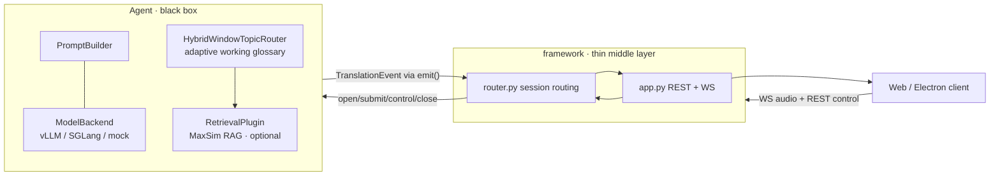

# AutoTerm-SST

**Zero session-time setup for terminology-aware streaming speech translation —
as a thin, pluggable framework.**

AutoTerm-SST is an interactive simultaneous speech-translation (SST) system for
term-dense vertical domains (academic, medical, legal, financial). It streams
speech in, runs a swappable translation **agent**, and streams translated text
back — with an **adaptive terminology memory** (AutoTerm) that retrieves up to
10 prompt glossary references per chunk from an automatically routed,
budgeted multi-slice working set, so the model gets specialized vocabulary right
without a per-session glossary upload or domain choice. Domain resources are
prebuilt and registered by the deployment operator.

The codebase is a **thin middle layer** (transport / session / routing) plus
**swappable agents**. The framework knows nothing about models, prompting,
batching, KV-cache, or retrieval; an agent is an opaque black box that owns all
of that internally.

## Demo

- 📄 Paper: *AutoTerm-SST: Adaptive Terminology Memory with Zero Session-Time
  Setup for Streaming Speech Translation* (EMNLP 2026 System Demonstrations, under review) —
  PDF: [`docs/autoterm_sst_emnlp2026_demo.pdf`](docs/autoterm_sst_emnlp2026_demo.pdf) (LaTeX sources live in git history).
- 📊 Evaluation source of truth: [ten-talk StreamLAAL audit](https://github.com/luojiaxuan/autoterm-sst/blob/explore/multidomain-routing/docs/autoterm_1m_budget_search_20260711.md)
  and [`docs/system_scaling.md`](docs/system_scaling.md).
- 🎬 Screencast video: [docs/demo_screencast.mp4](https://github.com/luojiaxuan/autoterm-sst/blob/main/docs/demo_screencast.mp4) (2.5 min).
- 🌐 Hosted live demo: <https://luojiaxuan.github.io/autoterm-sst/> (stable
  entry page; redirects to the current GPU-backed tunnel).
- 🖥️ No GPU? Mock mode below runs the full UI, wire protocol, and JSON evidence
  stream on a laptop with zero model downloads.

---

## Highlights

- **Zero session-time setup.** `auto_working` mode starts from a
  domain-specific glossary slice and a training-free hybrid router switches
  slices from streaming evidence (generated-translation topic windows,
  speech-window domain probes, speech-centroid similarity, retrieved-term
  metadata) — no ASR or source transcripts in the production path.
- **Thin framework, pluggable agents.** The core only does WebSocket/REST
  transport, session lifecycle, and `agent_type` routing. Agents implement a
  small `Agent` contract.
- **Retrieval is optional and agent-internal.** Terminology retrieval (MaxSim
  RAG over glossary indexes) lives *inside* the agent as a plugin — enable it,
  swap it, or turn it off without touching the framework.
- **Live evidence panel.** The JSON WebSocket protocol exposes retrieved terms,
  active glossary state, router decisions/confidence, and retrieval/generation
  latency, rendered live in the web UI.
- **Multiple backends.** Ships with an in-process **vLLM** Qwen3-Omni agent
  (continuous batching for many concurrent sessions) and a legacy **InfiniSST**
  scheduler agent; the same protocol can front external SGLang-compatible
  servers.
- **Runs without a GPU for development.** `RASST_DEMO_MOCK=1` exercises the full
  protocol/UI with no model, GPU, or network dependencies.

---

## Architecture



The contract between the two halves is intentionally tiny
(`framework/agent.py`): `open_session`, `submit_audio`, `on_control`,
`close_session`, plus `describe()` / `health()` and a thread-safe `emit()`
callback for streaming results back. Everything model-specific is hidden behind
that boundary.

---

## Repository layout

```
framework/                 # the thin transport/session/routing layer (entry point)
├── server.py              #   python -m framework.server  (uvicorn launcher)
├── app.py                 #   FastAPI: REST + /wss WebSocket (wire protocol)
├── router.py              #   AgentRouter: sessions, routing, health/config aggregation
├── agent.py               #   the Agent <-> framework contract
├── config.py              #   config-driven, lazy agent loading
└── agents/
    ├── omni.py            #   OmniAgent: streaming Qwen3-Omni (in-process vLLM)
    ├── infinisst.py       #   InfiniSSTAgent: wraps the legacy scheduler/engine
    ├── glossary.py        #   language pairs + glossary/index presets (agent data)
    ├── term_memory/       #   open-memory manifests, domain taxonomy, topic router
    └── plugins/           #   agent-internal plugins (NOT framework concerns)
        ├── backends.py    #     ModelBackend: VLLMBackend / SGLangHTTPBackend / MockBackend
        ├── retrieval.py   #     RetrievalPlugin: MaxSimRetrievalPlugin / NullRetrieval
        └── prompt.py      #     PromptBuilder: system prompt + term_map assembly

serve/                     # original servers + shared assets
├── static/                #   the demo web UI (served at / by the framework)
├── vllm_compat/           #   sitecustomize.py (vLLM aimv2 registry fix; keep on PYTHONPATH)
├── api.py, scheduler.py, inference_engine.py   # legacy InfiniSST stack
└── rasst_server.py, rasst_sglang_server.py     # legacy standalone RASST servers

electron/                  # desktop client
eval/streaming_sst/        # terminology / routing / scale eval harnesses
scripts/                   # run + smoke + SLURM scripts (see below)
configs/autoterm_slices.yaml   # default adaptive-router thresholds
docs/                      # design notes, evaluation reports, paper PDF, screencast
tests/                     # unit + integration suites (run from the repo root)
legacy/                    # pre-AutoTerm InfiniSST launchers and pages (unused)
start_demo.sh              # primary framework launcher (mock-friendly)
```

---

## Quick start

### 1. Mock mode (no GPU)

```bash
python3 -m venv .venv
.venv/bin/python -m pip install -r requirements-mock.txt
RASST_DEMO_MOCK=1 PORT=8000 bash start_demo.sh
# open http://127.0.0.1:8000/
```

`start_demo.sh` resolves the repository from its own location and automatically
uses `.venv/bin/python` when present; it contains no machine-specific paths.
Mock mode loads the RASST agent with deterministic CPU-only generation and
retrieval (no torch/vLLM/GPU), so you can exercise the full
`/init` → `/wss` → translate → `/delete_session` flow, the web UI, and the JSON
evidence protocol.

### 2. Live GPU mode — RASST (Qwen3-Omni)

The real RASST agent loads a ~30B Qwen3-Omni checkpoint with **in-process vLLM
tensor parallelism** (2 GPUs by default) plus the MaxSim retriever on a third
GPU. Requirements: A6000-class NVIDIA GPUs, `vllm>=0.13`,
`transformers>=4.57`, and the RASST retriever checkpoint
(`checkpoints/retriever/rasst-hn1024.pt`, distributed separately).

```bash
bash scripts/run_taurus_framework_vllm.sh   # pins GPUs and sets every vLLM/RAG knob
curl -s http://127.0.0.1:8011/health | python -m json.tool
```

See the comments in that script and [Configuration](#configuration) for every
knob (GPU selection, ports, memory fractions, retrieval devices).

---

## Agents & models

| `agent_type` | Agent             | Backend                         | Notes |
|--------------|-------------------|---------------------------------|-------|
| `RASST`      | `OmniAgent`       | in-process **vLLM** Qwen3-Omni  | streaming, batched, optional MaxSim RAG |
| `InfiniSST`  | `InfiniSSTAgent`  | legacy scheduler + engine       | paged-attention LLM stack |
| `Qwen3-Omni` | `OmniAgent`       | vLLM (`qwen3_omni` template)    | model-extension entry |
| `MiniCPM-o`  | `OmniAgent`       | `minicpm_o` template            | extension stub |

Which agents load is controlled by `RASST_FRAMEWORK_AGENTS` (the UI's model
picker uses these ids). An omni agent can also use an external SGLang/vLLM HTTP
server instead of in-process vLLM by setting its template `backend_kind` to
`sglang_http`.

---

## Configuration

Selected environment variables (all optional; sensible defaults in the scripts).

**Framework / routing**

| Var | Default | Meaning |
|-----|---------|---------|
| `RASST_FRAMEWORK_AGENTS` | `InfiniSST,RASST` | comma-separated agents to load |
| `RASST_FRAMEWORK_DEFAULT_AGENT` | first loaded | agent for blank/unknown `agent_type` |
| `RASST_DEMO_MOCK` | `0` | `1` = no GPU/model, deterministic mock |
| `HOST` / `PORT` | `127.0.0.1` / `8000` | bind address |

**RASST / vLLM (OmniAgent)**

| Var | Default | Meaning |
|-----|---------|---------|
| `RASST_VLLM_TP_SIZE` | `1` (script: `2`) | tensor-parallel GPUs for vLLM |
| `RASST_GPU_MEMORY_UTILIZATION` | `0.86` (script: `0.80`) | vLLM memory fraction/GPU |
| `RASST_MAX_NUM_SEQS` | `32` | max concurrent sequences (continuous batching) |
| `RASST_MAX_MODEL_LEN` | `16384` | context length |
| `RASST_VLLM_LIMIT_AUDIO` | `16` | max audio clips per prompt |
| `RASST_VLLM_ENFORCE_EAGER` | `0` (script: `1`) | disable CUDA graphs |
| `RASST_VLLM_MODEL_PATH` | per-language catalog | override the checkpoint path |
| `CUDA_VISIBLE_DEVICES` | — | which physical GPUs are visible |

**Retrieval (MaxSim RAG)**

| Var | Default | Meaning |
|-----|---------|---------|
| `RASST_RAG_ENABLED` | `1` | enable terminology retrieval |
| `RASST_RAG_DEVICE` | `cuda:1` (script: `cuda:2`) | retriever GPU |
| `RASST_HN1024_RETRIEVER` | `checkpoints/retriever/rasst-hn1024.pt` | retriever checkpoint |
| `RASST_ROOT` | — | glossary indexes + retriever code root |

If retrieval fails to load, the agent logs it and continues **without** RAG
(graceful degradation).

**Adaptive working glossary (AutoTerm)**

| Var | Default | Meaning |
|-----|---------|---------|
| `RASST_AUTO_GLOSSARY_ENABLED` | `1` | default to zero session-time setup via `auto_working` mode |
| `RASST_AUTO_GLOSSARY_DEFAULT` | `nlp_core_10k` | initial domain-specific active slice |
| `RASST_AUTO_GLOSSARY_PRESETS` | `nlp_core_10k,medicine_core_10k,finance_core_10k,legal_core_10k` | domain slices the topic router may activate |
| `RASST_AUTO_GLOSSARY_UPDATE_SEC` | `45` | minimum interval between topic decisions |
| `RASST_AUTO_GLOSSARY_WARMUP_SEC` | `30` | no switching before this many session seconds |
| `RASST_AUTO_GLOSSARY_MIN_CONF` | `0.60` | minimum router confidence to switch |
| `RASST_AUTO_GLOSSARY_MIN_MARGIN` | `0.15` | minimum top-vs-runner-up domain margin |
| `RASST_AUTO_GLOSSARY_MIN_CONSISTENT_WINDOWS` | `2` | repeated windows required before switching |
| `RASST_AUTO_GLOSSARY_FALLBACK` | `none` | uncertain routing keeps the current domain slice |
| `RASST_ROUTER_MODE` | `hybrid_window_topic` | window-topic-first router; `embedding_refs` / `legacy_keywords` are compatibility modes |
| `RASST_PROMPT_TOP_K` | `10` | retrieval cap: max refs injected into the prompt |
| `RASST_UI_TOP_K` | `10` | max refs surfaced in JSON metadata/UI evidence |

Additional router hysteresis defaults live in
[`configs/autoterm_slices.yaml`](configs/autoterm_slices.yaml)
(`current_margin_threshold`, per-signal consistency windows, probe floors,
`switch_cooldown_sec`, `candidate_stale_sec`).

---

## HTTP / WebSocket API

| Method | Path | Purpose |
|--------|------|---------|
| `GET`  | `/` | demo web UI (`serve/static/index.html`) |
| `GET`  | `/config` | aggregated agent capabilities (models, language pairs, presets) |
| `GET`  | `/health` | aggregated agent health (incl. `term_memory` block) |
| `POST` | `/init` | open a session (`agent_type`, `language_pair`, …) → `session_id` |
| `WS`   | `/wss/{session_id}` | stream float32 PCM (16 kHz mono) up; receive text down. `EOF` ends input |
| `POST` | `/reset_translation`, `/update_latency`, `/glossary/build`, `/ping`, `/delete_session` | session control (forwarded to the agent) |
| `GET`  | `/queue_status/{session_id}` | admission/queue info |

By default output events are **plain text** over the WS (errors as `ERROR: ...`,
end-of-file as `PROCESSING_COMPLETE: ...`) — unchanged for existing clients.

Add **`?event_format=json`** to the WS URL for the **structured protocol**:
each message is `{"type", "text", "meta"}` where `type` is
`partial` / `final` / `status` / `error`, and `meta` carries the agent's
evidence — retrieved terms (`references`), per-tick retrieval latency
(`retrieve_s`), generation latency (`elapsed_s`), segment index, routing-only
domain-probe scores (`domain_probe_scores`), and adaptive router evidence
(`topic`, `topic_router`). The web UI renders this as the live **Retrieved
Terms** evidence panel and active-glossary status line.

---

## Open terminology memory

Beyond curated glossary presets, the agent serves a large, swappable **open
terminology memory** (Wikidata/Wikipedia-derived). A small **manifest**
(`framework/agents/term_memory/manifest.py`) points the agent at a snapshot's
term files + precomputed MaxSim indexes; selecting an `open_wiki_*` preset
retrieves from it exactly like a glossary.

The default demo path provides **zero session-time terminology setup**:
`auto_working` starts from a domain-specific slice (e.g. `nlp_core_10k`) and
the `hybrid_window_topic` router may switch to another domain slice (e.g.
`medicine_core_10k`) from streaming evidence. The prompt interface stays
capped: each chunk retrieves at most `RASST_PROMPT_TOP_K=10` candidates, then
score filtering keeps only confident matches (no filler terms). Large
100k/500k/1M memories remain offline resources, rescue pools, and scale
evidence. See [`docs/adaptive_working_glossary.md`](docs/adaptive_working_glossary.md).

Build pipeline (normalize → filter/rank → index → snapshot/manifest):

```bash
# 1. normalize a Wikidata-derived glossary -> rows, filter/rank/scale -> glossary
python scripts/term_memory/extract_wikidata_terms.py --glossary <wiki_glossary.json> \
    --target-lang zh --out rows.en-zh.jsonl
python scripts/term_memory/filter_terms.py --in rows.en-zh.jsonl --target-lang zh \
    --limit 100000 --out wiki_open_zh_100k.json

# 2. build the maxsim index (GPU; RASST text encoder)
python <RASST>/retriever/build_maxsim_index.py --model-path checkpoints/retriever/rasst-hn1024.pt \
    --glossary-path wiki_open_zh_100k.json --output-path <root>/indexes/wiki_100k/en-zh/maxsim.pt --device cuda:0

# 3. write terms.jsonl + publish a manifest exposing the preset (atomic swap)
python scripts/term_memory/build_term_memory_snapshot.py --glossary wiki_open_zh_100k.json \
    --snapshot-id wiki_100k --langs zh --preset-id open_wiki_100k \
    --root <root> --maxsim-index zh=<root>/indexes/wiki_100k/en-zh/maxsim.pt

# 4. point the agent at it
export RASST_TERM_MEMORY_MANIFEST=<root>/manifests/current.json
export RASST_DEFAULT_GLOSSARY_PRESET=open_wiki_100k   # or leave 'none'; users pick in the UI
```

Manifests/snapshots/indexes live under a runtime root (e.g.
`$RASST_DEMO_DATA_ROOT/runtime/term_memory`), **never in the repo**. Open
presets degrade to `none` if no manifest/index is available, so a missing
snapshot never breaks a session.

---

## Evaluation

Harnesses live in `eval/streaming_sst/`; result summaries live in `docs/`.

| Harness | Purpose |
|---------|---------|
| `eval_auto_glossary.py` | adaptive glossary switch/latency/reference-volume eval |
| `eval_auto_glossary_switch.py` | router-unit ACL/NLP ↔ medicine switch diagnostic |
| `eval_mixed_domain_switch.py` | state-machine mixed-playlist switch benchmark |
| `eval_mixed_audio_switch.py` | real E2E mixed-audio routing probe (JSON WS) |
| `score_auto_glossary.py` | summarize adaptive glossary eval JSON as a table |
| `sweep_term_memory.py` | term-memory scale sweep (retrieve p50/p95, refs/chunk) |
| `score_terms.py` | terminology accuracy + regular/masked-term BLEU vs references |
| `scripts/smoke_p0_protocol.py` | client-side protocol/concurrency smoke test |

Key reports: [`docs/adaptive_working_glossary_eval.md`](docs/adaptive_working_glossary_eval.md),
[`docs/auto_glossary_mixed_switch_20260707.md`](docs/auto_glossary_mixed_switch_20260707.md),
[`docs/open_term_memory_eval.md`](docs/open_term_memory_eval.md),
[`docs/ai_glossary_sweep.md`](docs/ai_glossary_sweep.md).

---

## Remote access (Cloudflare Tunnel)

Expose the local server for the public/live demo with **cloudflared** (no
interstitial page, no concurrent-session limit, WebSockets proxied natively):

```bash
# quick tunnel (ephemeral https://<random>.trycloudflare.com URL in the log)
setsid nohup bash scripts/run_cloudflared_tunnel.sh \
  > logs/cloudflared_tunnel.out 2>&1 &

# stable URL for the submission link (one-time setup, free account):
#   cloudflared tunnel login
#   cloudflared tunnel create rasst-demo
#   cloudflared tunnel route dns rasst-demo <your-hostname>
CF_TUNNEL_NAME=rasst-demo CF_HOSTNAME=<your-hostname> \
  setsid nohup bash scripts/run_cloudflared_tunnel.sh \
  > logs/cloudflared_tunnel.out 2>&1 &
```

If the model backend goes down while the tunnel is up, the web UI shows a
fallback banner pointing visitors to the demo video and this repository
instead of a raw connection error.

`scripts/run_ngrok_tunnel.sh` remains as a legacy alternative; note the free
ngrok tier shows a one-time "Visit Site" interstitial and allows only a single
concurrent agent session per authtoken, so it is not suitable for the
reviewer-facing live demo.

---

## Requirements

- **GPU (live mode only):** NVIDIA A6000-class. The 30B Qwen3-Omni checkpoint
  needs ≥ 2 GPUs (tensor parallel); RAG uses an additional small allocation.
  Mock mode needs no GPU.
- **Python:** two environments are used in practice —
  a vLLM env for the real RASST run (`vllm>=0.13`, `transformers>=4.57`,
  `torch` cu12x, `qwen_omni_utils`, `fastapi`, `uvicorn`, `soundfile`, `numpy`)
  and a lighter env for mock mode / the InfiniSST scheduler agent.
- **Node:** Electron 28+ for the optional desktop client (`package.json`).

> `serve/vllm_compat` must stay on `PYTHONPATH` for any vLLM run (it
> neutralizes the duplicate `aimv2` Transformers-config registration in a
> subprocess-safe way).

Internal cluster paths, staging locations, and lab-specific launchers are
documented separately in
[`docs/internal_operations.md`](docs/internal_operations.md).

---

## License

The demo code is released under the [MIT License](LICENSE). Model weights
(Qwen3-Omni) and Wikidata/Wikipedia-derived terminology resources retain their
respective upstream licenses.

## Citation

```bibtex
@inproceedings{luo2026autoterm,
  title  = {{AutoTerm-SST}: Adaptive Terminology Memory with Zero Session-Time Setup for Streaming Speech Translation},
  author = {Luo, Jiaxuan and Ouyang, Siqi and Xu, Xi and Li, Lei},
  note   = {Under review, EMNLP 2026 System Demonstrations},
  year   = {2026}
}
```
