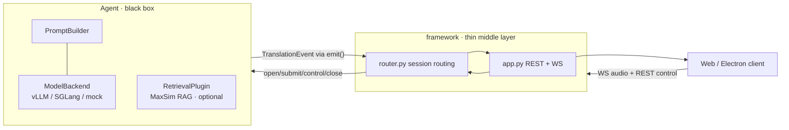

# RASST-Demo

**Retrieval-aware, terminology-sensitive streaming speech translation — as a thin, pluggable framework.**

RASST-Demo is an interactive simultaneous speech-translation (SST) demo for
term-dense vertical domains (academic, medical, legal, financial). It streams
speech in, runs a customizable translation **agent**, and streams translated
text back — with **optional terminology retrieval (RAG)** that injects
domain-glossary terms so the model gets specialized vocabulary right.

The codebase is organized as a **thin middle layer** (transport / session /
routing) plus **swappable agents**. The framework knows nothing about models,
prompting, batching, KV-cache, or retrieval; an agent is an opaque black box
that owns all of that internally.

---

## Highlights

- **Thin framework, pluggable agents.** The core only does WebSocket/REST
  transport, session lifecycle, and `agent_type` routing. Agents implement a
  small `Agent` contract.
- **Retrieval is optional.** Terminology retrieval (MaxSim RAG over glossary
  indexes) lives *inside* the agent as a plugin — enable it, swap it, or turn
  it off without touching the framework.
- **Multiple backends.** Ships with an in-process **vLLM** Qwen3-Omni agent
  (continuous batching for many concurrent sessions) and a legacy **InfiniSST**
  scheduler agent. Designed to add more omni models (e.g. MiniCPM-o).
- **Runs without a GPU for development.** `RASST_DEMO_MOCK=1` exercises the full
  protocol/UI with no model, GPU, or network dependencies.
- **Same UI, same wire protocol** as the original demo (`serve/static`), so web
  and Electron frontends work unchanged.

---

## Architecture



The contract between the two halves is intentionally tiny
(`framework/agent.py`): `open_session`, `submit_audio`, `on_control`,
`close_session`, plus `describe()` / `health()` and a thread-safe `emit()`
callback for streaming results back. Everything model-specific is hidden behind
that boundary.

---

## Repository layout

```
framework/                 # the thin transport/session/routing layer (entry point)
├── server.py              #   python -m framework.server  (uvicorn launcher)
├── app.py                 #   FastAPI: REST + /wss WebSocket (wire protocol)
├── router.py              #   AgentRouter: sessions, routing, health/config aggregation
├── agent.py               #   the Agent <-> framework contract
├── config.py              #   config-driven, lazy agent loading
└── agents/
    ├── omni.py            #   OmniAgent: streaming Qwen3-Omni (in-process vLLM)
    ├── infinisst.py       #   InfiniSSTAgent: wraps the legacy scheduler/engine
    ├── glossary.py        #   language pairs + glossary/index presets (agent data)
    └── plugins/           #   agent-internal plugins (NOT framework concerns)
        ├── backends.py    #     ModelBackend: VLLMBackend / SGLangHTTPBackend / MockBackend
        ├── retrieval.py   #     RetrievalPlugin: MaxSimRetrievalPlugin / NullRetrieval
        └── prompt.py      #     PromptBuilder: system prompt + term_map assembly

serve/                     # original servers + shared assets
├── static/                #   the demo web UI (served at / by the framework)
├── vllm_compat/           #   sitecustomize.py (vLLM aimv2 registry fix; keep on PYTHONPATH)
├── api.py, scheduler.py, inference_engine.py   # legacy InfiniSST stack
└── rasst_server.py, rasst_sglang_server.py     # legacy standalone RASST servers

electron/                  # desktop client
scripts/                   # run + smoke + SLURM scripts (see below)
demo_paper_emnlp/          # EMNLP system-demo paper draft
start_demo.sh              # primary framework launcher (mock-friendly)
AGENTS.md                  # repo conventions & canonical paths
```

---

## Quick start

> Canonical repo root on Taurus: `/mnt/taurus/home/jiaxuanluo/rasst-demo`.

### 1. Mock mode (no GPU — for development / UI / protocol work)

```bash
RASST_DEMO_MOCK=1 PORT=8000 bash start_demo.sh
# open http://127.0.0.1:8000/
```

Mock mode loads both agents with a deterministic, dependency-free backend (no
torch/vLLM/GPU), so you can develop the UI and exercise the full
`/init` → `/wss` → translate → `/delete_session` flow.

### 2. Real run — RASST (Qwen3-Omni) on GPUs

The real RASST agent loads a ~30B Qwen3-Omni checkpoint with **in-process vLLM
tensor parallelism** and (optionally) the MaxSim retriever. Use the dedicated
Taurus launcher, which pins free GPUs and sets every vLLM/RAG knob:

```bash
# resident (survives logout); logs to logs/framework_vllm_live.out
cd /mnt/taurus/home/jiaxuanluo/rasst-demo
setsid nohup bash scripts/run_taurus_framework_vllm.sh \
  > logs/framework_vllm_live.out 2>&1 < /dev/null &

# wait for the model to load, then:
curl -s http://127.0.0.1:8011/health | python -m json.tool
```

Defaults (override via env): vLLM on the first 2 visible GPUs (`tp=2`), MaxSim
RAG on a dedicated 3rd GPU, RASST agent only, port `8011`. See
[Configuration](#configuration) and the comments in the script.

> **Environment:** the real vLLM path requires the **`spaCyEnv`** conda env
> (vLLM ≥ 0.13, native Qwen3-Omni multimodal). The default `infinisst` env's
> vLLM 0.9.x loads the checkpoint as text-only and rejects audio. The launcher
> already points `PYTHON_BIN` at `spaCyEnv`.

---

## Agents & models

| `agent_type` | Agent             | Backend                         | Notes |
|--------------|-------------------|---------------------------------|-------|
| `RASST`      | `OmniAgent`       | in-process **vLLM** Qwen3-Omni  | streaming, batched, optional MaxSim RAG |
| `InfiniSST`  | `InfiniSSTAgent`  | legacy scheduler + engine       | paged-attention LLM stack |
| `Qwen3-Omni` | `OmniAgent`       | vLLM (`qwen3_omni` template)    | model-extension entry |
| `MiniCPM-o`  | `OmniAgent`       | `minicpm_o` template            | extension stub |

Which agents load is controlled by `RASST_FRAMEWORK_AGENTS` (the UI's model
picker uses these ids). An omni agent can also use an external SGLang/vLLM HTTP
server instead of in-process vLLM by setting its template `backend_kind` to
`sglang_http`.

---

## Configuration

Selected environment variables (all optional; sensible defaults in the scripts).

**Framework / routing**

| Var | Default | Meaning |
|-----|---------|---------|
| `RASST_FRAMEWORK_AGENTS` | `InfiniSST,RASST` | comma-separated agents to load |
| `RASST_FRAMEWORK_DEFAULT_AGENT` | first loaded | agent for blank/unknown `agent_type` |
| `RASST_DEMO_MOCK` | `0` | `1` = no GPU/model, deterministic mock |
| `HOST` / `PORT` | `127.0.0.1` / `8000` | bind address |

**RASST / vLLM (OmniAgent)**

| Var | Default | Meaning |
|-----|---------|---------|
| `RASST_VLLM_TP_SIZE` | `1` (script: `2`) | tensor-parallel GPUs for vLLM |
| `RASST_GPU_MEMORY_UTILIZATION` | `0.86` (script: `0.80`) | vLLM memory fraction/GPU |
| `RASST_MAX_NUM_SEQS` | `32` | max concurrent sequences (continuous batching) |
| `RASST_MAX_MODEL_LEN` | `16384` | context length |
| `RASST_VLLM_LIMIT_AUDIO` | `16` | max audio clips per prompt |
| `RASST_VLLM_ENFORCE_EAGER` | `0` (script: `1`) | disable CUDA graphs |
| `RASST_VLLM_MODEL_PATH` | per-language catalog | override the checkpoint path |
| `CUDA_VISIBLE_DEVICES` | — | which physical GPUs are visible |

**Retrieval (MaxSim RAG)**

| Var | Default | Meaning |
|-----|---------|---------|
| `RASST_RAG_ENABLED` | `1` | enable terminology retrieval |
| `RASST_RAG_DEVICE` | `cuda:1` (script: `cuda:2`) | retriever GPU |
| `RASST_HN1024_RETRIEVER` | `checkpoints/retriever/rasst-hn1024.pt` | retriever checkpoint |
| `RASST_ROOT` | `/mnt/taurus/data2/jiaxuanluo/RASST` | glossary indexes + retriever code |

If retrieval fails to load, the agent logs it and continues **without** RAG
(graceful degradation).

---

## HTTP / WebSocket API

| Method | Path | Purpose |
|--------|------|---------|
| `GET`  | `/` | demo web UI (`serve/static/index.html`) |
| `GET`  | `/config` | aggregated agent capabilities (models, language pairs, presets) |
| `GET`  | `/health` | aggregated agent health |
| `POST` | `/init` | open a session (`agent_type`, `language_pair`, …) → `session_id` |
| `WS`   | `/wss/{session_id}` | stream float32 PCM (16 kHz mono) up; receive text down. `EOF` ends input |
| `POST` | `/reset_translation`, `/update_latency`, `/glossary/build`, `/ping`, `/delete_session` | session control (forwarded to the agent) |
| `GET`  | `/queue_status/{session_id}` | admission/queue info |

Output events are plain text over the WS; errors arrive as `ERROR: ...`,
end-of-file as `PROCESSING_COMPLETE: ...`.

---

## Remote access (ngrok)

Expose the local server for a remote/live demo:

```bash
# static reserved domain (default)
setsid nohup bash scripts/run_ngrok_tunnel.sh > logs/ngrok_tunnel.out 2>&1 &

# or an ephemeral random URL (if the static domain is taken):
NGROK_DOMAIN="" setsid nohup bash scripts/run_ngrok_tunnel.sh \
  > logs/ngrok_tunnel.out 2>&1 &

# the public URL (ephemeral mode) is in the local inspector:
curl -s http://127.0.0.1:4040/api/tunnels
```

The free ngrok tier shows a one-time "Visit Site" interstitial in the browser
and allows a single concurrent agent session per authtoken.

---

## Scripts

| Script | Purpose |
|--------|---------|
| `start_demo.sh` | primary framework launcher (mock-friendly; defaults to `infinisst` env) |
| `scripts/run_taurus_framework_vllm.sh` | resident real RASST run (spaCyEnv, in-process vLLM tp=2 + RAG) |
| `scripts/run_ngrok_tunnel.sh` | resident ngrok tunnel (static or ephemeral) |
| `scripts/smoke_p0_protocol.py` | client-side protocol/concurrency smoke test |
| `scripts/legacy/*.sh` | the original standalone servers (`serve.api`, `serve.rasst_sglang_server`) |
| `scripts/slurm_*_aries.sh` | SLURM batch variants for the aries node |

---

## Requirements

- **GPU:** NVIDIA (A6000-class). The 30B Qwen3-Omni checkpoint needs ≥ 2 GPUs
  (tensor parallel); RAG uses an additional small allocation.
- **Python envs (conda):**
  - `spaCyEnv` — real RASST/vLLM run: `vllm>=0.13`, `transformers>=4.57`,
    `torch` (cu12x), `qwen_omni_utils`, `fastapi`, `uvicorn`, `soundfile`, `numpy`.
  - `infinisst` — mock mode and the InfiniSST scheduler agent.
- **Node:** Electron 28+ for the desktop client (`package.json`).

> There is no root `requirements.txt`; the project relies on the prepared conda
> envs above. Ask if you want one generated/pinned.

---

## Notes & conventions

- Keep large artifacts (checkpoints, logs, recordings, benchmark dumps) **out of
  the repo**; prefer a runtime root under `/mnt/taurus/data2/jiaxuanluo`.
- Use host-qualified Taurus paths in scripts and docs (see `AGENTS.md`).
- The EMNLP system-demo paper draft lives in `demo_paper_emnlp/`.
- `serve/vllm_compat` must stay on `PYTHONPATH` for any vLLM run (it neutralizes
  the duplicate `aimv2` Transformers-config registration in a subprocess-safe way).
